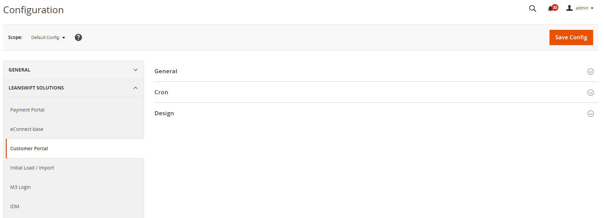
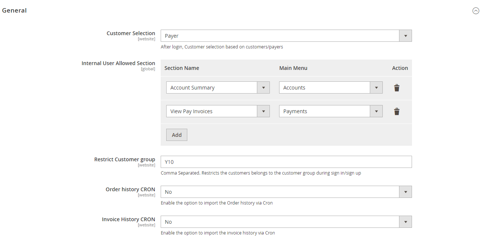
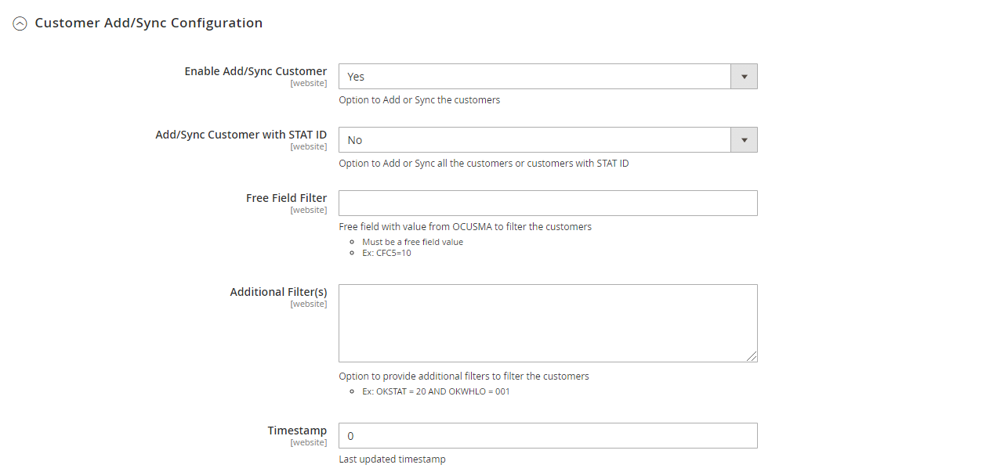
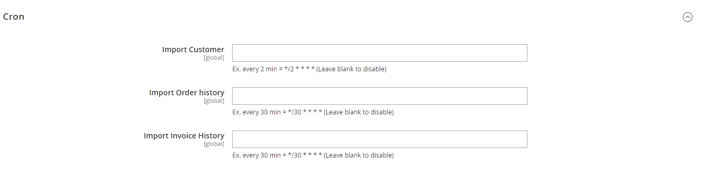

# Overview

LeanSwift Customer Portal is a customer self-service portal that enables efficient online communication with customers. It is seamlessly integrated with Infor M3 Cloudsuite via ION. Customer Portal helps automate the entire sales and payment process for the customer.

## Organization of the Manual

This manual describes the admin configuration of Customer Portal for Infor M3 and is meant for the Portal administrator.

To view the user manual for Portal Users, click [here](usermanual-customerportal-user.md)

# Customer Portal

<kbd>

</kbd>

## General Configuration

<kbd>

</kbd>
  
**Customer Selection**

**Internal User Allowed Section**

**Restrict Customer group**

**Order history CRON**

**Invoice History CRON**

### Customer Add/Sync Configuration

<kbd>

</kbd>

**Enable Add/Sync Customer**

**Add/Sync Customer with STAT ID**

**Free Field Filter**

**Additional Filter(s)**

**Timestamp**

## Cron Configuration

<kbd>

</kbd>

# Payment Portal

