
# User Manual – Payment Module – Customer Portal – Front end User

# Table of Contents

- [Overview](#Overview)
    - [Features](#Features)
    - [Point Of Contact](#Point_Of_Contact)
- [User Guide for Payment Module of Customer Portal – Front End User](#User_Guide)
    - [Login](#Login)
    - [Pay Invoices](#Pay_Invoices)
        - [Types of Invoices](#Types_of_Invoices)
        - [Apply Credits](#Apply_Credits)
        - [Process Payment](#Process_Payment)
        - [Multiple Invoice Payment](#Multiple_Invoice_Payment)
        - [Partial Invoice Payment](#Partial_Invoice_Payment)
        - [Fully Invoiced Payment](#Fully_Invoiced_Payment)
        - [Remove Credits](#Remove_Credits)
	- [Pay on Account](#Pay_on_Account)
	- [Payment Process](#Payment_Process)
        - [Payment Method](#Payment_Method)
        - [Payment Details](#Payment_Details)
        - [Review your order](#Review_your_order)
        - [Receipt](#Receipt)
    - [Cancel Payment](#Cancel_Payment)
    - [General Guidelines](#General_Guidelines)

 

# Overview
LeanSwift Customer Portal is a customer self-service web portal that enables users to get instance access to information about their orders, invoices and payments. With additional add-ons, uses can also make e-payments directly via the portal. It is seamlessly integrated with Infor M3 CloudSuite using ION. Customer Portal offers a single point of access to structured information about customer transactions and self-service functionality such as pay invoices, user management and much more.

The Payment Portal module is an add-on for Customer Portal which provides customers the ability to make payments for orders and invoices via the portal. The first version of this module uses CyberSource as the payment gateway and provides support for Credit Card payments.

<b>
 <a href="#toc">↥ Go to Top</a>
</b>

 
 

## Features
Account

- Registration and Login of External User
- Import and Login of Internal User
- View User Account Information
- Customer Selection by logged in user
- Switch Customer Account

Orders

- View Order History
- Synchronization of Order Status in real-time
- Search by Order#, Order Date
- Filter by Order Status
- Sort by Order Date

Invoices

- View Invoice History
- Synchronization of Invoice Status in real-time
- Search by Invoice#, Invoice Date
- Filter by Invoice Status
- Sort by Invoice Date

Payments

- Pay Invoices by CC
- Pay Invoices by Credit Memos
- Pay on Account by CC
- Support for both Full & Partial Payments
- Synchronization of Payment Status in real-time

Admin

- Settings and Configuration for Portal and M3 Connectivity
- M3 User Roles Configuration, User Permissions and sub-account management

<b>
 <a href="#toc">↥ Go to Top</a>
</b>

 
 

## Point Of Contact

This document and the software it describes are provided by LeanSwift Solutions Inc. For additional information regarding support, licensing, functionality etc. please contact LeanSwift Solutions Inc. via contact form at http://www.leanswift.com or email info@leanswift.com.

 
 

# User Guide for Payment Module of Customer Portal – Front End User

 
 

## Login
- To login to the Customer portal Payment module, the front end user can login to Customer Portal – Select customer – Click on Payments.

<kbd>
<kbd>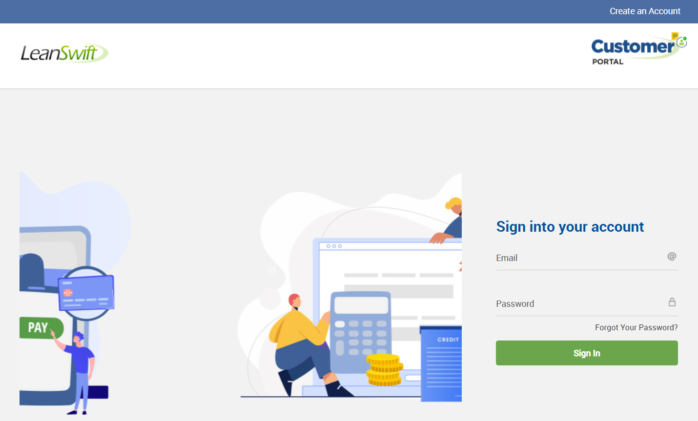</kbd>
</kbd>

<kbd>
<kbd>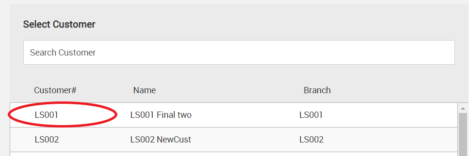</kbd>
</kbd>

<kbd>
<kbd>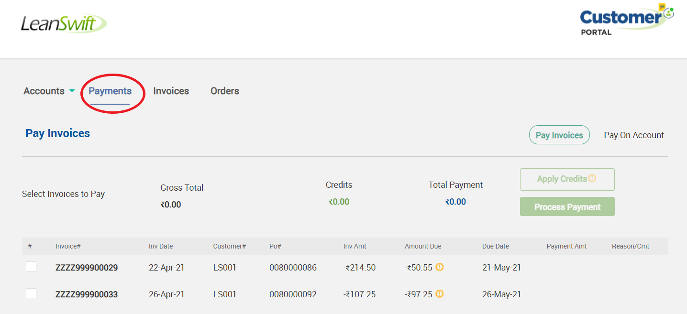</kbd>
</kbd>

<b>
 <a href="#toc">↥ Go to Top</a>
</b>

 
 

## Pay Invoices
- Customer Portal Front end users can pay their invoices from Payment module - Pay Invoices.
- Selecting Pay Invoices, displays all open invoices of the customer.

<kbd>
<kbd>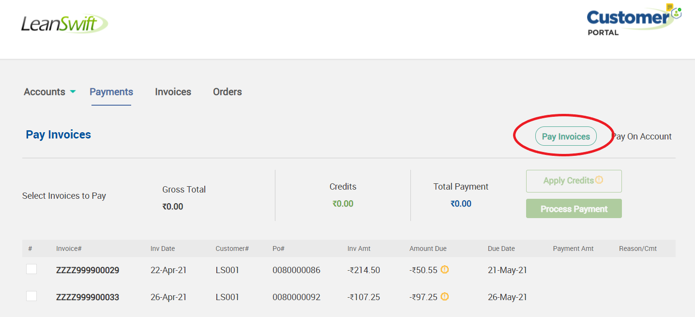</kbd>
</kbd>

- User can utilize Pagination option to navigate and identify the open invoice.

<kbd>
<kbd>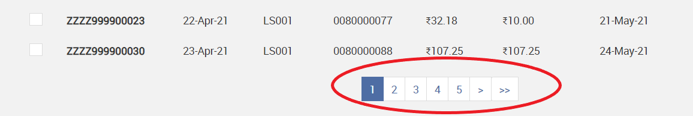</kbd>
</kbd>

<b>
 <a href="#toc">↥ Go to Top</a>
</b>

 
 

### Types of Invoices
- Invoices with Credit Note
    - Invoices with Credit Note are displayed with negative amount due, also for easy identification they are displayed along with Orange colour alert symbol next to Amount due.

<kbd>
<kbd>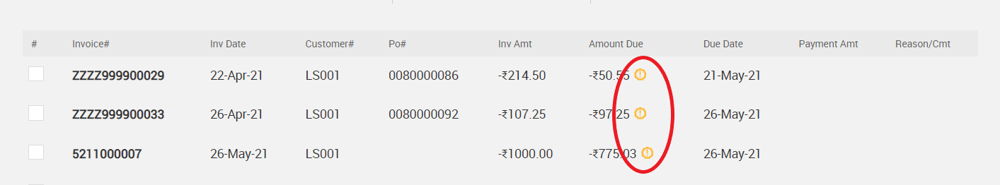</kbd>
</kbd>

- Invoices on Discount
    - When there are promotional discounts for Invoices, invoices with discount are displayed with the discounted rate and for ease of identification, displayed with Green colour alert symbol next to Amount due.
    - Discount rates are applied on the outstanding amount. 

<kbd>
<kbd>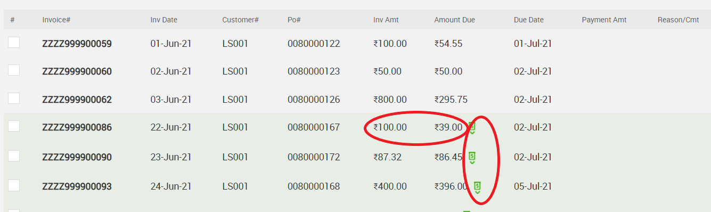</kbd>
</kbd>

- Invoice with Tax

<b>
 <a href="#toc">↥ Go to Top</a>
</b>

 
 

### Apply Credits
- Any open invoice can be used to apply credits.
- Customer Portal User can select payment method as Apply Credits while making payment.

<kbd>
<kbd>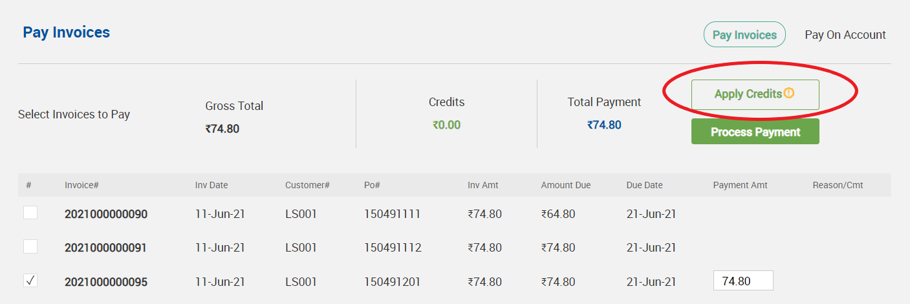</kbd>
</kbd>

- Full Payment via Credits
    - User can select the invoice to be paid.
    - Click on Apply Credit.
    - The system runs through defined algorithms, identifies possible invoice with credit or their combinations, that can be applied for the given invoice. 
    - User can review the Gross Total, Credits and Total Payment details displayed. 
      - Gross total – Amount due for the invoice.
      - Credits – Amount of Credits applied.
      - Total Payment – Remaining payment requried after credit adjustments.
    - User can navigate using pagination to identify the Credits applied invoices, which are selected by system.
    - If the invoice requires more amount than Credits, or the user prefers to pay partially from Credit and remaining from other payment methods, he can select/deselect the credits applied automatically by system. 

<kbd>
<kbd></kbd>
</kbd>

- Click on Process Payment.

<kbd>
<kbd>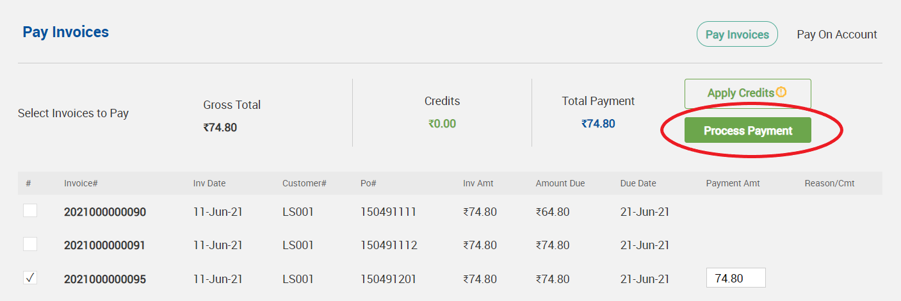</kbd>
</kbd>

<b>
 <a href="#toc">↥ Go to Top</a>
</b>

 
 

### Process Payment
- When the user clicks on Process Payment:
  - If Total Payment due is zero, the credits are applied directly.
  - If there is amount to be paid against total Payment, clicking on process payment takes the user to payment screen, with other payment options.

<kbd>
<kbd>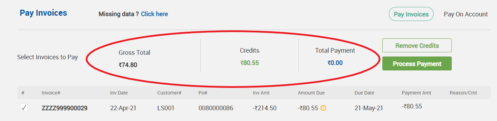</kbd>
</kbd>

- In case the credits are higher than required total payment, the system automatically debits only the required amount due from the credit invoice. 
- In the given example, we can find the balance amount in the credit invoice is Rs.5.75, after applying credit.

<kbd>
<kbd>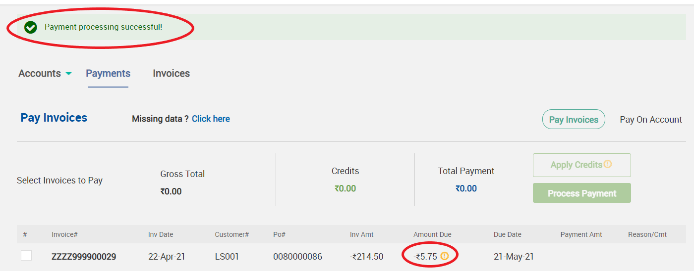</kbd>
</kbd>

- In case of multiple credits also, the credit invoice is updated with its amount due, after successfully applying credit and making payment for the invoice. 

<b>
 <a href="#toc">↥ Go to Top</a>
</b>

 
 

### Multiple Invoice Payment
- User can perform multiple invoice payment. 
- Select multiple invoices, apply credits, verify Gross total, Credits and Total payments and proceed to Process Payment.

<kbd>
<kbd>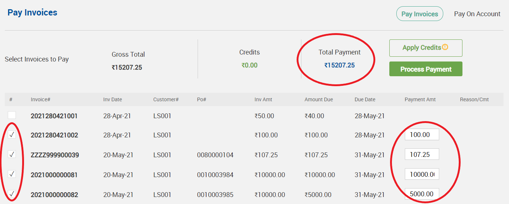</kbd>
</kbd>

<b>
 <a href="#toc">↥ Go to Top</a>
</b>

 
 

### Partial Invoice Payment
- User can perform partial payment towards an invoice or group of invoices. 
- Select invoice, type the amount preferred to pay, in Payment Amt field.
- Specify the pricing type.
- Apply required credits if any, verify Gross total, Credits and Total payments.

<kbd>
<kbd>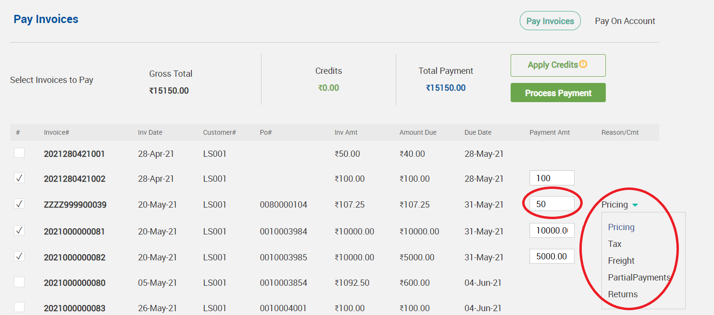</kbd>
</kbd>

<b>
 <a href="#toc">↥ Go to Top</a>
</b>

 
 

### Fully Invoiced Payment
- Fully Invoiced payments can be viewed under Invoice history.

 
 

### Remove Credits
- To remove applied credits prior to payment, user can click on Remove Credits.

<kbd>
<kbd>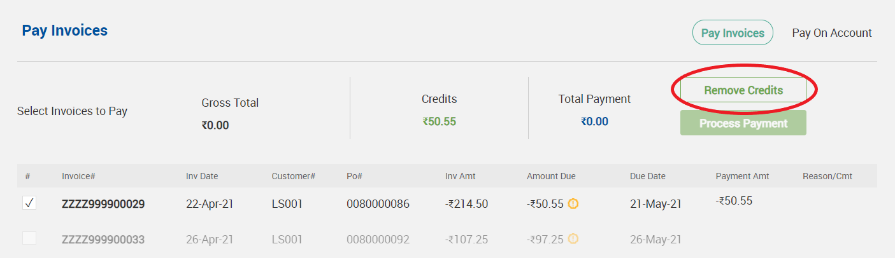</kbd>
</kbd>

 
 

## Pay on Account
- Customer Portal Front end users can pay their orders from Payment module - Pay on Account.
- Selecting Pay on Account, displays all open orders of the customer.

<kbd>
<kbd>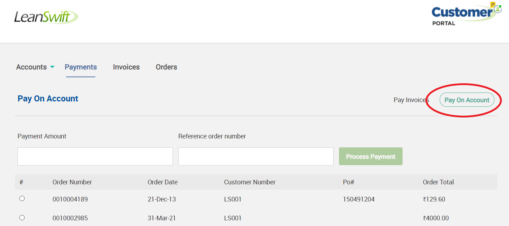</kbd>
</kbd>

- User can select the order, clicking on process payment takes the user to payment screen, with other payment options.

<kbd>
<kbd>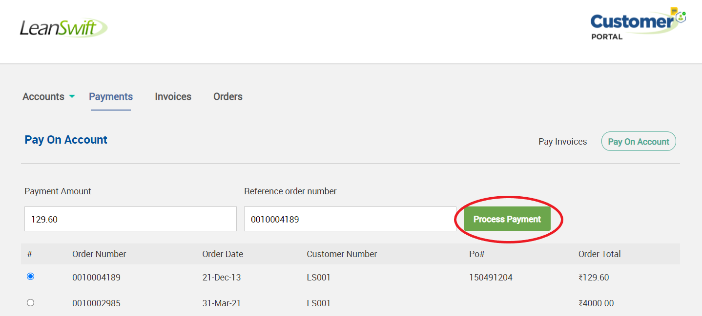</kbd>
</kbd>

- On successful pay on account, credit Invoice is created for the amount paid and can be viewed in Pay Invoices tab.

 
 

## Payment Process

 
 

### Payment Method
- Click on proceed payment for both cases pay invoices and pay on account, the user is taken to payment screen with other payment method options.

<kbd>
<kbd>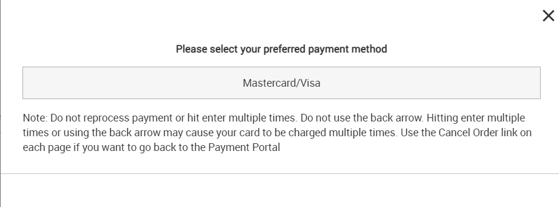</kbd>
</kbd>

- Select the preferred Payment method. Credit Card – MasterCard/Visa/Amex/Discover

<kbd>
<kbd>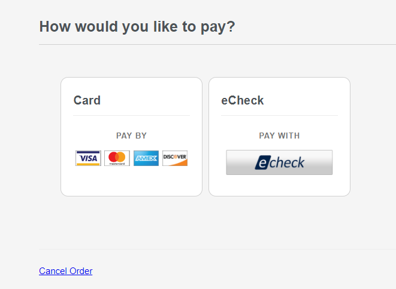</kbd>
</kbd>

 
 

### Payment Details
- In Payment process, once the user selects the payment method, the payment information screen is displayed to enter Card type, number and expiry details. 
- Click on change payment method, system takes the user to payment method screen.

<kbd>
<kbd>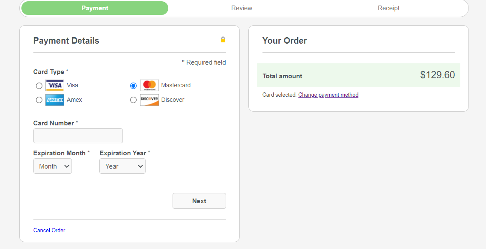</kbd>
</kbd>

 
 

### Review your order
- Enter payment details and click next, payment review screen appears.
- User can review all payment details, from billing address, card type, number, expiry or edit the details.
- Click on Pay to proceed with payment.

Note: Edit Address option on review stage is not available for Customer Portal Payment Module.

<kbd>
<kbd>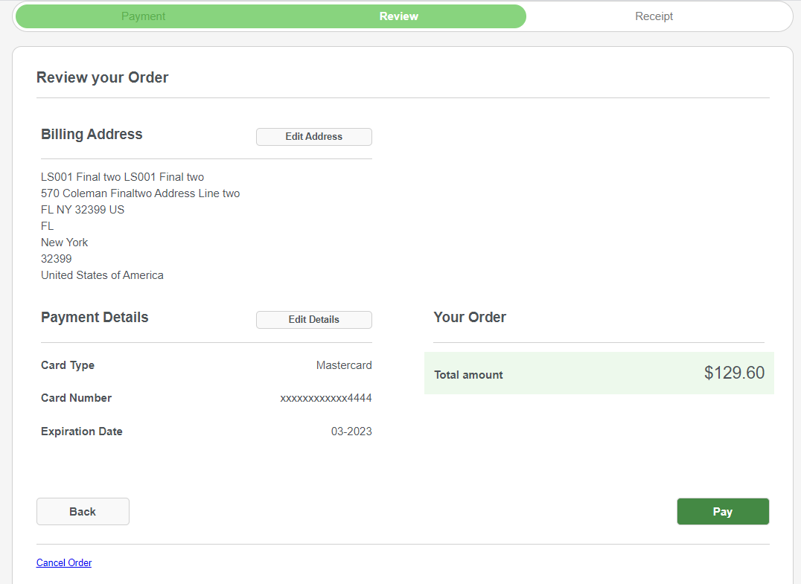</kbd>
</kbd>

 
 

### Receipt
- When a payment is completed successfully, the transaction reference and payment status are presented on the Customer Portal's message display space.

<kbd>
<kbd>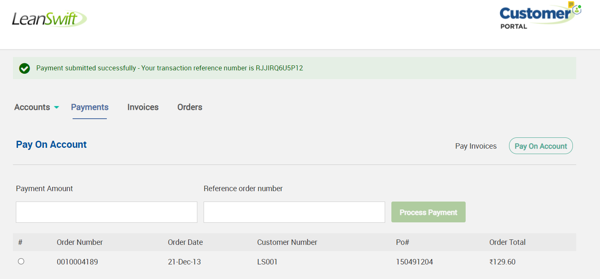</kbd>
</kbd>

 
 

## Cancel Payment
- To cancel payment process, user can click on Cancel order, and confirm to cancel.

<kbd>
<kbd>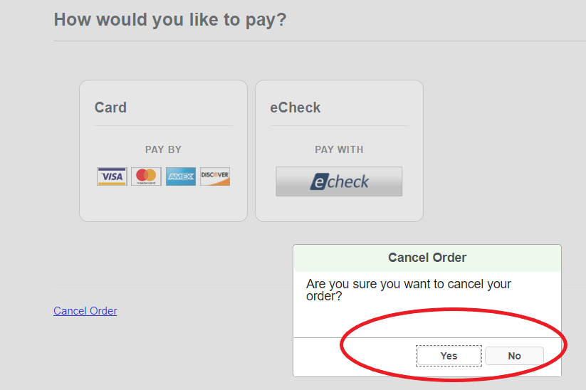</kbd>
</kbd>

 
 

## General Guidelines
- Payment processing is enabled only on Google Chrome and Safari.
- User can view responses/error messages from system in the message display space of Customer Portal.
- Currently payment method is enabled for master card only.
- When the session is inactive for long time, user is prompted to enter the mobile number, to validate session. 

<kbd>
<kbd>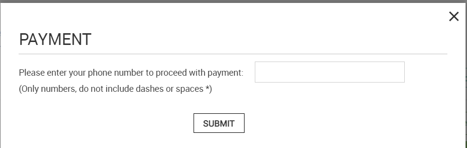</kbd>
</kbd>

