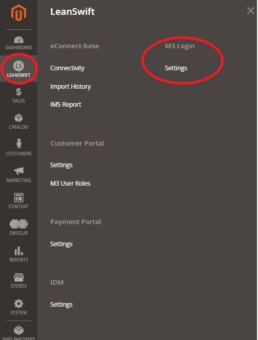
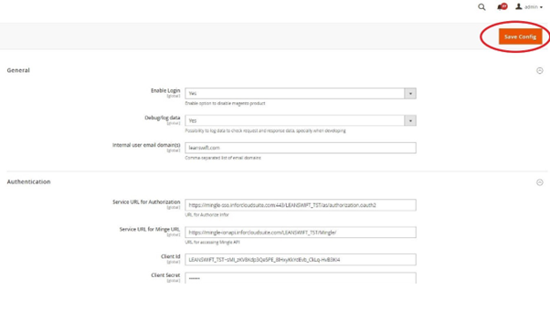
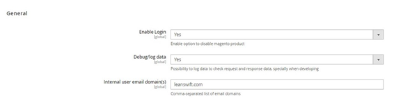
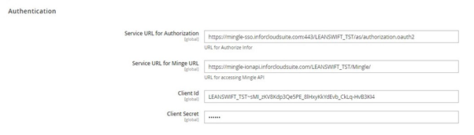
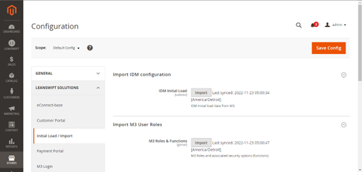
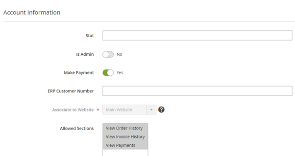

# **Version 22.4.0- User Manual - M3 Login**

# Table of contents

- [Overview](#Overview)
    - [Architecture](#Architecture)
    - [Features](#Features)
    - [Point of Contact](#Point_of_Contact)
- [User Guide for M3 Login Module – Admin User](#User_Guide_for_M3_Login_Module_Admin_User)
  - [Login](#Login)
  - [General](#General)
  - [Authentication](#Authentication)
  - [Import M3 User Roles](#Import_M3_User_Roles)
   - [Customer User Permissions](#Customer_User_Permissions)

## Overview

 

**LeanSwift M3 login module**  provides the ability to log into Magento with an Infor OS user (Single Sign-on support with Infor OS). It also retrieves the list of users in Infor M3 along with security roles. The module leverages ION APIs and Infor's authentication and authorization services to validate M3 user credentials (Ming.le user) via IFS (Infor Federation Services).

# Architecture

<kbd>
<kbd></kbd>
</kbd>

<b>
 <a href="#toc">↥ Go to Top</a>
</b>

## Features

- Redirect user login attempt from Magento to Infor OS (Ming.le) login interface
- Authenticate Ming.le user credentials
- Redirect to invoking Magento interface after authentication is successful
- Retrieves list of M3 users and associated security roles

<b>
 <a href="#toc">↥ Go to Top</a>
</b>

## Point Of Contact

This document and the software it describes are provided by LeanSwift Solutions Inc. For additional information regarding support, licensing, functionality etc. please contact LeanSwift Solutions Inc. via contact form at [http://www.leanswift.com](http://www.leanswift.com/) or email [info@leanswift.com](mailto:info@leanswift.com).

<b>
 <a href="#toc">↥ Go to Top</a>
</b>

# User Guide for M3 Login Module – Admin User

 

## Login

- To access M3 Login Settings as admin user, go to LeanSwift – M3 Login – Settings.

<kbd>
<kbd></kbd>
</kbd>

- From the M3 Login module the Admin user can configure logging preference, domain and authentication settings and click on Save Config.

<kbd>
<kbd></kbd>
</kbd>

<b>
 <a href="#toc">↥ Go to Top</a>
</b>

## General

- M3 Login general module allows admin to configure logging preference and internal email domain settings.
- Go to LeanSwift – M3 Login – Settings – General.
- Enable Login
  - To enable login for M3 User, configure Enable Login setting as Yes.
  - Configuring the enable login as No, disables M3 User Login into Customer Portal. Internal users will not be able to access Customer Portal.
- Debug/log data
  - To enable debug/log data, configure Debug/log data as Yes.
  - Setting Debug/log data to No, disables logger.
  - The logger is disabled by default and can be enabled to check request and response data for troubleshooting purposes.

<kbd>
<kbd></kbd>
</kbd>

- Internal user Email domain(s)
  - Configure the internal user email domain(s).
  - Specify comma separated list of internal user email domains.Ex: leanswift.com
  - If the login Id contains any of the internal user email domains, the password field is disabled and the user is taken to Magento for login authentication.

<b>
 <a href="#toc">↥ Go to Top</a>
</b>

## Authentication

- M3 Login authentication module allows admin to configure service URL for authorization, service URL for Ming.le, Client id and Client secret settings.
  - This information can be obtained from [Multi-tenant Cloud Infor OS](https://www.infor.com/resources/infor-ming-le).
- Go to LeanSwift – M3 Login – Settings – Authentication.

<kbd>
<kbd></kbd>
</kbd>

<b>
 <a href="#toc">↥ Go to Top</a>
</b>

## Import M3 User Roles

- It is part of add-on to fetch M3 User Roles and Functions as initial import. This is not required for Customer Portal v21.1.0.

<kbd>
<kbd></kbd>
</kbd>

## Customer User Permissions

- Users must have roles assigned to them in Magento, and they can only log in to the frontend based on the rights they have been allowed.
- **Internal User Permission**

<kbd>
<kbd></kbd>
</kbd>

- M3 USER Role - Internal User permissions are leveraged at M3 user Role configuration.
  - Customers of Magento have permissions by default.
  - Users should have access configured both in Customers Portal Settings and M3 user role settings.

<b>
 <a href="#toc">↥ Go to Top</a>
</b>

