

# Version 1.1.0 - User Manual - Payment Portal - Admin User

# Table of Contents

- [Overview](#Overview)
    - [Features](#Features)
    - [Architecture](#Architecture)
    - [Point Of Contact](#Point_Of_Contact)
- [User Guide](#User_Guide)
    - [Login](#Login)
    - [Bank Statement Configuration](#Bank_Statement)
    - [Payment Reason](#Payment_Reason)
    - [Invoice Payments](#Invoice_Payments)
    - [Short Pay Notification](#Short_Pay_Notification)
    - [Invoice/Order Sync Roles](#Invoice_Order_Sync_Roles)
    	  - [On-demand Synchronization](#On_demand_Synchronization)
    - [Cron](#Cron)
    - [General Settings](#General_Settings)

# Overview
LeanSwift Customer Portal is a customer self-service web portal that enables users to get instance access to information about their orders, invoices and payments. With additional add-ons, uses can also make e-payments directly via the portal. It is seamlessly integrated with Infor M3 CloudSuite using ION. Customer Portal offers a single point of access to structured information about customer transactions and self-service functionality such as pay invoices, user management and much more.

<b>
 <a href="#toc">↥ Go to Top</a>
</b>

# Architecture

<kbd>
<kbd>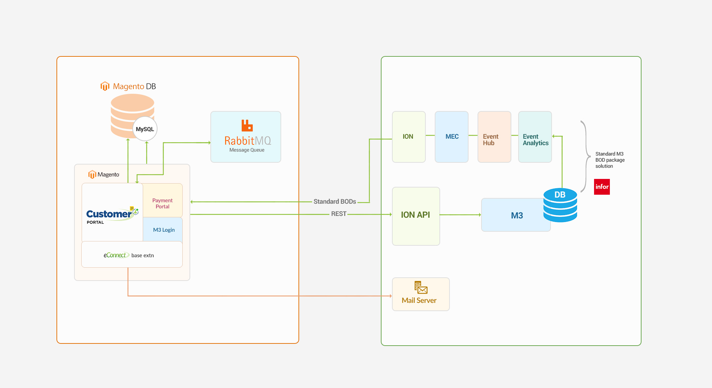</kbd>
</kbd>

<b>
 <a href="#toc">↥ Go to Top</a>
</b>

## Features
Account

- Registration and Login of External User
- Import and Login of Internal User
- View User Account Information
- Customer Selection by logged in user
- Switch Customer Account

Orders

- View Order History
- Synchronization of Order Status in real-time
- Search by Order#, Order Date
- Filter by Order Status
- Sort by Order Date

Invoices

- View Invoice History
- Synchronization of Invoice Status in real-time
- Search by Invoice#, Invoice Date
- Filter by Invoice Status
- Sort by Invoice Date

Payments

- Pay Invoices by CC
- Pay Invoices by Credit Memos
- Pay on Account by CC
- Support for both Full & Partial Payments
- Synchronization of Payment Status in real-time

Admin

- Settings and Configuration for Portal and M3 Connectivity
- M3 User Roles Configuration, User Permissions and sub-account management

<b>
 <a href="#toc">↥ Go to Top</a>
</b>

## Point Of Contact
This document and the software it describes are provided by LeanSwift Solutions Inc. For additional information regarding support, licensing, functionality etc. please contact LeanSwift Solutions Inc. via contact form at http://www.leanswift.com or email info@leanswift.com.

# User Guide for Payment Module of Customer Portal Admin User

## Login
- Provide Admin User credentials and login to the Magento system. 
- Go to LeanSwift tab (from left panel) - Payment Portal - Settings.

<kbd>
<kbd>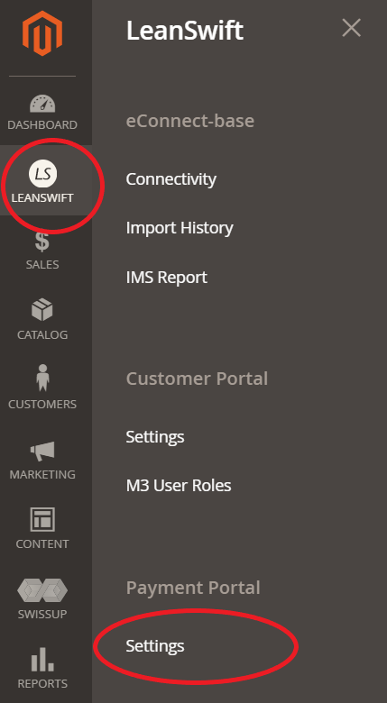</kbd>
</kbd>

- Payment portal admin user can configure/modify settings and Click on Save Config button.

<kbd>
<kbd>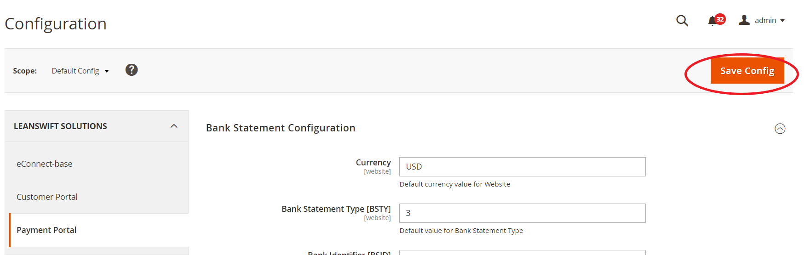</kbd>
</kbd>

<b>
 <a href="#toc">↥ Go to Top</a>
</b>

## Bank Statement Configuration
- Payment portal settings allows the admin to configure bank statement configurations, these configuration values are input to various M3 transactions using the ABS100MI API.
1. Currency
   1. Only one currency type is supported. 
   1. For multiple currencies, multiple websites have to be configured.
1. Bank statement type [BSTY]
1. Bank identifier [BSID]
1. Sequence number[BLSN]
1. Statement line type – Invoice [BLLT]
1. Statement line Type – Account [BLLT]

<kbd>
<kbd></kbd>
</kbd>

<b>
 <a href="#toc">↥ Go to Top</a>
</b>

## Payment Reason
- Payment reasons can be configured by an admin as a list of comma-separated reasons.
- The payment reasons will appear as choice downs for the front-end user to choose from while making a payment.

<kbd>
<kbd>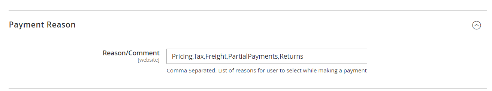</kbd>
</kbd>

<b>
 <a href="#toc">↥ Go to Top</a>
</b>

## Invoice Payments
- To suspend payment modules for front-end users, admin can go to Invoice payments – Suspend Invoice Payments – Select Yes.
- Enabling Suspend Invoice payment option, disables making payments for Pay Invoices in Customer Portal. 
- Payment cannot be processed online.

<kbd>
<kbd>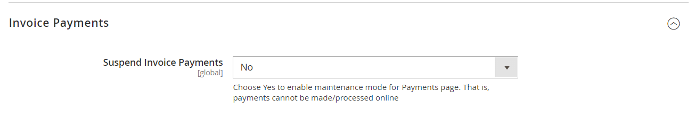</kbd>
</kbd>

- The maintenance notification will appear when the front-end user clicks on payments - Pay Invoices.

Note: From the Customer Portal, the user will be able to pay on account. Only Pay Invoices will be unavailable during this time.

<kbd>
<kbd>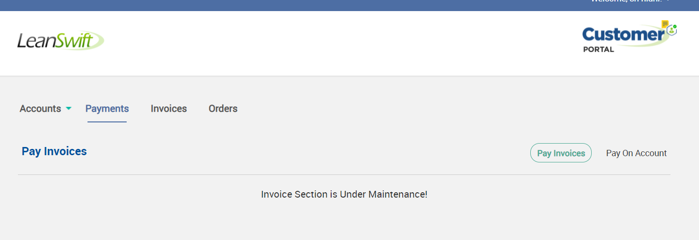</kbd>
</kbd>

<b>
 <a href="#toc">↥ Go to Top</a>
</b>

## Short Pay Notification
- To configure notification details for Short pay, admin can configure Payment Module – Short Pay Notification.
  - Email Sender 
  - Short Pay Notification Email Template – Choose from default template or custom template.
  - Email Address – Configure with comma separated email addresses for multiple email addresses to be notified.

<kbd>
<kbd>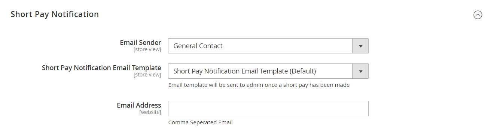</kbd>
</kbd>

<b>
 <a href="#toc">↥ Go to Top</a>
</b>

## Invoice/Order Sync Roles
- To enable on-demand sync option for specific M3 user roles, admin must configure Invoice/Order Sync roles, with M3 user Roles(comma separated).
- Specify the M3 user roles as comma separated list, for multiple M3 User roles with on-demand sync option.

Note: For on-demand sync option from the front-end option, the specified user role should have relevant privileges for the configured M3 user role superseding others.

<kbd>
<kbd>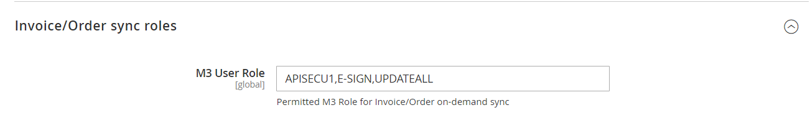</kbd>
</kbd>

<b>
 <a href="#toc">↥ Go to Top</a>
</b>

### On-demand Synchronization
- Missing Invoices
- Missing data for invoices option is accessible under Payments tab when Invoice/Order Sync Roles is enabled for the customer M3 User Role.

<kbd>
<kbd>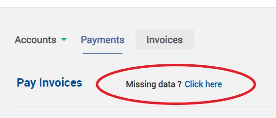</kbd>
</kbd>

- Clicking on Missing data, takes the user to screen, where user can mention document number and run sync job or run by default for 3 days.
- If the missing data is less than 3 days old please hit Submit. 
- If the missing data is older than 3 days enter the document number (invoice or order) and then hit enter. 
- If multiple documents are missing enter them with a comma separating each document number.

<kbd>
<kbd>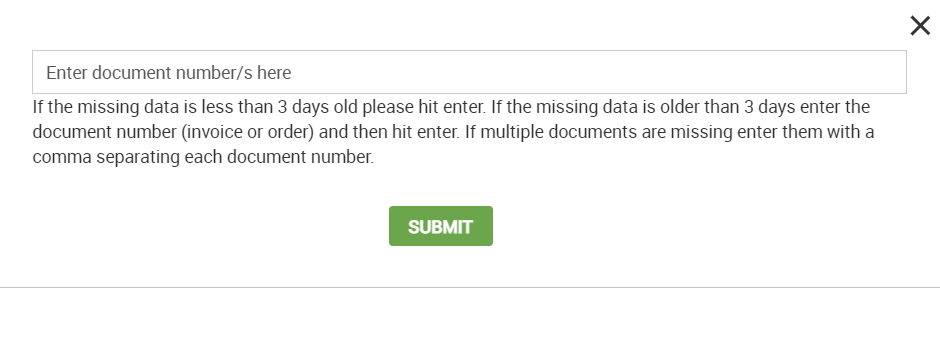</kbd>
</kbd>

- Status of the sync job will be displayed in the display message space of Customer Portal.

<kbd>
<kbd>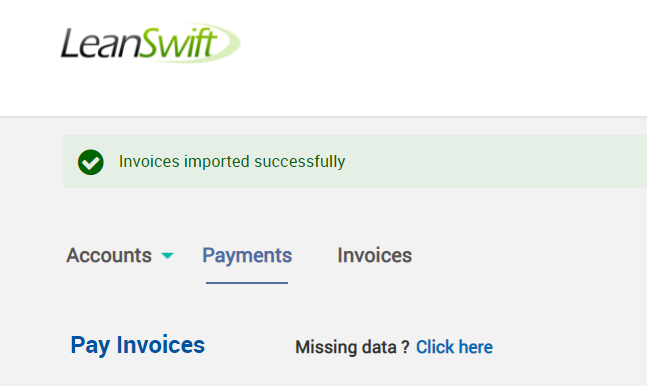</kbd>
</kbd>

<b>
 <a href="#toc">↥ Go to Top</a>
</b>

## Cron
- To configure Invoice Payment Sync, go to LeanSwift – Payment Portal – Settings – Cron – Invoice Payment Sync.
- To disable the CRON job, the configuration for CRON shall be empty.
  - For detailed understanding of CRON configurations refer to [cron - Wikipedia](https://en.wikipedia.org/wiki/Cron#Predefined_scheduling_definitions).

` `┌───────────── minute (0 - 59)

` `│ ┌───────────── hour (0 - 23)

` `│ │ ┌───────────── day of the month (1 - 31)

` `│ │ │ ┌───────────── month (1 - 12)

` `│ │ │ │ ┌───────────── day of the week (0 - 6) (Sunday to Saturday;

` `│ │ │ │ │                            7 is also Sunday on some systems)

` `│ │ │ │ │

` `│ │ │ │ │

` `\* \* \* \* \* <command to execute>

|Field|Required|Allowed values|Allowed special characters|
| :- | :- | :- | :- |
|Minutes|Yes|0–59|\* , -|
|Hours|Yes|0–23|\* , -|
|Day of month|Yes|1–31|\* , - ? L W|
|Month|Yes|1–12 or JAN–DEC|\* , -|
|Day of week|Yes|0–6 or SUN–SAT|\* , - ? L #|
|Year|No|1970–2099|\* , -|

<kbd>
<kbd>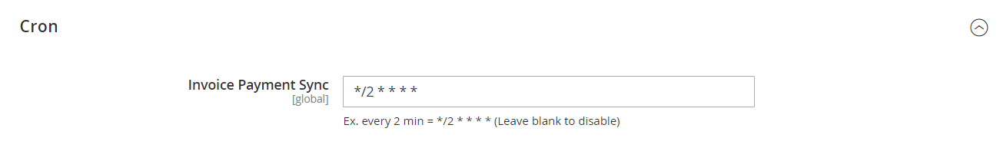</kbd>
</kbd>

<b>
 <a href="#toc">↥ Go to Top</a>
</b>

## General Settings
- CyberSource
- Currently payment portal is integrated  with CyberSource.
- To configure payment method, go to Leanswift->Sales->Payment Methods->Cyber source -> Hosted Checkout Profile. 
- Enter the profile ID, Access Key and Secret Key.
