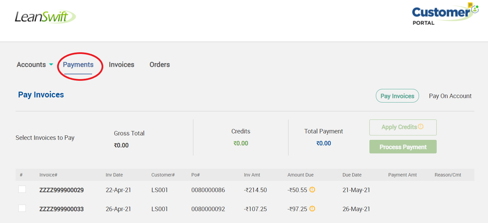
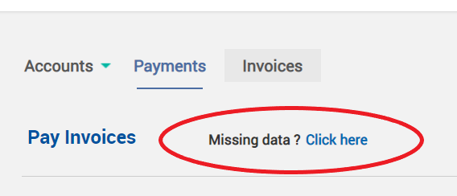

# Version 1.1.0 - User Manual - Payment Portal - User

# Table of Contents

- [Overview](#Overview)
	- [Architecture](#Architecture)
    - [Features](#Features)
    - [Point Of Contact](#Point_Of_Contact)
- [User Guide for Payment Module of Customer Portal – Front End User](#User_Guide)
    - [Login](#Login)
    - [Pay Invoices](#Pay_Invoices)
        - [Invoice Classification](#Invoice_Classification)
        - [Apply Credits](#Apply_Credits)
        - [Process Payment](#Process_Payment)
        - [Multiple Invoice Payment](#Multiple_Invoice_Payment)
        - [Partial Invoice Payment](#Partial_Invoice_Payment)
        - [Fully Invoiced Payment](#Fully_Invoiced_Payment)
        - [Remove Credits](#Remove_Credits)
	- [Pay on Account](#Pay_on_Account)
	- [ On-demand Synchronization](#On_demand_Synchronization)
	- [Payment Process](#Payment_Process)
        - [Payment Method](#Payment_Method)
        - [Payment Details](#Payment_Details)
        - [Review your order](#Review_your_order)
        - [Receipt](#Receipt)
    - [Cancel Payment](#Cancel_Payment)
    - [General Guidelines](#General_Guidelines)

 

# Overview

LeanSwift Customer Portal is a customer self-service web portal that enables users to get instance access to information about their orders, invoices and payments. With additional add-ons, uses can also make e-payments directly via the portal. It is seamlessly integrated with Infor M3 CloudSuite using ION. Customer Portal offers a single point of access to structured information about customer transactions and self-service functionality such as pay invoices, user management and much more.

The Payment Portal module is an add-on for Customer Portal which provides customers the ability to make payments for orders and invoices via the portal. The first version of this module uses CyberSource as the payment gateway and provides support for Credit Card payments.

<b>
 <a href="#toc">↥ Go to Top</a>
</b>

# Architecture

<kbd>
<kbd></kbd>
</kbd>

<b>
 <a href="#toc">↥ Go to Top</a>
</b>

 
 

## Features
Account

- Registration and Login of External User
- Import and Login of Internal User
- View User Account Information
- Customer Selection by logged in user
- Switch Customer Account

Orders

- View Order History
- Synchronization of Order Status in real-time
- Search by Order#, Order Date
- Filter by Order Status
- Sort by Order Date

Invoices

- View Invoice History
- Synchronization of Invoice Status in real-time
- Search by Invoice#, Invoice Date
- Filter by Invoice Status
- Sort by Invoice Date

Payments

- Pay Invoices by CC
- Pay Invoices by Credit Memos
- Pay on Account by CC
- Support for both Full & Partial Payments
- Synchronization of Payment Status in real-time

Admin

- Settings and Configuration for Portal and M3 Connectivity
- M3 User Roles Configuration, User Permissions and sub-account management

<b>
 <a href="#toc">↥ Go to Top</a>
</b>

 
 

## Point Of Contact

This document and the software it describes are provided by LeanSwift Solutions Inc. For additional information regarding support, licensing, functionality etc. please contact LeanSwift Solutions Inc. via contact form at http://www.leanswift.com or email info@leanswift.com.

 
 

# User Guide for Payment Module of Customer Portal – Front End User

 
 

## Login
- To login to the Customer portal Payment module, the front end user can login to Customer Portal – Select customer – Click on Payments.

<kbd>
<kbd></kbd>
</kbd>

<kbd>
<kbd></kbd>
</kbd>

<kbd>
<kbd></kbd>
</kbd>

<b>
 <a href="#toc">↥ Go to Top</a>
</b>

 
 

## Pay Invoices
- Customer Portal Front end users can pay their invoices from Payment module - Pay Invoices.
- Selecting Pay Invoices, displays all open invoices of the customer.

<kbd>
<kbd></kbd>
</kbd>

- User can utilize Pagination option to navigate and identify the open invoice.

<kbd>
<kbd></kbd>
</kbd>

<b>
 <a href="#toc">↥ Go to Top</a>
</b>

 
 

### Invoice Classification
- Credit Invoices
    - Credit Invoices are displayed with negative amount due, also for easy identification they are displayed along with the Orange colour alert symbol next to Amount due.

<kbd>
<kbd></kbd>
</kbd>

- Invoices after Discount
    - Invoices with discount are displayed with the discounted rate and for ease of identification, displayed with Green colour alert symbol next to Amount due.
    - Discount rates are applied on the outstanding amount. 

<kbd>
<kbd></kbd>
</kbd>

<b>
 <a href="#toc">↥ Go to Top</a>
</b>

 
 

### Apply Credits
- Any open invoice can be paid by applying credits.
- Customer Portal User can select payment methods as Apply Credits while making payment.

<kbd>
<kbd></kbd>
</kbd>

- Full Payment via Credits
    - Users can select the invoice to be paid.
    - Click on Apply Credit.
    - The system runs through defined algorithms, identifies possible invoice with credit or their combinations, that can be applied for the given invoice. 
    - Users can review the Gross Total, Credits and Total Payment details displayed. 
      - Gross total – Amount due for the invoice.
      - Credits – Amount of Credits applied.
      - Total Payment – Remaining payment required after credit adjustments.
    - Users can navigate using pagination to identify the Credits applied invoices, which are selected by system.
    - If the invoice requires more amount than Credits, or the user prefers to pay partially from Credit and remaining from other payment methods, user can select/deselect the credits applied automatically by system. 

<kbd>
<kbd></kbd>
</kbd>

- Click on Process Payment.

<kbd>
<kbd></kbd>
</kbd>

<b>
 <a href="#toc">↥ Go to Top</a>
</b>

 
 

### Process Payment
- When the user clicks on Process Payment:
  - If Total Payment due is zero, the credits are applied directly.
  - If there is an amount to be paid against total Payment, clicking on process payment takes the user to the payment screen, with other payment options.

<kbd>
<kbd></kbd>
</kbd>

- In case the credits are higher than required total payment, the system automatically debits only the required amount due from the credit invoice. 
- In the given example, we can find the balance amount in the credit invoice is Rs.5.75, after applying credit.

<kbd>
<kbd></kbd>
</kbd>

- In case of multiple credits also, the credit invoice is updated with its amount due, after successfully applying credit and making payment for the invoice. 

<b>
 <a href="#toc">↥ Go to Top</a>
</b>

 
 

### Multiple Invoice Payment
- Users can perform multiple invoice payments. 
- Select multiple invoices, apply credits, verify Gross total, Credits and Total payments and proceed to Process Payment.

<kbd>
<kbd></kbd>
</kbd>

<b>
 <a href="#toc">↥ Go to Top</a>
</b>

 
 

### Partial Invoice Payment
- Users can perform partial payment towards an invoice or group of invoices. 
- Select invoice, type the amount preferred to pay, in the Payment Amt field.
- Select the Reason/Comment from the dropdown list.
- Apply required credits if any, verify Gross total, Credits and Total payments.

<kbd>
<kbd></kbd>
</kbd>

<b>
 <a href="#toc">↥ Go to Top</a>
</b>

 
 

### Fully Invoiced Payment
- Fully Invoiced payments can be viewed under the Invoices tab in the Customer Portal.

 
 

### Remove Credits
- To remove applied credits prior to payment, users can click on Remove Credits.

<kbd>
<kbd></kbd>
</kbd>

<b>
 <a href="#toc">↥ Go to Top</a>
</b>

 
 

## Pay on Account

- Users can pay for open orders also from the portal via the “Pay on Account” tab, thereby creating credit invoices against their account.
- Selecting Pay on Account, displays all open orders of the customer.

<kbd>
<kbd></kbd>
</kbd>

- User can select the order, clicking on process payment takes the user to the payment screen, with other payment options.

<kbd>
<kbd></kbd>
</kbd>

- On successful pay on account, credit Invoice is created for the amount paid and can be viewed in the Pay Invoices tab.

<b>
 <a href="#toc">↥ Go to Top</a>
</b>

 
 

## On-demand Synchronization
- Missing Invoices
	- Missing data for invoices option is accessible under Payments tab when Invoice/Order Sync Roles is enabled for the customer M3 User Role.

<kbd>
<kbd></kbd>
</kbd>

- Clicking on Missing data, takes the user to screen, where the user can mention document number and run sync job or run by default for 3 days.
    - If no document number is mentioned and the submit button is clicked, invoices from the last 3 days will get synchronized.
    - If the document number is mentioned, the specific invoice alone will get synchronized with M3.
    - Can enter multiple document numbers separated by comma. Sync from M3 will be performed for the specified invoices alone.

<kbd>
<kbd></kbd>
</kbd>

- Status of the sync job will be displayed in the display message space of Customer Portal.

<kbd>
<kbd></kbd>
</kbd>

<b>
 <a href="#toc">↥ Go to Top</a>
</b>

 
 

## Payment Process

 
 

### Payment Method
- Click on proceed payment for both cases pay invoices and pay on account, the user is taken to payment screen with other payment method options.

<kbd>
<kbd></kbd>
</kbd>

- Select the preferred Payment method. Credit Card – MasterCard/Visa/Amex/Discover

<kbd>
<kbd></kbd>
</kbd>

<b>
 <a href="#toc">↥ Go to Top</a>
</b>

 
 

### Payment Details
- In the Payment process, once the user selects the payment method, the payment information screen is displayed to enter Card type, number and expiry details. 
- Click on change payment method, system takes the user to payment method screen.

<kbd>
<kbd></kbd>
</kbd>

<b>
 <a href="#toc">↥ Go to Top</a>
</b>

 
 

### Review your order
- Enter payment details and click next, the payment review screen appears.
- Users can review all payment details, from billing address, card type, number, expiry or edit the details.
- Click on Pay to proceed with payment.

<kbd>
<kbd></kbd>
</kbd>

 
 

### Receipt
- When a payment is completed successfully, the transaction reference and payment status are presented on the Customer Portal's message display space.

<kbd>
<kbd></kbd>
</kbd>

 
 

<b>
 <a href="#toc">↥ Go to Top</a>
</b>

## Cancel Payment
- To cancel the payment process, the user can click on Cancel order, and confirm to cancel.

<kbd>
<kbd></kbd>
</kbd>

<b>
 <a href="#toc">↥ Go to Top</a>
</b>

 
 

## General Guidelines
- Payment processing is enabled only on Google Chrome and Safari (on Mac).
- Users can view responses/error messages from the system in the message display space of Customer Portal.
- Payment by Credit Card only is supported by the Customer portal as of now.

<kbd>
<kbd></kbd>
</kbd>

<b>
 <a href="#toc">↥ Go to Top</a>
</b>

