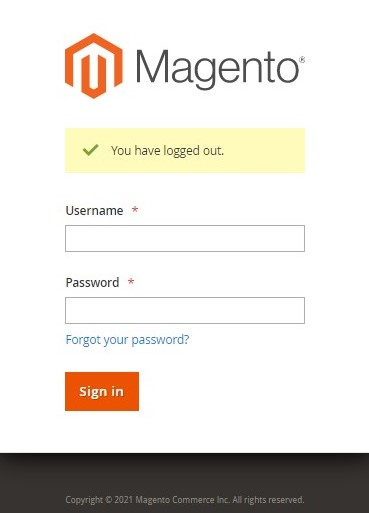
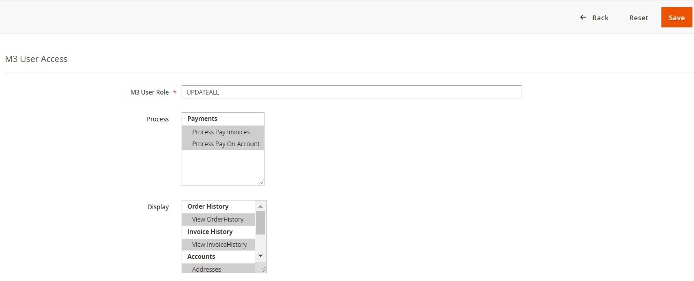

 
 
 # Version 21.1.0 - User Manual - Customer Portal - Admin User

# Table of contents

- [Overview](#Overview)
	- [Architecture](#Architecture)	 
	- [Features](#Features)
	- [Point Of Contact](#Point-Of-Contact)
- [User Manual for Customer Portal - Admin User](#User-Manual-for-Customer-Portal-Admin-User)
	- [Login](#Login)
	- [Configuration](#Configuration)
		- [General](#General)
		- [Customer Add/Sync Configuration](#Customer-Add/Sync-Configuration)
		- [Cron](#Cron)
	- [M3 User Roles](#M3-User-Roles)
        - [Add New Role](#Add-New-Role)
            - [Edit Role](#Edit-Role)
            - [Delete Role](#Delete-Role)
            - [Search/Filter](#Search/Filter)
            - [Visible Columns](#Visible-Columns)
            - [Pagination](#Pagination)
	- [Sub Account User Management](#Sub-Account-User-Management)
        - [Export](#Export)
        - [Import](#Import)
        - [Import Settings](#Import-Settings)
        - [Import Behaviour](#Import-Behaviour)
        - [File to Import](#File-to-Import)
        - [Check Data](#Check-Data)
	- [Customer User Permissions](#Customer-User-Permissions)

 

# User Manual – Customer Portal Admin User

 

# Overview
LeanSwift Customer Portal is a customer self-service web portal that enables users to get instance access to information about their orders, invoices and payments. With additional add-ons, uses can also make e-payments directly via the portal. It is seamlessly integrated with Infor M3 CloudSuite using ION. Customer Portal offers a single point of access to structured information about customer transactions and self-service functionality such as pay invoices, user management and much more.

# Architecture

<kbd>
<kbd></kbd>
</kbd>

<b>
 <a href="#toc">↥ Go to Top</a>
</b>

 

## Features
Account

- Registration and Login of External User
- Import and Login of Internal User
- View User Account Information
- Customer Selection by logged in user
- Switch Customer Account

Orders

- View Order History
- Synchronization of Order Status in real-time
- Search by Order#, Order Date
- Filter by Order Status
- Sort by Order Date

Invoices

- View Invoice History
- Synchronization of Invoice Status in real-time
- Search by Invoice#, Invoice Date
- Filter by Invoice Status
- Sort by Invoice Date

Payments

- Pay Invoices by CC
- Pay Invoices by Credit Memos
- Pay on Account by CC
- Support for both Full & Partial Payments
- Synchronization of Payment Status in real-time

Admin

- Settings and Configuration for Portal and M3 Connectivity
- M3 User Roles Configuration, User Permissions and sub-account management

<b>
 <a href="#toc">↥ Go to Top</a>
</b>

 

## Point Of Contact
This document and the software it describes are provided by LeanSwift Solutions Inc. For additional information regarding support, licensing, functionality etc. please contact LeanSwift Solutions Inc. via contact form at http://www.leanswift.com or email info@leanswift.com.

<b>
 <a href="#toc">↥ Go to Top</a>
</b>

 

# User Guide for Customer Portal Admin

 

## Login

Logging to Customer Portal Configuration:

- Login using Magento admin credentials.
- Go to LeanSwift tab (from left panel) - Customer Portal - Settings.

<kbd>
<kbd></kbd>
</kbd>

<kbd>
<kbd></kbd>
</kbd>

<b>
 <a href="#toc">↥ Go to Top</a>
</b>

 

## Configuration

- The Configuration module allows the administrator to configure Settings of Customer Portal.
- Administrator can view, add and edit configurations.
- Go to LeanSwift – Customer Portal – Configuration.
- Save the configuration by clicking the Save Config button.

<kbd>
<kbd></kbd>
</kbd>

<b>
 <a href="#toc">↥ Go to Top</a>
</b>

 

### General

- General configurations section allows the admin to configure general settings of Customer Portal such as Customer Selection, Internal User allowed Sections, Restricted Customer groups, CRON configurations of Order and Invoice.

<kbd>
<kbd></kbd>
</kbd>

- Customer Selection
    - Customer Selection Configuration of General section, allows admin to select the type of customer to be listed after logging to Customer Portal. 
    - Specify Customer Selection, Payer or Customer.
    - If customer type is selected as Customer, all customers associated with the user are listed in the Customer Portal home page.
    - If customer type is selected as Payer, customers who are payers are listed for the logged in user.

<kbd>
<kbd></kbd>
</kbd>

<kbd>
<kbd></kbd>
</kbd>

- Internal User Allowed Section
    - Admin users can configure the Internal User Allowed Section, to limit/add sections allowed for Internal User, add or delete the section.
    - The main menus and their related Section names are listed in the table below.

|Main Menus|Section Name|
| :-: | :-: |
|Accounts|
Account Summary

- Addresses
|
|Order History|View Order History|
|Invoice History|View Invoice History|
|Payments|
View Pay Invoices

- View Pay in Account

- Process Pay invoices

Process Pay on Account
|

<kbd>
<kbd></kbd>
</kbd>

- To add or delete the internal user allowed section click on Add or delete button.

<kbd>
<kbd></kbd>
</kbd>
<kbd>
<kbd></kbd>
</kbd>

- Restrict Customer Group
    - To restrict access to Customer Portal based on M3 Customer group, Admin user can configure Restrict Customer Group - Specify customer groups as per M3 system. 
    - If a user's customer group is restricted, external customers with valid credentials will be unable to register or access the Customer portal.
    - To restrict multiple customer groups, specify the customer groups as Comma separated. Eg. Y10, Y20.

<kbd>
<kbd></kbd>
</kbd>

- Order History CRON
    - To import Order history via Cron, configure Order History CRON – Select Yes.
    - When the Order History CRON setting is set to NO, the user is not allowed to run the Order History CRON job.

- From Date to Fetch Orders
    - To set the from date to fetch Order history, configure From Date to Fetch Orders – Specify the date.
    - Enabling Use System Value sets the from date to fetch orders to 180 days behind the current date as the default value.

<kbd>
<kbd></kbd>
</kbd>

- Invoice History CRON
    - To import Order history via Cron, configure Invoice History CRON – Select Yes.
    - When the Invoice History CRON setting is set to NO, the user is not allowed to run the Invoice History CRON job.

- From Date to Fetch Invoices
    - To set the from date to fetch Order history, configure From Date to Fetch Invoices – Specify the date.
    - Enabling Use System Value, sets the from date to fetch Invoices as default value, 180 days behind the current date. 

- Invoice/Order History Max Records
    - To limit the maximum number of records retrieved while executing Invoice/Order History CRON, configure Invoice/Order History Max Records – Specify the number of records.
    - Enabling Use System value sets the maximum invoice/order records to default value, 10000. 

<kbd>
<kbd></kbd>
</kbd>

 

### Customer Add/Sync Configuration
Customer Add/Sync Configurations section allows admin to configure customer add/sync settings such as Add/Sync Customers, Add/Sync Customers with STAT Id, Free Field filters, Additional filters and the last updated timestamp.

- Enable Add/Sync Customer
	- To allow import of data through CRON and Sync from M3 to Portal Database,configure Enable Add/Sync Customer – Select Yes.
	- Configuring Enable Add/Sync Customer setting to No, restricts the user from importing data via CRON and Sync from M3 to Portal Database.

- Add Sync Customer with STAT ID
	- After the Add/Sync Customer option is enabled, in order to restrict Sync Customer feature only for customers with STATID, configure Add Sync Customer with STAT ID – Select Yes.
	- Configuring Add Sync Customer with STAT ID to No, allows Sync Customer feature for both Customers with STAT ID and Customers without STAT ID.

<kbd>
<kbd></kbd>
</kbd>

- Free Field Filter
	- To filter customers based on free field value from OCUSMA in M3 system, configure Free Field Filter – Specify the filter with free field values. 
  Ex: CFC5=1 or CFC=5

 <kbd>
<kbd></kbd>
</kbd>

<kbd>
<kbd></kbd>
</kbd>

- Additional Filter(s)
	- To add additional filters to filter customers, configure Additional Filter(s) – Add conditions. Ex: OKSTAT = 20 AND OKWHLO = 001.
	- Additional filters are applied to CRON jobs executed.

- Time Stamp
    - To configure the last updated time stamp – configure Time Stamp – Mention the timestamp. 
    - The time stamp configuration is updated after every CRON import with its successful execution timestamp. 

<kbd>
<kbd></kbd>
</kbd>

<b>
 <a href="#toc">↥ Go to Top</a>
</b>

 

### Cron
- To configure CRON job details of Customer portal as admin, go to LeanSwift – Customer Portal – Settings – General – CRON.
- To disable the CRON job, the configuration for CRON shall be empty.
- The CRON job details can be configured for:
    - Import Customer
    - Import Order History
    - Import Invoice History

For detailed understanding of CRON configurations refer to [cron - Wikipedia](https://en.wikipedia.org/wiki/Cron#Predefined_scheduling_definitions).

┌───────────── minute (0 - 59)

│ ┌───────────── hour (0 - 23)

│ │ ┌───────────── day of the month (1 - 31)

│ │ │ ┌───────────── month (1 - 12)

│ │ │ │ ┌───────────── day of the week (0 - 6) (Sunday to Saturday;

│ │ │ │ │                            7 is also Sunday on some systems)

│ │ │ │ │

│ │ │ │ │

\* \* \* \* \* <command to execute>

|Field|Required|Allowed values|Allowed special characters|
| :- | :- | :- | :- |
|Minutes|Yes|0–59|\* , -|
|Hours|Yes|0–23|\* , -|
|Day of month|Yes|1–31|\* , - ? L W|
|Month|Yes|1–12 or JAN–DEC|\* , -|
|Day of week|Yes|0–6 or SUN–SAT|\* , - ? L #|
|Year|No|1970–2099|\* , -|

<kbd>
<kbd></kbd>
</kbd>

<b>
 <a href="#toc">↥ Go to Top</a>
</b>

 

## M3 User Roles
- To access Customer Portal M3 User Roles, Admin user can login to the Magento system with credentials, go to LeanSwift - Customer Portal - M3 User Roles.

<kbd>
<kbd></kbd>
</kbd>

- Admin user can view the list of M3 User Roles, add new roles, edit roles and delete roles.

<kbd>
<kbd></kbd>
</kbd>

<b>
 <a href="#toc">↥ Go to Top</a>
</b>

 

### Add New Role
- The Admin user can click the Add New Role button to create a new role.
- By adding a new role, Admin users can configure permissions to perform processes such as payments and modules to be displayed for the M3 User role.

<kbd>
<kbd></kbd>
</kbd>

- Select the M3 user role, the processes that should be authorised, and the modules that should be displayed.
- Click on Save button to add a new Role.
- Incorrect configuration of user roles, will lead to authorization failure while logging.

Note: To deselect an option, hold down the Ctrl key while selecting it.

<kbd>
<kbd></kbd>
</kbd>

<b>
 <a href="#toc">↥ Go to Top</a>
</b>

 

### Edit Role
- To edit M3 User Roles, click on the edit option next to M3 user roles.
- Modify the permissions and Click on Save.

<kbd>
<kbd></kbd>
</kbd>

<kbd>
<kbd></kbd>
</kbd>

<b>
 <a href="#toc">↥ Go to Top</a>
</b>

 

### Delete Role
- To delete an existing M3 User Role, admin user can Click on delete option next to the user role displayed.

<kbd>
<kbd></kbd>
</kbd>

<b>
 <a href="#toc">↥ Go to Top</a>
</b>

 

### Search/Filter
- The Search by Keyword option allows admin to search for M3 User Roles using a keyword.
- Filter option helps to filter the M3 user roles based on M3 Role, Process, Display, No Access. 
- Specify the fields to be filtered, and apply filters.

<kbd>
<kbd></kbd>
</kbd>

<b>
 <a href="#toc">↥ Go to Top</a>
</b>

 

### Visible Columns
- Click on columns and select the columns to be displayed to configure the viewable columns on the M3 User Roles screen.

<kbd>
<kbd></kbd>
</kbd>

<b>
 <a href="#toc">↥ Go to Top</a>
</b>

 

### Pagination
- The pagination menu can be used to change the number of records displayed each page.
- Custom option allows admin to enter the number manually. 
- 999 records is the maximum number of records per page.

<kbd>
<kbd></kbd>
</kbd>

<b>
 <a href="#toc">↥ Go to Top</a>
</b>

 

## Sub Account User Management

 

### Export
- To export Customers' Main File, go to Settings – Data Transfer – Export.

<kbd>
<kbd></kbd>
</kbd>

- Select the entity type from export settings, as Customers Main File.
- Currently Supported export file format is CSV.
- Fields enclosure.

<kbd>
<kbd></kbd>
</kbd>

- Admin can search the entity attributes and apply attribute-level exclude filters.

<kbd>
<kbd></kbd>
</kbd>

- Click on continue button, to export customers main file with search and exclude filter conditions applied.
- The admin can use the Reset filter option to return to the default filter configurations.
- Export requests will be added to the message queue if the export file Cron job is active.

*“Message is added to queue, wait to get your file soon. Make sure your Cron job is running to export the file.”*

<kbd>
<kbd></kbd>
</kbd>

- Admin can download or delete the exported file from the action menu.

<kbd>
<kbd></kbd>
</kbd>

<b>
 <a href="#toc">↥ Go to Top</a>
</b>

 

### Import
- To import the Customer's Main file, Customer portal Admin user can go to Settings – Data Transfer – Import.
- Update Fields:
  - IsAdmin - Specifying yes to IsAdmin provides admin privilege to user. 
  - Make Payment - Specifying yes to make payment provides payment privilege to user.
  - View Sections - Specify the sections with view permission for users.
  - Assigned customers field - Verify the list of customers, add or delete to limit access for users.

<kbd>
<kbd></kbd>
</kbd>

<b>
 <a href="#toc">↥ Go to Top</a>
</b>

 

### Import Settings
- The maximum size of the import file for Customers Main File is 1536MB.
- Select the Entity type as Customers Main File.

<kbd>
<kbd></kbd>
</kbd>

- Admin can download Sample file to understand the expected file format and field values.
- Is Admin, Make Payment and Allow Section are all mandatory and not null fields. 

<kbd>
<kbd></kbd>
</kbd>

<b>
 <a href="#toc">↥ Go to Top</a>
</b>

 

### Import Behaviour
- Choose the expected Import behaviour
  - Add/Update Complex Data - Modify the exported file and click on add/update complex data, upload the modified file.
  - Delete entities.
  - Custom Action. 
- Choose the Validation Strategy for the system when error occurs during import.
  - Stop on Error – Configuring Stop On error instructs the system to not proceed when an error occurs during import.
  - Skip Error entities – Configuring Skip Error entities instructs the system to skip those entities with error and complete import action.
- Allowed Error count 
  - The maximum number of errors accepted while importing. 
  - In case there are more errors than allowed error count, the system shall stop the import process.
- Field separator – Specify the separator as used in the import file. 
- Multiple value separator – Specify the separator when there are multiple values in one field value. 
- Empty attribute value constant.

<kbd>
<kbd></kbd>
</kbd>

<b>
 <a href="#toc">↥ Go to Top</a>
</b>

 

### File to Import
- Select File to Import: Choose the file to be imported, file must be of UTF-8 encoding for proper import.

<kbd>
<kbd></kbd>
</kbd>

<b>
 <a href="#toc">↥ Go to Top</a>
</b>

 

### Check Data
- Once Import settings, Import behaviour and Files to import are provided, admin can check data in import file, by clicking on Check Data button.
- System validates the import file and displays Validation results. 
- Error messages displayed helps admin to understand the issues with the import file.
	- Eg: Data validation failed, please check the below errors and upload the file.

<kbd>
<kbd></kbd>
</kbd>

<kbd>
<kbd></kbd>
</kbd>

- When the import file is valid, the data is validated and the choice to import is provided in the validation results section.
- Click on the Import button.

<kbd>
<kbd></kbd>
</kbd>

- Confirmation on import status is displayed with information on the number of records created, updated or deleted.

<kbd>
<kbd></kbd>
</kbd>

<b>
 <a href="#toc">↥ Go to Top</a>
</b>

 

## Customer User Permissions

- Users must have roles assigned to them in Magento, and they can only log in to the frontend based on the rights they have been allowed.

 - **Default permission for External User**

<kbd>
<kbd></kbd>
</kbd>

 - **Internal User Permission**

<kbd>
<kbd></kbd>
</kbd>

 - **STAT Admin Permission**

<kbd>
<kbd></kbd>
</kbd>

 - **STAT Sub Account Permission**

<kbd>
<kbd></kbd>
</kbd>

- M3 USER Role 
	- Internal User permissions are leveraged at M3 user Role configuration. 
	- Customers of Magento have permissions by default. 
	- Users should have access configured both in Customers Portal Settings and M3 user role settings.

- Configuration of Customer Logo
	- To configure the Logo of Customer Portal, go to Content - Configuration - Design Configuration - Header.
	- Provide the Logo image, Alternate Logo Image and additional details like width height of the logo.

<kbd>
<kbd></kbd>
</kbd>

- Configuration of Email Templates
	- To configure Email Templates, go to Stores – Configuration – Customers - Customer configuration.
	- Configure Default welcome email without password.

<kbd>
<kbd></kbd>
</kbd>

<b>
 <a href="#toc">↥ Go to Top</a>
</b>

