# Version 21.1.0 - User Manual - Customer Portal - User

# Table of contents

- [Overview](#Overview)
 	- [Architecture](#Architecture)	 
    - [Features](#Features)	 
    - [Point Of Contact](#Point_Of_Contact)
- [Registration](#Registration)
    - [Registration for Internal Customer (M3 User)](#Registration_for_Internal)
    - [Registration for External Customer](#Registration_for_External)
    - [Password Policy](#Password_Policy)
    - [General guidelines/help](#Help)
- [Login](#Login)
    - [Login](#Login1)
    - [User Privileges](#User_Privileges)
- [Forgot Password](#Forgot_Password)
- [Switch Customer](#Switch_Customer)
- [Download Sub Accounts Info](#Download_Sub_Accounts_Info)
- [My Account](#My_Account)
    - [Account Summary](#Account_Summary)
    - [Addresses](#Addresses)
- [Invoices](#Invoices)
    - [Invoice Search](#Invoice_Search)
    - [Invoice Filter](#Invoice_Filter)
    - [Invoice Sort](#Invoice_Sort)
    - [Download Current Statement](#Download_Current_Statement)
- [Orders](#Orders)
    - [Order Search](#Order_Search)
    - [Order Filter](#Order_Filter)
    - [Order Sort](#Order_Sort)
- [Sign Out](#Sign_Out)

# User Manual - Customer Portal - Front end User

 
 

# Overview
LeanSwift Customer Portal is a customer self-service web portal that enables users to get instance access to information about their orders, invoices and payments. With additional add-ons, uses can also make e-payments directly via the portal. It is seamlessly integrated with Infor M3 CloudSuite using ION. Customer Portal offers a single point of access to structured information about customer transactions and self-service functionality such as pay invoices, user management and much more.

<b>
 <a href="#toc">↥ Go to Top</a>
</b>

# Architecture

<kbd>
<kbd></kbd>
</kbd>

<b>
 <a href="#toc">↥ Go to Top</a>
</b>

 
 

## Features
Account

- Registration and Login of External User
- Import and Login of Internal User
- View User Account Information
- Customer Selection by logged in user
- Switch Customer Account

Orders

- View Order History
- Synchronization of Order Status in real-time
- Search by Order#, Order Date
- Filter by Order Status
- Sort by Order Date

Invoices

- View Invoice History
- Synchronization of Invoice Status in real-time
- Search by Invoice#, Invoice Date
- Filter by Invoice Status
- Sort by Invoice Date

Payments

- Pay Invoices by CC
- Pay Invoices by Credit Memos
- Pay on Account by CC
- Support for both Full & Partial Payments
- Synchronization of Payment Status in real-time

Admin

- Settings and Configuration for Portal and M3 Connectivity
- M3 User Roles Configuration, User Permissions and sub-account management

<b>
 <a href="#toc">↥ Go to Top</a>
</b>

 
 

## Point Of Contact

This document and the software it describes are provided by LeanSwift Solutions Inc. For additional information regarding support, licensing, functionality etc. please contact LeanSwift Solutions Inc. via contact form at http://www.leanswift.com or email info@leanswift.com.

<b>
 <a href="#toc">↥ Go to Top</a>
</b>

 
 

# Registration

 
  

## Registration for Internal Customer (M3 User)
- Internal customers (M3 users) can utilise their Infor OS (Mingle) credentials to access the Customer Portal without having to sign up.
- The password box is disabled whenever an internal user inputs an email address with a valid internal domain.

<kbd>
<kbd>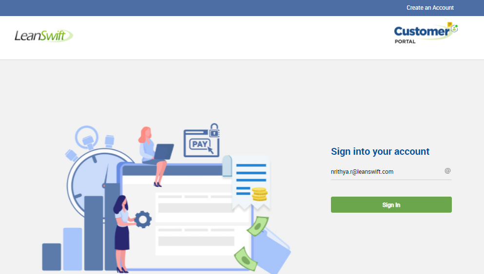</kbd>
</kbd>

- By clicking Sign in, the front end user is redirected to Infor OS to authenticate their credentials.
  - Note: The user must use the same credentials to login to Infor OS as used to log in to the customer portal.

<kbd>
<kbd>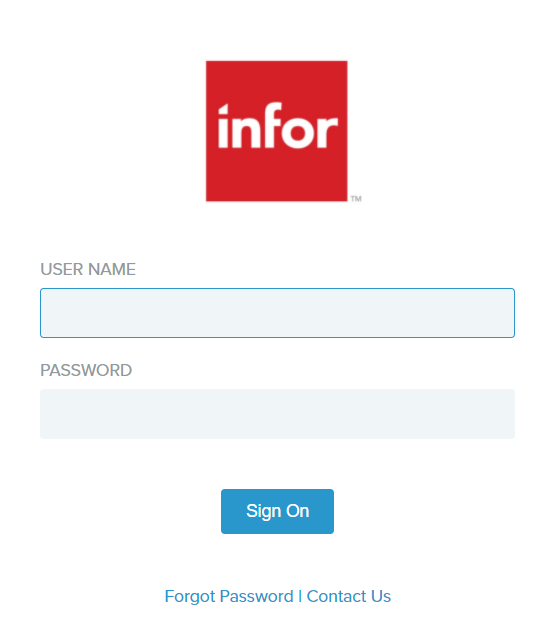</kbd>
</kbd>

- Following successful validation in the Infor OS, the system generates a Request for Approval, which includes the requester's information and the choice to grant or deny access.

<kbd>
<kbd>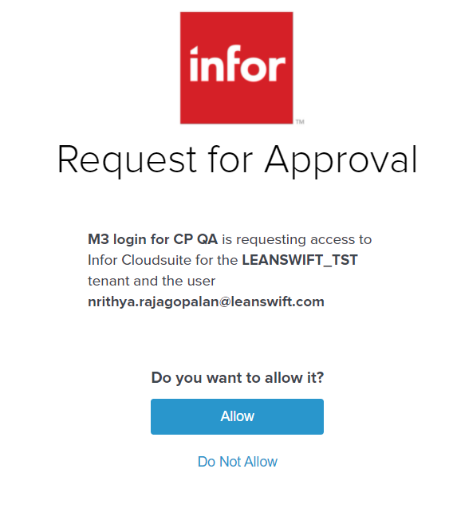</kbd>
</kbd>

- Once the internal user has authorised access, the user gets signed in to Customer Portal.

Note: After the initial successful login, the Infor OS user id is created in the Customer Portal Database.

<kbd>
<kbd>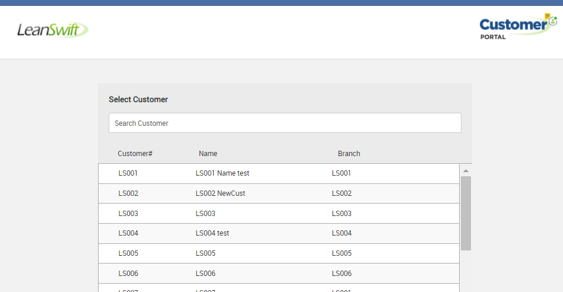</kbd>
</kbd>

- If a user is unable to log in to Infor OS, they can utilise Forgot password to reset their password or Contact us to contact the team.

<b>
 <a href="#toc">↥ Go to Top</a>
</b>

 
 

## Registration for External Customer 
- Users who have reference current Invoice number or Orders in the M3 system can register as an external customer in the Customer Portal.
- Registration for External Customer - Prerequisites:
  - First Name 
  - Last Name 
  - M3 Customer Number
  - Invoice/Order Number
  - Invoice/Order Amount
  - Email id

<kbd>
<kbd>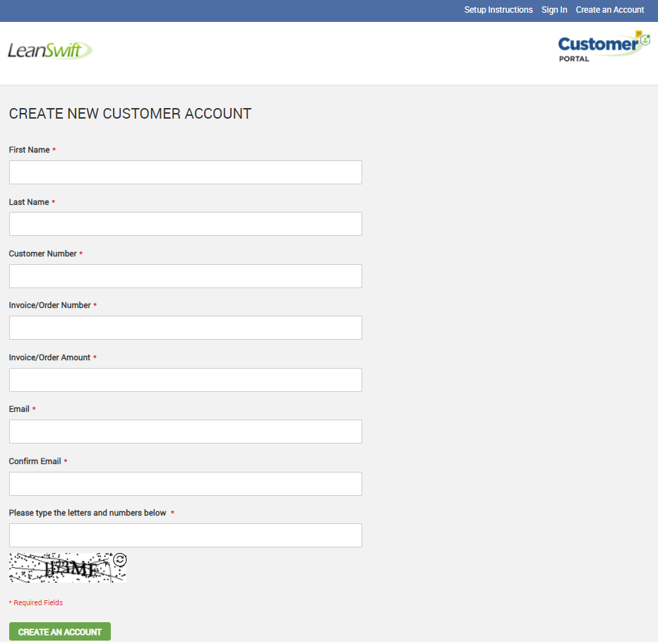</kbd>
</kbd>

- As the user enters the above details, Customer number, Invoice/Order Number and Invoice/Order amount is validated.
- A STAT ID may or may not be associated with the client in M3.  Behavior of the portal is slightly different based on whether the customer has a STAT ID or not.
- The first customer to be associated with a new account will be an Admin user for the account and will have full access.
- All other users will have limited access on the site, until the admin provides additional privileges.

<kbd>
<kbd>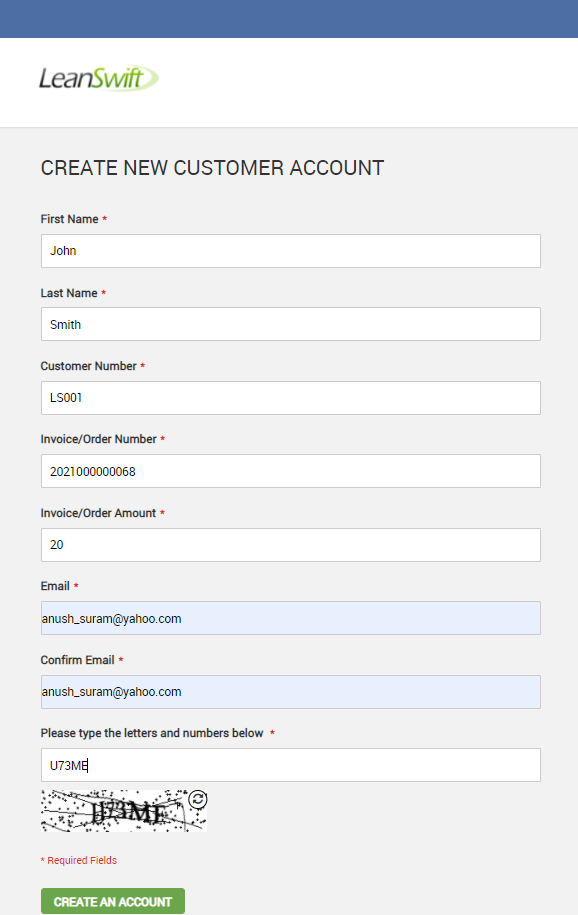</kbd>
</kbd>

- Following successful registration, an email with a link for account verification and password creation is sent to the registered email address.

Note: Please check the Junk or Spam folder in case this mail does not arrive within few minutes.

<kbd>
<kbd>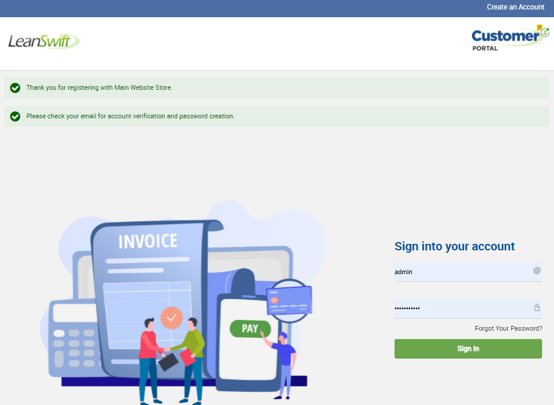</kbd>
</kbd>

<kbd>
<kbd>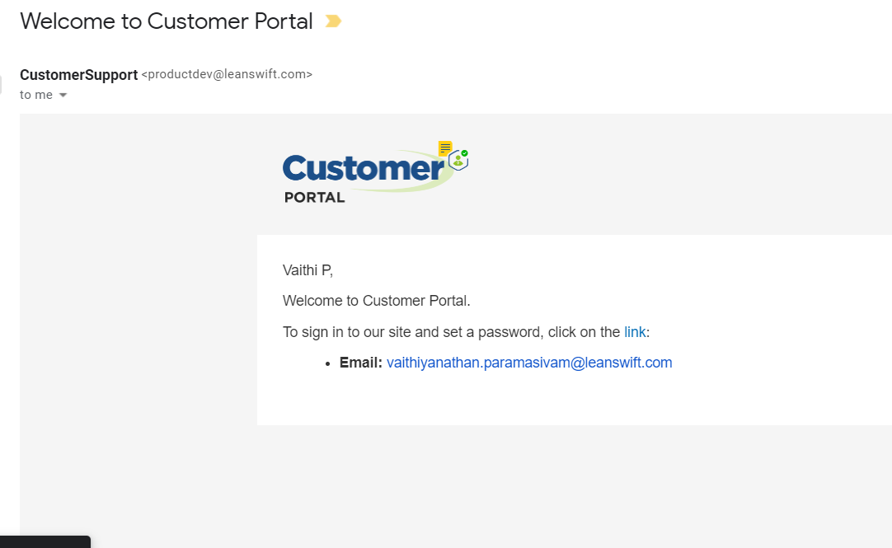</kbd>
</kbd>

- The link in the email directs the user to the password creation screen, where they can create a new password in accordance with the [password policy](#Password_Policy).

<kbd>
<kbd>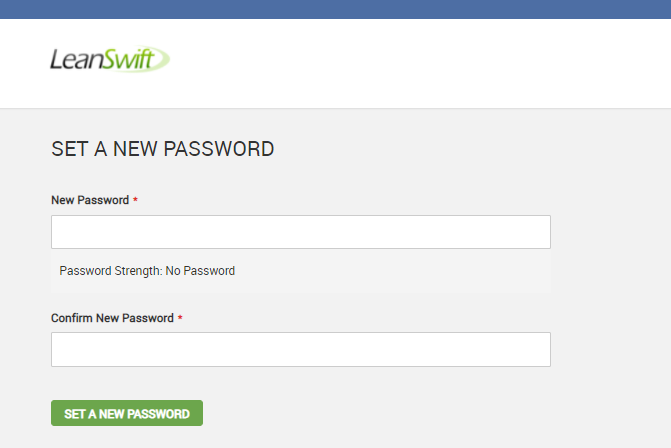</kbd>
</kbd>

<b>
 <a href="#toc">↥ Go to Top</a>
</b>

## Password Policy
Characteristics of Strong Password:

- Minimum of three different classes of characters. 
- Classes of characters: 
  - Lower Case
  - Upper Case
  - Digits
  - Special Characters
- Minimum length must be equal or greater than 8 symbols. 
- Leading and trailing spaces are ignored.

<kbd>
<kbd>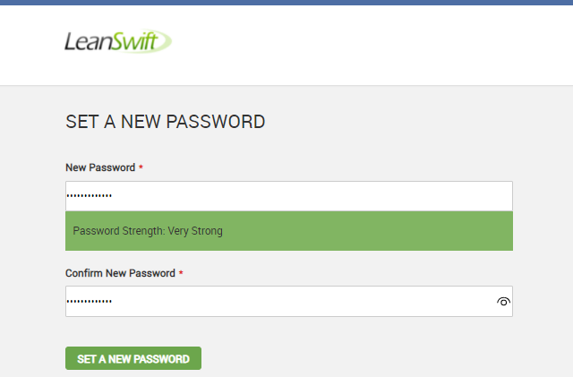</kbd>
</kbd>

<b>
 <a href="#toc">↥ Go to Top</a>
</b>

## General guidelines/help
- The following are some of the possible mistakes that can occur when enrolling a new user.
  - Customer number not present in the Customer Portal Database.
  - The requested order/invoice does not match.
    - The combination of Customer number, Invoice number and Amount did not match in M3 system and Customer Portal Database.
  - Registration is not allowed for this customer.
    - Customer Number is part of a restricted user group that is denied access to the Customer portal.
  - There is already an account with this email address. If you are sure that it is your email address, [click here](https://cpqa.leanswiftdev.net/customer/account/forgotpassword/) to get your password and access your account.

<kbd>
<kbd>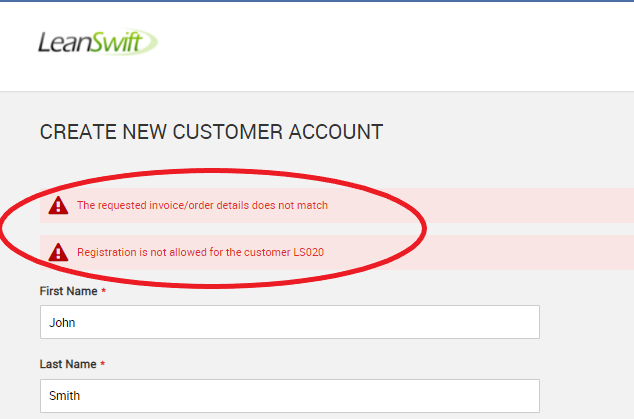</kbd>
</kbd>

<b>
 <a href="#toc">↥ Go to Top</a>
</b>

# Login
- The user logs in to Customer Portal using their registered credentials. 

<kbd>
<kbd>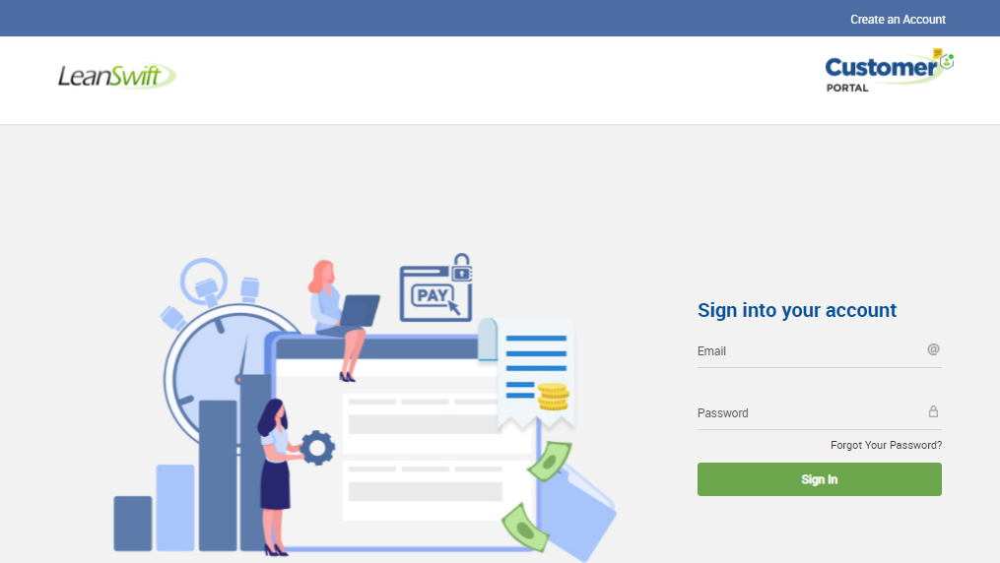</kbd>
</kbd>

<b>
 <a href="#toc">↥ Go to Top</a>
</b>

## Login
- Successful login takes the front end user to the Customer Portal main screen, which displays a list of customers.
- The user can choose a customer and view their information.

<kbd>
<kbd>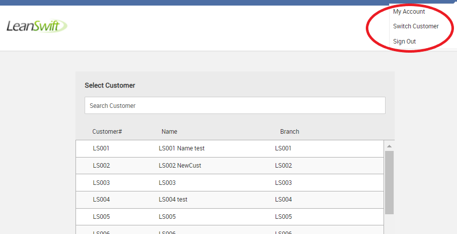</kbd>
</kbd>

<kbd>
<kbd>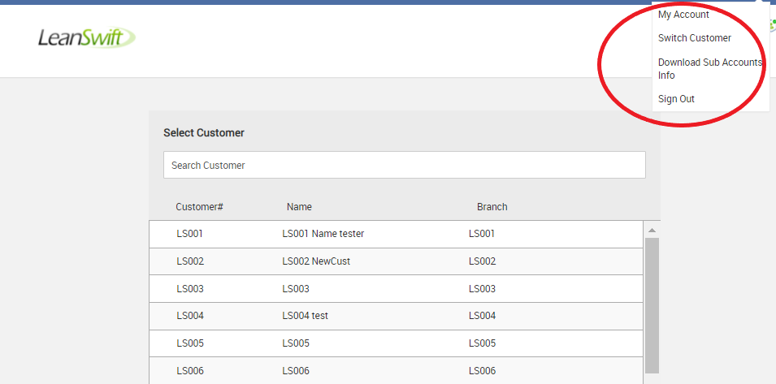</kbd>
</kbd>

<b>
 <a href="#toc">↥ Go to Top</a>
</b>

## User Privileges
- Based on the user privileges of the external user, the options are enabled.

|External User|My Account|Switch Accounts|Download Sub Accounts Info|
| :- | :- | :- | :- |
|Customer with STAT ID + Account Admin User|Yes|Yes|Yes|
|Customer with STAT ID + Account Normal User|Yes|Yes|No|
|Customer without STAT ID|Yes|No|No|

<b>
 <a href="#toc">↥ Go to Top</a>
</b>

# Forgot Password
- To reset the password, user can click on forgot password button in the home screen of Customer Portal.

<kbd>
<kbd>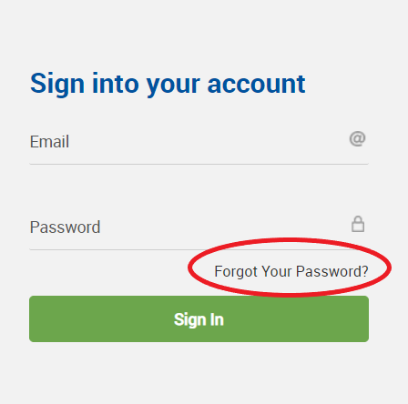</kbd>
</kbd>

- The user can provide a registered email id and request a reset password.

<kbd>
<kbd>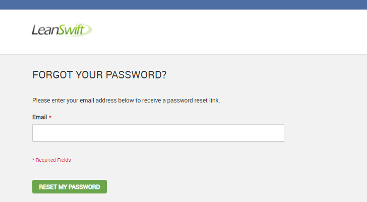</kbd>
</kbd>

- The password reset link will be sent to the user's email address.

<kbd>
<kbd>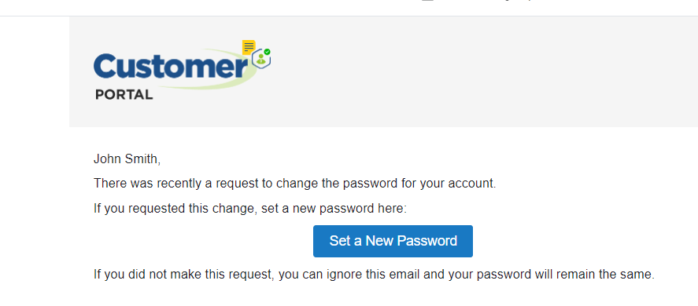</kbd>
</kbd>

- The link redirects the user to the password reset page, where they can create a new password that meets the[ password policy](#_heading=h.17dp8vu).

<kbd>
<kbd></kbd>
</kbd>

<b>
 <a href="#toc">↥ Go to Top</a>
</b>

# Switch Customer
- The Switch Customer option on the top right drop down menu is enabled for users with [privileges](#_heading=h.35nkun2) to view other customer account details.

<kbd>
<kbd>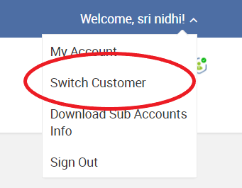</kbd>
</kbd>

- Once the user clicks on the switch customer option, a list of the user's customers are displayed. 
- To view details about a customer, the user must first select the customer.

<kbd>
<kbd></kbd>
</kbd>

<b>
 <a href="#toc">↥ Go to Top</a>
</b>

# Download Sub Accounts Info

- Users having Sub Accounts, i.e. Account Admin Users, have the option to download Sub Accounts Info.

<kbd>
<kbd>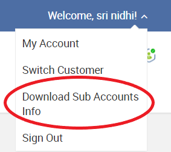</kbd>
</kbd>

- Click on Download Sub Accounts Info Option, to download the details of sub accounts in CSV format.
    - Name - Name of the customer.
    - Email - Email id of the customer.
    - Allowed Sections - The sections allowed to the user - View Order History, View Invoice History, View Pay Invoices.
    - Make Payment - Provides information on whether or not the customer has privileges to make a payment - Yes/No.

<kbd>
<kbd>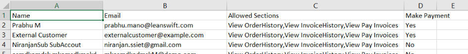</kbd>
</kbd>

<b>
 <a href="#toc">↥ Go to Top</a>
</b>

# My Account
- The My Account menu shows the selected customer's account information.

<kbd>
<kbd>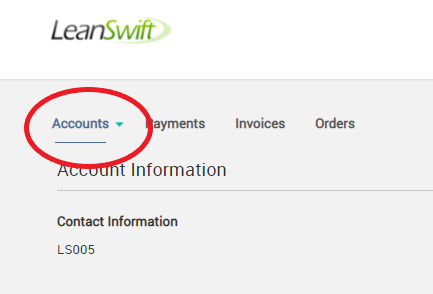</kbd>
</kbd>

<b>
 <a href="#toc">↥ Go to Top</a>
</b>

## Account Summary
- The user can access account summary, from the Accounts section's drop down menu,.
- The customer's contact information and invoice address are displayed in the account summary.

<kbd>
<kbd>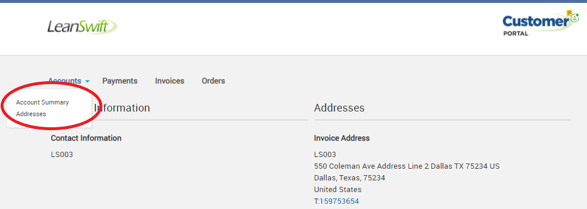</kbd>
</kbd>

<b>
 <a href="#toc">↥ Go to Top</a>
</b>

## Addresses
- The Addresses option displays the customer's invoice address as well as any extra addresses.

<kbd>
<kbd>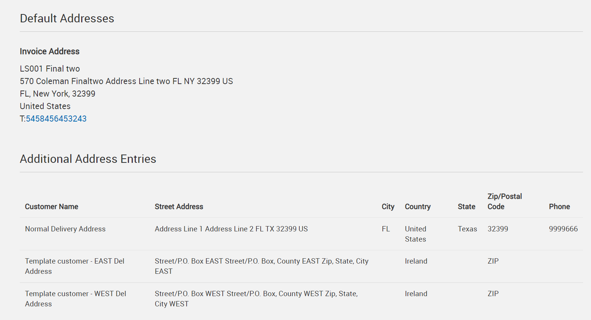</kbd>
</kbd>

<b>
 <a href="#toc">↥ Go to Top</a>
</b>

# Invoices
- The customer's invoice data are displayed in the Invoice tab:Invoice number, Order number, Customer number, Customer PO Ref, Invoice Date, Invoice Amount, and Status.
- Ten invoice entries are displayed per page.

<kbd>
<kbd>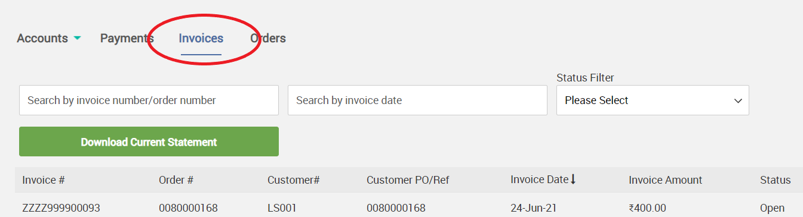</kbd>
</kbd>

<b>
 <a href="#toc">↥ Go to Top</a>
</b>

## Invoice Search
- Search by Invoice Number or Order Number.
- Search by Invoice Date 
  - The user can view Invoices by slecting start date(Year 2018) and end date(Current year).

<kbd>
<kbd>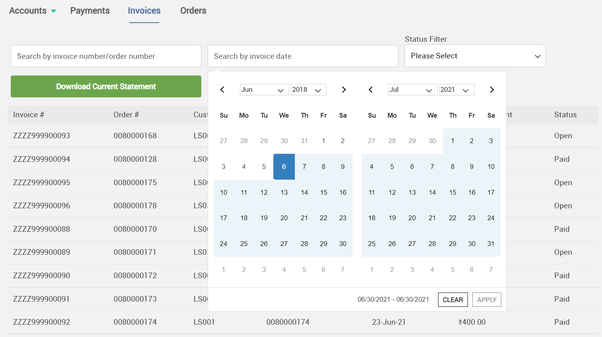</kbd>
</kbd>

<b>
 <a href="#toc">↥ Go to Top</a>
</b>

## Invoice Filter
- The user can filter invoices based on the status of invoices.
  - Open Invoices
  - Paid Invoices
  - All Invoices

<kbd>
<kbd>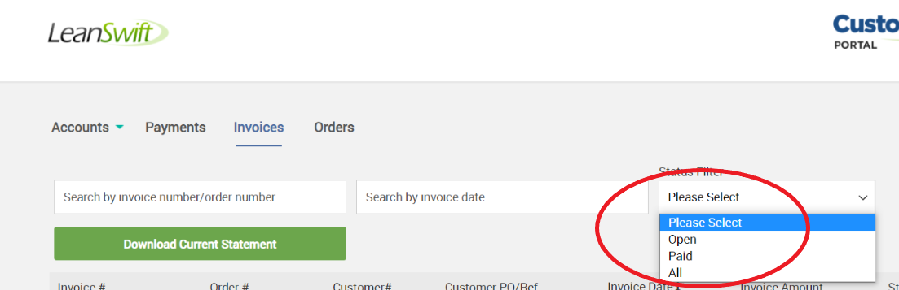</kbd>
</kbd>

<b>
 <a href="#toc">↥ Go to Top</a>
</b>

## Invoice Sort
- By clicking on the sort arrow next to Invoice Date, users can sort the invoices by date.
- By default, invoices are sorted in descending order, with the most recent invoices appearing first.

<kbd>
<kbd>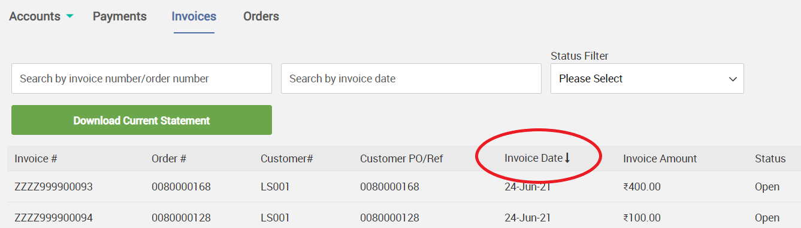</kbd>
</kbd>

<b>
 <a href="#toc">↥ Go to Top</a>
</b>

## Download Current Statement
- Click on Download Current Statement menu to download Current Open Invoices in CSV format.

<kbd>
<kbd>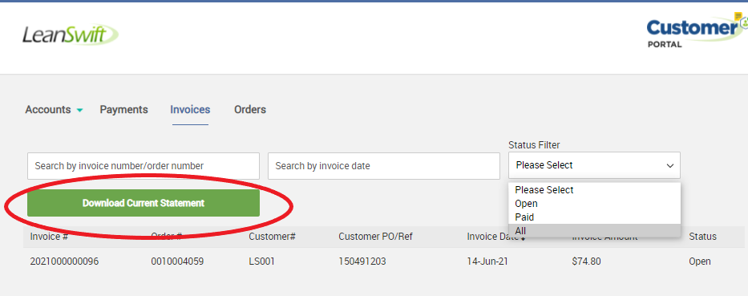</kbd>
</kbd>

<b>
 <a href="#toc">↥ Go to Top</a>
</b>

# Orders
- Orders tab displays the customer's order information – Order number, Customer number, Customer PO/Reference, Order Date and Order Status.
- Ten order entries are displayed per page.

<kbd>
<kbd>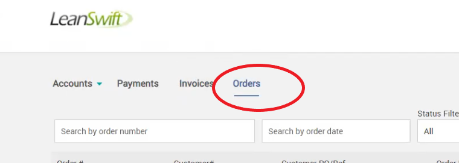</kbd>
</kbd>

<b>
 <a href="#toc">↥ Go to Top</a>
</b>

## Order Search
- Search by Order Number.
- Search by Order Date.

## Order Filter
The user can filter orders based on the status of invoices.

- All Orders
- Open Orders
- Fully Invoiced Orders

<kbd>
<kbd>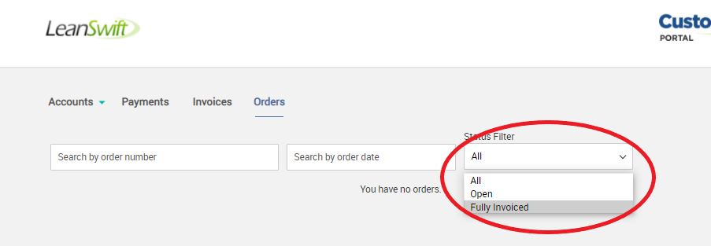</kbd>
</kbd>

## Order Sort
- By clicking on the sort arrow next to Order Date, users may sort the orders by date.
- By default, orders are sorted in descending order, with the most recent orders appearing first.

<kbd>
<kbd></kbd>
</kbd>

<b>
 <a href="#toc">↥ Go to Top</a>
</b>

# Sign Out
- Click on the arrow next to the user's name on top right corner of the Customer Portal. 
- Select Sign Out from the dropdown menu.
- The user will be redirected to the main page in 5 seconds after successfully signing out.

<kbd>
<kbd>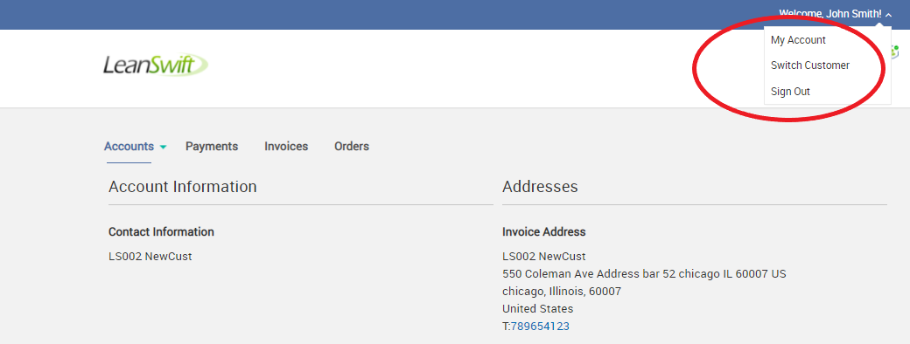</kbd>
</kbd>

<kbd>
<kbd></kbd>
</kbd>

<b>
 <a href="#toc">↥ Go to Top</a>
</b>

