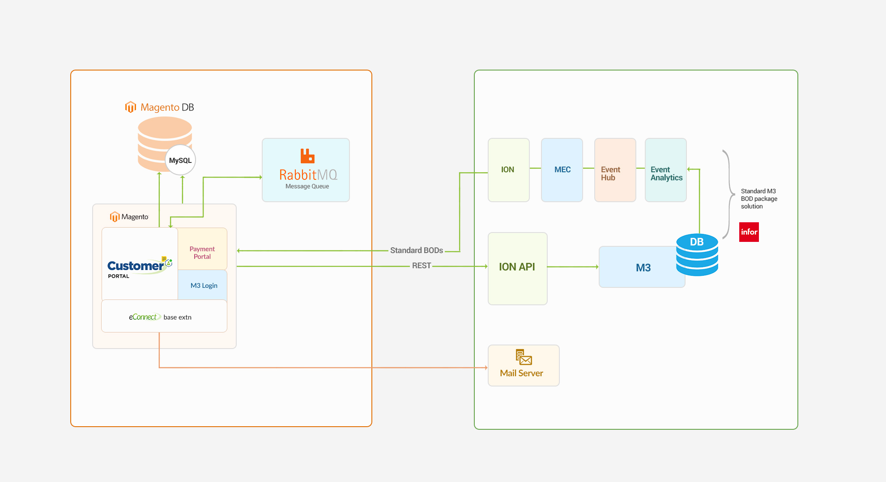

# **Version 23.1.0 - User Manual – Customer Portal - User**

# Table of contents

- [Overview](#overview)
- [Architecture](#architecture)
  - [Features](#features)
  - [Point Of Contact](#point-of-contact)
- [Registration](#registration)
  - [Registration for Internal Customer (M3 User)](#registration-for-internal-customer-m3-user)
  - [Registration for External Customer](#registration-for-external-customer)
  - [Password Policy](#password-policy)
  - [General guidelines/help](#general-guidelineshelp)
- [Login](#login)
  - [Login](#login)
  - [User Privileges](#user-privileges)
- [Forgot Your Password](#forgot-your-password)
- [Switch Customer](#switch-customer)
- [Download Sub Accounts Info](#download-sub-accounts-info)
    - [Accounts Overview](#account)
  - [My Invoices](#Invoices)
    - [My Invoice Search](#Invoice-search)
    - [My Invoice Filter](#Invoice-filter)
    - [My Invoice Sort](#Invoice-sort)
    - [Download Current Statement](#download-current-statement)
    - [Email Invoice Document](#email-invoice-document)
    - [Document Download in Invoice History](#document-download-in-invoice-history)
   - [My Orders](#orders)
       - [Order Search](#Order-search)
       - [Order Filter](#Order-filter)
       - [Order Sort](#Order-sort)
       - [Email Order Confirmation Document](#email-order-confirmation-document)
      - [Document Download in Order History](#document-download-in-order-history)
      - [Delivery Document Download](#delivery-document-download)
      - [View Order Shipment information](#view-order-shipment-information)
- [Log-out](#Log-out)

# User Manual - Customer Portal - Front end User

 

# Overview

LeanSwift Customer Portal is a customer self-service web portal that enables users to get instance access to information about their orders, invoices and payments. With additional add-ons, uses can also make e-payments directly via the portal. It is seamlessly integrated with Infor M3 CloudSuite using ION. Customer Portal offers a single point of access to structured information about customer transactions and self-service functionality such as pay invoices, user management and much more.

<b>
 <a href="#toc">↥ Go to Top</a>
</b>

# **Architecture**

<kbd>
<kbd></kbd>
</kbd>

<b>
 <a href="#toc">↥ Go to Top</a>
</b>

 

## Features 

Account

- Registration and Login of External User
- Import and Login of Internal User
- View User Account Information
- Customer Selection by logged in user
- Switch Customer Account

Orders

- View Order History
- Synchronization of Order Status in real-time
- Search by Po reference#, Order Date
- Filter by Order Status
- Sort by Order Date

Invoices

- View Invoice History
- Synchronization of Invoice Status in real-time
- Search by Invoice number or po reference#, Invoice Date
- Filter by Invoice Status
- Sort by Invoice Date

Payments

- Pay Invoices by CC
- Pay Invoices by Credit Memos
- Pay on Account by CC
- Support for both Full & Partial Payments
- Synchronization of Payment Status via cron

Admin

- Settings and Configuration for Portal and M3 Connectivity
- M3 User Roles Configuration, User Permissions and sub-account management

<b>
 <a href="#toc">↥ Go to Top</a>
</b>

 

## Point Of Contact 

This document and the software it describes are provided by LeanSwift Solutions Inc. For additional information regarding support, licensing, functionality etc. please contact LeanSwift Solutions Inc. via contact form at http://www.leanswift.com or email info@leanswift.com.

<b>
 <a href="#toc">↥ Go to Top</a>
</b>

 

# Registration

 
 

## Registration for Internal Customer (M3 User)

- Internal customers (M3 users) can utilise their Infor OS (Mingle) credentials to access the Customer Portal without having to sign up.
- The password box is disabled whenever an internal user inputs an email address with a valid internal domain.

<kbd>
<kbd></kbd>
</kbd>

- By clicking Sign in, the front-end user is redirected to Infor OS to authenticate their credentials.
  - Note: The user must use the same credentials to login to Infor OS as used to log in to the customer portal.

<kbd>
<kbd></kbd>
</kbd>

- Following successful validation in the Infor OS, the system generates a Request for Approval, which includes the requester's information and the choice to grant or deny access.

<kbd>
<kbd></kbd>
</kbd>

- Once the internal user has authorised access, the user gets signed into Customer Portal.

Note: After the initial successful login, the Infor OS user id is created in the Customer Portal Database.

<kbd>
<kbd></kbd>
</kbd>

- If a user is unable to log in to Infor OS, they can utilise Forgot password to reset their password or contact us to contact the team.

<b>
 <a href="#toc">↥ Go to Top</a>
</b>

## Registration for External Customer

- Users who have reference current Invoice number or Orders in the M3 system can register as an external customer in the Customer Portal.
- Registration for External Customer - Prerequisites:
  - First Name
  - Last Name
  - Customer Number
  - Invoice/Order Number
  - Invoice/Order Amount
  - Email
  - Confirm Email

<kbd>
<kbd></kbd>
</kbd>

- As the user enters the above details, Customer number, Invoice/Order Number and Invoice/Order amount is validated.
- A STAT ID may or may not be associated with the client in M3. Behaviour of the portal is slightly different based on whether the customer has a STAT ID or not.
- The first customer to be associated with a new account will be an Admin user for the account and will have full access.
- All other users will have limited access on the site, until the admin provides additional privileges.

<kbd>
<kbd></kbd>
</kbd>

- Following successful registration, an email with a link for account verification and password creation is sent to the registered email address.

Note: Please check the Junk or Spam folder in case this mail does not arrive within few minutes.

<kbd>
<kbd></kbd>
</kbd>

<kbd>
<kbd></kbd>
</kbd>

- The link in the email directs the user to the password creation screen, where they can create a new password in accordance with the password policy

<kbd>
<kbd></kbd>
</kbd>

<b>
 <a href="#toc">↥ Go to Top</a>
</b>

## Password Policy

Characteristics of Strong Password:

- Minimum of three different classes of characters.
- Classes of characters:
  - Lower Case
  - Upper Case
  - Digits
  - Special Characters
- Minimum length must be equal or greater than 8 symbols.
- Leading and trailing spaces are ignored.

<kbd>
<kbd></kbd>
</kbd>

<b>
 <a href="#toc">↥ Go to Top</a>
</b>

## General guidelines/help

- The following are some of the possible mistakes that can occur when enrolling a new user.
  - Customer number should not present in the Customer Portal Database.
  - The requested order/invoice does not match.
    - The combination of Customer number, Invoice number and Amount did not match in M3 system and Customer Portal Database.
  - Registration is not allowed for this customer.
    - Customer Number is part of a restricted user group that is denied access to the Customer portal.
  - There is already an account with this email address. If you are sure that it is your email address, [click here](https://cpqa.leanswiftdev.net/customer/account/forgotpassword/) to get your password and access your account.

<kbd>
<kbd></kbd>
</kbd>

<b>
 
  <a href="#toc">↥ Go to Top</a>
  
</b>

 

# Login

- The user logs in to Customer Portal using their registered credentials.

<kbd>
<kbd></kbd>
</kbd>

<b>
 <a href="#toc">↥ Go to Top</a>
</b>

## Login

- Successful login takes the front-end user to the Customer Portal main screen, which displays a list of customers.
- The user can choose a customer and view their information.
- We can logout to that customer while we are opening a particular customer.

<kbd>
<kbd></kbd>
</kbd>

<kbd>
<kbd></kbd>
</kbd>

<b>
 <a href="#toc">↥ Go to Top</a>
</b>

## User Privileges 

- Based on the user privileges of the external user, the options are enabled.

| **External User** | **My Account** | **Switch Accounts** | **Download Sub Accounts Info** |
| --- | --- | --- | --- |
| Customer with STAT ID + Account Admin User | Yes | Yes | Yes |
| --- | --- | --- | --- |
| Customer with STAT ID + Account Normal User | Yes | Yes | No |
| Customer without STAT ID | Yes | No | No |

<b>
 <a href="#toc">↥ Go to Top</a>
</b>

 

# Forgot Your Password

- To reset the password, user can click on forgot password button in the home screen of Customer Portal.

<kbd>
<kbd></kbd>
</kbd>

- The user can provide a registered email id and request a reset password.

<kbd>
<kbd></kbd>
</kbd>

- After entering email id and clicking on Reset My password, it will take to Customer portal home page with message displayed " **If there is an account associated with challa.anjana@leanswift.com you will receive an email with a link to reset your password.**"

<kbd>
<kbd></kbd>
</kbd>

- The password reset link will be sent to the user's email address.

<kbd>
<kbd></kbd>
</kbd>

- The link redirects the user to the password reset page, where they can create a new password that meets the password policy.
<kbd>
<kbd></kbd>
</kbd>

<b>
 <a href="#toc">↥ Go to Top</a>
</b>

 

# Switch Customer

- If the current customer wishes to switch to another customer, they need to navigate to the dropdown section for customer names in the header.

<kbd>
<kbd></kbd>
</kbd>

- Once the user clicks on the switch customer option, a list of the user's customers are displayed.
- To view details about a customer, the user must first select the customer.

<kbd>
<kbd></kbd>
</kbd>

<b>
 <a href="#toc">↥ Go to Top</a>
</b>

 

# Download Sub Accounts Info

- Users having Sub Accounts, i.e. Account Admin Users, have the option to download Sub Accounts Info.

<kbd>
<kbd></kbd>
</kbd>

- Click on Download Sub Accounts Info Option, to download the details of sub accounts in CSV format.
  - Name - Name of the customer.
  - Email - Email id of the customer.
  - Allowed Sections - The sections allowed to the user - View Order History, View Invoice History, View Pay Invoices.
  - Make Payment - Provides information on whether the customer has privileges to make a payment - Yes/No.

<kbd>
<kbd></kbd>
</kbd>

<b>
 <a href="#toc">↥ Go to Top</a>
</b>

 

# Accounts Overview

- In the Accounts Overview menu, the selected customer's account information and addresses are displayed, which include Default Addresses, Invoice Addresses, and Additional Address Entries.
- The header navigation menu allows the customer to navigate Orders, Invoices and Payments.
<kbd>
<kbd></kbd>
</kbd>

<b>
 <a href="#toc">↥ Go to Top</a>
</b>

 

# Invoices

- The customer's invoice data are displayed in the Invoice tab: Invoice number, Order number, Customer number, Customer PO Ref, Invoice Date,  Due Date, Invoice Amount, and Status, Cler All.
- As the user scrolls down the page, the content is loaded dynamically and displayed.

<kbd>
<kbd></kbd>
</kbd>

<b>
 <a href="#toc">↥ Go to Top</a>
</b>

## Invoice Search

- Search by Invoice Number 
- Search by Po reference.
- Search by Order Number 
- Search by Invoice Date
  - The user can view Invoices by selecting start date (Year 2018) and end date (Current year).

<kbd>
<kbd></kbd>
</kbd>

<b>
 <a href="#toc">↥ Go to Top</a>
</b>

## Invoice Filter

- The user can filter invoices based on the status of invoices.
- By clicking on the status drop-down, user can view the filters.

  - Open Invoices
  - Paid Invoices
  - All Invoices

<kbd>
<kbd></kbd>
</kbd>

<b>
 <a href="#toc">↥ Go to Top</a>
</b>

## Invoice Sort

- By clicking on the arrow icon next to Invoice Date, users can sort the invoices by date.
- By default, invoices are sorted in descending order, with the most recent invoices appearing first.

<kbd>
<kbd></kbd>
</kbd>

<b>
 <a href="#toc">↥ Go to Top</a>
</b>

## Download Current Statement

- Click on Download Current Statement menu to download Current Open Invoices in CSV format.

<kbd>
<kbd></kbd>
</kbd>

<kbd>
<kbd></kbd>
</kbd>

<b>
 <a href="#toc">↥ Go to Top</a>
</b>

## Email Invoice Document

- Select one or multiple invoices and click on Send Email icon.
- The user will be displayed with a success message.

<kbd>
<kbd></kbd>
</kbd>

<kbd>
<kbd></kbd>
</kbd>

- The documents are sent email through Infrocloudsite and Customer portal also (as configured in back end).

<kbd>
<kbd></kbd>
</kbd>

<kbd>
<kbd></kbd>
</kbd>

<b>
 <a href="#toc">↥ Go to Top</a>
</b>

## Document Download in Invoice History

- Click on the PDF icon on left side of an invoice to download customer invoice document.
- Document(s) will be downloaded and opened in new tab(s).

When no document is available for the selected invoice, following message is displayed" No Documents available".

<kbd>
<kbd></kbd>
</kbd>

<b>
 <a href="#toc">↥ Go to Top</a>
</b>

 

# Orders

- Orders tab displays the customer's order information – Order number,Customer Name, PO/Reference, Order Date and Order Status, Delivery, 
Clear All.
- As the user scrolls down the page, the content is loaded dynamically and displayed.

<kbd>
<kbd></kbd>
</kbd>

<b>
 <a href="#toc">↥ Go to Top</a>
</b>

## Order Search

- Search by Order number.
- Search by Po reference.
- Search by Order Date.

<kbd>
<kbd></kbd>
</kbd>

## Order Filter

The user can filter orders based on the status of invoices.

- By clicking on the status drop-down, user can view the filters.
- All Orders
- Open Orders
- Fully Invoiced Orders

<kbd>
<kbd></kbd>
</kbd>

## Order Sort

- By clicking on the sort of arrow icon next to Order Date, users may sort the orders by date.
- By default, orders are sorted in descending order, with the most recent orders appearing first.

<kbd>
<kbd></kbd>
</kbd>

<b>
 <a href="#toc">↥ Go to Top</a>
</b>

## Email Order Confirmation Document

- Select one or multiple Orders and click on Send Email icon
- The user will be displayed with a success message.

<kbd>
<kbd></kbd>
</kbd>

<kbd>
<kbd></kbd>
</kbd>

<b>
 <a href="#toc">↥ Go to Top</a>
</b>

## Document Download in Order History

- Click on the PDF icon on left side of an order to download Order Confirmation document.
- Document(s) will be downloaded and opened in new tab(s).

<kbd>
<kbd></kbd>
</kbd>

When no document is available for the selected order, following message is displayed.

<kbd>
<kbd></kbd>
</kbd>

<b>
 <a href="#toc">↥ Go to Top</a>
</b>

## Delivery Document Download

- Click on the arrow icon behind the order number on order history page.
- Click on the PDF icon behind delivery number
- Document(s) will be downloaded and opened in new tab(s)

<kbd>
<kbd></kbd>
</kbd>

<b>
 <a href="#toc">↥ Go to Top</a>
</b>

## View Order Shipment information

- Click on the arrow icon behind the order number on the order history page.
- View the order shipment details such as Shipment number, delivery number, forwarding agent etc.

<kbd>
<kbd></kbd>
</kbd>

<b>
 <a href="#toc">↥ Go to Top</a>
</b>

 

# Log Out

- Click on the human ion on right corner.
- Select LogOut from the dropdown menu.
- The user will be redirected to the main page in 5 seconds after successfully signing out.

<kbd>
<kbd></kbd>
</kbd>

<kbd>
<kbd></kbd>
</kbd>

<b>
 <a href="#toc">↥ Go to Top</a>
</b>

