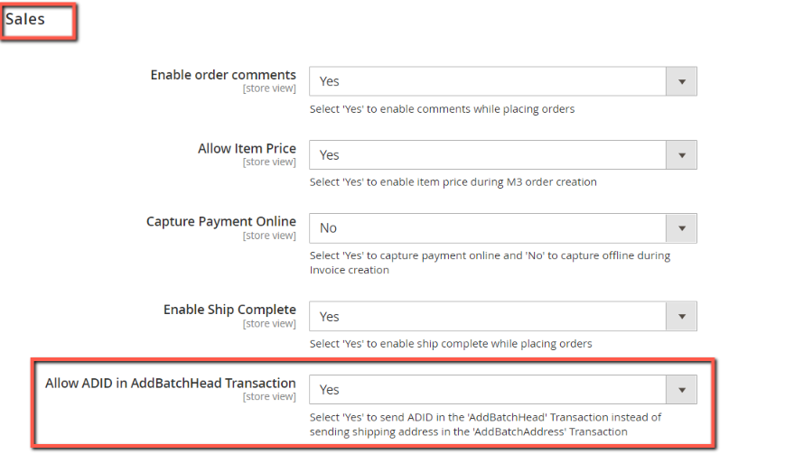

#  User Manual Part I - eConnect for M3 - v21.4.0

# Table of contents

- [New in this version](#new-in-this-version)

## New in this version

### Additional Entity Attribute Mapping Website Scope

Additional Entity Attribute Mapping now provides the options to choose the websites for which the additional API call should run. Also, we can enable or disable the entries and based on that the API Calls will be made.

### ADID(Shipping) via addBatchHead transaction

To update the delivery address for the orders, now we are sending ADID and ADRT field will be send via ‘AddBatchHead’ transaction. Also, ADRT Value will always be 1 since we are using it for shipping/delivery address. These will be passed via 'addBatchHead' only if it satifies the below conditions.

If the below setting is set to ‘Yes’

If the delivery/shipping/drop address chosen by the customer will have ADID value.

If billing and shipping addresses are not the same. 
Reason: If it’s the same, then ‘ADID’ will also be from the billing address. Since we are sending ‘ADRT’ as 1, passing the ADID from the billing address will cause problems in the order creation like order status will be moved to 15 with the reason like “No such address exists”.
	
If any of the above conditions fail, then the existing approach will be followed.

Rest of the User Manual for 21.4.0 is same as 20.3.0

To view the part-1 user manual click [here](../20.3.0/usermanual-econnect-m3-part-1.md).
