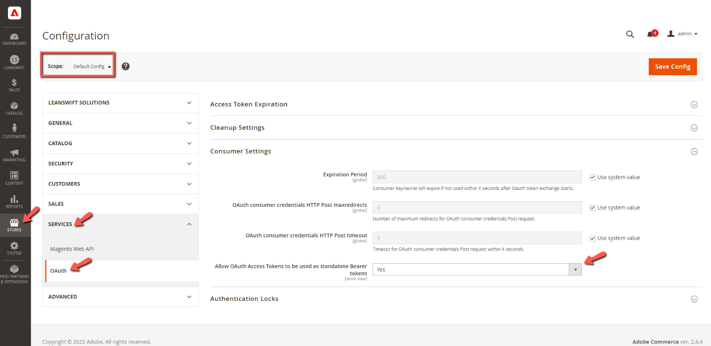
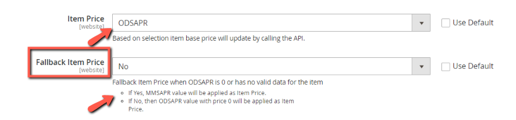

#  User Manual Part I - eConnect for M3 - v22.2.1

# Table of contents

- [Prerequisites](#prerequisites)
- [New in this version](#new-in-this-version)

## Prerequisites

From Magento v2.4.4 with PHP v8.1, the following setting must be set to 'Yes' in order to make successful connection with the Infor ION API.

## New in this version

### Improved the way of fetching ODSAPR

- Improved the way of fetching ODSAPR from OPRBAS with the below things
	- ODSAPR will now be retrieved via EXPORTMI instead of using the below APIs
		- OIS017MI/LstPriceList
			- Reason:
				- LIST API will always bring the whole data including different PriceCodes & CurrencyCodes irrespective of what input data we pass. 
				- Also, eConnect was always getting the first record from the LIST APIs result without checking the PriceCode and Currency values to fetch the FVDT value which is required to call OIS017MI/GetBasePrice. 
				- Sometimes it fetches the FVDT value which doesn't matches with the PriceCode and Currency specified in the Backend 'Basic data configuration'
	
		- OIS017MI/GetBasePrice
			- Reason: 
				- Due to the reason mentioned under the LIST API, we have moved to EXPORTMI which brings all the necessary data we need

	- Added the following additional validations in the EXPORTMI while fetching the ODSAPR
		- FVDT(Valid From Date must be equal to and lesser than the current date) & LVDT(Valid To Date must be greater than the current date
	
		- If the result contains more than one entry with a valid date then the ODSAPR will choose the entry with the nearest date
	
	- Added an additional field in the Backend Configuration to choose whether the MMSAPR value can be set as an item price if the ODSAPR value is 0 for the item

		- If Item Price field is selected as 'ODSAPR' then a new setting called 'Fallback Item Price' will appear

			- If the above setting is set to Yes, then the item price will be updated with MMSAPR from MITMAS only if the ODSAPR from OPRBAS is 0 or there is no valid price data for the item.

			- If the above setting is set to No, then the item price will be updated with '0.00'

Rest of the User Manual for  22.2.1 is same as 21.4.0

To view the part-1 user manual click [here](../21.4.0/usermanual-econnect-m3-part-1.md).
