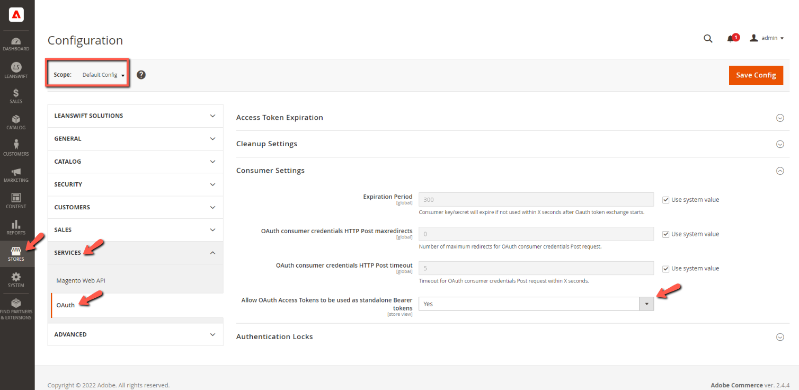

# **eConnect 24.1.0**

# Table of contents

- [Environment Details](#environment-details)
- [Standard Features](#standard-features)
- [Prerequisites](#prerequisites)
- [Highlight](#highlight)
- [Compatibility Fixes](#compatibility-fixes)
- [Other Fixes](#other-fixes)
- [ION Package Update](#ion-package-update)
- [Point of Contact](#point-of-contact)

# Environment Details

| **Software Name**   | **Version** |
| --------------------| ----------- |
| Magento Open Source | 2.4.6       |
| eConnect Community  | 24.1.0      |
| eConnect Base       | 6.3.0       |
| PHP version         | 8.1.6       |
| RabbitMQ            | 3.7.28      |
| Infor M3 (MT)       | 16.1        |
| ION Package         | 3.2.1       |

# Standard Features

All the standard functionalities of core eConnect are supported in v24.1.0, which includes the following:

- Customer Registration
- Customer Addition
- Customer Synchronization
- Product Addition
- Product Synchronization
- Inventory Synchronization
- Customer Price Synchronization
- Order Creation
- Order Synchronization
- Shipment Synchronization
- Invoice History
- Order History
- Initial Load

## Prerequisites

- From Magento v2.4.4 with PHP v8.1, the following setting must be set to 'Yes' in order to make successful connection with the Infor ION API.

	

## Highlight

- eConnect module is now compatible with Magento v2.4.6 and tested on PHP v8.1(but supports PHP v8.2 too).

## **Compatibility Fixes**

- Resolved the unsupported operand type error encountered during Order Creation cron.
- Addressed the error 'Undefined array key STAT' that occurred during Order Creation.
- Updated the customer PO reference number in order history to resolve issues.
- Fixed the URL key generation for products with name, SKU, and randomNumber to ensure compatibility.
- Addressed BOD XML path changes for invoice quantity to maintain compatibility.
- Fixed issues related to invoice and shipment quantity to ensure compatibility.
- Added validation for customer number during order sync with M3 and displayed actual error messages.
- Implemented displaying actual errors in the admin panel when orders sync to ERP to enhance compatibility.
- Rectified the issue where CUNO was overwritten by ADID in Customer attribute mapping configuration to maintain compatibility.
- Resolved the problem where shipments were not created for configurable product variants in Magento, ensuring compatibility.

## **Enhancements**

- Added features to skip account creation without an email address to enhance functionality.
- Added temporary and final order numbers in the admin order view page to provide additional information.

## ION Package Update

- Updated ION Package version to 3.2.1 with the below fix
- Show Shipment BOD is now working and getting triggered as expected after making changes in the Event Analytics Rules.

## Point of Contact

- [prabhu.manoharan3@wipro.com](mailto:prabhu.manoharan3@wipro.com)
- [deepthi.tadikamalla@wipro.com](mailto:deepthi.tadikamalla@wipro.com)
- [narayanan.gurusamy@wipro.com](mailto:narayanan.gurusamy@wipro.com)
- [saurabh.gupta77@wipro.com](mailto:saurabh.gupta77@wipro.com)
- [shoubhik.ghosh@wipro.com](mailto:shoubhik.ghosh@wipro.com)
- [kalaivani.nagarajan1@wipro.com](mailto:kalaivani.nagarajan1@wipro.com)

