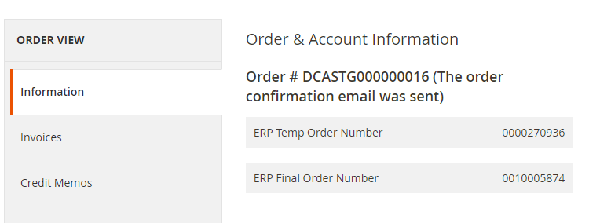

# **User Manual Part I - eConnect for M3 -v24.1.0**

# Table of contents

  - [Prerequisites](#prerequisites)
  - [New in this Version](#new-in-this-version)

## Prerequisites

- From Magento v2.4.4 with PHP v8.1, the following setting must be set to 'Yes' to make a successful connection with the Infor ION API.

	

## **New in this Version**

- Implemented Configuration under "**Customer Addition/Synchronization**" to restrict customer creation with different Email IDs (i.e. [ERPnumber@someone.com](mailto:ERPnumber@someone.com))
- Navigate to Leanswift -> Econnect ION -> Configuration -> Switch to the required Website -> Customer Addition and Synchronization. 
- If the configuration **Skip Account Creation Without Email** is set to “YES” the customer creation will be skipped When the email ID is not provided.
- Once the email address is updated to the customer in M3 it will generate a BOD and the customer will reflect in the Customer Page in Magento.
- If the configuration **Skip Account Creation Without Email** is set to "NO” the customer will be created with an anonymous mail address like "[ERPnumber@someone.com](mailto:ERPnumber@someone.com)"

- The admin order view page displays the ERP temporary and final order numbers.

   

### User Manual for 24.1.0 is same as 23.2.0

To view the part-1 user manual click [here]
(usermanual-econnect-m3-part-1.md).

