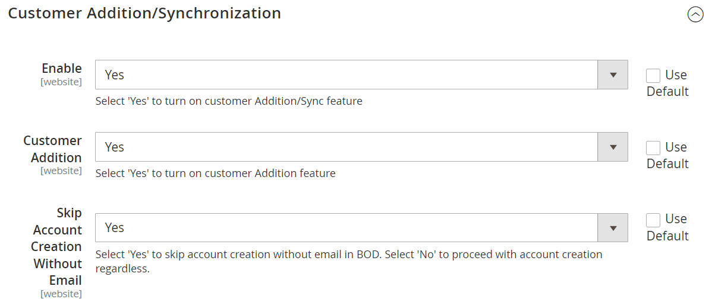

# **User Manual Part I - eConnect for M3 -v24.1.0**

# Table of contents

  - [Prerequisites](prerequisites)
  - [New in this Version](new-in-this-version)

# **Prerequisites**

- From Magento v2.4.4 with PHP v8.1, the following setting must be set to 'Yes' to make a successful connection with the Infor ION API.

	

# **New in this Version**

- Option to skip customer creation with random email id is implemented (i.e. [ERPnumber@someone.com](mailto:ERPnumber@someone.com))
- Navigate to Leanswift -> Econnect ION -> Configuration -> Switch to required Website -> Customer Addition and Synchronization. 
- If configuration is set to “YES”, the customer creation will be skipped. When the email ID is not provided.
- Once the email address is given for customer in M3 it will generate a BOD and the customer will reflect in Customer Page in Magento.
- If configuration is set to "NO” the customer will be created with e-mail address like [ERPnumber@someone.com](mailto:ERPnumber@someone.com)

- The admin order view page displays the ERP temporary and final order numbers.

  
  
**User Manual for 24.1.0 is same as 23.2.0**

To view the part-1 user manual click [here](https://github.com/leanswift/leanswift.github.io/blob/master/ecommerce/pages/econnect-m3/22.2.1/usermanual-econnect-m3-part-1.md).
