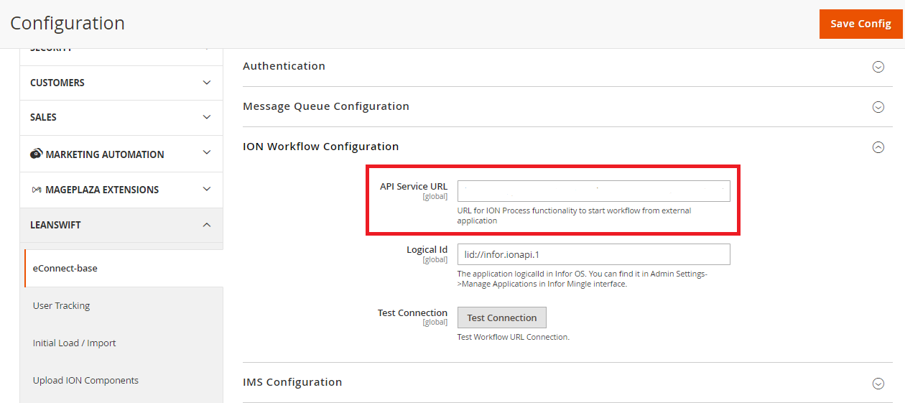
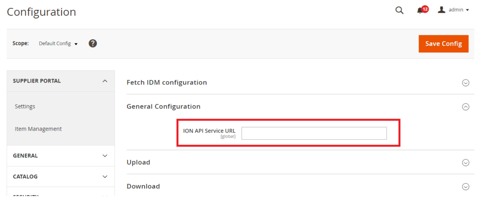

# Version 25.1.0 - User Manual- One-Day Deployment

# Table of contents

- [Introduction](#introduction)
- [Configuration Setup](#configuration-setup)
  - [Data Templates Packages](#data-templates-packages)
- [ION Authentication](#ion-authentication)
  - [Import History](#import-history)
- [Import IDM Configuration](#import-idm-configuration)
- [Import Supplier Portal Configuration](#import-supplier-portal-configuration)
- [Import Item Management configuration](#import-item-management-configuration)
- [Upload ION components](#upload-ion-components)
  - [1.Configuration Setup](#1configuration-setup)
    - [Connection Point Packages](#connection-point-packages)
    - [Data Flow Packages](#data-flow-packages)
    - [Work Flow Packages](#work-flow-packages)
  - [2.Upload Connection Points, Data Flows, Workflows:](#2upload-connection-points-data-flows-workflows)
    - [Connection Point](#connection-point)
    - [Data Flows](#data-flows)
    - [Workflows](#workflows)
  - [ION Component Upload History](#ion-component-upload-history)

# Introduction
This is a new feature implemented to set configuration with one click and make eConnect Portal ready to use in one day.

Some of the configuration's fields are set as default values while installing the eConnect portal.
 
# Configuration Setup

## Data Templates Packages

- This will update eConnect-Base configurations at once click.
- Navigate to Leanswift -> eConnect-base -> Connectivity -> Configuration Setup -> Data Template Packages. 
- Admin users can update configuration values in the standard ‘config.csv’ template as per their environment requirements.
- When “Import” is clicked, values from the config.csv file will update the configuration field values.
- The config.csv file will be uploaded under "root_folder/template" in the server.
The list of values that are imported from the config.csv file are: 
	- Company
	- Division
	- authenticate_m3_user
	- queue_host
	- queue_port
	- queue_user
	- queue_password
	- queue_virtualhost
	- ion_workflow_logical_id
	- smtp_disable
	- smtp_transport
	- smtp_host
	- smtp_port	
	- smtp_username
	- smtp_password
	- smtp_auth
	- smtp_ssl
	- process_connect_model_url
	- cp_service_account
	- wf_service_account
	- proxy_url

 

<b>
 <a href="#toc">↥ Go to Top</a>
</b>

# ION Authentication

- The ION API file will auto-populate other API URL fields in the configuration.
- Navigate to Leanswift -> eConnect base -> Connectivity -> Authentication -> ION API Credentials file. 
- Once the ION API file is uploaded the below fields will get auto-populated.

1. Leanswift -> Econnect Base -> service configuration -> API service url.

2. Leanswift -> Econnect Base ->Authentication all field except M3 user.

3. Leanswift -> Econnect Base ->ION Workflow Configuration -> API service Url.

4. LeanSwift -> Idm -> Settings -> General Configuration -> ION Api service url.

## Import History

Once the all the configuration is imported (eConnect IoN Configuration, M3 Configuration, IDM Settings), history of import is recorded.

To verify the import history, navigate to Leanswift -> eConnect Base -> Import History. 

<b>
 <a href="#toc">↥ Go to Top</a>
</b>

# Import IDM Configuration

- For IDM configuration, navigate to Leanswift -> IDM-> Settings.
- Expand the menu Leanswift -> Initial load / Import -> Default Config -> Import IDM Configuration -> IDM Initial Load/ Configure.

- This will import/fetch Document Type and Attribute Type fields in the **Configurable Options to Upload** and **Configurable Options to Download** from IDM to configurations.

After the import is clicked, import changes to the “Reset” Button.

If there are any changes in Document Type and Attribute Type from IDM, click the “Reset” button, newly added or updated values will be retrieved from IDM.

 

<b>
 <a href="#toc">↥ Go to Top</a>
</b>

# Import Supplier Portal Configuration

- Import Supplier Portal configuration is website specific.
- Navigate to Leanswift -> Supplier portal -> Settings.
- Expand the menu Leanswift -> Initial load / Import -> Main Website -> Import Supplier Portal configuratio ->Supplier Portal Initial Load/ Configure.

<kbd>
 
</kbd>

- When “Import” button is clicked it will fetch the M3 attributes values from Infor M3 and configure default values based on the values updated in “config.csv” file. M3 attribute fields are available in csv file.
- They list of M3 Attribute fields fetched from Infor M3 are:
	- Supplier Onboarding:
		- M3 Supplier template.
		- SP Prefix.
		- M3 Language list.
		- M3 Order Currency List.
		- M3 Payment Terms.
		- M3 Fright Terms.
		- M3 Delivery Terms list.
		- M3 Payment Method List.
		- M3 Packing Terms List.
		- M3 Monitoring Class List.
		- M3 Delivery Method List.
- By default, all other configuration values are updated in Supplier Portal settings. 

<kbd>
 
</kbd>

<kbd>
 
</kbd>

After import is clicked, import changes to Reset Button. 

If there are any newly added M3 attributes, when the “Reset” button is clicked, the newly added values will be retrieved from Infor M3 and configure based on the values available in config.csv file.

<kbd>
 
</kbd>

<b>
 <a href="#toc">↥ Go to Top</a>
</b>

# Import Item Management configuration

- Import Item Management Configuration is website specific.
- Navigate to Leanswift -> Supplier portal -> Settings.
- Expand the menu Leanswift -> Initial load / Import -> Main Website -> Import Item Management configuration -> Item Management Initial Load/ Configure.

<kbd>
 
</kbd>

- Item Type and Quality Class attribute values are fetched from Infor M3 and update based on the default values given in the config.csv file.
- Creation Responsible, Workflow Distribution Username need to have the user specified values. This can be updated directly in the config.csv file. 

<kbd>
 
</kbd>

<kbd>
 
</kbd>

After the import is clicked, import changes to the Reset Button.

If there are any newly added values in the Item type or quality class in Infor M3, then click the “Reset” button, new values will be retrieved from Infor M3 and configure according to config.csv file.

<kbd>
 
</kbd>

<b>
 <a href="#toc">↥ Go to Top</a>
</b>

# Upload ION components

The ION components can be configured in two different ways:

## 1. Configuration Setup 

At the time of eConnect Portal installation, the Connection Point file (Json), Data Flows file(zip), and Work Flows file(zip) should be given under "root_folder/template" in the server.

### Connection Point Packages

- Navigate to Leanswift -> eConnect-base -> Connectivity -> Configuration Setup -> Connection Point Packages.
- Once “Upload” is clicked, a success message is displayed. The Connection Point can be verified in Infor under OS -> ION -> Connect -> Connection Point.

- In the OS portal, initially, the connection point will be “Inactive” state, once the data flows are uploaded then the connection point will become “Active”.
- List of connection points: 
	- LS_CP_eConnect_SSD_API
- An error message” There's an issue with the input, or it already exists within Infor ION for ConnectionPoint.json Connection Point.” will be displayed if there is an issue in the file uploaded.

  

### Data Flow Packages

- Navigate to Leanswift -> eConnect-base -> Connectivity -> Configuration Setup -> Data Flow Packages.  
- Once “Upload” is clicked in Data Flow packages, the Data flows will automatically generate in Infor OS. 
- Once the file is uploaded, a success message is displayed. The activated data flow can be verified in M3 under ION Desk -> Connect -> Data flows.

- List of data flows are: 
	- LS_eConnect_DF_ShowToSync_BillToPartyMaster
        - LS_eConnect_DF_ShowToSync_BillToPartyMaster
        - LS_eConnect_DF_ShowToSync_CustomerPartyMaster
        - LS_eConnect_DF_ShowToSync_Invoice
        - LS_eConnect_DF_ShowToSync_ItemMaster
        - LS_eConnect_DF_ShowToSync_LSItemStock
        - LS_eConnect_DF_ShowToSync_LSPriceList
        - LS_eConnect_DF_ShowToSync_ReceivableTransaction
        - LS_eConnect_DF_ShowToSync_SalesOrder
        - LS_eConnect_DF_ShowToSync_Shipment
        - LS_eConnect_DF_ShowToSync_ShipToPartyMaster
        --LS_eConnect_DF_Sync_BODs 

## 2.Upload Connection Points, Data Flows, Workflows:

- Upload ION components are used to import the Connection Points, Data Flows, Workflows to ION from admin portal.
- Navigate to Leanswift -> eConnect-base -> Upload ION components.

**Prerequisites**: 
- The handy file format must be in zip or json file only.  
- Initially Proxy URL, ION connect /Process model URL, Encoded service account (to update in cp_service_account), Encoded Service Account (to update in wf_service_account) values will be "Empty". These values should be updated in config.csv file from backend before installation.

### Connection Point

- Navigate to Leanswift -> eConnect base -> Upload ION Components -> Upload Connection Point, DataFlow and WorkFlow -> Upload ION Connection Point.

### Data Flows

- Navigate to Leanswift -> Econnect base -> Upload ION Components -> Upload connection point, data flow and workflow -> Upload ION Data Flow.

## ION Component Upload History

- To verify the upload history of ION components, navigate to Leanswift ->eConnect Base -> ION Component Upload History.   
- If the Job ID is 201 means the connection is successfully done.
- If the Job ID is 500 means Server Error 
- If the Job ID is 403 means No Authorization.

<b>
 <a href="#toc">↥ Go to Top</a>
</b>

