# Version 20.3.0 - User Manual for eConnect for SX.e/CSD

# GENERAL INFORMATION

# System Overview

**LeanSwift eConnect for SX.e/CSD** provides a seamless integration between Magento(Community & Enterprise) and Infor Distribution SX.e/CSD. The product consists of a base Magento extension and optional add-on extensions. SOAP APIs exposed by SX.e and ION REST APIs exposed by cloudsuite distribution are used to manage the communication with Infor Distribution SX.e/CSD from Magento.

<kbd>
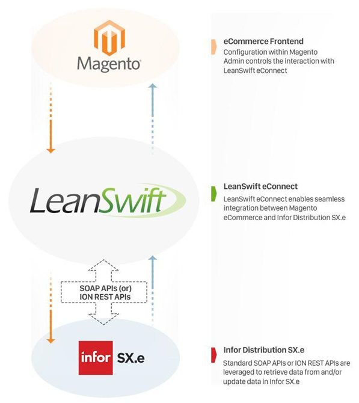</kbd>

## User Interface

During setup, the Magento Admin panel is used to configure transactions that should be used and how they should function.
There is also additional background configuration specific to eConnect.

## Validated Versions

- Magento Open Source 2.4.0
- Magento Commerce 2.4.1
- Infor SX.e 6.1.19
- Infor CloudSuite Distribution 11.20.1
- PHP 7.4.12

# Point of Contact

This document and the software it describes are provided by LeanSwift Solutions Inc. For additional information regarding support, licensing, functionality etc. 
please contact LeanSwift Solutions Inc. via contact form at [https://www.leanswift.com/contact](https://www.leanswift.com/contact/)or email info@leanswift.com

# Organization of the Manual

This manual describes the configuration of LeanSwift eConnect for Infor Distribution SX.e/Cloudsuite Distribution and also provides a description of standard transactions.

This manual is not intended to cover any standard Magento functionality or user experience. The Magento user experience is customized and slightly different in each eCommerce implementation, though the general workflow is similar.

# STANDARD TRANSACTIONS

## Summary

### List of Transactions

- Inventory Synchronization
  - Real-time Stock Fetch and Synchronization
  - Background Synchronization
  - Manual Synchronization
- Product & Category Synchronization
   - Background Synchronization
   - Manual Synchronization
- Price Synchronization
  - List Price
    - Background Synchronization
    - Manual Synchronization
  - Customer Specific Price
    - Real-time Price Fetch and Synchronization
- Customer Synchronization
  - Customer Master Information
    - Background Synchronization
    - Manual Synchronization
  - Billing Address and Shipping Addresses
    - Background Synchronization
    - Manual Synchronization
- Customer Accounts Receivable Information Synchronization
  - Period Balances
  - Credit Balances
  - Ordering Information
  - Taxing Information
- Order Synchronization
  - Order Creation
    - Background Synchronization
    - Manual Synchronization
  - Order Status
    - Shipment and Invoice Creation
    - Background Synchronization
    - Manual Synchronization
  - Order History
    - Background Synchronization
    - Manual Synchronization

These above transactions can, if necessary, be modified and new transactions can be added to fulfill specific customer requirements.

### Inventory

Real-time inventory synchronization to ensure accurate stock display to customers.

Synchronization can be performed multiple times through the various ordering stages such as, while viewing product details, while adding to cart and on checkout.

### Product and Category

Synchronization of Product information such as General and Tax which includes category.

### Pricing

Synchronization of Product Base Price for all types of Products in Magento.

Real-time fetch and synchronization of Customer Specific Price.

### Customers

Synchronization of Customer information such as General, Order and Tax and address information such as Billing and Shipping with customer data in SX.e/CSD.

### Accounts Receivable

Easy access for customers to view accounts receivable information via "My Accounts Receivable" page.

View period balances, credit balances, ordering and taxing information.

### Sales Orders

Supports creation of sales orders in SX.e for every order placed via Magento webshop.

Synchronization of the status of a customer order within SX.e with the corresponding order in Magento.

### Shipments and Invoices

Shipments and Invoices in SX.e are reflected within Magento according to order status in SX.e.

Delivery tracking numbers associated to an order in SX.e are also synchronized.

### Order History

Easy access for customers to view all orders placed through Magento as well as those placed in SX.e directly via "My Orders" page.

View order details and reorder.

## Assumptions/Limitations

LeanSwift uses two key principles as guiding lights when new features are included in eConnect.

1. Infor Distribution SX.e is the system of record.
2. Always adhere to Magento's core standard functionality wherever possible.
3. There is no limit enforced for Manual Synchronization option on the grids in Admin panel such as for Customers, Orders and Products. 

Manual Synchronization of a very large number of Customers, Orders or Products may be slow and admin users will have to stay on the same page until the operation is complete.

# CONFIGURATION

# Magento Configuration

To support the use of LeanSwift eConnect for Infor SX.e/CSD, configuration is required within Magento and SX.e ERP. 
This section covers the configuration within Magento.

Log in to Magento Admin Panel using the URL provided to you and the applicable user credentials.

<kbd>
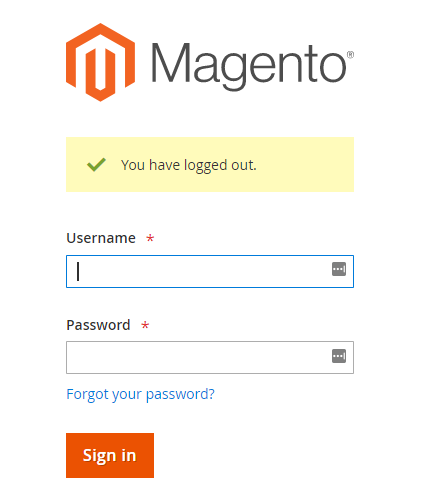</kbd>

# System Menu

## Configuration

To access the LeanSwift Configuration, click the **LeanSwift** tab (1), and select the **Configuration**

<kbd>
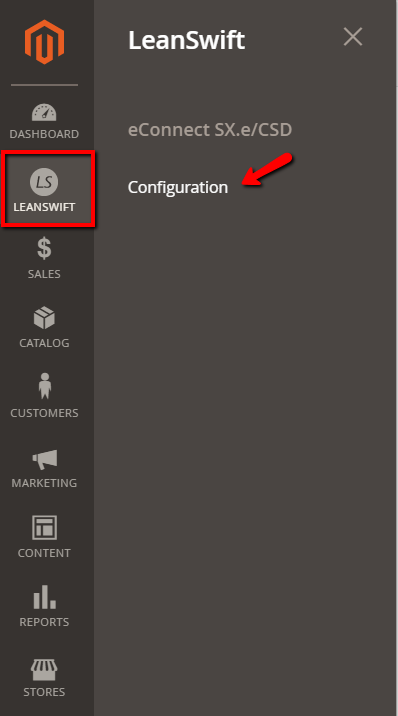</kbd>

Also pay attention to which configuration scope you're working under.

<kbd>
</kbd>

For further information about _Configuration scope_ in Magento, please refer to the following article:

[http://www.magentocommerce.com/knowledge-base/entry/understanding-store-scopes](http://www.magentocommerce.com/knowledge-base/entry/understanding-store-scopes)

Here, the section that is always included in the base LeanSwift configuration is **eConnect SX.e/CSD** This is covered in detail in the following sections.

There could be a number of other sections under the LeanSwift Solutions sub-menu. Exactly which sections are visible depends on how many add-ons are installed in the environment.

Configuration related to the add-ons to eConnect, if any, would be covered within their specific user manuals.

<kbd>
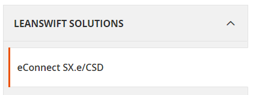</kbd>

## LeanSwift/eConnect for SX.e/CSD

This section contains the vast majority of the settings for base eConnect, and the details of each group is covered in the following sections of this document.

The following picture shows the sections that are included in base eConnect configuration.

<kbd>
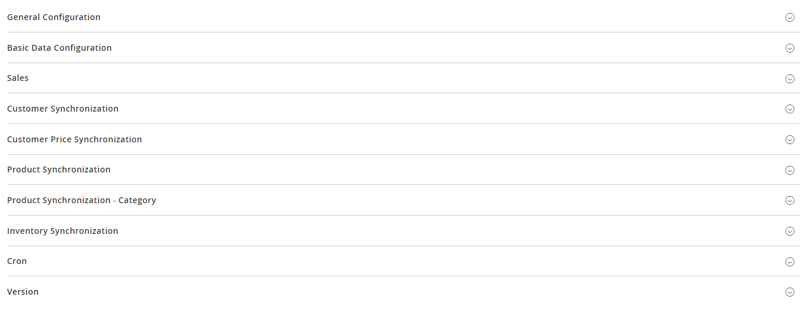</kbd>

## General Configuration

The **General** section contains a number of basic settings that are generic for this instance of eConnect.

**For SX.e version - 6 to 10**

<kbd>
</kbd>

**For SX.e version - CSD**

<kbd>
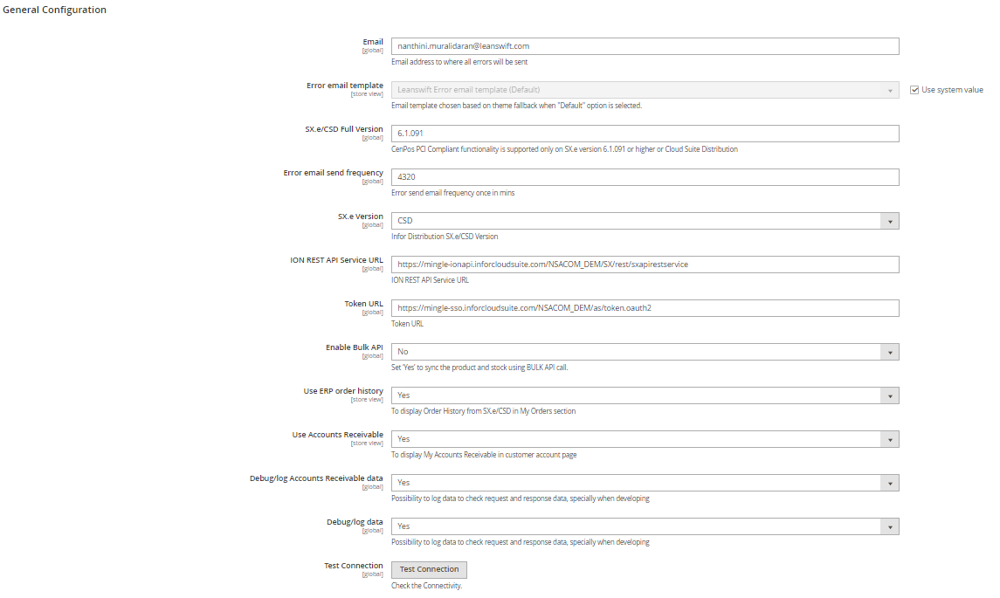</kbd>

### Email

Define the email address that will be used for error alerts if exceptions were to occur in Magento and when any transaction in eConnect fails due to a failed connection to SX.e.

### Error email send frequency

Define frequency in minutes at which to send error emails to the email address defined above.

### SX.e Version

Has two options in the dropdown, namely

(1) 6-10

(2) CSD

Versions 6-10 support SOAP web services to access SX.e whereas versions 11+ for CloudSuite Distribution support ION REST APIs. One of the two options **must** be selected.

### SX.e Connection String

If selected SX.e Version is 6-10, this field should have the connection string (URL) to connect to SX.e's SOAP services.

Example: [appserver://localhost:5162/sxapiappsrv](about:blank)

### Location URL

If selected SX.e Version is 6-10, this field should have the SOAP location URL to access it's SVC file.

Example: [http://24.89.159.5/sxapi/Service.svc](http://24.89.159.5/sxapi/Service.svc)

**Enable Bulk API**

- If "Enable Bulk API" option is set to "Yes", then the BULK API(ICGetWhseProductListV3) is used to update the products based on the warehouse.

- The warehouse is a request param and list of warehouse products will be returned and the attribuites of product such as price and others and qty got updated in Magento.

- If the option is disabled then the product price and stock is updated using below APIs where the list of products are sent as a batch and will get updated in Magento.

  - Product price: ICGetWhseProductDataGeneral
  - Product general: ICGetProductDataGeneral
  - Product tax: ICGetWhseProductDataTaxing
  - Product inventory: ICGetWhseProductDataQuantity

### SX.e ION REST API Service URL

If selected SX.e Version is CSD, this field should have the REST endpoint (URL) to connect to SX.e's ION web services.

### Token URL

If selected SX.e Version is CSD, this field should have the URL to retrive OAuth Token to be able to access SX.e's ION web services.

### Use ERP order history

- This field refers to the retrieval of customer order history from SX.e from Magento front-end.

- Select "Yes" to retrieve and display order history from SX.e when user selects _Order History_ in _My Account_. 
This will make order information synchronize seamlessly between Magento and SX.e and any order status change in SX.e will be displayed in Magento instantly.

- Select "No" to only use the order history from Magento when the user selects _Order History in My Account_.

### Show 'My Accounts Receivable'

Select "Yes" to retrieve and display accounts receivable information from SX.e when user selects _My Accounts Receivable_ section in _My Account_. This will make accounts receivable information synchronize seamlessly between Magento and SX.e.

### Debug or log data Accounts Receivable data

Select "Yes" to log additional information in Magento. This setting is recommended in the Test/Staging environment but should be set to "No" in production to improve performance.

### Debug or log data

Select "Yes" to log additional information in Magento. This setting is recommended in the Test/Staging environment but should be set to "No" in production to improve performance.

## Basic Data Configuration

The **Basic Data** section of the configuration contains a number of key settings needed for the various transactions within LeanSwift eConnect.

<kbd>
</kbd>

### Company

The default company in SX.e/CSD to connect with. This is mandatory to establish connection.

### Operator Initials

The operator initials in SX.e to connect with. This is mandatory to establish connection.

### Operator Password

The operator password in SX.e to connect with. This is mandatory to establish connection.

### Type

To mention the type of order/transaction type.

### Warehouse

Select a value from the drop-down list of warehouses in the company. In order to retrieve this list from SX.e, user should fill in company number in _Company_ field stated above, save the configuration and then click on "_Retrieve Warehouse List_" button.

## Inventory Synchronization

These settings provide options for when to invoke inventory pull from SX.e.

<kbd>
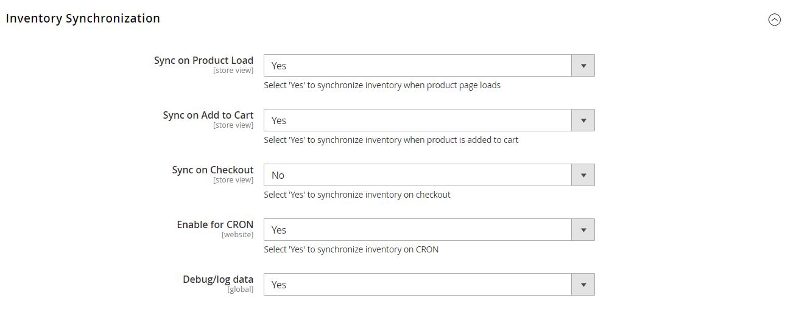</kbd>

### Sync on Product Load

Retrieves inventory quantity each time the product details page is pulled up on the front-end.

### Sync on Add to Cart

Enabling this option ensures a real-time inventory call is performed when a product is added to the cart.

### Sync on Checkout

Enabling this option ensures a real-time inventory call is performed during the final stage of the Checkout process (when the order is confirmed by the customer).

### Debug or log data

Select "Yes" to log additional information about Inventory transactions in eConnect. This setting is recommended in Test/Staging environment but should be set to "No" in production to improve performance. This setting overrides the global setting available in the "_General_" section of configuration.

## Price Synchronization

The Price Synchronization settings have been added to provide an option to enable or disable the real-time customer/item specific price call, as well as provide an option to increase site performance when needed.

<kbd>
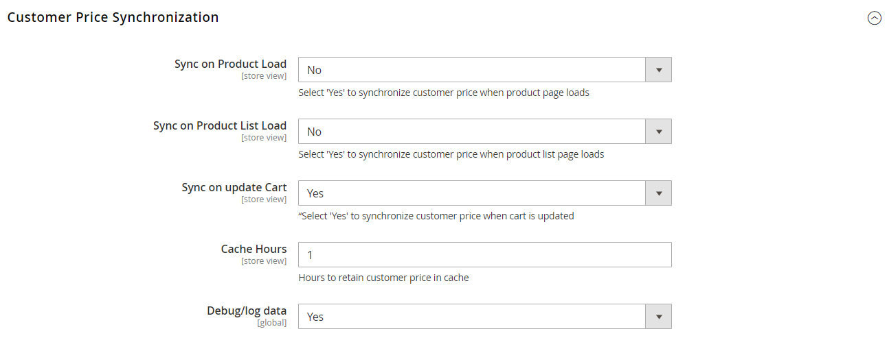</kbd>

### Sync on Product Load

Setting this parameter to 'Yes' enables the real-time price call transaction. Only if this parameter is enabled will the system in real-time retrieve the customer/item specific price from SX.e upon _ **product detail page** _ load. 'No' disables the real-time price call from being performed for the applicable configuration scope.

### Sync on Product List Load

Setting this parameter to 'Yes' enables the real-time price call transaction for the _ **product list page** _. Only if this parameter is enabled will the system in real-time retrieve the customer/item specific price from SX.e for each product listed on the page. 'No' disables the real-time price call from being performed for the applicable configuration scope.

### Cache Hours

Leaving this value blank ensures that the price retrieved from SX.e is stored locally within a Magento extension table for 8 hrs. A value of '1' or greater (integer) ensures that the price retrieved from SX.e is stored locally within a Magento extension table, and won't be refreshed (no real-time call would be made) for as many hours.

### Debug or log data

Select "Yes" to log additional information about Price transactions in eConnect. This setting is recommended in Test/Staging environment but should be set to "No" in production to improve performance. This setting overrides the global setting available in the "_General_" section of configuration.

## Product Synchronization

<kbd>
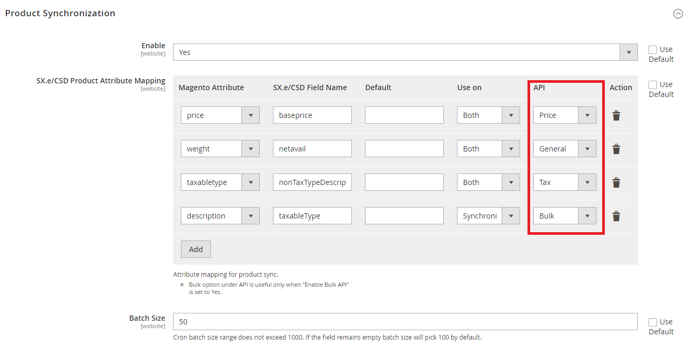</kbd>

This section contains settings on how to manage the synchronization of product data from SX.e to Magento.

The Magento product attribute is mapped to a field from SX.e/CSD API responses using the field tag name. A default value can be given for results which do not contain a value.

### Enable

Setting this parameter to 'Yes' enables product synchronization.

### SX.e Product Attribute Mapping

This section controls how Product Synchronization should behave. 
  - The Magento attribute to map is selected from the drop-down list in the "Magento Attribute" column. 
  - The "SX.e/CSD Field Name" (Case sensitive) is to be mapped with field name from APIs. 
  - Default value for the attribute can be configured in "Default" field. 
  - Use On - Synchronization/Both
  - In addition, API field can be configured with one of the below
      - Bulk (ICGetWhseProductListV3) [Useful only when the “Enable Bulk API” option under General Configuration section is set to Yes]
      - General (sxapiICGetProductDataGeneralV4)
      - Price (sxapiICGetWhseProductDataGeneralV3)
      - Tax (sxapiICGetWhseProductDataTaxingv2)
      
      Note: API version might differ for SX.e and CSD

Product sync can be run manually from the product grid. There is also a cron job available to run the product synchronization in the background.

<kbd>
</kbd>

### Batch Size

This refers to the number of products that are synchronized with SX.e at a given point of time. Default batch size is 100. The number has to be must not exceed 1000.

### Debug or log data

Select "Yes" to log additional information about Product sync transactions in eConnect. This setting is recommended in Test/Staging environment but should be set to "No" in production to improve performance. This setting overrides the global setting available in the "_General_" section of configuration.

## Category Synchronization

This section controls how the Category of product is synchronized.

<kbd>
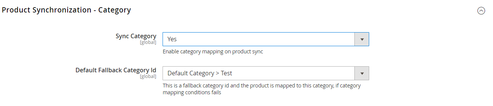</kbd>

### Sync Category (Yes/No)

This setting is in global scope and when set to 'Yes', enables the category to be synced to the product in magento.

### Default Fallback Category Id

When no category is available in Sx.e/CSD for the product, the product is synced with value selected in 'Default Fallback Category Id'

## Customer Synchronization

### Update Customer Data On Login

This setting provides the option to in real-time initiate an update of the address data that's been mapped for synchronization from SX.e within the **Customer Synchronization** section.

The **Customer Synchronization** group contains all settings related to synchronizing Customer data. In this version, the following limitations apply:

- Sync only applies to existing customers (i.e. customer exist in both SX.e and Magento)
- Customer data is synchronized; General, Order, Tax
- Address data is synchronized; Billing and Ship-to Addresses.
- Address data sync is one-way: SX.e --> Magento

### Customer Mapping

<kbd>
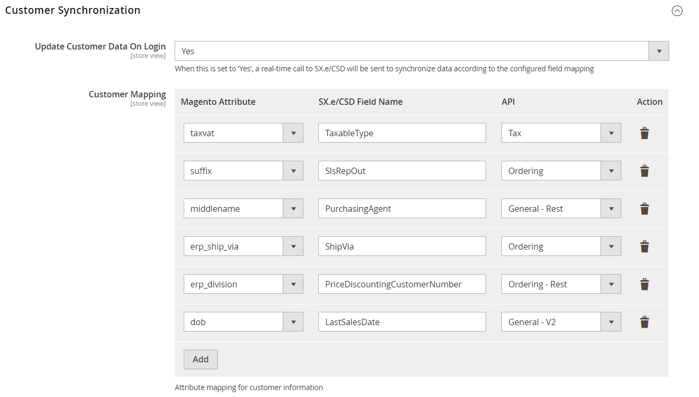</kbd>

This section controls how Customer attribute Synchronization should behave. 
  - The Magento attribute to map is selected from the drop-down list in the "Magento Attribute" column. 
  - The "SX.e/CSD Field Name" (Case sensitive) is to be mapped with field name from APIs. 
  - In addition, API field can be configured with one of the below
      - Tax (sxapiARGetCustomerDataTaxing)
      - General - Rest (sxapiARGetCustomerDataGeneralRest)
      - General - V2 (sxapiARGetCustomerDataGeneralV2)
      - Ordering (sxapiARGetCustomerDataOrdering)
      - Ordering - Rest (sxapiARGetCustomerDataOrderingRest)
      
       Note: API version might differ for SX.e and CSD

### Billing Address Mapping

<kbd>
</kbd>

This section controls how the Billing Address for the customer in Magento is to be created based on the address details in SX.e. Usually, every customer has only one Billing Address in SX.e.

The mapping is done in the same way as for Product Sync, for example. The Magento address attribute to map is selected from the drop-down list in the 'Magento Attribute' column. This SX.e attribute should be mapped to the value in the 'SX.e Field Name' column.

### Shipping Address Mapping

<kbd>
</kbd>

This section controls how the Shipping (Ship-to) Addresses for the customer in Magento is to be created based on the address details in SX.e. Usually, every customer in SX.e can have no or any number of Shipping Addresses in SX.e. If Shipping Address is not available for a customer during synchronization, then the Billing Address is set as Shipping Address as well in Magento.

The mapping is done in the same way as for Product Sync and Billing Address, for example. The Magento address attribute to map is selected from the drop-down list in the 'Magento Attribute' column. This SX.e attribute should be mapped to the value in the 'SX.e Field Name' column.

### Debug or log data

Select "Yes" to log additional information about Customer Address transactions in eConnect. This setting is recommended in Test/Staging environment but should be set to "No" in production to improve performance. This setting overrides the global setting available in the "_General_" section of configuration.

## Sales

The 'Sales' section contains three settings related to the sales order process from Magento to SX.e. From this version, all the three lines of shpipping address will appear in SX.e/CSD if given.

<kbd>
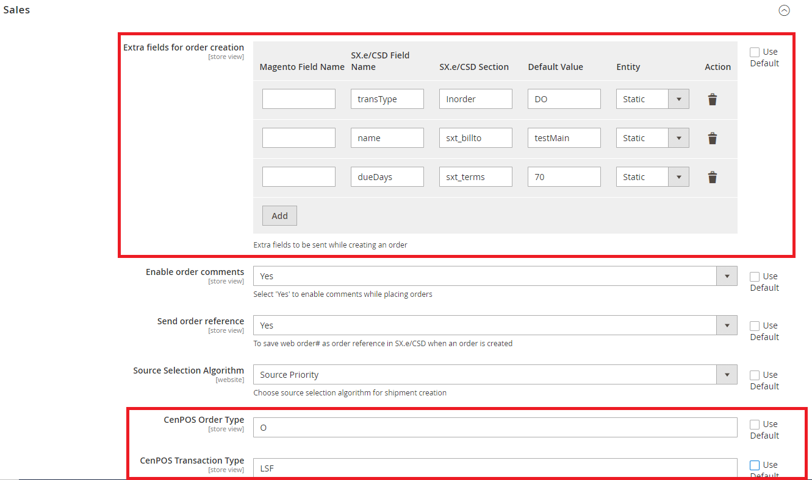</kbd>

### Extra fields for Order Creation

Using this mapping section
- Extra fields can be sent in Order Creation request. 
- We can also overwrite the existing request values.

  **Magento Field Name**
    
     Magento Attribute code -  [When entity is Customer/Customer-Billing/Customer-Shipping/Product],
     Column Name => [When entity is Order],
     XML config path[When the entity is Config-Store/Website/Global] => For example, "econnectSXE/basic_data/order_type"]

  **SX.e Field Name(case sensitive)** 
    
    This is Order creation request’s node/element name
    - ShipVia(SX.e)
    - shipVia(CSD)

  **SX.e Section(case sensitive)** 
  
  This is Order creation request’s section name
  - Initem(SX.e) 
  - sxt_itemv4(CSD)

  **Default Value**
  
  The value given here will only be taken if the entity is chosen as "static"

  **Entity**
  
  - Static
      
      The value provided in "Default Value" will be taken. If any existing static value of the Order Request has to be changed then this will be useful. No need to specify “Magento Field Name” when choosing this option
  - Customer
      
      Values of Customer attributes[Can be custom or default attribute]
  - Customer - Billing
     
     Values of Customer Billing address attributes[Can be custom or default attribute]
  - Customer - Shipping
     
     Values of Customer Shipping address attributes[Can be custom or default attribute]
  - Order
     
     Values of Order Object only
  - Product
     
     Values of Product attributes.[Note: We can fetch the product information only from the order items of the order object. So, any product attribute(custom or default) can be added but only to the order item section]
  - Config - Store, Website, Global 
     
     Value will be taken using the configuration path value given in "Magento Field Name" and the chosen entity
    
   **Note:** Since we have few limitations to the above method when comes to Order and Product Entities, I have provided a method where the additional required data can be passed and which will be automatically updated in the required section.

      Method Name - setExtraFields() or getExtraFields() under Helper/Order.php
      Param should have the format of: 
      ['section' => array('FieldName' => 'FieldValue')]
      Example: ['sxt_itemV4' => array('ordertype' => Value)]

### Enable order comments

If set to 'Yes', this enables sending header-level comments [entered in the last step of the Checkout process] for the entire order to SX.e/CSD.

### Send order reference

If set to 'Yes', the web order number (Magento order number) will be sent to SX.e in the order. This number will be saved in the "Reference" field of the sales order created in SX.e.

### Debug or log data

Select "Yes" to log additional information about Order transactions in eConnect. This setting is recommended in Test/Staging environment but should be set to "No" in production to improve performance. This setting overrides the global setting available in the "_General_" section of configuration.

## CRON Settings

This section contains the basic setup for how often the LeanSwift specific background (cron) jobs should run. The actual configuration of each of the jobs in the screen shot below is not representative of a normal customer installation.

The setup will vary from customer to customer depending on a number of factors such as basic data volumes, ordering processes etc.

This section should always be reviewed within the project, and with the help of the LeanSwift Services team be adjusted to best fit each customer's environment.

<kbd>
</kbd>

<kbd>
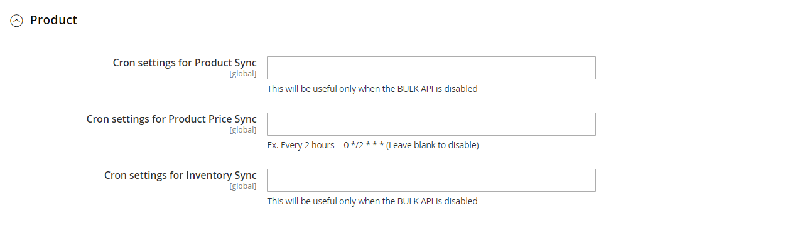</kbd>

## Version Info

This last section provides information related to the version of the LeanSwift eConnect for SX.e/CSD extension that's installed, as well as the version of CenPOS addon being used

<kbd>
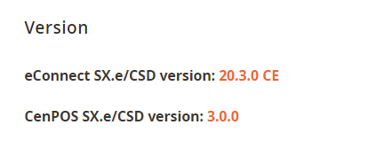</kbd>

## Save Configuration

Following the above, remember to save the configuration by pressing 'Save Config' at the top of the page.

<kbd>
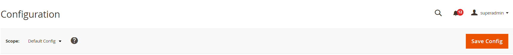</kbd>

# MAGENTO STANDARD FUNCTIONALITY

The extension does not override or impact any other functionality in Magento. Configure Magento using the Magento admin panel as required.

### Exit System

Log out from Magento admin using the link at the top right.

<kbd>
</kbd>

# PRODUCT SETUP and INFORMATION

<kbd>
</kbd>

## Transaction Overview

From a product perspective, eConnect relies on the 'SX.e Product Number'. This value provides mapping between a Magento Product and an SX.e Product. It must be equal to the corresponding SX.e item or product number in order for all of the eConnect transactions to function as they should.

The Product Synchronizationtransaction offers the ability to sync base sales price of product in SX.e to Magento's Product Price attribute. **Mapping of a Magento Product to an SX.e Product is a manual process and must be done before Product Synchronization transaction can be performed.**

The synchronization can be initiated manually via the Product Catalogue grid (_Products> Catalog_) within the Magento Admin panel and also via a separate cron (background) job.

## PRICE

Depending on the configuration within Magento and SX.e, different types of prices can get synchronized.

1. Base price
2. Customer specific price
3. Customer specific price based on quantity break or discount

## INVENTORY

## Synchronization Process

### Background Sync

The inventory cron is scheduled in the same way as the other LeanSwift specific cron jobs.

\*\* **Please note** \*\*

The recommendation for how often to run the inventory cron job is directly tied to the number of active products within Magento, as well as how the real-time inventory sync covered in the next section is configured.

### Real-time Sync

The real-time sync uses the same API logic as the cron job.

The user has an option to enable real-time inventory sync at three different points, all controlled via the LeanSwift eConnect extension in Magento Admin:

1) During load of a product detail page

An inventory result where the selected quantity value in SX.e is less than or equal to '0' will lead to the product showing as 'Out of Stock'

2) At the Add-to-Cart stage

The end-user is presented with an error message that the requested quantity isn't

available and Add-to-Cart isn't possible

3) At the Complete Order (or) Checkout stage

The end-user is presented with an error message that the requested quantity isn't

available and final Checkout isn't possible.

# CUSTOMER SETUP and INFORMATION

<kbd>
</kbd>

## Transaction Overview

From a customer perspective, eConnect relies on the 'SX.e Customer Number'. This value provides mapping between a Magento Customer and an SX.e Customer. It must be equal to the corresponding SX.e customer number in order for all of the eConnect transactions to function as they should. **Mapping of a Magento Customer to an SX.e Customer is a manual process and must be done before Customer Address Synchronization transaction can be performed**.

This functionality enables customer addresses to be synced over to Magento from SX.e. In this version, the functionality assumes that the Customer exists in both SX.e/CSD and Magento as active and approved customers. With this pre-requisite fulfilled, any type of customer address that's defined within SX.e can be synchronized over to Magento. Customer Billing Address and Shipping Addresses (also known as Ship-Tos) are the information synchronized from SX.e to Magento.

## Synchronization Process

The synchronization of the customer information can be handled in two different ways – manually via the Customer grid, during the customer frontend login or automatically via a cron (background) job.

# ORDER CREATION

Alongside Price and Inventory, the Order Creation transaction is one of the core transactions within eConnect. Fundamentally, the transaction leverages the standard API transactions available in SX.e for adding customer sales orders.

Order Comments and Magento Order Number are passed to SX.e while creating order.

# ORDER INFORMATION

<kbd>
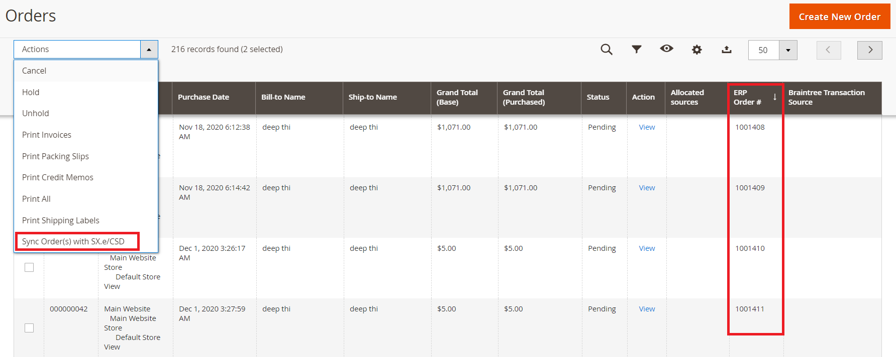</kbd>

## Transaction Overview

The following information of an order gets synced from SX.e to Magento/eConnect

1. Order Status
2. Invoice Date
3. Ship Date
4. Invoice Amount
5. Tracking Number

## Order Status Relation

#### **Order Status in SX.e**

0 Entered

1 Ordered

2 Picked

3 Shipped

4 Invoiced

5 Paid

9 Cancelled

| Stage Number | Stage | Description | Valid Order Types | Effect on Inventory |
| --- | --- | --- | --- | --- |
| 0 | Entered | Orders in this stage are never invoiced. They might be converted to orders that reserve stock and are then invoice processed. | BL, BR, ST, FO, QU | No Effect |
| 1 | Ordered | New orders, with the above exceptions, are assigned to this stage.If the order is a back order, Ord BO appears in the Stage field on the order banner. | SO, DO, RM | Reserved Increased |
| 2 | Picked | When a pick ticket is printed, the order advances to this stage. | SO, BR, RM | Committed Increased,Reserved Decreased,Selling Net Available unchanged |
| 3 | Shipped | If an order is processed in Sales Entry Shipping Feedback or is a Counter Sale (CS) or Correction (CR) order, it is upgraded to this stage. Once an order is in Stage 3, it cannot be maintained in Sales Entry Transactions. It must be unshipped in Sales Entry Shipping Feedback, changed, then reshipped. If you need to change a CS, or CR, you might need authorization from a supervisor with grant authority. | SO, BR, RM, DO, CS, CR | No effect |
| 4 | Invoiced | Orders processed through Sales Entry Processing Invoice Processing are upgraded to this stage. An invoiced order becomes inactive and cannot be altered. | SO, CS, BR, DO | On Hand Decreased,Committed Decreased |
| 5 | Paid | When an order is paid in full, it is upgraded to this stage.When a Credit (CR) or Return Merchandise (RM) order is processed, it is upgraded to this stage. If the RM is not tied to an order a Misc Credit is created. | SO, CS, CR, RM, BR, DO | No effect |
| 9 | Cancelled | A cancelled order is upgraded to this stage. | All | Reversed |

#### **Order Status in Magento **

All orders have an order status that is associated with a stage in the order processing [workflow](http://docs.magento.com/m2/ce/user_guide/sales/order-status-workflow.html). The Magento store has a set of predefined order status and order state settings. The order state describes the position of an order in the [workflow](http://docs.magento.com/m2/ce/user_guide/sales/order-status-workflow.html).

Magento only supports order statuses on order head level (not order line level).

<kbd>
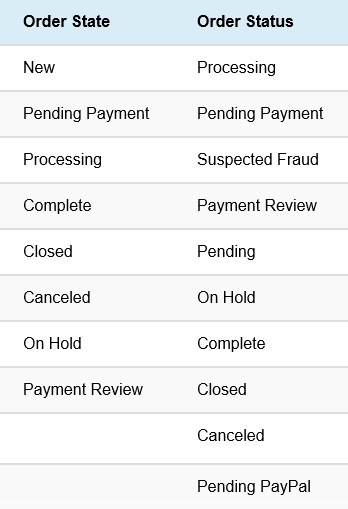</kbd>

#### **Magento and SX.e Order Status Relation **

<kbd>
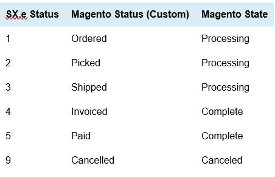</kbd>

# ACCOUNTS RECEIVABLE

This page has 5 tabs: Period Balances, Credit Balances, Ordering Information, Taxing Information

<kbd>
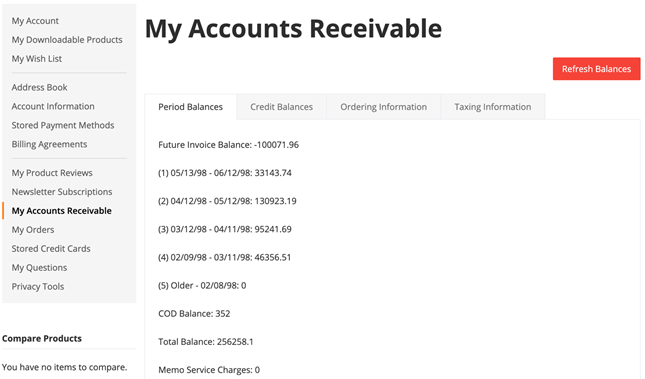</kbd>

# CRON JOBS

This section provides an overview of the various Cron (background) jobs within Magento that are available within LeanSwift eConnect.

The cron job configuration can be found within the LeanSwift extension configuration under

_LeanSwift > Configuration > eConnect SX.e/CSD > Cron_:

<kbd>
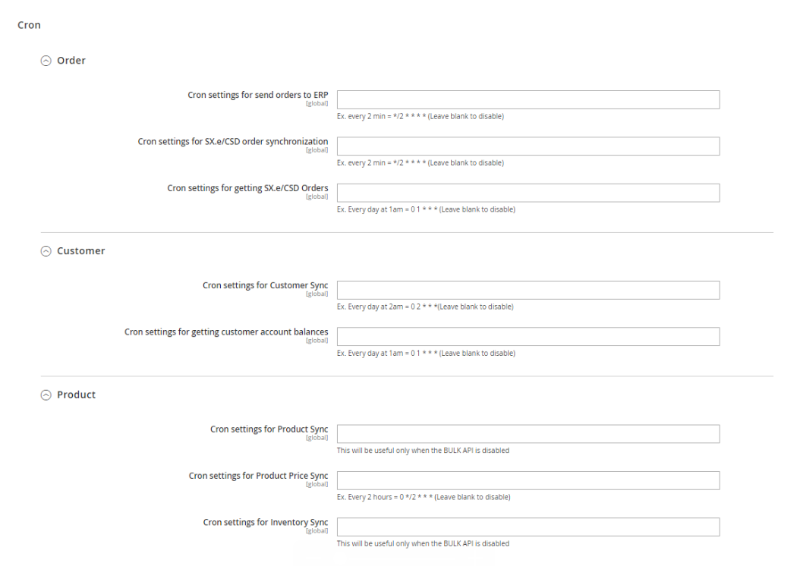</kbd>

## Order

**Cron settings for send orders to ERP**

This job controls how often new orders are sent to SX.e from Magento.

**Cron settings for ERP order synchronization**

This job looks for all the Magento orders in 'processing' state. The main idea behind this job is to sync all necessary order related information between Magento and SX.e. This job normally isn't run as frequent as the 'Send orders to ERP' cron.

**Cron settings for getting ERP Orders**

This job controls how often the Order history that's visible for the customer when logged in from the Magento front-end is updated.

## Customer

**Cron settings for getting Customer Account Balances**

This job controls how often the customer account balance information that's visible for the customer when logged in from the Magento front-end is updated.

**Cron settings for Customer Sync**

This cron job manages the synchronization from SX.e/CSD to Magento of Customer information and customer address information.

## Product

**Cron settings for Product Sync**

- This job synchronizes product attributes from SX.e/CSD to Magento. Every product that in Magento has status 'Enabled' and has a valid SX.e item number value associated will be included in the update each time.  
- In the SX.e/CSD product attributes mapping section, all the attributes mapped to General and Tax API will be synced and the attributes mapped to Bulk API will not be synced.

Note: This will work only when the "Enable Bulk API" option is set to "No". 

**Cron settings for Product List Price Sync**

This job synchronizes Item Price from SX.e to Magento. Every product that in Magento has status 'Enabled' and has a valid SX.e item number value associated will be included in the update each time.

During this cron,
  1. When "Enable Bulk API" is set to "Yes", the following data will be synced using the Bulk API call [ICGetWhseProductListV3].
      - Price
      - Inventory(if "Enable in CRON" is set to "Yes" under "Inventory Synchronization"),
      - Product attributes(Only when the API is chosen as ‘Bulk’ and not General and Tax)

  2. When Enable Bulk API is set to No, the following data will be synced using the normal price API call
      - Price
        Following will be synced via separate CRON
        - Inventory(if "Enable in CRON" is set to "Yes" under "Inventory Synchronization"),
        - Product attributes

**Cron settings for Inventory Sync**

- This job controls how often the inventory synchronization is run. The background inventory synchronization will each time it runs update the 'Qty' value within the product Every product that in Magento has status 'Enabled' and has a valid SX.e item number value associated will be included in the update each time. 
- Inventory data can be synced only when "Enable in CRON" is set to "Yes" under "Inventory Synchronization". 

Note: This will work only when the "Enable Bulk API" option is set to "No"

