#  User Manual - eConnect for M3 - v6.2.1

# Table of contents

- [GENERAL INFORMATION](#general-information)
  - [System Overview](#system-overview)
  - [Backend Configuration](#backend-configuration)
	- [Connectivity](#connectivity)
		- [Service Configuration](#service-configuration)
		- [Basic Data Configuration](#basic-data-configuration)
		- [Authentication](#authentication)
		- [Message Queue Configuration](#message-queue-configuration)
		- [ION Workflow Configuration](#ion-workflow-configuration)
		- [IMS Configuration](#ims-configuration)
		- [Cron](#cron)
		- [Version](#version)
	- [Import History](#import-history)
	- [IMS Report](#ims-report)

# GENERAL INFORMATION

## System Overview

- Provides the connectivity to eLink and/or Infor systems with the use of a generic function which decides whether to call the eLink / ION APIs based on the M3 Connection Protocol chosen in the backend
- Acts as the communication layer for RabbitMQ Message consumption
- Acts as a core module for 
	- eConnect
	- IDM
	- Supplier Portal
- eConnect add-ons depend on both eConnect-base and eConnect likewise SupplierPortal add-ons depend on both eConnect-base and SupplierPortal

[Go to Top](#table-of-contents)

## Backend Configuration

- eConnect-base has separate configuration settings in the backend. There are 3 sub-menus for eConnect-base
	- Connectivity
	- Import History
	- IMS Report

	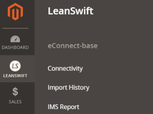
	
### Connectivity
- There are 8 sections under Connectivity:

#### Service Configuration
- M3 Connection Protocol can either be eLink or ION.

	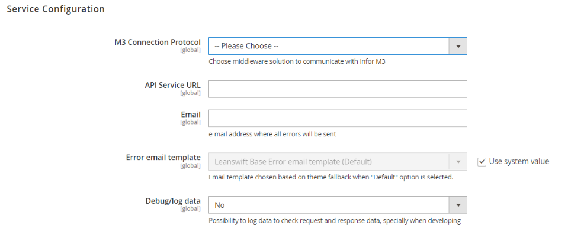

#### Basic Data Configuration
- When M3 Connection Protocol is eLink

	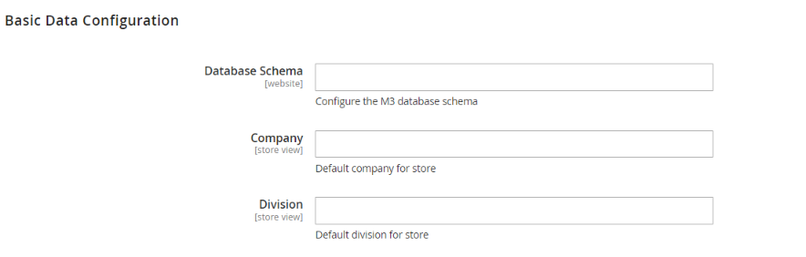

- When M3 Connection Protocol is ION

	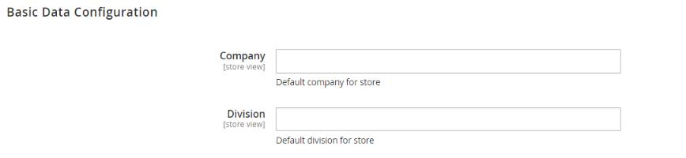

#### Authentication
- When M3 Connection Protocol is eLink

	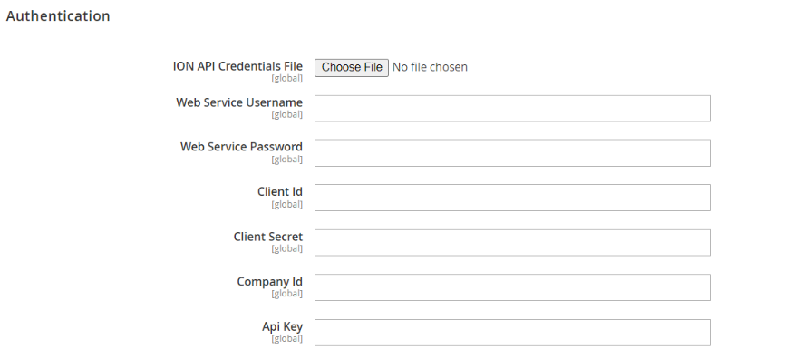

- When M3 Connection Protocol is ION

	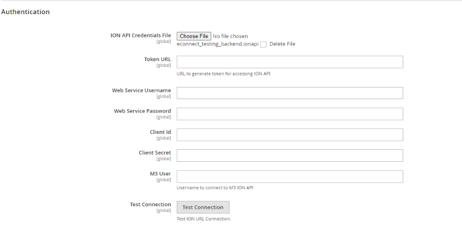

#### Message Queue Configuration
- Configuration fields to make a connection with the RabbitMQ while using ION as M3 Connection Protocol

	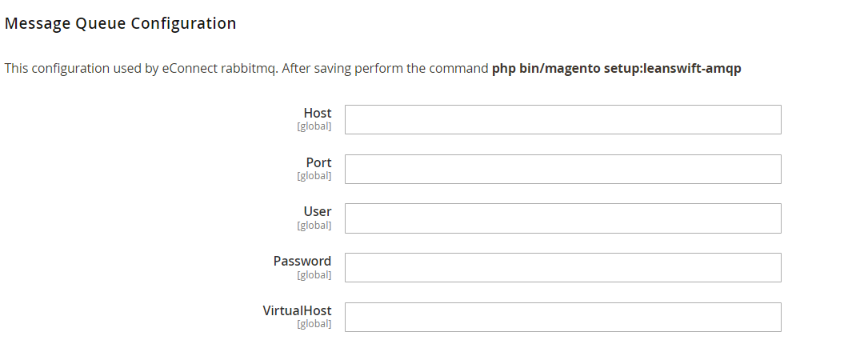

#### ION Workflow Configuration
- Workflow configuration to make use of the workflows used in ION while using ION as M3 Connection Protocol

	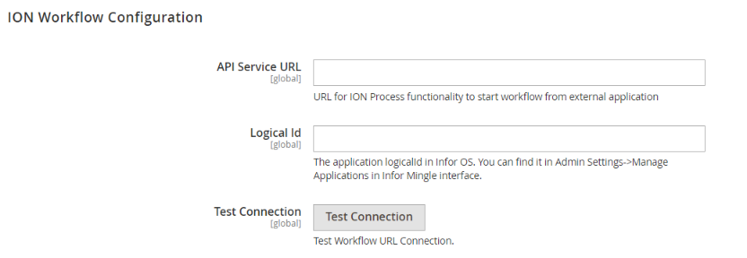

#### IMS Configuration
- This configuration will work when the M3 Connection Protocol is chosen as ION. We can make use of this Infor Messaging Service to create customers via BODs instead of APIs.

	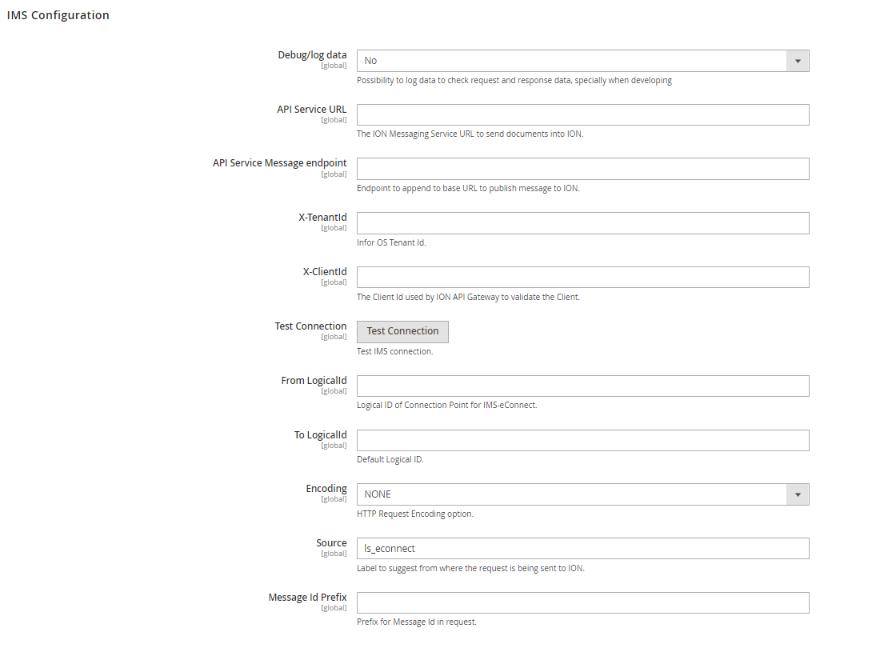

#### Cron
- Cron to clear the inbound BODs which are related to IMS.

	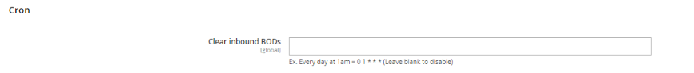

#### Version
- Displays the installed version of all the extensions

	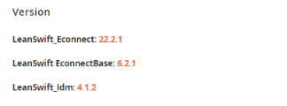

### Import History
- This menu is to show the Grid which has the content of `leanswift_econnect_import_history` table i.e. of all the Initial Load calls which has been made by triggering /EVS002MI/Initiate ION API

	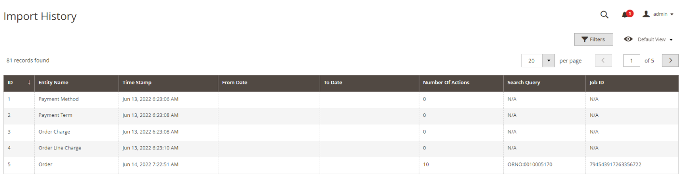

### IMS Report
- This menu is to show the reports of the IMS related call results. Currently this feature is used in eConnect module to create customers via IMS(Infor Messaging Service)

	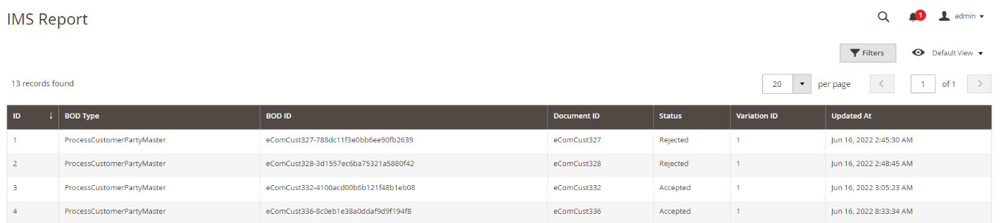

[Go to Top](#table-of-contents)
