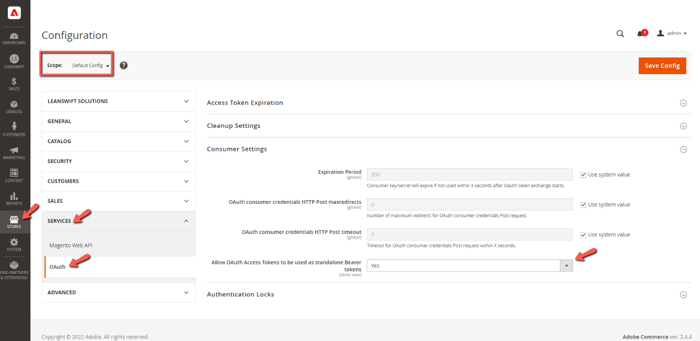

# **eConnectBase 6.3.0**

# Table of contents

- [**Environment Details**](#environment-details)
- [**Overview**](#overview)
- [**Prerequisites**](#prerequisites)
- [**Highlight**](#highlight)
- [**Compatibility Fixes**](#compatibility-fixes)
- [**Point of Contact**](#point-of-contact)

# **Environment Details**

| **Software Name** | **Version** |
| --- | --- |
| Magento version | 2.4.6 |
| PHP version | 8.1.6 |

# **Overview**

- Provides the connectivity to eLink and/or Infor systems with the use of a generic function which decides whether to call the eLink / ION APIs based on the M3 Connection Protocol chosen in the backend
- Acts as the communication layer for RabbitMQ Message consumption
- Acts as a core module for 
	- eConnect
	- IDM
	- Supplier Portal
- eConnect add-ons depend on both eConnect-base and eConnect likewise SupplierPortal add-ons depend on both eConnect-base and SupplierPortal

# Prerequisites

- From Magento v2.4.4 with PHP v8.1, the following setting must be set to 'Yes' in order to make successful connection with the Infor ION API.

	

# **Highlight**

- eConnect-base module is now compatible with Magento v2.4.6 and PHP v8.1(Supports PHP v8.2 too)

# **Compatibility Fixes**

- Replaced 'Zend' with 'Laminas' to generate Refresh Token and Access Token

# **Point of Contact**

- [prabhu.mano@leanswift.com](mailto:prabhu.mano@leanswift.com)
- [deepthi.tadikamalla@leanswift.com](mailto:deepthi.tadikamalla@leanswift.com)
- [narayanan.gurusamy@leanswift.com](mailto:narayanan.gurusamy@leanswift.com)
