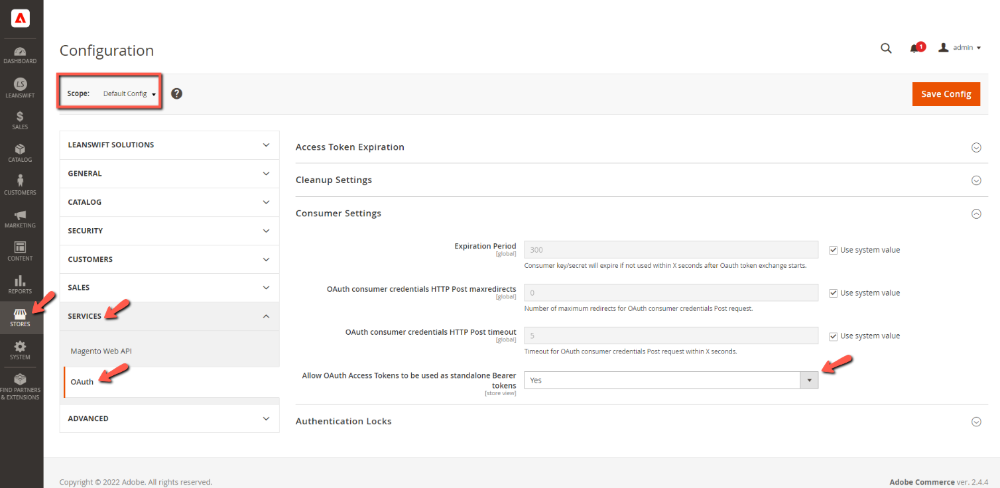

# **eConnectBase 6.4.2**

# Table of contents

- [**Environment Details**](#environment-details)
- [**Overview**](#overview)
- [**Prerequisites**](#prerequisites)
- [**Highlight**](#highlight)
- [**Compatibility Fixes**](#compatibility-fixes)
- [**Point of Contact**](#point-of-contact)

# **Environment Details**

| **Software Name** | **Version** |
| --- | --- |
| Magento version | 2.4.8-p3 |
| PHP version | 8.3 |

# **Overview**

- Provides the connectivity to eLink and/or Infor systems with the use of a generic function which decides whether to call the eLink / ION APIs based on the M3 Connection Protocol chosen in the backend
- Acts as the communication layer for RabbitMQ Message consumption
- Acts as a core module for 
	- eConnect
	- IDM
	- Supplier Portal
- eConnect add-ons depend on both eConnect-base and eConnect likewise SupplierPortal add-ons depend on both eConnect-base and SupplierPortal

# Prerequisites

- From Magento v2.4.8-p3 with PHP v8.3, the following setting must be set to 'Yes' in order to make successful connection with the Infor ION API.

	

# **Highlight**

- eConnect-base module is now compatible with Magento v2.4.8-p3 and PHP v8.3

# **Compatibility Fixes**

- Fixed compatibility issue for Amqp Queue module

# **Point of Contact**

- [prabhu.mano@leanswift.com](mailto:prabhu.mano@leanswift.com)
- [deepthi.tadikamalla@leanswift.com](mailto:deepthi.tadikamalla@leanswift.com)
- [pradeep.shinde2@wipro.com](mailto:pradeep.shinde2@wipro.com)
- [saurabh.gupta77@wipro.com](mailto:saurabh.gupta77@wipro.com)
