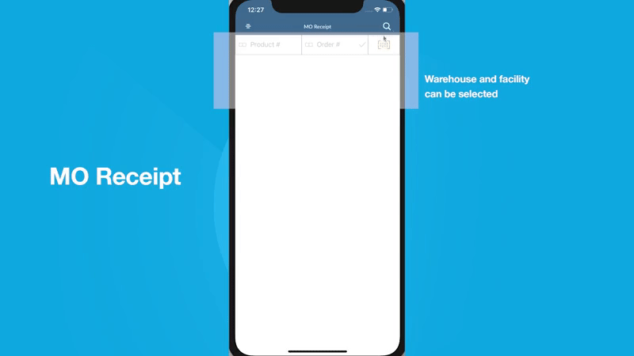
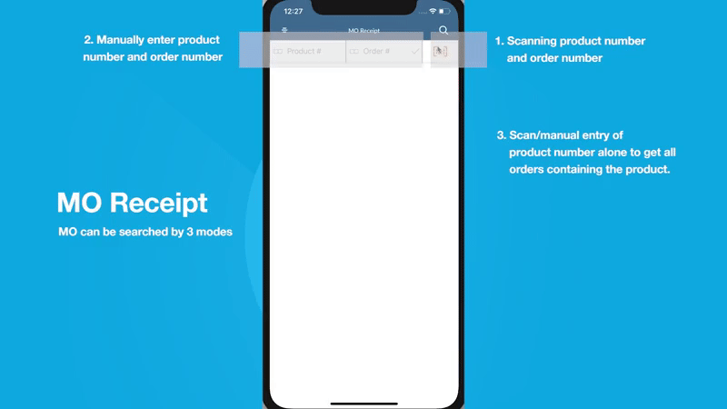
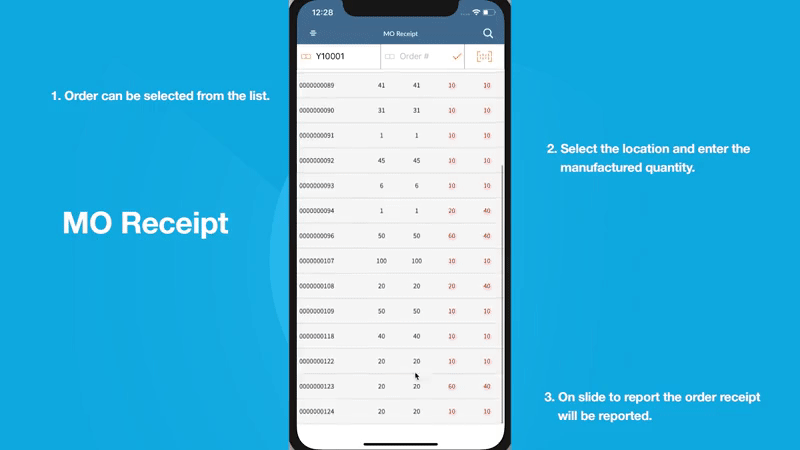

# User Guide - MO Receipt

# Table of contents

- **[About this guide](#about-this-guide)**
  - [Intended Audience](#intended-audience)
    - [MO Receipt standard functionality](#std-func)
- **[M3 Setup](#m3-setup)**

  - [Set Pick Team](#set-pick-team)

- **[Workflow, Screen Layouts & API Logic](#wrk)**
  
  - [Settings](#settings)
  - [Item #](#itno)
  - [Reporting Receipt](#submit-scr)
  
- **[M3 sample workflow](#m3sample)**

  - [Create customer order PMS001](#crt-pms)

  

# About this guide

### Intended Audience

MobileFirst Configuration User Guide provides guidance for LeanSwift customers and consultants regarding understanding the basic concept, functionality and configuration of the MO Receipt Standard App. Further information about MobileFirst standard applications can be found at [www.inform3marketplace.com](http://www.inform3marketplace.com).

#### **MO Receipt standard functionality**

The intended use of this app is for a user to be reporting receipts against Manufacturing orders (MOs) with a trimmed down way to quickly and easily report quantity produced.

Using PO Receipt module in MobileFirst Orders can be searched by providing order number and product number. They can also input only product number and list all orders containing the product and choose from the list.The receipt report can be done by tapping the orders in the list and on selecting valid location and manufactured quantity that order can be reported using slide to confirm at the end.

# **M3Setup**

### Set Pick Team

<!-- Setting up HPTEAM for the users -->

# **Workflow, Screen Layouts & API Logic**

### Settings

Initially the MO Receipt module settings can be opened to choose warehouse and facility.

### Item #

In the Item number field enter manually using keyboard or scan from inbuilt camera. Item Number and Order Number can be entered or scanned from inbuilt camera.

Entered details will be validated against M3 services.

### Reporting Receipt

On successfull retrival of head info data for the item number. User can select a order and can be reported.

After selecting an line item in the order. Enter the location and manufactured quantity.

All entered details will be validated and if the data were valid the slider will be shown. On slide to confirm the order receipt will be reported.

# M3 Sample Flow

This section describes the MO Receipt workflow in M3 to create purchase order. The current warehouse and facility selection can be made using the search icon on the top right corner of the screen.

### Create customer order PMS001

- Manufacture order can be created in PMS001.
- Enter Product, Product structure type.
- Product and its details will be defined in MMS001.
- On clicking [+] the order will be created this order can be viewed in PMS100 sort the list based on 70-Res/Prod/MO to see the orders.

The Product number with the manufacturing order can be searched in MO Receipt module and the receipt can be reported.