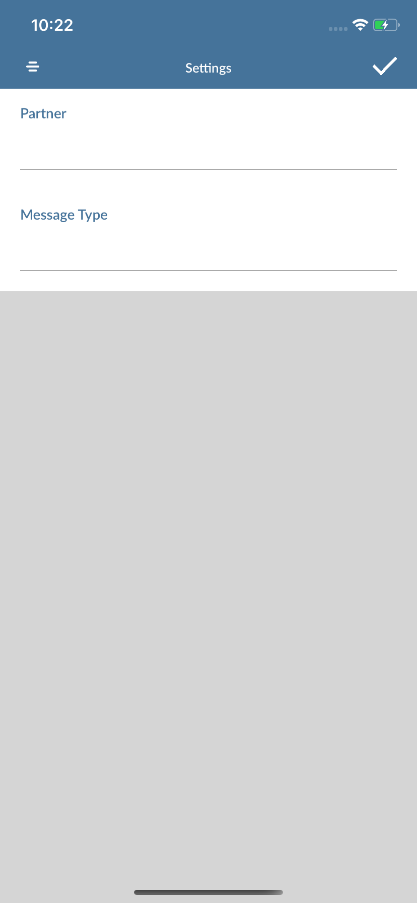
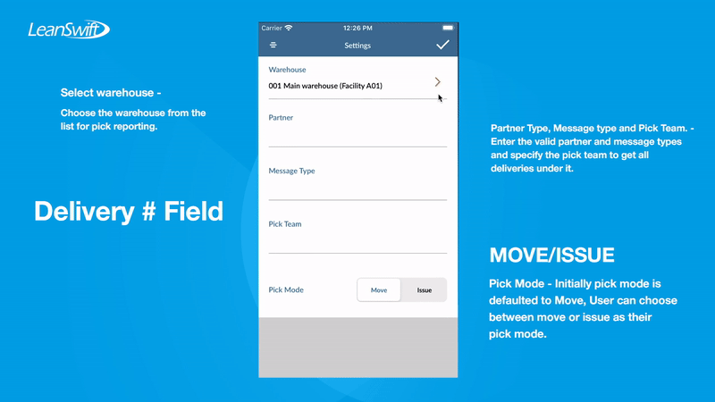
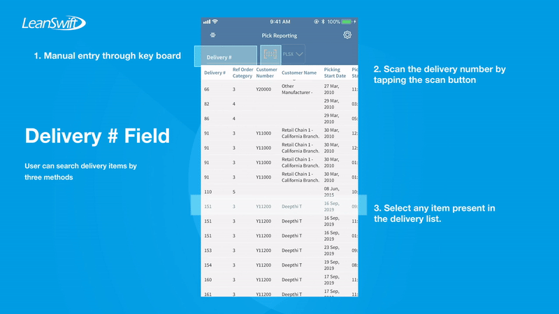
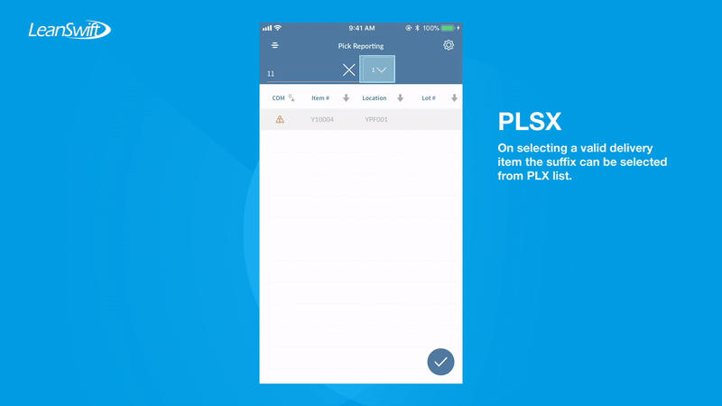
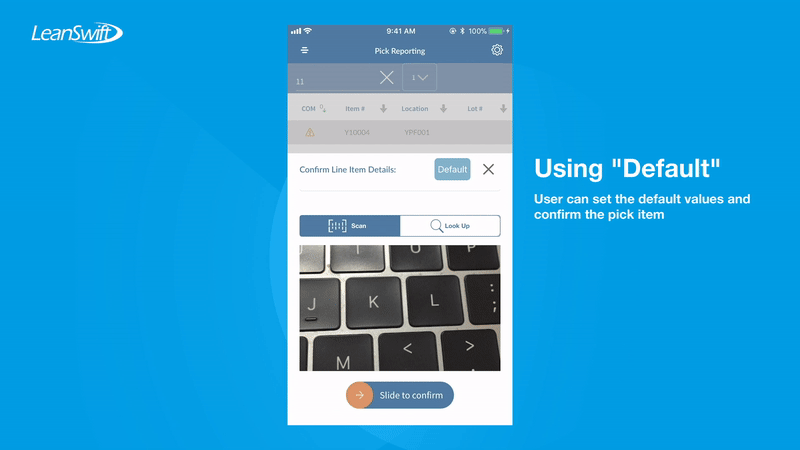
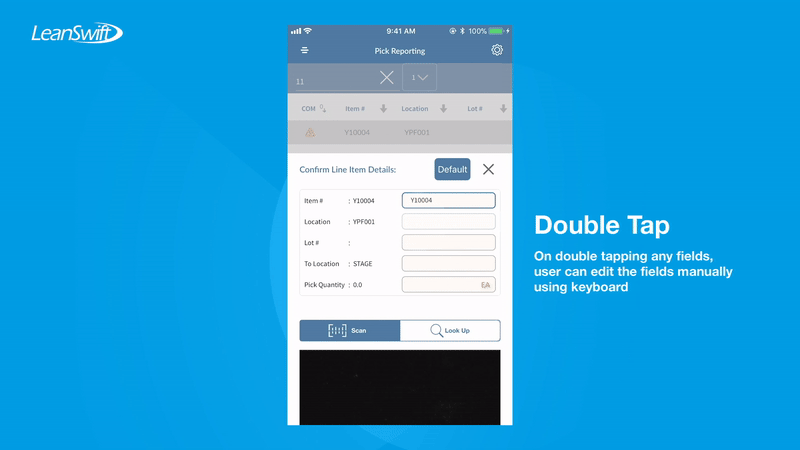
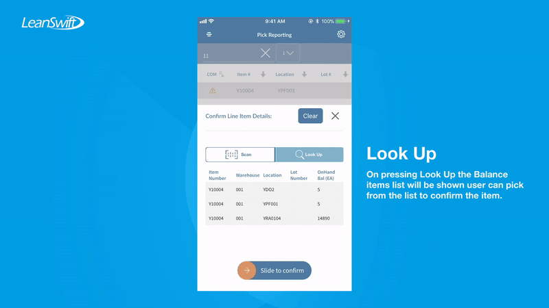
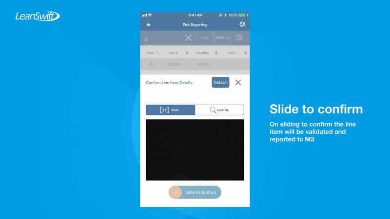
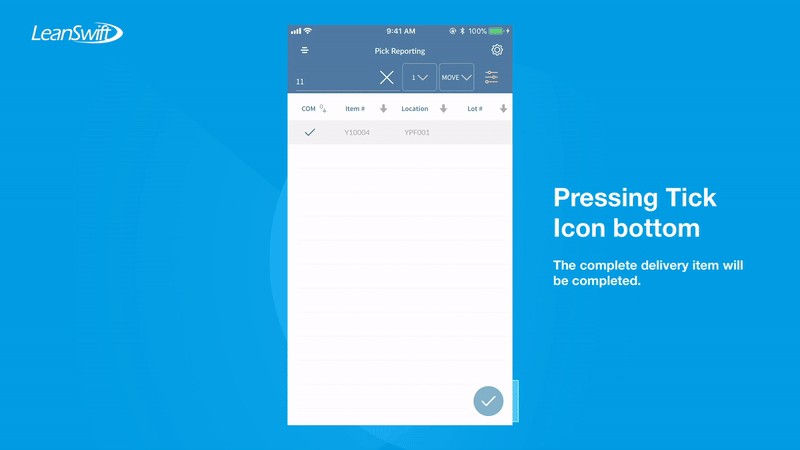

# User Guide - Pick Reporting

# Table of contents

- **[About this guide](#about-this-guide)**
  - [Intended Audience](#intended-audience)
    - [Pick reporting standard functionality](#std-func)
      - [Features include](#ftrs)
- **[M3 Setup](#m3-setup)**
  - [Set Pick Team](#set-pick-team)
- **[Workflow, Screen Layouts & API Logic](#wrk)**
  - [Settings](#settings)
  - [Pick Reporting mode](#pick-mode)
  - [Delivery # Field](#del-field)
  - [Pick Line Items](#pick-lines)
  - [Confirming Line Item Details](#confirm-details)
    - [Default  entry](#default)
    - [Manual entry using keyboard](#manual)
    - [Scan field / Look up selection](#scan-lookup)
  - [Report Pick Item](#report-item)
  - [Confirm Delivery Item](#confirm-demo)
- **[M3 sample workflow](#m3sample)**
  - [Create customer order OIS300](#crt-ois)
  - [Assigning pick team](#pick-team-assign)

# About this guide

### Intended Audience

MobileFirst Configuration User Guide provides guidance for LeanSwift customers and consultants regarding understanding the basic concept, functionality and configuration of the Pick reporting Standard App. Further information about MobileFirst standard applications can be found at [www.inform3marketplace.com](http://www.inform3marketplace.com). 

#### **Pick reporting standard functionality**

MobileFirst Pick reporting for Infor M3 makes it possible to provide support for quick and easy reporting of picking lists in your warehouse or distribution center.When the Initial launch of the pick reporting module there is message type and partner type fields will be required. If there is a message type and partner type specified that can be used. If not for message type WS and for partner type WMS can be used.

#### Features include

1. Barcode scanning using the device built-in camera
2. Retrieve and display the list of delivery
3. Confirm pick items
4. Complete Move / Issue pick items.
5. Look from Balance ID’s and fill up the item pick quantity.
6. Delivery Items picking completion. 

# **M3Setup**

### Set Pick Team

<!-- Setting up HPTEAM for the users -->

# **Workflow, Screen Layouts & API Logic**

### Settings:

Initially the Pick Reporting module settings will be opened to get message type and partner type.

Either the provided message type or partner type can be entered or for Message type WS and partner type WMS can be used. On entering these details and saved using tick button persent on top right corner the settings will be saved. This is one time user can always change this settings from top right corner setting button.

### Pick Reporting mode:

Pick reporting can be done in Move or Issue mode.

### Delivery # Field:

By default the Delivery list will list all deliveries available under the selected warehouse and pick team fetched from M3 for the user.

Delivery item can be manually entered using keyboard, scanned using inbuilt camera or selected from the list.

### Pick Line Items:

On selecting a delivery item, suffix selection will be required from user. On selecting the suffic the pick line items under the delivery item for the suffix will be shown.

The line items details can be viewed by scrolling horiozontally and the line items can be sorted based on the item#,Location,Completed flag etc.

### Confirming Line Item Details:

After opening a line item it can be confirmed by three modes

#### Default  entry

#### Manual entry using keyboard

This can be done by double tapping the field which needs to be edited.

#### Scan field / Look up selection

The bottom scanner can be used to scan any field value on tapping a field and the scanner can fill the scanned data into that tapped field.

look up options allows to view the balance id's fetched from M3.

​		

### Report Pick Item

After entering the details for the line item it can be reported using slide to confirm slider action.

But all the entered data will be validated against the line item and reported.

### Confirm Delivery Item

On reporting all or partial line items the delivery item can be confirmed by tapping the tick button on the bottom of the line item's screen.

The completed line item will have a tick mark in the completed column. 

Delivery item will be confirmed in M3.s

# **M3 sample workflow**

This section describes the Pick Reporting workflow in M3 to create customer order. The workflow can have variations depending on your current order processing- and dispatch settings.

### Create customer order OIS300

- OIS300 create new order by pressing New Order Button
- Create customer order and order lines OIS100/101.
- Add items with some quantity. items with Alternate unit of measures can also be added and submit by pressing F3
- Allocate quantity MNS121, order status 33.

### Assigning pick team

- Close all tabs and open OIS300 and search the customer order with customer number copied.
- Select the customer order related items and choose the delivery toolbox to view the delivery item.
- Select the delivery item in MWS410 open Delivery toolbox and related items to select picking list
- See if the pick list has a team mapped if now assign a team to the pick list by choosing related, plan pickers.
- Set the pick team as 001 or any other pick team.
- Refresh the list to see the assigned team is updated for pick list.
- Customer Order status should be 44 in OIS300.

**Note:** Orders with status 40 or above will be recognized by the Mobile App and in which the items can be processed using transaction MHS850MI/AddPickViaRepNo and the delivery item can be confirmed by MWS420MI/Confirm transaction can be performed in the Mobile First Pick Reporting application.