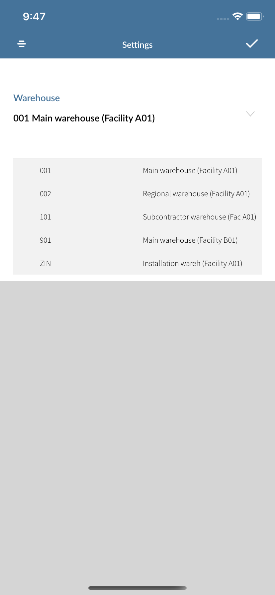

# User Guide - PO Inspection

# Table of contents

- **[About this guide](#about-this-guide)**
  - [Intended Audience](#intended-audience)
    - [PO Inspection standard functionality](#std-func)
- **[M3 Setup](#m3-setup)**
  - [Set Pick Team](#set-pick-team)
- **[Workflow, Screen Layouts & API Logic](#wrk)**
  - [Settings](#settings)
  - [Purchase Order](#po)
  - [Line Items](#lines)
  - [Inspecting Line Item](#line-details)
  - [Choosing QI Result](#qi-res)
  - [Fill Required Details](#fill-details)
  - [Submit the Inpection](#confirm-demo)
- **[M3 sample workflow](#m3sample)**
  - [Create Purchase order PPS200](#crt-po)
  - [Receive the order in PPS300](#receive-po)

# About this guide

### Intended Audience

MobileFirst Configuration User Guide provides guidance for LeanSwift customers and consultants regarding understanding the basic concept, functionality and configuration of the PO Inspection Standard App. Further information about MobileFirst standard applications can be found at [www.inform3marketplace.com](http://www.inform3marketplace.com).

#### **PO Inspection standard functionality**

The PO Inpsection for Infor M3 provides for the ability to inspect the items received via M3 Purchase Orders into a warehouse. In M3 terms, it is the ability to inspect a PO.

# **M3Setup**

### Set Pick Team

# **Workflow, Screen Layouts & API Logic**

### Settings:

The current warehouse selection can be made using the settings icon on top right corner of the screen.

### Purchase Order #:

/*Image*/

On Entering/Scanning number it will be validated using [GetHeadMI](#validate-po). If the PO's status is greater that 50 and the goods receiving methods specifed is of Quality Inspect type then the PO is valid to proceed to get line items.

### Line Items:

The List of line items will be fetched from [Get Line](#line-items).

/*Image*/

The line items details can be viewed by scrolling horiozontally.

### Inspecting Line Item:

After tapping on a line item it can be inspected by providing required values for the attributes like, loaction, rejected reason, reject location lot number etc.

/*Image*/

### Choosing QI Result

QI results can be chosen from the available options:-

- Partially reported approved quantity.
- Fully approved.
- Approved with remarks.
- Partailly rejected.
- Rejected.

/*Image*/

Each QI options will have different details required for submitting the inspection.

### Fill Required Details

Choose the location code for approved quantiy from the drop down, enter/scan approved quantity and enter the remarks.

/*Image*/

### Submit the Inpection

If all details were entered a slider will be shown, on slide to confirm the item inspection details will be submitted via [M3 inspect](#inspect).

/*Image*/

# **M3 sample workflow**

- This section describes the Pick Reporting workflow in M3 to create purchase order. The workflow can have variations depending on your current order processing- and dispatch settings.

  The current warehouse selection can be made using the settings icon on top right corner of the screen.

  ### Create Purchase order PPS200

  - Purchase order can be created in PPS200 by clicking [+] button.
  - Enter supplier, order type and Req delivery date.
  - Supplier will be defined in CRS620 and customer will be defined in CRS610
  - Add line items for the order and specify the item quantity, price and goods receiving method
  - Complete the order creation. It will be in status 15 - ready to send

  The Goods Receving methods will be defined in PPS345, Select Method type having quality inspect.

  ### Receive the order in PPS300

  - Enter the created purchase order number in the PPS300 panel.
  - Listed line items have to be received enter the received quantity and receive the items.
  - After successful receiving of order the status will be 50- Goods received.

**Note:** Orders with status 50 or above will be recognized by the Mobile App.

