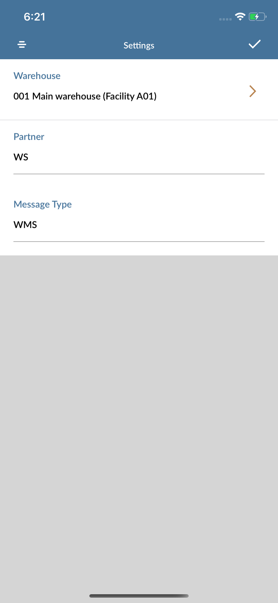

# User Guide - PO Put-Away

# Table of contents

- **[About this guide](#about-this-guide)**
  - [Intended Audience](#intended-audience)
    - [Put Away standard functionality](#std-func)
      - [Features include](#ftrs)
- **[Technical details](#tech-details)**
  - [Validate PO #](#validate-po)
  - [Get Line Items](#line-items)
  - [Get Line Details](#line-details)
  - [Get Line Quantity](#line-qty)
  - [Get Line UOM](#uom)
  - [Get Container Info](#container-info)
  - [Get Item Warehouse Balance](#balanceid)
  - [Retrive Put-Away Location](#retr-loc)
  - [Put-Away PO](#putaway-po)
  - [Get Two Step Put-away List](#2putaway-list)
  - [Process Two Step Putaway](#process-2po)
- **[Workflow, Screen Layouts & API Logic](#wrk)**
  - [Settings](#settings)
  - [Purchase #](#po)
  - [Line Items](#lines)
  - [Single Put Away](#single-put)
  - [Submit Single Put Away](#submit-single)
  - [Continue with two step Put-Away](#continue-two)
  - [Two step Put-Away](#two)
- **[M3 sample workflow](#m3sample)**
  - [Create Purchase order PPS200](#crt-po)
  - [Receive the order in PPS300](#receive-po)
  - [One step Put-Away](#one-step)
  - [Two step Put-Away](#two-step)

# About this guide

### Intended Audience

MobileFirst Configuration User Guide provides guidance for LeanSwift customers and consultants regarding understanding the basic concept, functionality and configuration of the PO Put Away Standard App. Further information about MobileFirst standard applications can be found at [www.inform3marketplace.com](http://www.inform3marketplace.com).  

#### **Put Away standard functionality**

The PO Put-Away for Infor M3 provides for the ability to put-away items which are received and/or inspected into an M3 warehouse.

When the Initial launch of the PO Put Away module there is message type and partner type fields will be required. If there is a message type and partner type specified that can be used. If not for message type WS and for partner type WMS can be used.

#### Features include

1. Barcode scanning using the device built-in camera
2. Put Away location will be retrieved from M3 or selected from the entire location list.
3. Completing the one step Put away and proceeding to Two Step put way.
4. Scannable lot number and container number fields.

# **Technical details**

### Validate PO #

**API:** PPS200MI/GetHead

Input field required:

| Field | Description    |
| ----- | -------------- |
| CONO  | Company        |
| PUNO  | Purchase Order |

### Get Line Items

**API:** PPS320MI/LstReceivedPO

Input field required:

| Field | Description    |
| ----- | -------------- |
| PUNO  | Purchase Order |

Select the line item from the list. Depending on the PO's order type the items will be under single put away or two step put away.

### Get Line Details

**API:** PPS320MI/GetPADataPO

Input field required:

| Field | Description      |
| ----- | ---------------- |
| REPN  | Receiving number |

### Get Line Quantity

**API:** ExportMI/Select

Query: "ICPUOS,ICNEAC,ICRPQA from MPLIND where ICREPN = '%@' and ICWHLO = '%@'"

### Get Line UOM

**API:** PPS200MI/GetLine

Input field required:

| **Field** | **Description**               |
| --------- | ----------------------------- |
| CONO      | Company                       |
| PUNO      | Purchase Order Number         |
| PNLI      | Purchase Line Item Number     |
| PNLS      | Purchase Line Sub-Line Number |

### Get Container Info

**API:** MMS200MI/GetItmWhsBasic

Input field required:

| **Field** | **Description**              |
| --------- | ---------------------------- |
| CONO      | Company                      |
| ITNO      | Purchase Order's Item Number |
| WHLO      | Purchase Order warehouse     |

### Get Item Warehouse Balance 

**API:**MMS200MI/GetItmBasic

Input field required:

| **Field** | **Description**              |
| --------- | ---------------------------- |
| CONO      | Company                      |
| ITNO      | Purchase Order's Item Number |

### Retrive Put-Away Location

**API:**MMS160MI/RtvPutAwayLoc

Input field required:

| **Field** | **Description**                 |
| --------- | ------------------------------- |
| WHLO      | warehouse                       |
| QLFR      | Qualifier                       |
| RORL      | Reference Order Line Number     |
| RORX      | Line Suffix                     |
| STAS      | Status - Balance ID             |
| TRQA      | Transaction Quantity in alt U/M |
| ALUN      | Alternate unit of measure       |
| REPN      | Receving number                 |

### Put-Away PO

**API:**PPS320MI/PutawayPO

Input field required:

| **Field** | **Description**              |
| --------- | ---------------------------- |
| WHSL      | Location                     |
| OEND      | Flagged as Complete          |
| BANO      | Lot Number                   |
| CAMU      | Container Number             |
| BREM      | Remarks                      |
| RPQA      | Reported Quantity in alt U/M |
| RESP      | Responsible                  |
| REPN      | Receving number              |

### Get Two Step Put-away List

**API:**MWS460MI/LstPutAwayTask

Input field required:

| **Field** | **Description**            |
| --------- | -------------------------- |
| WHLO      | Warehouse                  |
| CONO      | Company                    |
| AORC      | Acquisition Order Category |
| ARDN      | Acquisition Order Number   |

###  Process Two Step Putaway

**API:**MHS850MI/AddPutAwayConf

Input field required:

| Field | Description      |
| ----- | ---------------- |
| CONO  | Company          |
| PRMD  | Process Flag     |
| RIDL  | Order Line       |
| RIDN  | Order Number     |
| PANO  | Put-away Number  |
| WHSL  | Location         |
| TWSL  | To Location      |
| WHLO  | Warehouse        |
| ITNO  | Item Number      |
| E0PA  | Partner          |
| E065  | Message Type     |
| BANO  | Lot Number       |
| CAMU  | Container Number |

# **Workflow, Screen Layouts & API Logic**

### Settings:

Initially the PO Put Away module settings will be opened to get message type and partner type.

Either the provided message type or partner type can be entered or for Message type WS and partner type WMS can be used. On entering these details and saved using tick button persent on top right corner the settings will be saved. This is one time user can always change this settings from top right corner setting button.

### Purchase #:

In the Purchase order number field enter manually using keyboard or scan from inbuilt camera.

/*Image*/

PO number entered will be sent to M3 to [head Info](#validate-po) and head details will be retrived. If the PO items hav goods receiving method as direct put away the one step option will be shown or the methods type as two step put away then two step put away will be shown.

### Line Items:

On successfull retrival of head info data for the PO. we need to get [line items](#line-items).

/*Image*/

Select any line item to do the put away.

### Single Put Away

After selecting an line item in single put away. Enter the details like location, stored quantity and remarks.

/*Image*/

Location entry can be made by either selecting for all location list avaliable when the field is tapped or it can be selected by tapping the lookup button to select the [retrieve put away location](#retr-loc).

### Submit Single Put Away

All entered details will be validated and if the data were valid the slider will be shown. On slide to confirm the item will be put awayed.

/*Image*/

### Continue with two step Put-Away

If the submission is successful there will be a notification banner on top to proceed with two step or skip.

/*Image*/

If two step put away is selected in the banner the two step screen will be shown. if the skipped the intial screen will be shown for user to search for other PO.

#### Two step Put-Away

Enter the details like location, new quantity and if the entered values are valid then use the slide to confirm to do [two step Put away](#process-2po).

/*Image*/

# **M3 sample workflow**

This section describes the Pick Reporting workflow in M3 to create purchase order. The workflow can have variations depending on your current order processing- and dispatch settings.

The current warehouse selection can be made using the settings icon on top right corner of the screen.

### Create Purchase order PPS200

- Purchase order can be created in PPS200 by clicking [+] button.
- Enter supplier, order type and Req delivery date.
- Supplier will be defined in CRS620 and customer will be defined in CRS610
- Add line items for the order and specify the item quantity, price and goods receiving method
- Complete the order creation. It will be in status 15 - ready to send.

### Receive the order in PPS300

- Enter the created purchase order number in the PPS300 panel.
- Listed line items have to be received enter the received quantity and receive the items.
- After successful receiving of order the status will be 50- Goods received.

### One step Put-Away

- If the Goods receiving method chosen is of kind Direct Put Away not the order can be processed in the Mobile First PO Put Away module.

### Two step Put-Away

- For Two step Put Away the goods receiving method should be two step put-away.
- So, after creating the order with above goods receiving method, and receiving in PPS300.
- Look for receiving number in the PPS330 for the purchase order.
- Open PPS310 and enter the complete quantity and do the put-away.
- Open PPS320 and enter the partial quantity and do the put-away.
- Now the order can be done two-step put away from Mobile First PO Put Away module.

