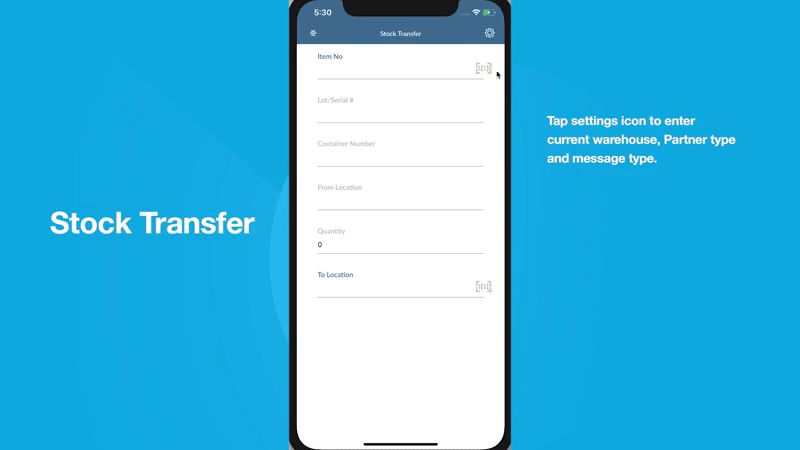
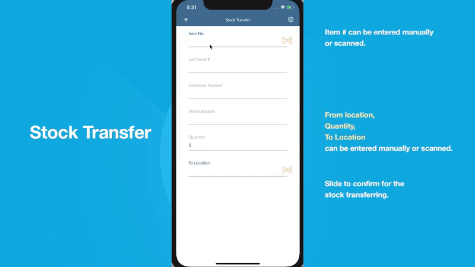

# User Guide - Stock Transfer

# Table of contents

- **[About this guide](#about-this-guide)**
  - [Intended Audience](#intended-audience)
    - [Stock Transfer standard functionality](#std-func)
- **[Workflow, Screen Layouts & API Logic](#wrk)**
  - [Settings](#settings)
  - [Fill Details & Transfer Item](#pick-mode)

# About this guide

### Intended Audience

MobileFirst Configuration User Guide provides guidance for LeanSwift customers and consultants regarding understanding the basic concept, functionality, and configuration of the Stock Transfer Standard App. Further information about MobileFirst standard applications can be found at [www.inform3marketplace.com](http://www.inform3marketplace.com).

#### **Stock Transfer standard functionality**

The intended use of this app is for a user to easily move inventory between a different stock location within a warehouse using MobileFirst Stock Transfer for Infor M3 CE. The application provides the user with a clean user interface to quickly execute a movement of stock from one location to another. Information such as Item number and Location ID can be scanned or keyed in manually.

When the Initial launch of the stock transfer module there is the message type and partner type fields will be required. If there is a message type and partner type specified that can be used. If not for message type WS and for partner type WMS can be used.

# **Workflow, Screen Layouts & API Logic**

### Settings:

Initially, the Stock Transfer module settings will be opened to get message type and partner type.

Either the provided message type or partner type can be entered or for Message type WS and partner type WMS can be used. On entering these details and saved using the tick button present on the top right corner the settings will be saved. This is a one-time change user can always change these settings from the top right corner setting button.

### Fill Details & Transfer Item:

Enter or scan the item number. This item's warehouse balance will be checked in M3.

if the entered number is of alias number it will also be validated.

The default head details for the item will be fetched. Other field data like lot number, container number, alternate units of measurement, will be auto-filled or can be manually entered. The location will be validated.

Finally by sliding the slide to confirm slider the transfer of stack will be done.

