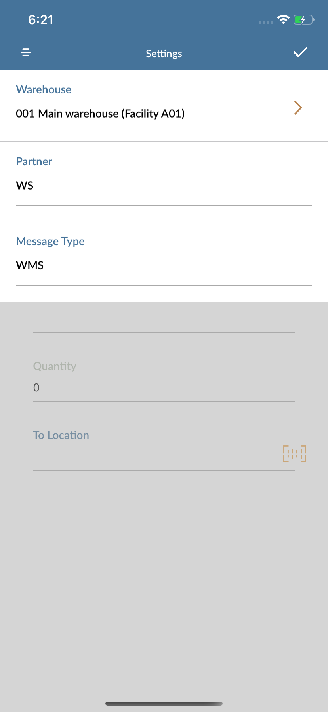

# User Guide - Stock Transfer

# Table of contents

- **[About this guide](#about-this-guide)**
  - [Intended Audience](#intended-audience)
    - [Stock Transfer standard functionality](#std-func)
- **[Technical details](#tech-details)**
  - [Get Item Warehouse Balance ](#balanceid)
  - [Get Item Alias](#alias)
  - [Get Line Details](#line-details)
  - [Get Alternate UOM details](#container-info)
  - [Validate From Location](#retr-loc)
  - [Transfer Stock](#trn-stock)
- **[Workflow, Screen Layouts & API Logic](#wrk)**
  - [Settings](#settings)
  - [Item #](#pick-mode)
  - [Item details](#basic-details)
  - [Validate transfer details](#pick-lines)
  - [Transfer Item](#confirm-demo)

# About this guide

### Intended Audience

MobileFirst Configuration User Guide provides guidance for LeanSwift customers and consultants regarding understanding the basic concept, functionality and configuration of the Stock Transfer Standard App. Further information about MobileFirst standard applications can be found at [www.inform3marketplace.com](http://www.inform3marketplace.com).

#### **Stock Transfer standard functionality**

The intended use of this app is for a user to easily move inventory between different stock location within a warehouse using MobileFirst Stock Transfer for Infor M3 CE. The application provides the user a clean user interface to quickly execute a movement of stock from one location to another. Information such as Item number and Location ID can be scanned or keyed in manually.

When the Initial launch of the stock transfer module there is message type and partner type fields will be required. If there is a message type and partner type specified that can be used. If not for message type WS and for partner type WMS can be used.

# **Technical details**

### Get Item Warehouse Balance 

**API:**MMS200MI/GetItmWhsBal

Input field required:

| **Field** | **Description** |
| --------- | --------------- |
| CONO      | Company         |
| ITNO      | Item Number     |
| WHLO      | Warehouse       |

### Get Item Alias

**API:** MMS025MI/LstItem

Input field required:

| Field | Description    |
| ----- | -------------- |
| POPN  | Alias Number   |
| CONO  | Company        |
| ALWT  | Alias category |

### Get Line Details

**API:** MMS200MI/Get

Input field required:

| Field | Description |
| ----- | ----------- |
| ITNO  | Item number |
| LNCD  | Language    |

### Get Alternate UOM details

**API:** ExportMI/Select

Input field required:

Query: MUALUN,MUDCCD,MUCOFA,MUDMCF,MUITNO from MITAUN where MUITNO = '%@' and MUAUTP = '1'

After Successful retrieving of item details and UOM. User will be allowed to enter location and lot number.

### Validate From Location

**API:**MMS060MI/Get

Input field required:

| **Field** | **Description**  |
| --------- | ---------------- |
| WHLO      | Warehouse        |
| CONO      | Company          |
| WHSL      | Warehouse        |
| ITNO      | Item Number      |
| BANO      | Lot Number       |
| CAMU      | Container        |
| REPN      | Receiving number |

### Transfer Stock

**API:**MMS850MI/AddMove

Input field required:

| **Field** | **Description**           |
| --------- | ------------------------- |
| ITNO      | Item number               |
| CONO      | Company                   |
| WHSL      | Location                  |
| WHLO      | Warehouse                 |
| BANO      | Lot number                |
| CAMU      | Container                 |
| PRFL      | Process flag              |
| E0PA      | Partner                   |
| E065      | Message Type              |
| QLQT      | Quantity                  |
| QLUN      | Qualifier unit of measure |

# **Workflow, Screen Layouts & API Logic**

### Settings:

Initially the Stock Transfer module settings will be opened to get message type and partner type.

Either the provided message type or partner type can be entered or for Message type WS and partner type WMS can be used. On entering these details and saved using tick button persent on top right corner the settings will be saved. This is one time user can always change this settings from top right corner setting button.

### Item #:

Enter or scan the item number. This item's warehouse balance will be checked in M3 using [warehouse balance](#balanceid)

/*Image*/

if the enter number is of alias number it will be checked for [alias check](#alias) in M3.

### Item details

/*Image*/

Details for the entered item will be fetched from M3 using [basic detail](#line-details). The item's unit of measures will also be fetched from get [alternate UOM](#alter-uom).

### Validate transfer details

Other field data like lot number, container number, will be auto filled or can be manually entered. 

/*Image*/

The from location will be validated using [Location](#retr-loc).

### Transfer Item

On entering all details the slider will appear, slide to confirm the transfer of stock.

/*Image*/

Item transfer will be confirmed in M3 using [Transfer](#trn-stock).
