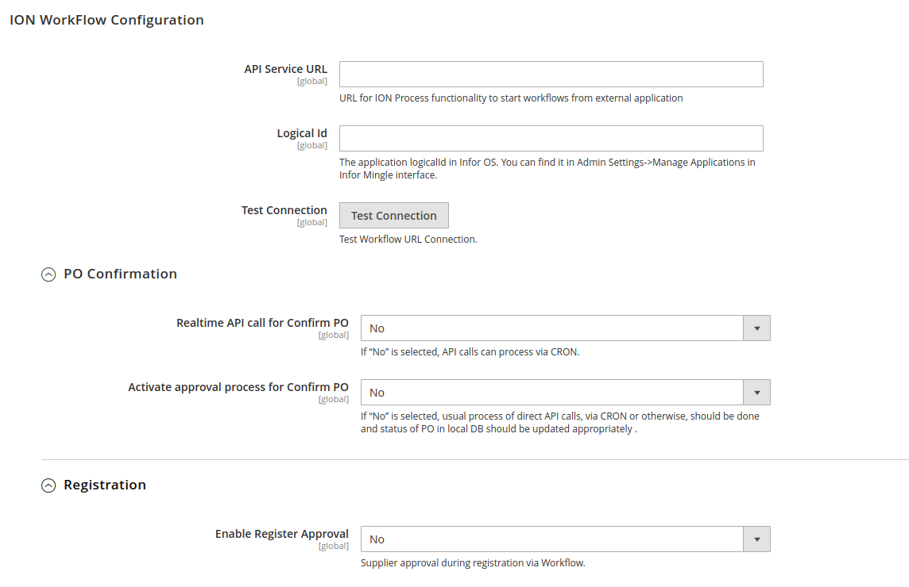

# Supplier Portal

Supplier Portal Admin User Manual

Version 1.0

May, 2020

## Overview

# Table of contents

- [Supplier Portal](#supplier-portal)
  - [Overview](#overview)
- [Table of contents](#table-of-contents)
- [System Overview](#system-overview)
  - [Organization of the Manual](#organization-of-the-manual)
  - [Architecture](#architecture)
  - [Features](#features)
- [User Guide for Portal Admin](#user-guide-for-portal-admin)
  - [Log in](#log-in)
  - [Configuration](#configuration)
    - [Menus](#menus)
    - [eConnect-base Configuration](#econnect-base-configuration)
      - [Service Configuration](#service-configuration)
      - [Basic Data Configuration](#basic-data-configuration)
      - [Authentication](#authentication)
    - [Supplier Portal Settings](#supplier-portal-settings)
      - [General Configuration](#general-configuration)
      - [ION WorkFlow Configuration](#ion-workflow-configuration)
      - [Metrics Display](#metrics-display)
      - [On-Time Delivery KPI](#on-time-delivery-kpi)
      - [Email templates](#email-templates)
      - [Cron](#cron)
    - [Design Settings](#design-settings)
      - [General](#general)
      - [Frontend Color Codes](#frontend-color-codes)
      - [Logo Image size](#logo-image-size)
      - [Status Mapping](#status-mapping)
        - [PO Status Mapping](#po-status-mapping)
        - [Forecast Status Mapping](#forecast-status-mapping)
      - [Filter and Search](#filter-and-search)
        - [Purchaseorder Filter Mapping](#purchaseorder-filter-mapping)
        - [Forecast Filter Mapping](#forecast-filter-mapping)
    - [Exit System](#exit-system)
  - [Additional Functionality](#additional-functionality)
    - [IDM](#idm)
  - [ION Workflows](#ion-workflows)
  - [Logging](#logging)
  
# System Overview

LeanSwift Supplier Portal is a supplier self-service web portal that enables efficient online communication with vendors. It is seamlessly integrated with Infor M3 Cloudsuite via ION. Supplier Portal helps automate the entire purchase-to-pay process for the customer.

## Organization of the Manual

This manual describes the admin configuration of LeanSwift Supplier Portal for Infor M3 and is meant for the Portal administrator.

To view the user manual for Portal Users, click here.

## Architecture

The solution is built on **Magento Open Source Platform**. It interacts with **Infor M3** via **Infor ION Platform**. **RabbitMQ** is the message queue used to send/receive messages to/from ION.

\&lt;\&lt;Insert Architecture Image\&gt;\&gt;

## Features

- Register Supplier as Portal user (existing M3 suppliers only)
- View Supplier Information
- View Purchase Orders
- Search/Filter/Sort on Purchase Orders
- Confirm Purchase Orders
- Download Purchase Orders Information
- View Purchase Forecasts
- Search/Filter/Sort on Purchase Forecasts
- View Quality metrics based on rejected quantity
- View Delivery Performance metrics
- View Purchase Price Variance metrics
- User settings to set date format
- Configurable options for Portal Admin user

# User Guide for Portal Admin

## Log in

Log in to Magento Admin Panel using the URL provided to you and the applicable user

credentials.

<kbd>

</kbd>

## Configuration

The Admin Panel allows the portal administrator to view and edit configuration required for the Supplier Portal to function.

**Note** : _Images for Admin should be from the restricted access menu that we would create for portal administrators and not the super admin user we usually use for ourselves._

### Menus

To access the LeanSwift Configuration, click the LeanSwift tab.

<kbd>

</kbd>

### eConnect-base Configuration

LeanSwift eConnect-base extension is a prerequisite for Supplier Portal. Provides the connectivity to eLink and/or Infor systems with the use of a generic function which decides whether to call the eLink / ION APIs based on the M3 Connection Protocol chosen in the backend

#### Service Configuration

Section enables the user to configure M3 communication and general usability related settings.

**M3 Connection Protocol** : Option to choose the M3 communication protocol either ION or eLink.eConnectBase Pick the option which is choosen.

**API Service URL:** Service URL is entered here.

**Email** : Define the e-mail address that will be used for error alerts if exceptions were to occur in

Magento and when any transaction in eConnect is not working due to service being down

**Error Email Template:** Enabled an option to choose an error email template can map over the customized template here.

**Debug/Log data:** Select &quot;Yes&quot; to log additional information in Magento. This setting is recommended in development but should be set to &quot;No&quot; in production to improve performance.

<kbd>

</kbd>

 
<b>
 <a href="#table-of-contents">↥ Go to Top</a>
</b>

#### Basic Data Configuration

The **Basic Data** section of the configuration contains key settings needed for the various transactions.

<kbd>

</kbd>

#### Authentication

The section used to configure the connection parameters for connecting M3. An option to test the connection between Portal and M3.

<kbd>

</kbd>

 
<b>
 <a href="#table-of-contents">↥ Go to Top</a>
</b>

### Supplier Portal Settings

Supplier portal related settings and design configurations can be made here.
 
#### General Configuration

The section provides configuration for the company details and other settings which are associated for the behaviour
 of the system.

**Company Name:** Provide the company name.

**Company Email** : Alerts will be sent to the company email.

**Debug/Log data:** Select &quot;Yes&quot; to log additional information in Magento. This setting is recommended in development but should be set to &quot;No&quot; in production to improve performance.

<kbd>

</kbd>

 
<b>
 <a href="#table-of-contents">↥ Go to Top</a>
</b>

#### ION WorkFlow Configuration

<kbd>

</kbd>

#### Metrics Display

<kbd>

</kbd>

#### On-Time Delivery KPI

<kbd>

</kbd>

#### Email templates

The section provides an option to choose email templates for each operation. It is configured with default email
 templates. When a new email template is created it can be changed over here. 

<kbd>

</kbd>

 
<b>
 <a href="#table-of-contents">↥ Go to Top</a>
</b>

#### Cron

The section contains cron configuration for sending PO request to M3 and getting forecast PO from M3.

<kbd>

</kbd>

 
<b>
 <a href="#table-of-contents">↥ Go to Top</a>
</b>

### Design Settings

The section provides configuration for the company images with color code configuration affecting frontend behaviour
with an option to choose different colors for each status of Purchase order and forecast. It provides
an option to create customizable filters for the purchase order and forecast pages.

#### General

The section contains information to be basic configuration for company.

**Company Logo:** Provide the company logo.

**Company Logo:** Provide the product logo.

**Homepage Banner:** Provide the homepage banner.

**Facicon Image:** Provide the Favicon for the website.

**Show Supplier Portal Homepage:** When an option selected as &quot;Yes&quot; Supplier portal homepage is shown.When
 it is set to &quot;No&quot; default homepage configured to website will be displayed.
 
 > The option wil be enabled only when LeanSwift Econnect Module is installed 

**Show document upload option:** When an option is selected as &quot;Yes&quot; upload document in
 Purchase order page will be displayed. When set to &quot;No&quot; upload document is disabled.

> The option wil be enabled only when LeanSwift IDM Module is installed

<kbd>

</kbd>

 
<b>
 <a href="#table-of-contents">↥ Go to Top</a>
</b>

#### Frontend Color Codes  

| Color Label    | Purpose    |
| :-------------: | :----------: |
|  Background color | Page Body background color.   |
| Text HighLight   | Headings in account page, supplier name,filter name color. |
| Sign In Button color  | Normal Button BG color in supplier portal pages. |
| Filter Button color  | Filter list add button BG color for purchase order and forecast page. |
| Special Button color  | The color code used in download button, confirm, all button and chart types menu in metrics page. |
| Menu color  | Color code used for paginization , active menu selection, Table head BG color, Collapsible menu in my account and metrics page. |
| Chart color  | Chart color Background color in metrics page. |
| Confirmed Status BG color  | Confirmed purchase order line BG color. |
| Waiting Status BG color  | Waiting purchase order line BG color. |

 > BG  -  Background color

<kbd>
    
</kbd>

 
<b>
 <a href="#table-of-contents">↥ Go to Top</a>
</b>

#### Logo Image size

Logo image upload width and height can be changed over here.

<kbd>
    
</kbd>

 
<b>
 <a href="#table-of-contents">↥ Go to Top</a>
</b>

#### Status Mapping

The section contains mapping of status code corresponding status label and color code.

##### PO Status Mapping

The section contains the status code ,label and color code mapping for Purchase order page.

<kbd>

</kbd>

##### Forecast Status Mapping

The section contains the status code ,label and color code mapping for forecast purchase order.

<kbd>

</kbd>

 
<b>
 <a href="#table-of-contents">↥ Go to Top</a>
</b>

#### Filter and Search

The section contains the filter limit and mapping for the filter attribute and filter operations with filter type.

**Filter Operations:** Inbuild filter operations are

- Less Than
- Greater Than
- Equals
- Contains
- Starts with
- Ends with

**Filter types:** Inbuild filter types are

- Number
- Date
- Text

##### Purchaseorder Filter Mapping

The section contains the filter limit, filter label mapping for the filter attribute and filter operations for
 purchase order.

<kbd>

</kbd>

##### Forecast Filter Mapping

The section contains the filter limit, filter label mapping for the filter attribute and filter operations for forecast.

<kbd>

</kbd>

 
<b>
 <a href="#table-of-contents">↥ Go to Top</a>
</b>

### Exit System

Log out from Magento admin using the link at the top right.

<kbd>

</kbd>

## Additional Functionality

### IDM

&#39;Uploading documents into IDM against Purchase Orders&#39; requires LeanSwift IDM Magento Extension.

\&lt;\&lt; Provide link to eConnect-base Configuration page \&gt;\&gt;

## ION Workflows

\&lt;\&lt; Mention about the custom ION Workflows required for the functioning of the portal, details on functionality, prerequisites, how to set up/install, basic troubleshooting, if any. Add relevant images from MT demo environment \&gt;\&gt;

## Logging

\&lt;\&lt; Brief description of how logs are created/maintained, what information are logged and where to find/view logs \&gt;\&gt;