# Supplier Portal

Supplier Portal User Manual

Version 1.0

May, 2020

## Overview

# Table of contents

- [Supplier Portal](#supplier-portal)
  - [Overview](#overview)
- [Table of contents](#table-of-contents)
- [System Overview](#system-overview)
  - [Organization of the Manual](#organization-of-the-manual)
  - [Architecture](#architecture)
  - [Features](#features)
  - [User Interface](#user-interface)
  - [Validated Versions](#validated-versions)
  - [Point of Contact](#point-of-contact)
- [User Guide for Suppliers](#user-guide-for-suppliers)
  - [Registration](#registration)
  - [Log in](#log-in)
  - [Forgot Password](#forgot-password)
  - [Log out](#log-out)
  - [My Settings](#my-settings)
  - [My Account](#my-account)
  - [My Purchase Orders](#my-purchase-orders)
    - [Paginate](#paginate)
    - [Sort](#sort)
    - [Search](#search)
    - [Filter](#filter)
    - [Filter on Status](#filter-on-status)
    - [Download as CSV](#download-as-csv)
    - [Confirm PO Line](#confirm-po-line)
    - [Confirm All Lines](#confirm-all-lines)
    - [Upload to IDM](#upload-to-idm)
  - [My Forecast](#my-forecast)
  - [My Performance Metrics](#my-performance-metrics)
    - [On-Time Delivery %](#on-time-delivery-)
    - [Quality - Rejected Inventory](#quality---rejected-inventory)
    - [Purchase Price Variance](#purchase-price-variance)

    
# System Overview

LeanSwift Supplier Portal is a supplier self-service web portal that enables efficient online communication with vendors. It is seamlessly integrated with Infor M3 Cloudsuite via ION. Supplier Portal helps automate the entire purchase-to-pay process for the customer.

## Organization of the Manual

This manual describes the frontend look and feel of LeanSwift Supplier Portal for Infor M3 and is meant for the Portal user(Supplier).

To view the user manual for Portal admin, [click here.](https://github.com/leanswift/leanswift.github.io/blob/dev/supplierportal/src/pages/20.1.0/usermanual-supplierportal-admin.md)

## Architecture

The solution is built on **Magento Open Source Platform**. It interacts with **Infor M3** via **Infor ION Platform**. **RabbitMQ** is the message queue used to send/receive messages to/from ION.

<kbd>

</kbd>

## Features

- Register Supplier as Portal user (existing M3 suppliers only)
- View Supplier Information
- View Purchase Orders
- Search/Filter/Sort on Purchase Orders
- Confirm Purchase Orders
- Download Purchase Orders Information
- View Purchase Forecasts
- Search/Filter/Sort on Purchase Forecasts
- View Quality metrics based on rejected quantity
- View Delivery Performance metrics
- View Purchase Price Variance metrics
- User settings to set date format
- Configurable options for Portal Admin user

## User Interface

During setup, the Magento Admin panel is used to configure the portal. Some of the images and colors used in the user interface are configurable via the admin panel. The portal is accessible via any device using a web browser.

## Validated Versions

versions of various software components used in Supplier portal:

- Magento community version: 2.3.4
- eConnect Base Module Version: 2.0.0
- Supplier portal Module Version: 1.0.0
- Idm Module version: 3.0.0

## Point of Contact

This document and the software it describes are provided by LeanSwift Solutions Inc. For

additional information regarding support, licensing, functionality etc. please contact LeanSwift

Solutions Inc. via contact form at http://www.leanswift.com or email [info@leanswift.com](mailto:info@leanswift.com).

# User Guide for Suppliers

## Registration

Registration Page is used to register the user as supplier.Supplier portal registration page is displayed looks like below

<kbd>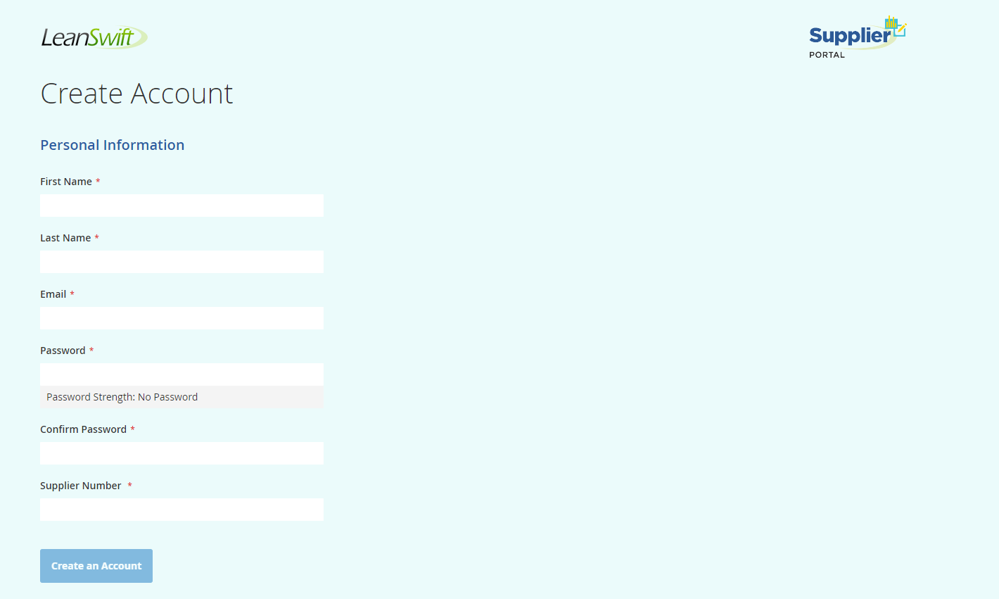</kbd>

Prerequisites to register as supplier

-The supplier needs to be vendor in M3 and the supplier id needs to be in status &#39;20&#39; (approved) in M3.

-Already registered supplier id cannot be registered again.

-A user can either register as supplier or as econnect user and not as both.

Steps to register as supplier.

-Go to Home page and select &#39;Create an Account&#39;

-Based on whether econnect is installed or not , the registration portal appears with/without supplier theme.

-Once the supplier registration is completed and sent for buyer approval,user is notified with message "Thank you for registering with  us. Your request has been sent for review. It may take a few hours or days to receive a response" in the homepage.

<kbd>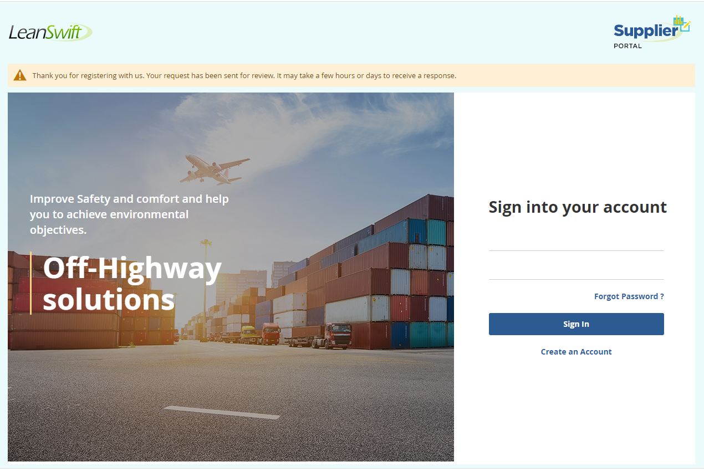</kbd>

**Note** : Once registration is complete, approval request is sent to buyer. Supplier can login only after the buyer has approved the registration request.Supplier will be notified with email regarding the approval/decline of the registration to registered email id.

<b>
 <a href="#table-of-contents">↥ Go to Top</a>
</b>

## Log in

The Homepage/Login page has username and password text fields. It can also be customised to incorporate CAPTCHA.

<kbd>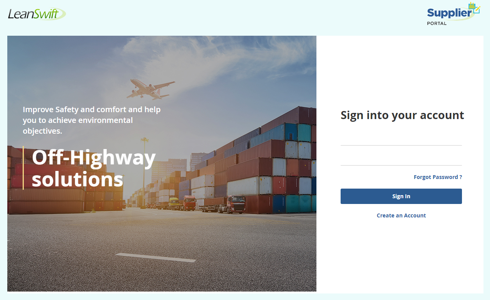</kbd>

The homepage is customised with error messages for empty or incorrect username and password.

<kbd>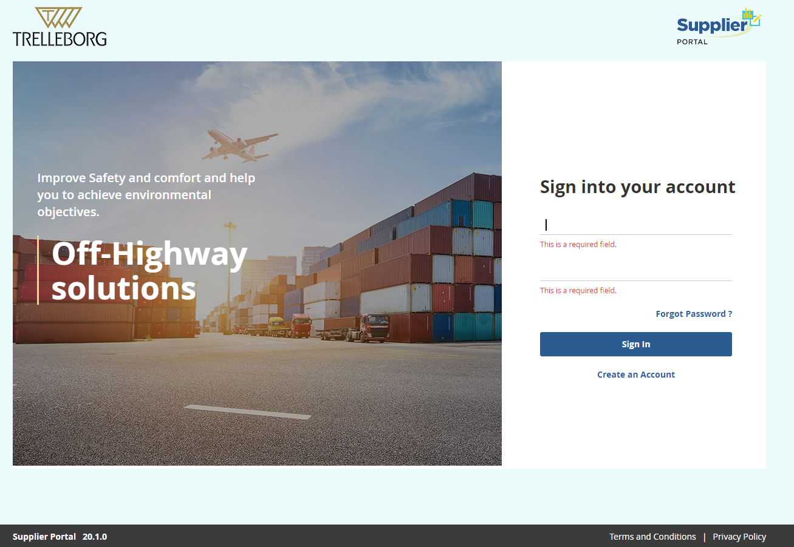</kbd>

<kbd></kbd>

<b>
 <a href="#table-of-contents">↥ Go to Top</a>
</b>

## Forgot Password

To change the password, click on forgot password link and enter the username and captcha and click on Reset My Password. An email will be sent to the registered mail id to reset the password. 

<kbd>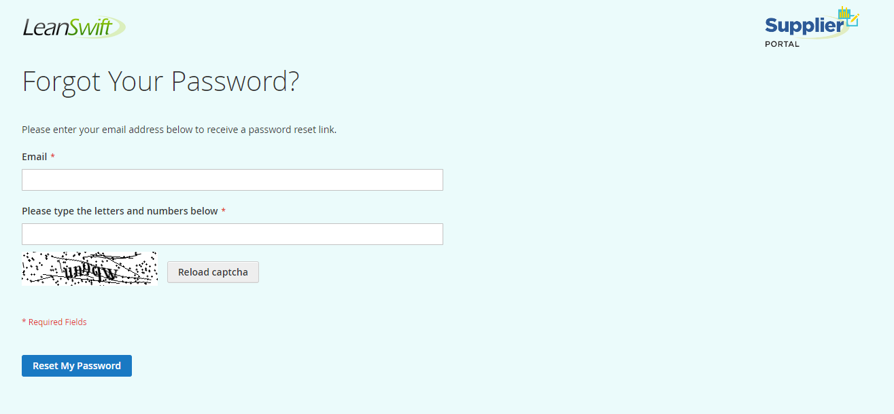</kbd>

<b>
 <a href="#table-of-contents">↥ Go to Top</a>
</b>

## Log out

To Log out click on the profile icon and select sign out. After logging out the page refreshes to home page after 5 seconds.

<kbd>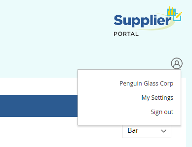</kbd>

<kbd>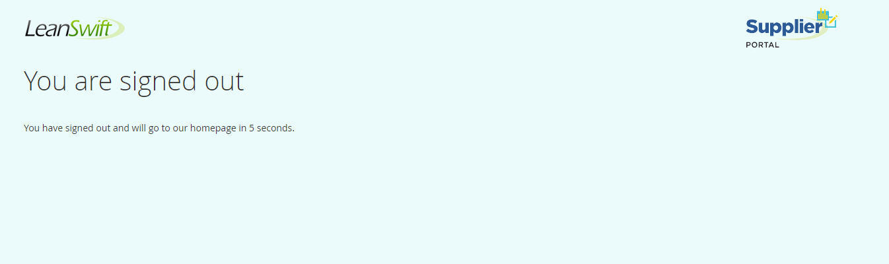</kbd>

<b>
 <a href="#table-of-contents">↥ Go to Top</a>
</b>

## My Settings

Date Format can be modified in this section.The selected date format will be displayed as *Changed Date Format* below the dropdown.

<kbd>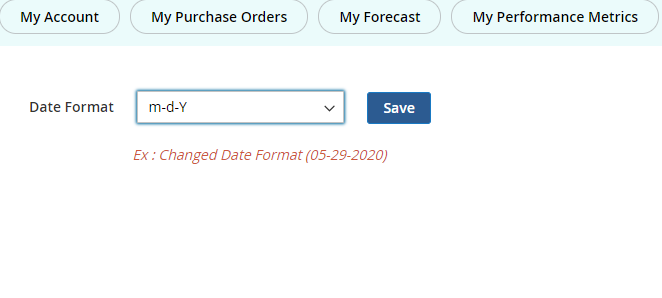</kbd>

<b>
 <a href="#table-of-contents">↥ Go to Top</a>
</b>

## My Account

My Accounts section contains Account information and  communication information of the supplier as well as general information of the buyer.

<kbd>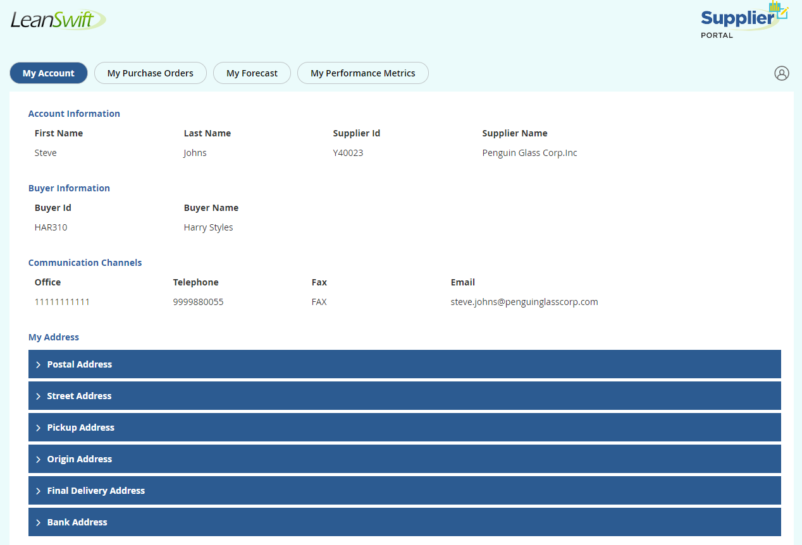</kbd>

The different types of supplier's address such as Postal Address,Street Address,Pickup Address,Origin Address,Final Delivery Address and Bank Address are listed in My Address section.

<kbd>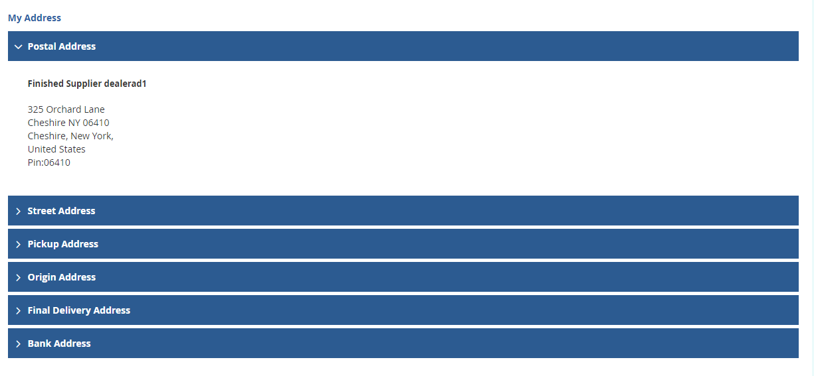</kbd>

<b>
 <a href="#table-of-contents">↥ Go to Top</a>
</b>

## My Purchase Orders

My Purchase Orders section contains all the purchase orders that belongs to the registered supplier.Based on the Purchase order (Normal or Delivery Schedule purchase orders ) indicators will be shown to differentiate.Each purchase order has one or more purchase order lines. Purchase orders are displayed along with Order date,Currency,lowest status among the order lines in a PO. A single purchase order can hold more than 1000 PO lines and it will be displayed in a single page with scroll button.

<kbd>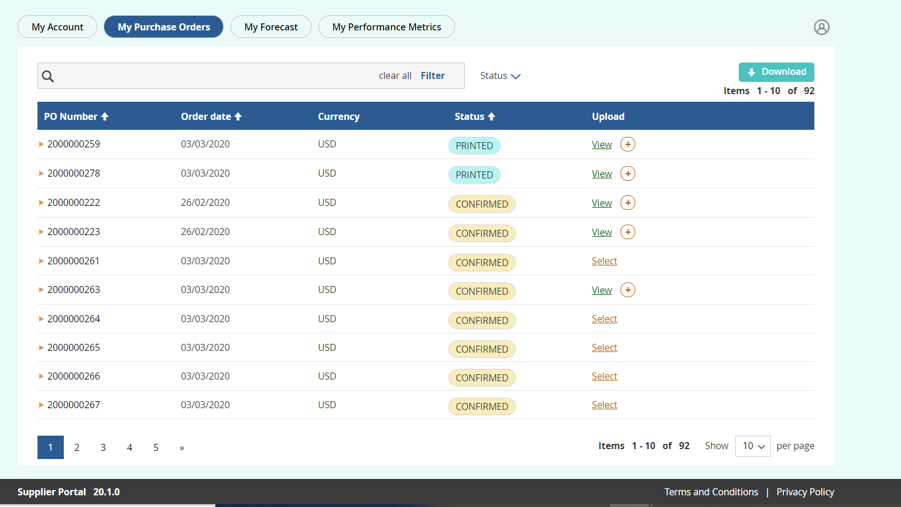</kbd> 

By clicking on the side arrow in a Purchase Order,it expands to display the purchase order lines and related information corresponding to the particular purchase order.The purchase order lines have Line Number, Sub Line Number,Item,Description,Quantity,Confirmed Quantity, Received Quantity,Price, U/M,Confirmed Price, Requested Date , Confirmed Date and Status.
Single select,Multi select or select all of the purchase order lines can be done 

<kbd>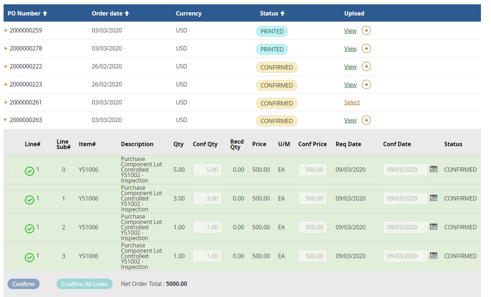</kbd>

### Paginate

Pagination is availabe to show a minimum of 10 PO  to maximum of 40 PO per page.

<kbd>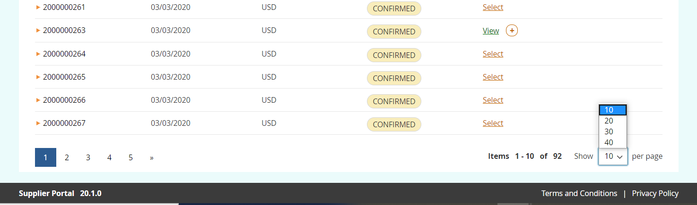</kbd>

### Sort

PO number, Order date and Status can be sorted ascendingly or descendingly. By default the POs are sorted based on the status.Single click on arrow mark (symbol pointing downwards) determines that the sort is descending. Double click on the arrow mark (symbol pointing upwards) determine the sort is ascending.

<kbd>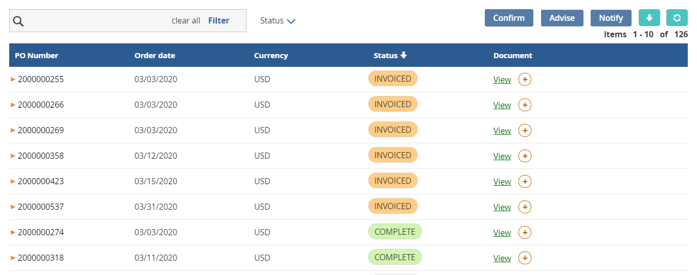</kbd>

### Search

Search bar is available above the purchase order table . The Search bar is a text field and it also accomodates Filter and clear all buttons. It provides a simple text search functionality and can be used to search both at PO and PO line levels.

### Filter

Based on admin configuraion,the filter can perform Equals,Less Than, Greater Than,Contains,Starts With,Ends With. The number of filters that can be applied is configured in admin. The filters works in AND operation (if two filters f1 and f2 are added , the results will have POs that satisify f1 AND f2)

<kbd>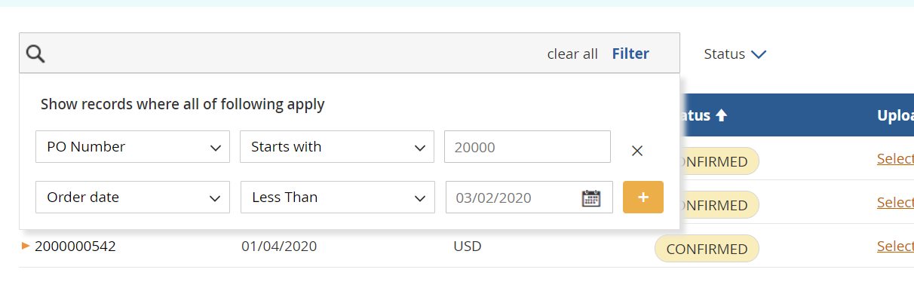</kbd>

### Filter on Status

The Status filter is a dropdown having a list of PO status such as READY, PRINTED, ACTIVATED, SCHEDULED, CONFIRMED, ASN, NOTIFIED, RECEIVED, PARTIAL REJECTED, COMPLETE, PARTIAL INVOICED, INVOICED.

<kbd>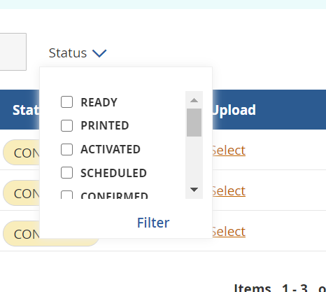</kbd>

### Download as CSV

Download button is present in top right corner of the My Purchase Order page and My Forecast page. By default downloads all the data ,When the purchase order/forecast POs are filtered, it downloads the filtered results in CSV format. Downloaded File Name  has pre-defined format, Supplier number with Timestamp of download. For example, Y50001_1578908806.csv.

<kbd>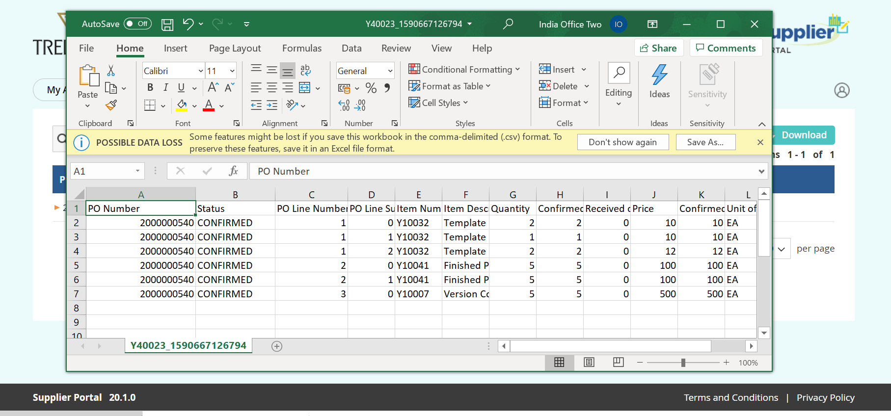</kbd>

### Confirm PO Line

To Confirm a PO line select a single PO line or multiple lines and click on the Confirm button.
Confirming a PO line can be done in two ways
- *Confirm with changes* :
   When a PO line is confirmed with changes, approval request is sent to ION. To confirm a PO line with changes, Change the Conf            Qty/Conf Date/Conf Price an click on confirm button. When Confirm with changes are done, PO Confirm approval request is sent to the      buyer.The PO lines confirmed with changes has indicator with red dot to differentiate with lines confirmed without changes.
   
   <kbd>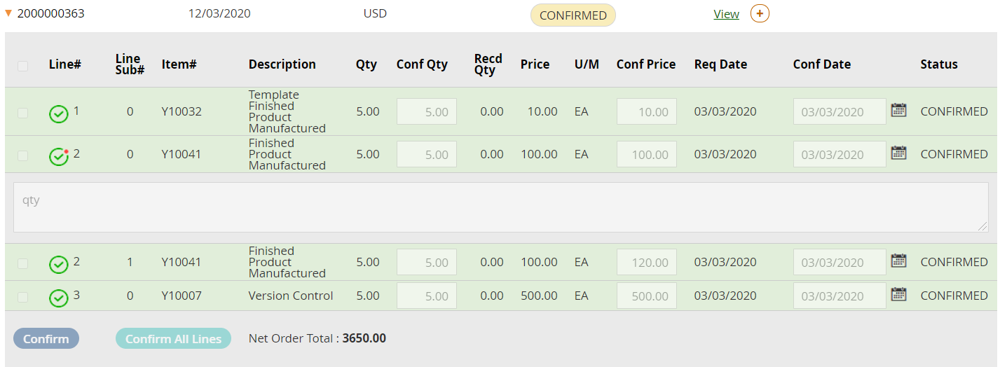</kbd>
   
   When a PO line approval is rejected by the buyer, it is update in the PO line with reject symbol.
   
   <kbd>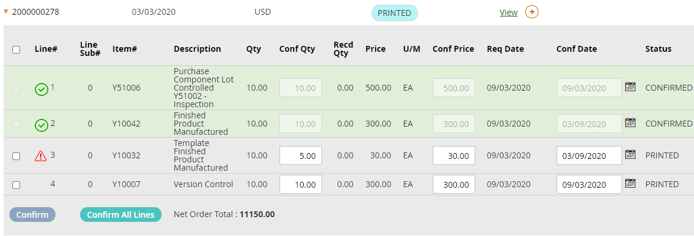</kbd>
   
   When PO line confirm quantity or date or price is modified, a text dialog box appears to add comments. User can add short notes to      track it further. The text box appears for each PO line. When there is no change in conf qty/date/price, the dialog box is not shown.
   
   <kbd>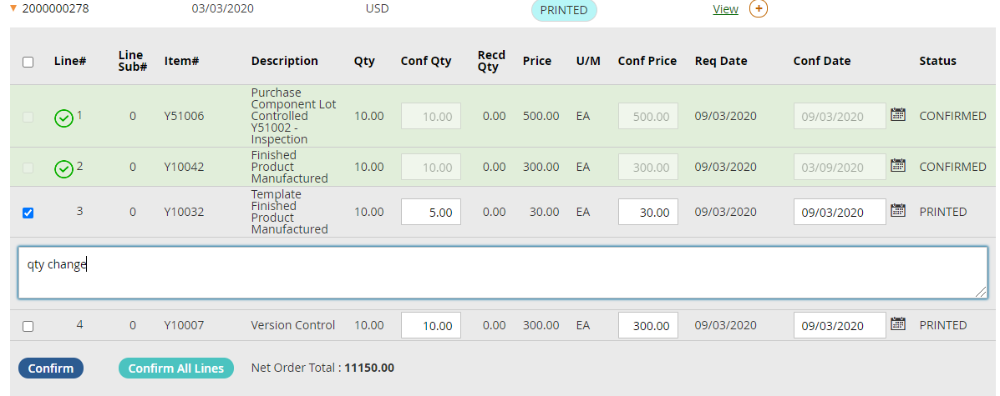</kbd>
  
- *Confirm without changes* :
   To confrim a PO line without changes, keep the conf qty/ conf date/conf price as same as the requested date/price/qty. When a PO line    is confirmed without changes, line is confirmed directly and no 'PO Confirm approval request' is not sent to the buyer. Confirmed        line without any changes has a plain green indicator. 

   <kbd></kbd>
   
 Apart from confirmed and rejected indicators, there is a waiting indicator applied to a PO line before it moves to confirmed state.
 
 <kbd>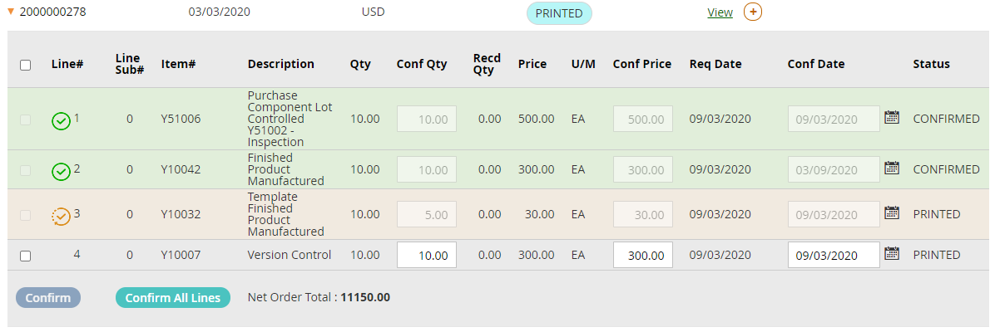</kbd>
 

### Confirm All Lines

When Confirm All Lines is selected , all the purhase order lines in a PO is confirmed with same Confirmed Quantity/Price/Date as the Requested Quantity/Price/Date.

<kbd>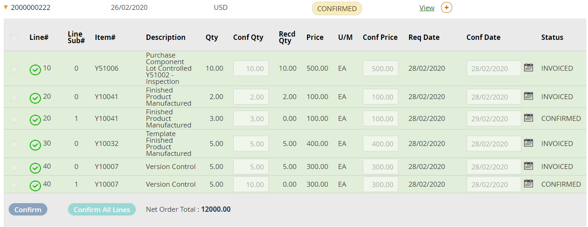</kbd>

### Upload to IDM

To add / view  notes or extra information related to a purchase order, one can upload/download IDM document. To upload a IDM document, click on the select option under Upload secion and upload a document. Document type that can be uploaded is configured in the backend. 

<kbd>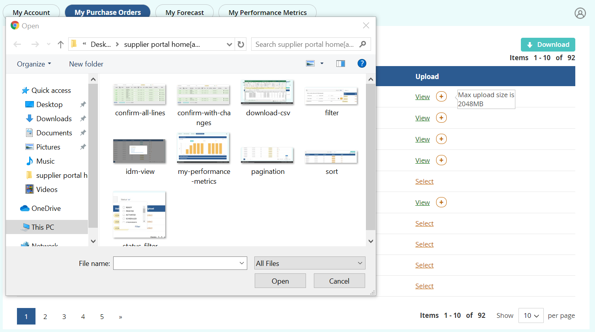</kbd>

To view the document attached for a particular PO, click on the plus symbol. A pop-up is displayed with document uploaded for a particular PO.

<kbd>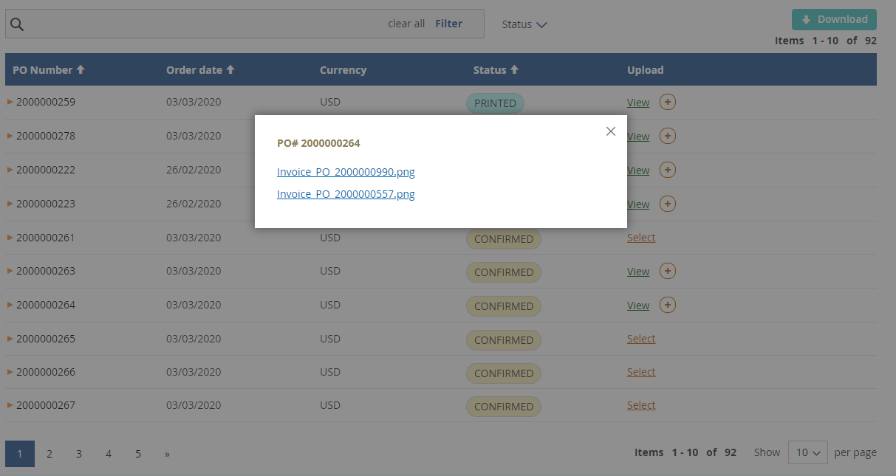</kbd>

<b>
 <a href="#table-of-contents">↥ Go to Top</a>
</b>

## My Forecast

My Forecast page list the Planned purchase orders created via delivery schedules. The Forecast page has the functionalities such as,

-Paginate

-sort

-search

-filter

-filter with status

-download as csv

All these works similar to 'My purchase Orders' page.

<kbd>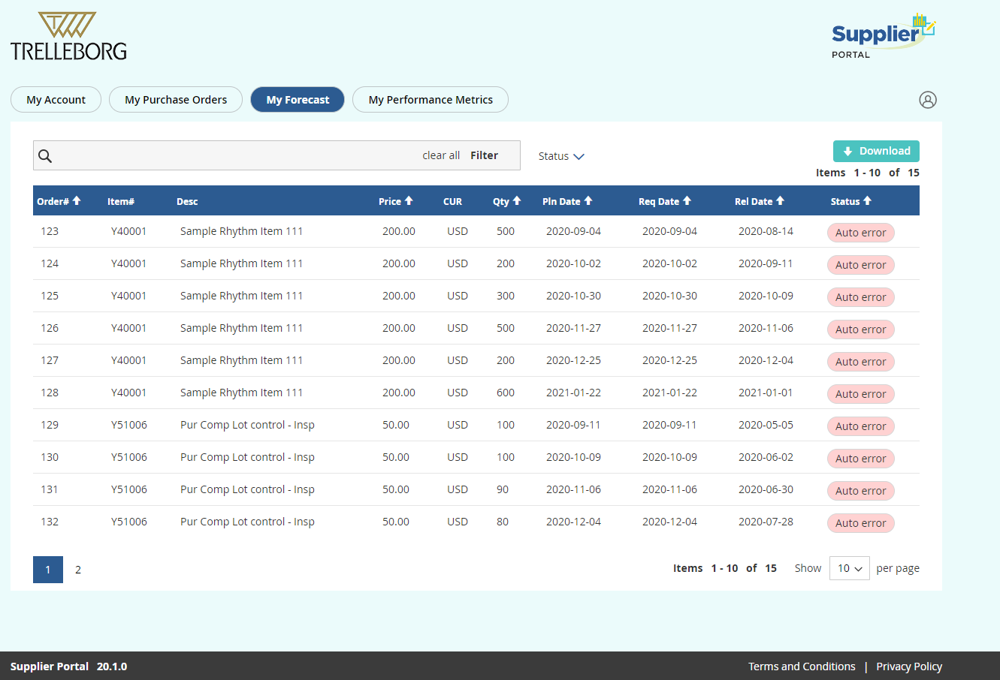</kbd>

<b>
 <a href="#table-of-contents">↥ Go to Top</a>
</b>

## My Performance Metrics

Currently there are three types of graphs supported, they are :
- On-Time Delivery
- Quality - Rejected Inventory
- Purchase Price Variance.
Graph can be viewed either as bar or line chart (selected from dropdown in right corner). The graph can also be plotted for Monthly , Quarterly or yearly based on the options selected.

<kbd>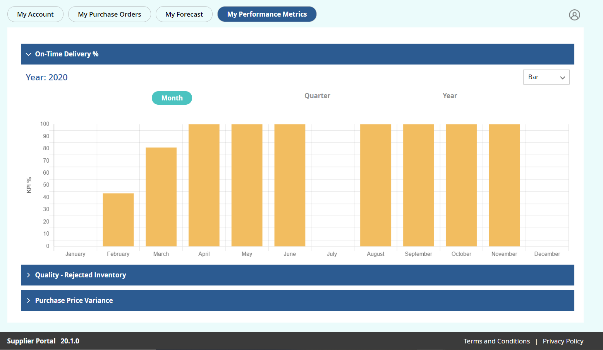</kbd>

### On-Time Delivery %

This metric records the percentage of inbound deliveries received on time, that is *Requested Delivery Date* Vs *Actual Delivery Date*.

<kbd>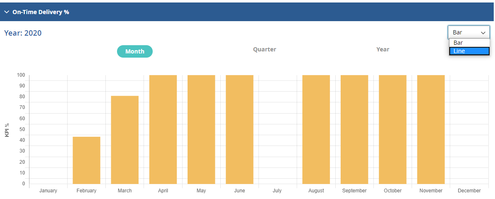</kbd>

### Quality - Rejected Inventory

 This metric records the total number of rejected supplies in a given period of time, that is Rejected Quantity.
 
 <kbd>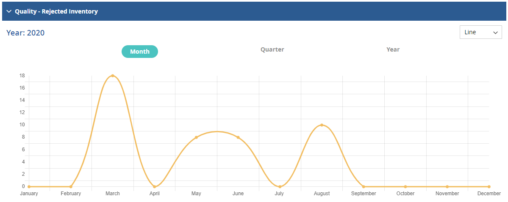</kbd>

### Purchase Price Variance

This metric records the difference between the actual price paid to buy an item and its standard price as confirmed by the supplier, multiplied by the actual number of units purchased (Confirmed Quantity), that is, Confirmed Price Vs Invoiced Price.

<kbd>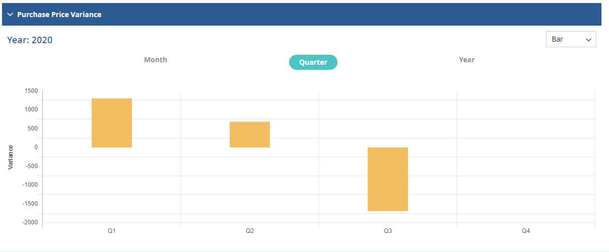</kbd>

<b>
 <a href="#table-of-contents">↥ Go to Top</a>
</b>

