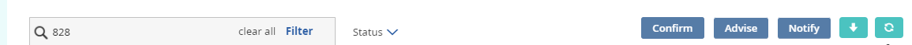
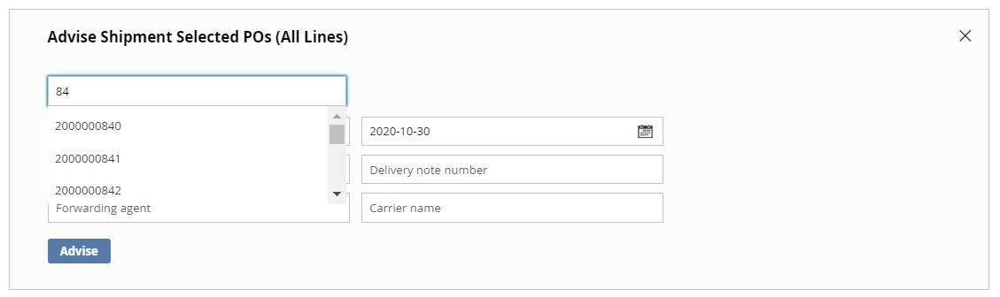
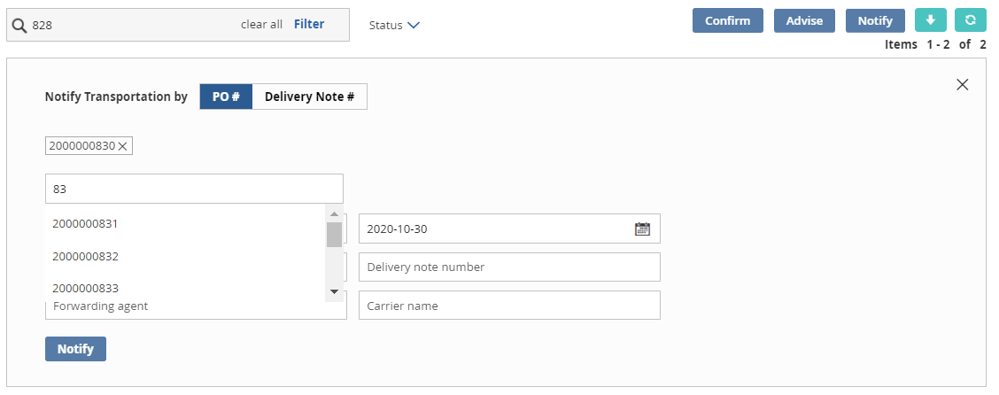

# Version 20.2.0 - Advise/Notify User Manual - User

# Table of contents

- [Version 20.2.0 - Advise/Notify User Manual - User](#version-2020---advisenotify-user-manual---user)
- [Table of contents](#table-of-contents)
- [Advise](#advise)
  - [Advise a PO Line](#advise-a-po-line)
  - [Advise Multiple POs](#advise-multiple-pos)
- [Notify](#notify)
  - [Notify a PO Line](#notify-a-po-line)
  - [Notify Multiple POs](#notify-multiple-pos)
- [Notify Transportation By Delivery Note number](#notify-transportation-by-delivery-note-number)

 

Creation of Purchase order in M3: 

The Supplier can be created in CRS610. 

To create a purchase order, we must go to PPS200, where "New" will be located at the top. 

Need to give the Supplier number, Order Type (M20), Request delivery date, click next. 

Here we can also change the buyer if needed. Click next. 

We will get the line entry page there we need to give the Item Number, Required Quantity and click on “Add”. The line will be added to the PO. To have multiple line we add multiple times with different item numbers and different quantities. 

After adding the line, we need to give the good receiving method (M30) click “Next” until the po is created and actions and “Close”. 

The purchase order is created, to check go to PPS200 and place the PO Number. 

The status of the PO will be “Ready to Print” (15). 

Confirmation of Purchase Order in M3: 

Open PPS250, enter the PO Number and select the PO line. 

Right click -> Related -> Confirmation. 

The line status will change to 35 (Purchase price and delivery date confirmed and approved). 

# Advise

## Advise a PO in M3: 

Open PPS260 give the PO number, the initial status of the line will be 35. 

Select the PO line, Right click -> Related -> Advise. The line status will change to 40 (Advised for shipment). 

Partial Advise: We can also do partial advise for a po line. While we are doing the advise we can reduce the Quantity to advise. 

And shows the remaining qty. 

Then we will get a pop up like “Order Line will be split”. Click next.  

The two lines status will be same i.e., 40 (Advised for shipment).
 
## Advise a PO Line

To Advise PO lines, Select PO lines from the list of POs that are either in Printed or Confirmed status (Based on the settings made in the Magento configuration) and click on &#39;Advise&#39;

<kbd>
 
</kbd>

All the PO lines under a PO can be advised at a time during which &#39;AdviseAll&#39; option is used

Once Advise/Advise All is chosen, &#39;Advise Shipment&#39; window opens at the top, where user can fill in the below information:
1. Planned Pickup Date (past date is not allowed)
2. Departure Date (past date is not allowed)
3. Quantity to Advise (must be valid quantity, less than or equal to confirmed quantity)
4. Forwarding Agent
5. Bill of Lading
6. Delivery Note Number
7. Carrier Name

<kbd>
 
</kbd>

All the above are optional input fields.

Planned Pickup, Departure Date are prefilled with current Date and Quantity to Advise is prefilled with Confirmed Quantity. Quantity to Advise can be changed to a lesser value in case of Partial Advise during which a new Subline number will be created below the actual line.

When &#39;Advise&#39; option is chosen, a Confirmation dialogue box appears on the top

<kbd>
 
</kbd>

The information submitted above for Advise is viewable for each Advised PO Line

<kbd>
 
</kbd>

Clicking on Advise, changes process indicator to &#39;Request is Processing&#39;

<kbd>
 
</kbd>

Once the line/lines are Advised/Advised All, the process indicator is updated and the &#39;Advised Shipment&#39; icon is displayed along with all the information filled in the &#39;Advise Shipment&#39; window below each line.

<kbd>
 
</kbd>

<b>
 <a href="#table-of-contents">↥ Go to Top</a>
</b>

## Advise Multiple POs

This can be used when multiple POs are to be advised.

Click on the Global Advise button on top right.

<kbd>
 
</kbd>

Similar to Advise functionality, &#39;Advise Shipment Selected POs&#39; (All Lines) window opens up with the following options:

1. Planned Pickup Date (past date is not allowed)
2. Departure Date (past date is not allowed)
3. Forwarding Agent
4. Bill of Lading
5. Delivery Note Number
6. Carrier Name

<kbd>
 
</kbd>

All the above are optional input fields.

Additionally there is a &#39;Search PO&#39; dropdown. Users can search order numbers and choose from the dropdown. Only eligible POs will be displayed in the dropdown (POs that can be advised based on the backend configuration).If user searches for a PO and that PO is not eligible for Advise, or if PO number search does not match any results, User is displayed with a message &#39;No results found&#39;.
As the user select’s PO from dropdown, it appears on the top with a &#39;x&#39; mark beside it. Users can select multiple POs and can choose to remove it by clicking on the &#39;x&#39; mark.

_Note that by choosing the PO, all eligible lines of the PO gets advised._

<b>
 <a href="#table-of-contents">↥ Go to Top</a>
</b>

# Notify

## Notify a PO in M3: 

Open PPS270 give the PO Number, the line with advised status will be displayed. 

Select the PO line, Right click -> Related -> Notify. The line status will change to 45 (Notified for transportation). 

## Notify a PO Line

To notify PO lines, Select PO lines from the list of POs that are either in Printed or Confirmed status (Based on the settings made in the Magento configuration) and click on &#39;notify&#39;

<kbd>
 
</kbd>

All PO lines can be notified at once during which &#39;notifyAll&#39; option is used

Once notify/notify All is chosen, &#39;notify Shipment&#39; window opens at the top, where user can fill in the below information:

1. Departure Date (same as Carrier Departure Date in M3, must be valid date, past date is not allowed)
2. Quantity to Notify (must be valid quantity, less than or equal to confirmed quantity)
3. Forwarding Agent
4. Delivery Note Number
5. Carrier Name
6. Arrival Date
7. Bill of Lading

<kbd>
 
</kbd>

All the above are optional input fields.

If data for above fields is already available by &quot;Advised&quot; before, the data is pre-populated and shown here in editable form. Otherwise, empty editable fields are displayed.

Departure Date and Arrival Date are prefilled with current Date and Quantity to Transport is prefilled with available Qty.

When &#39;NotifyAll&#39; option is chosen, a Confirmation dialogue box appears on the top

<kbd>
 
</kbd>

Quantity to Notify can be changed to a lesser value in case of Partial Notify during which a new Subline number will be created below the actual line.

<kbd>
 
</kbd>

The information submitted above for notify is viewable for each Notified PO Line

<kbd>
 
</kbd>

Clicking on notify, changes process indicator to &#39;Request is Processing&#39;

<kbd>
 
</kbd>

Once the line/lines are Notified/Notified All, the process indicator is updated and the &#39;Notified Transportation&#39; icon is displayed along with all the information filled in the &#39;Transport Notification&#39; window below each line.

<b>
 <a href="#table-of-contents">↥ Go to Top</a>
</b>

## Notify Multiple POs

This can be used when multiple POs are to be advised.
Click on the Global Notify button on top right.

<kbd>
 
</kbd>

Similar to Notify functionality, &#39;Notify Transportation By&#39; [PO#/Deliver Note#]  window opens up with the following options:

1. Departure Date (same as Carrier Departure Date in M3, must be valid date, past date is not allowed)
2. Forwarding Agent
3. Delivery Note Number
4. Carrier Name 
5. Arrival Date
6. Bill of Lading

<kbd>
 
</kbd>

Additionally there is a &#39;Search PO&#39; dropdown. Users can search order numbers and choose from the dropdown. Only eligible POs will be displayed in the dropdown (POs that can be Notified based on the backend configuration).If user searches for a PO and that PO is not eligible for Notify, or if PO number search does not match any results, User is displayed with a message &#39;No results found&#39;.
As the user selects PO from dropdown, it appears on the top with a &#39;x&#39; mark beside it. Users can select multiple POs and can choose to remove it by clicking on the &#39;x&#39; mark.
Note that by choosing the PO, all eligible lines of the PO get notified.

<b>
 <a href="#table-of-contents">↥ Go to Top</a>
</b>

# Notify Transportation By Delivery Note number

Notify option appears in the frontend( based on the configuration setting.)

On clicking, &quot;Notify&quot; button on top, &quot;Notify Transportation by&quot; window opens with following input text fields

1. Delivery Note Number
2. Carrier Name
3. Forwarding Agent
4. Bill of Lading
5. Departure Date
6. Arrival Date

<kbd>
 
</kbd>

Note that all the above except &#39;Delivery Note Number&#39; are optional input attributes.

User can enter the Delivery note number and click on Notify. This will notify all the lines with the given Delivery note number.

<b>
 <a href="#table-of-contents">↥ Go to Top</a>
</b>

