# Version 20.2.0 - Advise/Notify User Manual - User

# Advise

## Advise a PO Line

To Advise PO lines, Select PO lines from the list of POs that are either in Printed or Confirmed status (Based on the settings made in the Magento configuration) and click on &#39;Advise&#39;

<kbd>
 
</kbd>

All the PO lines under a PO can be advised at a time during which &#39;AdviseAll&#39; option is used

Once Advise/Advise All is chosen, &#39;Advise Shipment&#39; window opens at the top, where user can fill in the below information:
1. Planned Pickup Date (past date is not allowed)
2. Departure Date (past date is not allowed)
3. Quantity to Advise (must be valid quantity, less than or equal to confirmed quantity)
4. Forwarding Agent
5. Bill of Lading
6. Delivery Note Number
7. Carrier Name

<kbd>
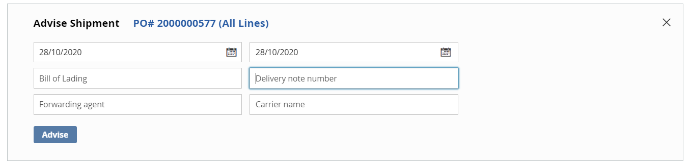 
</kbd>

All the above are optional input fields.

Planned Pickup, Departure Date are prefilled with current Date and Quantity to Advise is prefilled with Confirmed Quantity. Quantity to Advise can be changed to a lesser value in case of Partial Advise during which a new Subline number will be created below the actual line.

When &#39;Advise&#39; option is chosen, a Confirmation dialogue box appears on the top

<kbd>
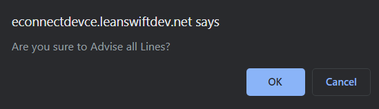 
</kbd>

The information submitted above for Advise is viewable for each Advised PO Line

<kbd>
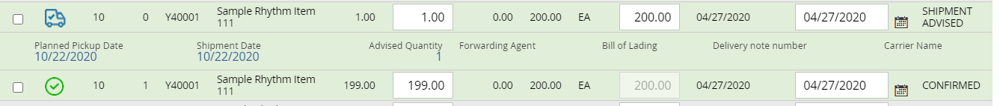 
</kbd>

Clicking on Advise, changes process indicator to &#39;Request is Processing&#39;

<kbd>
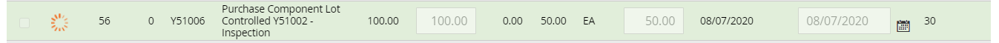 
</kbd>

Once the line/lines are Advised/Advised All, the process indicator is updated and the &#39;Advised Shipment&#39; icon is displayed along with all the information filled in the &#39;Advise Shipment&#39; window below each line.

<kbd>
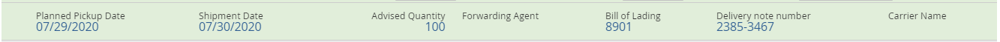 
</kbd>

# Notify

## Notify a PO Line

To notify PO lines, Select PO lines from the list of POs that are either in Printed or Confirmed status (Based on the settings made in the Magento configuration) and click on &#39;notify&#39;

<kbd>
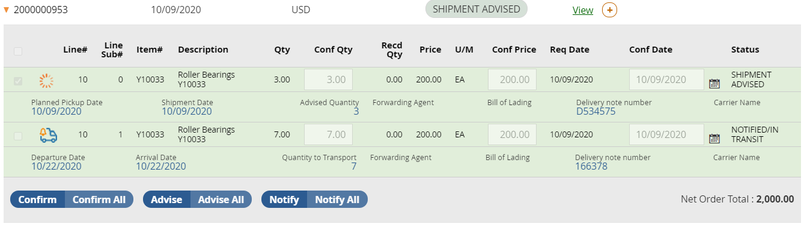 
</kbd>

All PO lines can be notified at once during which &#39;notifyAll&#39; option is used

Once notify/notify All is chosen, &#39;notify Shipment&#39; window opens at the top, where user can fill in the below information:

1. Departure Date (same as Carrier Departure Date in M3, must be valid date, past date is not allowed)
2. Quantity to Notify (must be valid quantity, less than or equal to confirmed quantity)
3. Forwarding Agent
4. Delivery Note Number
5. Carrier Name
6. Arrival Date
7. Bill of Lading

<kbd>
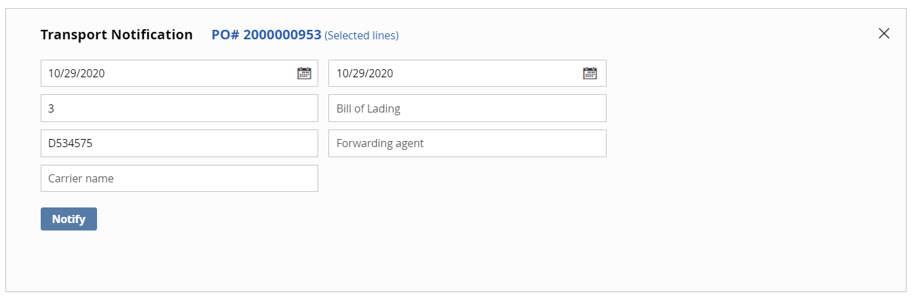 
</kbd>

All the above are optional input fields.

If data for above fields is already available by &quot;Advised&quot; before, the data is pre-populated and shown here in editable form. Otherwise, empty editable fields are displayed.

Departure Date and Arrival Date are prefilled with current Date and Quantity to Transport is prefilled with available Qty.

When &#39;NotifyAll&#39; option is chosen, a Confirmation dialogue box appears on the top

<kbd>
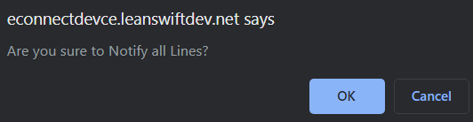 
</kbd>

Quantity to Notify can be changed to a lesser value in case of Partial Notify during which a new Subline number will be created below the actual line.

<kbd>
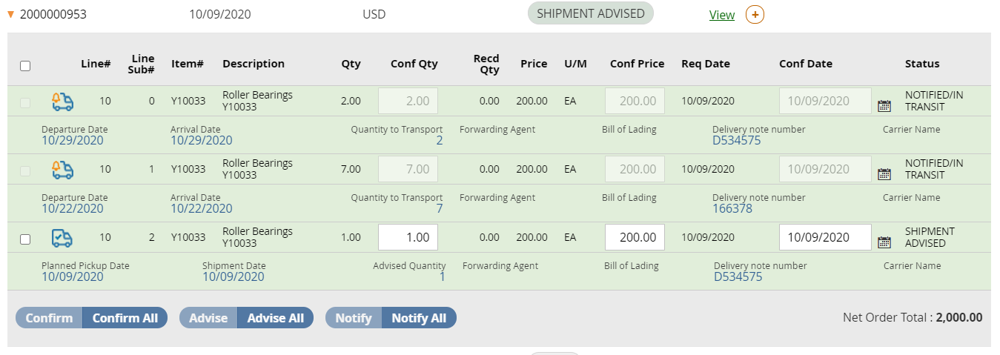 
</kbd>

The information submitted above for notify is viewable for each Notified PO Line

<kbd>
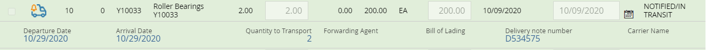 
</kbd>

Clicking on notify, changes process indicator to &#39;Request is Processing&#39;

<kbd>
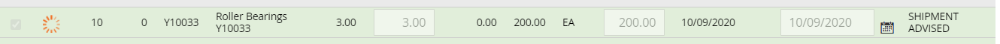 
</kbd>

Once the line/lines are Notified/Notified All, the process indicator is updated and the &#39;Notified Transportation&#39; icon is displayed along with all the information filled in the &#39;Transport Notification&#39; window below each line.

# Notify Transportation By Delivery Note number

Notify option appears in the frontend( based on the configuration setting.)

On clicking, &quot;Notify&quot; button on top, &quot;Notify Transportation by&quot; window opens with following input text fields

1. Delivery Note Number
2. Carrier Name
3. Forwarding Agent
4. Bill of Lading
5. Departure Date
6. Arrival Date

<kbd>
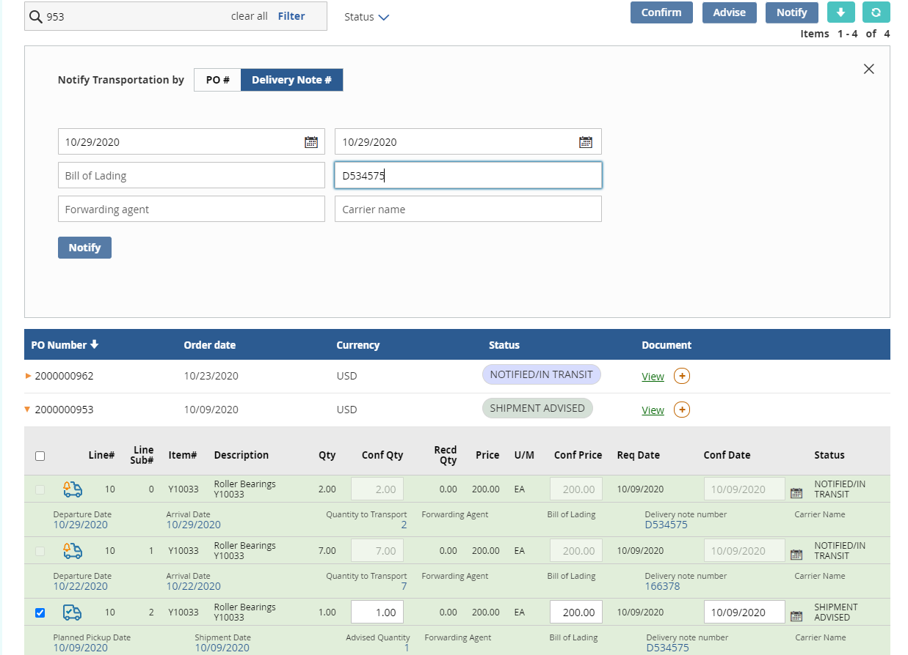 
</kbd>

Note that all the above except &#39;Delivery Note Number&#39; are optional input attributes.

User can enter the Delivery note number and click on Notify. This will notify all the lines with the given Delivery note number.

