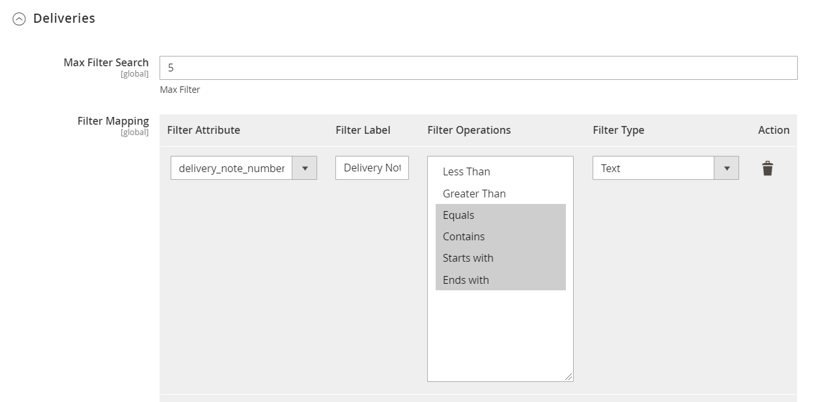

This is a separate add-on and has to be used alongside Supplier Portal.

&#39;My Deliveries&#39; displays all the Delivery notes of the registered supplier. 

For the first time login, Background job will fetch the delivery data from M3. By default, 180 days old deliveries will be pulled from M3. Days can be changed in the backend configuration but max value is 180 days
Once the old data are pulled, Background job will run based on Timestamp

<kbd>
 
</kbd>

Filter settings by which deliveries can be filtered in the portal are to be configured in the admin section under Leanswift > Supplier Portal > Design/Display > Deliveries

<kbd>
 
</kbd>

