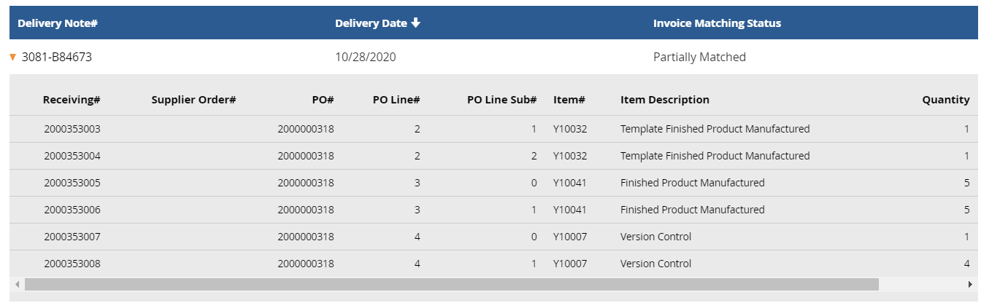
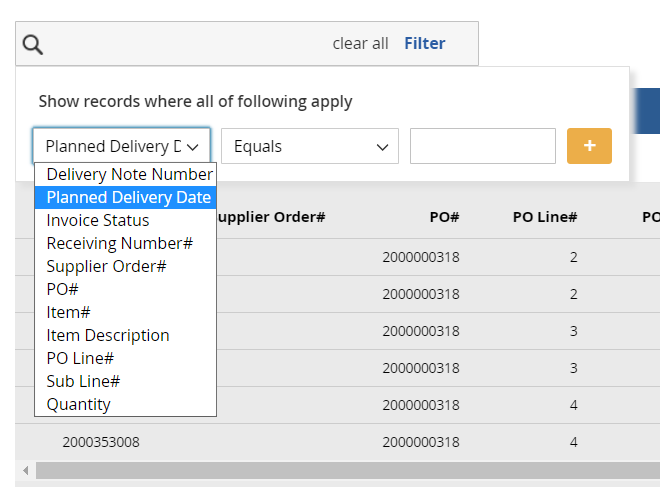
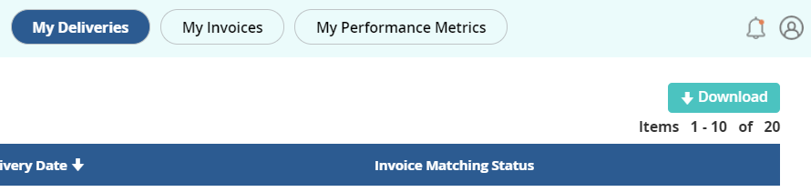

# Version 20.2.0 - Deliveries User Manual - User

My Deliveries displays all the Delivery notes (of order status > 50)

The Delivery head contains the following:

1. Delivery Note Number
2. Delivery Note Date
3. Invoice Matching Status

The Delivery note lines contains the following:

1. Receiving Number
2. Supplier Order number
3. PO Number
4. PO Line Number 
5. PO Sub Line Number
6. Item number
7. Item Description
8. Quantity

<kbd>
 
</kbd>

Deliveries can be filtered based on the above options

<kbd>
 
</kbd>

There is a &#39;Download&#39; option which downloads the entire list of filtered data on this page in CSV format.

<kbd>
 
</kbd>

_Note:_
- _When Delivery date is different but the delivery number is the same , a new record with the same delivery number and a different delivery date is added._
- _When a Delivery name and Delivery date is the same , all the lines advised with the delivery note are added as lines and when we try to advise a line with different planned pick up date , the following error message is shown ‘Shipment Advise is not allowed. Delivery note XXX is already advised with shipment date XXYYMM’_
