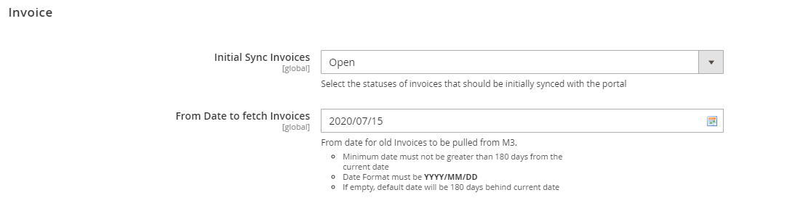
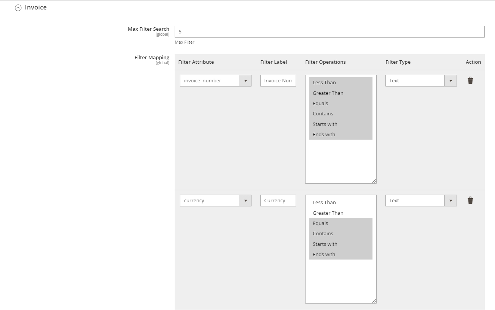

# Version 20.2.0 - User Manual - Invoice - Admin 

This is an Add-on to display a list of Invoices for that Supplier.

<kbd>
 
</kbd>

Admin can choose wether to display All invoices or Open invoices during the first time login of the user 

Invoices upto last 6months will only be displayed for the logged in Supplier. Users can choose the date from which Invoices has to be listed. It can be less than 180 days from the current date but not more than that.
The Date format must be YYYY/MM/DD. If no date is chosen, default date will be 180 days behind current date.

_Note that Logged in User must have permission to view Invoices_

The list of filter options can be configured under Leanswift > Supplier Portal > Design/Display > Invoice

<kbd>
 
</kbd>

During initial load, either open invoices or all the invoices within the configured date are fetched from table FPLEDG . ExportMI/ select query is used. Below are the fields fetched during the initial load.
EPSINO (Invoice number), EPIVDT(invoice date), EPCUCD (currency), EPDUDT(Due date), EPINYR (Invoice year), EPCUAM (foreign currency amount)

Invoices are also updated via Sync.SupplierInvoice bod (Whenever the due date is changed or an invoice is generated, this BOD gets triggered in m3) and Sync.PayableTransaction bod (whenever the amount or status gets changed, this BOD gets triggered in m3 )

