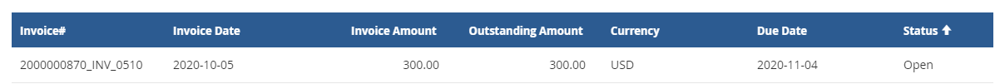
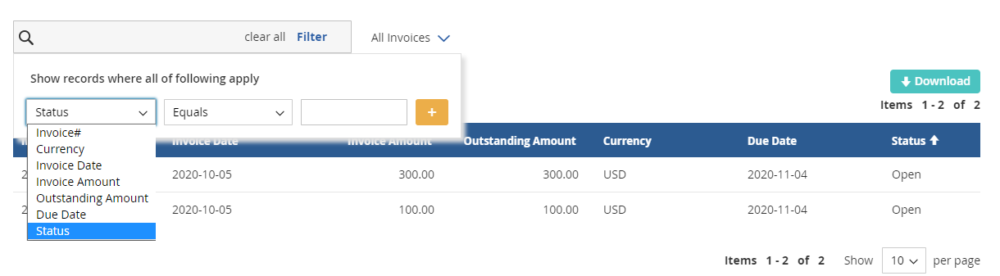
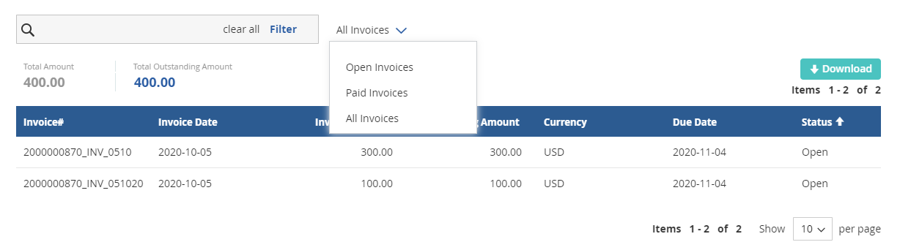

# Version 20.2.0 - User Manual - Invoice - User

This is an Add-on that can be used along side Supplier Portal.
 
My Invoices Displays list of Invoices associated to the logged in supplier

The Invoice page has the following details:

1. Invoice number
2. Invoice Date
3. Invoice amount
4. Due date
5. Currency
6. Outstanding amount
7. Status

<kbd>
 
</kbd>

Users can also filter the invoices based on the above fields.

<kbd>
 
</kbd>

The fields with which users can filter are configurable in the backend.

The list of invoices can be filtered based on the following:

1. All
2. Open
3. Paid

Total Amount and Total Outstanding Amount are displayed on the top of the invoice table.

<kbd>
 
</kbd>

Download option downloads the list of available invoices or based on filtered results
