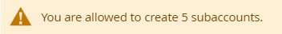

# Version 20.2.0 - User Tracking - User Manual - User

Based on the allowed count set up in the configuration for &#39;Allowed Registered Admin User Count&#39;, A note is displayed to the Admin when &#39;Create Account&#39; is clicked

<kbd>
 
</kbd>

Based on the allowed count set up in the configuration for &#39;Allowed Subaccount Count&#39;, A note is displayed to the user in the &#39;Manage Sub-Account page&#39;.

<kbd>
 
</kbd>

