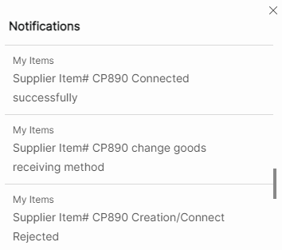
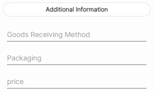
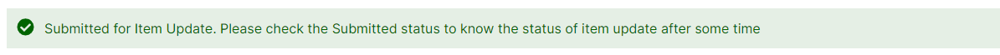
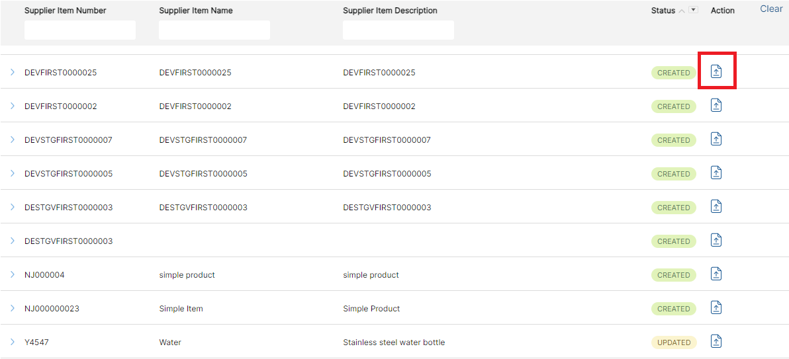

# **Version 23.4.0 - User Manual - Supplier Item Management - User**

# Table of contents

- [Supplier Item Management](#supplier-item-management)
  - [My Items](#my-items)
  - [Create New](#create-new)
  - [Item Update](#item-update)
  - [Stock Update](#stock-update)
  - [Status and Actions](#status-and-actions)
  - [Item Image Upload](#item-image-upload)

# **Supplier Item Management**

This will be an Add-on to Supplier Portal. With this Supplier can create a new supplier item/ M3 Item, Update item and Connect supplier item to existing M3 item. M3 Buyer decides to approve or reject the above requests from the supplier based on the real time data provided by him.

## **My Items**

To enable My Items feature in Supplier Portal, Item Management add on should be installed. My Items has below submenus,

<kbd>
 
</kbd>

1. Create New

2. Item Update

3. Stock Update

4. Refresh

<kbd>

 

</kbd>

## **Create New**

- Supplier can create a new Supplier item or connect Supplier Item with existing M3 item.

- By clicking "Create New" opens a pop-up window on the right side of the page.
- All input fields are mandatory in  **Basic and Purchase information**  section.
- Supplier must provide  **Supplier Item Number, Supplier Item Name and Supplier Item Description**  details under Basic information.
- Valid information must be provided for  **Purchase Price, Purchase Price Qty, Minimum Order Quantity, Order Multiple, Country of Origin, Supplier Stock Qty, Valid From and Valid To**  under Purchase information.

<kbd>
  
</kbd> 
 

<kbd>

</kbd> 

- Once the form is submitted, the supplier item is created successfully with success message as below. Initially, item creation request will be in  **'Submitted'**  status.

<kbd>
 
</kbd>

<kbd>
 
</kbd>

- Verification Task will be assigned to Buyer with all Item Details submitted by Supplier for approval.
- Buyer can approve, connect or reject the approval request.
- If approved, new item will be created in M3 and item will be connected to the supplier in PPS040.

- The status of the supplier item will change to  **'Created'**.

- If the item is rejected, item will not be created in M3.

- The status of the supplier item will change to  **'Rejected'**.

- If Buyer Connects the existing M3 item with supplier,

- The status changes to  **'Connected'**.

- If Item creation process fails in M3,

- The status changes to  **'Failed'**.

<kbd>
 
</kbd>

- Supplier will receive Bell Notification for each item status update with error message or notes sent by Buyer.

<kbd>
 
</kbd>

- Supplier can also create new item with Additional Information attributes. These input fields will be configured by portal admin. Additional Information fields are optional.

<kbd>
 
</kbd>

<b>
 <a href="#toc">↥ Go to Top</a>
</b>

## **Item Update**

- Supplier can update existing supplier item created via portal or Infor M3.
- By clicking on Item update on the right-side bar.

<kbd>
 
</kbd>

- By clicking on Item Update a search bar is opened, the items are searched using Supplier Item Number.

<kbd>
 
</kbd>

- After clicking on "Tick mark" opens the prepopulated form which can be edited.
- Items with status  **Submitted, Failed and Rejected**  cannot be updated.
- An error message is displayed as "Item with status **Submitted/Failed/Rejected** cannot be updated now".

<kbd>
 
</kbd>
 

<kbd>
 
</kbd>
 

<kbd>
 
</kbd>

- Once the page is submitted with additional information (if required), success message is displayed, and Item status will be in  **'Submitted'**  status.

<kbd>
 
</kbd>

- When supplier item is created, all the information is displayed along with additional information which is listed as drop down when 3 dotes were clicked.

<kbd>
 
</kbd>

- Verification Task is assigned to Buyer with item details submitted by supplier for approval.
-  If Buyer approves, item details will be updated in M3 and status changes to  **'Updated'**.

<kbd>
 
</kbd>

- If Buyer rejects, status changes to  **'Rejected'**.
- If Item update process fails in M3, the status changes to  **'Failed'**  with error message displayed in bell notification.

<b>
 <a href="#toc">↥ Go to Top</a>
</b>

## **Stock Update**

- Supplier can update stock of supplier item created via portal or Infor M3, by searching 'Supplier Item Number'.

<kbd>
 
</kbd>

- Stock cannot be updated for Item with status  **Submitted, Failed and Rejected,** an error message is thrown as mentioned below.

<kbd>
 
</kbd>

- When the Stock Update Icon is clicked on the right side of the page, pop up window is opened with a search bar. By searching the Supplier Item Number, displays "Current Stock" (Existing Stock) and revised stock.
- Revised Stock of the supplier item is updated in Realtime.

<kbd>
 
</kbd>
 

<kbd>
 
</kbd>

<kbd>
 
</kbd>

- When same item is searched in Stock Update, revised stock will be displayed in "Current Stock".

<kbd>
 
</kbd>

<b>
 <a href="#toc">↥ Go to Top</a>
</b>

<kbd>
 
</kbd>

## **Status and Actions**

Items can be filtered using  **Supplier Item number, Supplier Item Name, Supplier item Description and Status.**

**Submitted:** When Item Creation request is submitted. Supplier can view the item details by clicking on drop down.

**Created:** When Item Creation request is approved by Buyer. Supplier can view the item details and upload image for Item.

**Connected:** When Item Creation request is connected by Buyer with existing M3 Item. Supplier can view the item details and upload image for Item.

**Updated:** When Item Update request is approved by Buyer. Supplier can view the item details and upload image for Item.

**Rejected:** When Item Creation/ Item Update request is rejected by Buyer. Supplier can edit and re-submit the item request. Verification Task will assign to the Buyer for approval.

**Failed:** When Item Creation/ Item Update request process failed in Infor M3. Supplier can edit and re-submit the item request. Verification Task will assign to Buyer for approval.

<b>
 <a href="#toc">↥ Go to Top</a>
</b>

## **Item Image Upload**

- Item Image can be uploaded by clicking  **Upload** Icon for Items with status as  **Created, Connected and Updated**.

<kbd>
 
</kbd>

- After uploading the image successfully, success message is displayed.

<kbd>
 
</kbd>

<b>
 <a href="#toc">↥ Go to Top</a>
</b>

