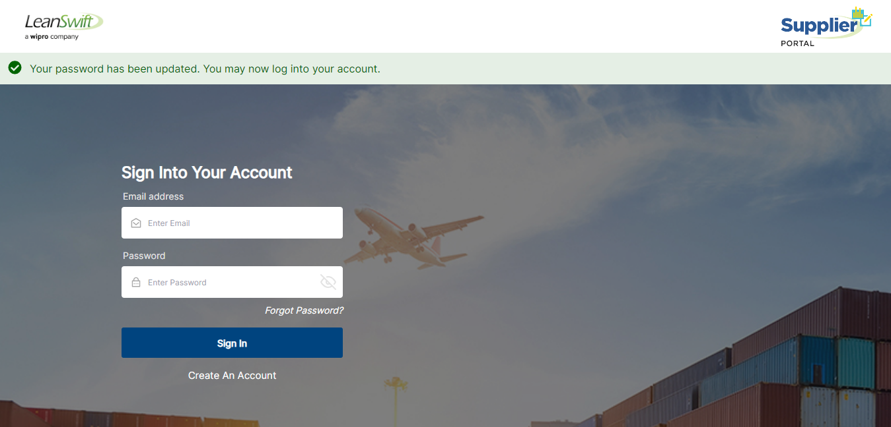

# **Version 23.4.0 - User Manual – Supplier Onboarding**

# **Table of contents**

  1. Supplier Onboarding
  2. Supplier Account Creation
  3. My Documents Task

**Supplier Onboarding**

Supplier portal onboarding allows supplier creation from portal itself. New supplier account is created using the invite sent by buyer to supplier email account.

**Supplier Account Creation**

The supplier will receive an invitation email from Buyer, as shown below, click the **Create Supplier Account** link to create an account.

<kbd>
 
</kbd>

Enter Strong/Very Strong Password (combination of alphanumeric and special characters) and click **Save Password.**

<kbd>
 
</kbd>

Next page will be redirected to supplier user portal with status as **Your password has been updated. You may now log into your account.** Enter your supplier email address and password to **Sign In**

<kbd>
 
</kbd>

Initially, the Supplier can only view **My Information** form and they should submit the **My Information** form with all mandatory fields.

It also includes **Before Getting Started, Review How It Works?** Link, which contains all the further steps about onboarding process. Supplier can use it as reference.

<kbd>
 
</kbd> 

<kbd>
 
</kbd>

<kbd>
 
</kbd>

Freight Terms, Payment Terms, Delivery Method, Monitoring Class, Delivery Terms and Packaging Terms are language specific fields. Based on the language chosen, these filed values must be selected.

You can add up to three references and they are optional.

Clicking on Submit button brings a confirm popup and click 'OK' button to start onboarding process.

<kbd>
 
</kbd>

<kbd>
 
</kbd>

**My Documents Task**

Supplier can view **My Documents** (next to 'My Information') after submitting the My Information form.

<kbd>
 
</kbd>

Click the 'checkbox' in upper right near the bell icon to see a list of required documents to be uploaded.

Do not click Mark Complete until document is uploaded for each task listed in check box.

The list of tasks available is based on the workflow created in ION.

<kbd>
 
</kbd>

Enter the **Document Name** for each required document and upload the required documents.

<kbd>
 
</kbd>

Click the **checkbox** and Click the **Mark Complete** button for each document you uploaded. Then click **Proceed** button.

<kbd>
 
</kbd>

Repeat above two steps for other documents listed in Check box.

Next, the buyer will review your My Information form and documents. If the buyer has any changes or additional information required, a notification message appears in bell icon. Click to review message and resubmit my information as required.

<kbd>
 
</kbd>

As tasks are approved in M3, document task list will also be removed from the checkbox icon.

Once your registration is complete, you will receive a confirmation email and a bell icon notification that you have been onboarded as a new supplier.

<kbd>
 
</kbd>

<kbd>
 
</kbd>

