# **Version 23.4.0 - Advise/Notify User Manual - User**

# Table of contents

- [Advise](#advise)
- [Notify](#notify)
- [Notify Transportation by Delivery Note number.](#notify-transportation-by-delivery-note-number)

# **Advise**

## **Advise a PO Line**  

- To Advise PO lines, Select PO lines from the list of POs that are either in Printed or Confirmed status (Based on the configuration in the Leanswift Settings in Magento) and click on 'Advise' button on the right side. 

<kbd>
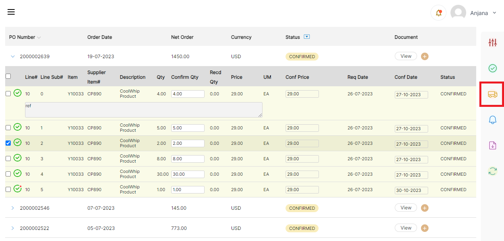 
</kbd>

- 'Advise All' can be performed when the PO is selected at the header level.

All PO lines will be selected and applicable to do advise. Click Advise button.

<kbd>
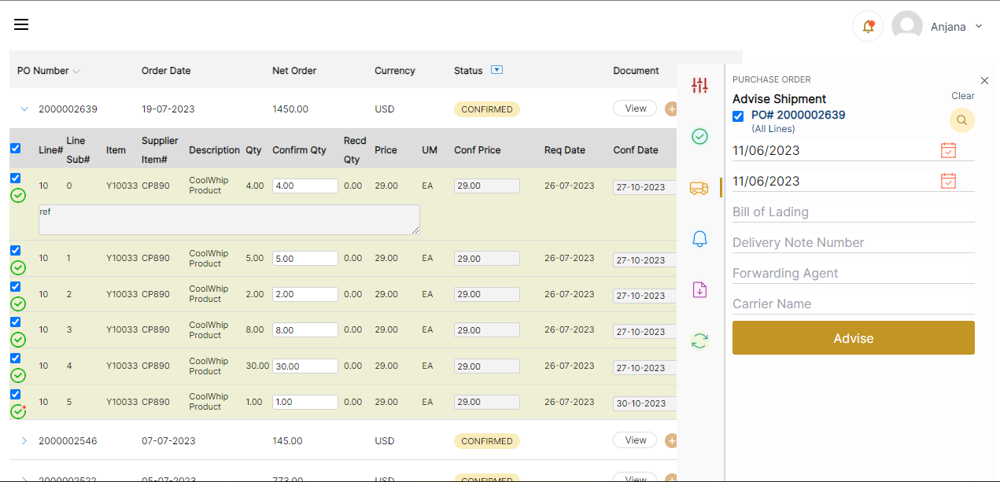 
</kbd>

- 'Advise Shipment' window opens at right side of the panel, selected PO number is displayed, and user can fill in the below information: 

  1. Planned Pickup Date (past date is not allowed) 
  2. Departure Date (past date is not allowed) 
  3. Quantity to Advise (must be valid quantity, less than or equal to confirmed quantity) 
  4. Forwarding Agent 
  5. Bill of Lading 
  6. Delivery Note Number 
  7. Carrier Name 

<kbd>
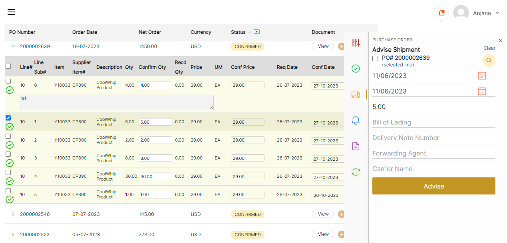 
</kbd>

- All the above are optional input fields. 
- Planned Pickup, Departure Date are prefilled with current Date and Quantity to Advise is prefilled with Confirmed Quantity.  
- Quantity to Advise can be reduced in case of Partial Advise, then a new Subline number will be created below the actual line. 
- When we advise all lines in PO, then Confirmation dialogue box appears on the top. 

<kbd>
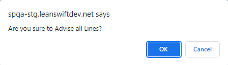 
</kbd>

- Once confirmed, status indicator changes from Printed/Confirmed to 'Request is Processing' 

<kbd>
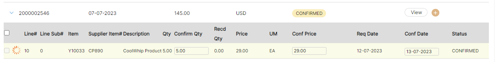 
</kbd>

- The information submitted above for Advise is viewable for each Advised PO Line

<kbd>
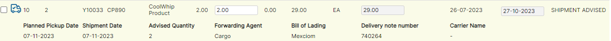 
</kbd>

- Once the line/lines are Advised/Advised All, the process indicator is updated, and the 'Advised Shipment' icon is displayed along with all the information filled in the 'Advise Shipment' window below each line. 

<kbd>
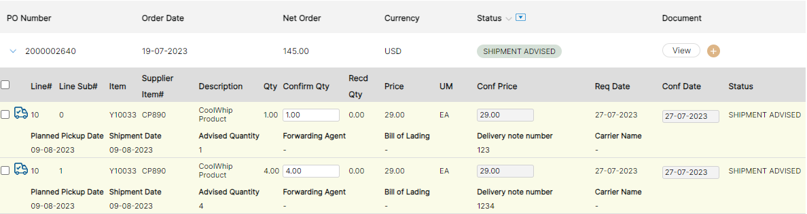 
</kbd>

<b>
<a href="#toc">↥ Go to Top</a>
</b>

## **Advise Multiple POs**  

- This can be used when multiple POs are to be advised at a time.
- Click on the Advise button (with "Truck Icon") on right side of the page

<kbd>
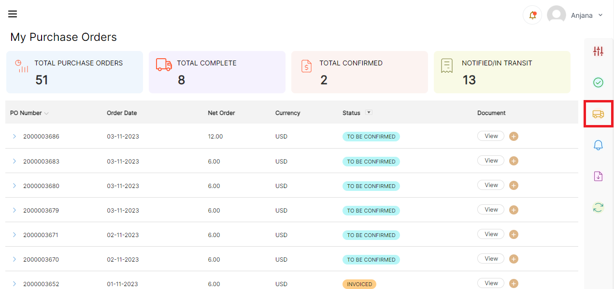 
</kbd>

- Click Advise button, pop-up 'Advise Shipment Selected POs' (All Lines) window opens with the following options: 

  1. Planned Pickup Date (past date is not allowed) 
  2. Departure Date (past date is not allowed) 
  3. Forwarding Agent 
  4. Bill of Lading 
  5. Delivery Note Number 
  6. Carrier Name 

<kbd>
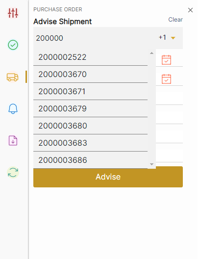 
</kbd>

All the above are optional input fields. 

- There is a 'Search PO' dropdown. Users can search purchase order numbers and choose from the dropdown.  

<kbd>
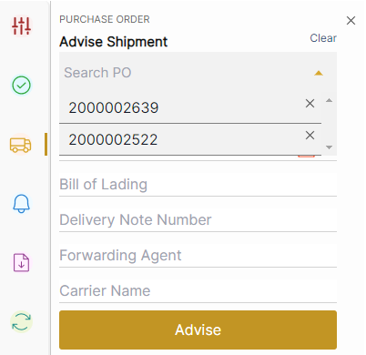 
</kbd>

- Only eligible POs will be displayed in the dropdown (POs that can be advised based on the backend configuration).  
- If user searches for a PO and that PO is not eligible for Advise, or if PO number search does not match any results, User is displayed with a message 'No results found'. 
-  As the user select's PO from dropdown, it appears in the right side of the search bar in a dropdown with a 'x' mark beside it. Users can select multiple POs and can choose to remove it by clicking on the 'x' mark. 

_Note that by choosing the PO, all eligible lines of the PO get advised._ 

**Creation of Purchase order in M3:**  

- The Supplier can be created in CRS620. 
- To create a purchase order, we must go to PPS200, where "New" will be located at the top. 
- Need to give the Supplier number, Order Type (M20), Request delivery date, click next. 
- Here we can also change the buyer if needed. Click next. 
- We will get the line entry page there we need to give the Item Number, Required Quantity and click on "**Add**". The line will be added to the PO. Multiple PO lines can be added with different items and quantity.
- After adding the line, we need to give the good receiving method (M30) click "Next" until the po is created and click Actions then "Close". 
- The purchase order is created, to check go to PPS200 and place the PO Number. 
- The status of the PO will be "Ready to Print" (15).  Print the PO using PPS600 and now status changes to "Printed" (20).

**Confirmation of Purchase Order in M3:**  

- Open PPS250, enter the PO Number and select the PO line. 
- Right click -> Related -> Confirmation. 
- The line status will change to 35 (Purchase price and delivery date confirmed and approved). 

**Advise a PO in M3:**  

- Open PPS260 give the PO number, the initial status of the line will be 35. 
- Select the PO line, Right click -\> Related -\> Advise. The line status will change to 40 (Advised for shipment). 
- **Partial Advise** : We can also do partial advise for a po line by decreasing the Quantity to advise. 
- And shows the remaining qty. 
- Then we will get a pop up like "Order Line will be split". Click next.  
- The line status will be same i.e., 40 (Advised for shipment). And a subline will be added with the status 35(Confirmed).  

<b>
<a href="#toc">↥ Go to Top</a>
</b>

 

# **Notify**

## **Notify a PO Line**  

- To notify PO lines, Select PO lines from the list of POs that are either in Printed or Confirmed status or Shipment Advised (Based on the settings made in the Magento configuration) and click on 'Bell' Icon on the right side of the page. And click on "Notify."

<kbd>
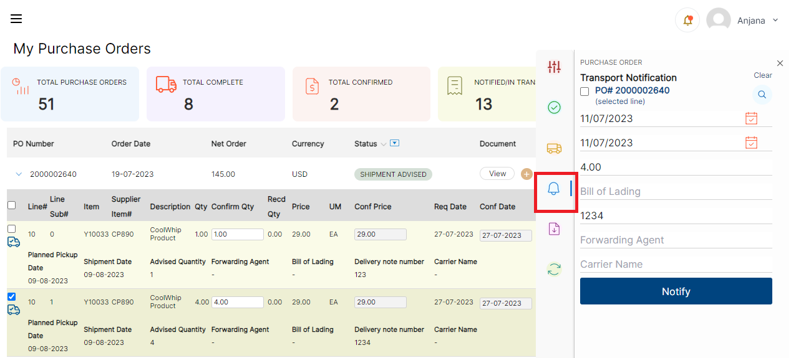 
</kbd>

- Once notify is chosen, 'notify Shipment' window opens at right side of the page, where user can fill in the below information: 

    1. Departure Date (same as Carrier Departure Date in M3, must be valid date, past date is not allowed) 
    2. Quantity to Notify (must be valid quantity, less than or equal to confirmed quantity) 
    3. Forwarding Agent 
    4. Delivery Note Number 
    5. Carrier Name 
    6. Arrival Date 
    7. Bill of Lading 

<kbd>
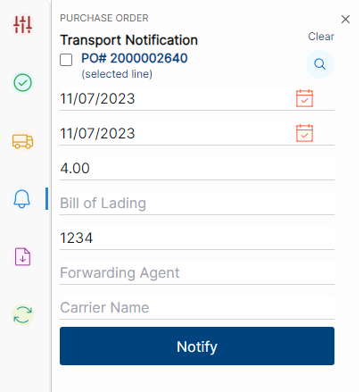 
</kbd>

- All the above are optional input fields. 
- If data for above fields is already available in "Advised" line, the data is pre-populated and shown here in editable form. Otherwise, empty editable fields are displayed. 
- Departure Date and Arrival Date are prefilled with current Date and Quantity to Transport is prefilled with available Qty. 
- When 'Notify' option is chosen, a Confirmation dialogue box appears on the top.

<kbd>
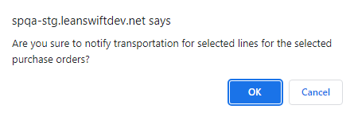 
</kbd>

- Quantity can be reduced in case of Partial Notify, then new Subline number will be created with "Shipment Advise" status below the actual line. 

<kbd>
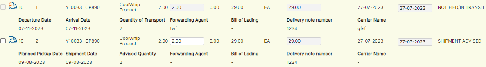 
</kbd>

- The information submitted above for notify is viewable for each Notified PO Line 
- Clicking on notify, changes process indicator to 'Request is Processing'. 

<kbd>
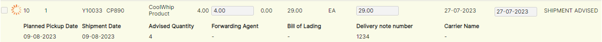 
</kbd>

- Once the line/lines are Notified/Notified All, the process indicator is updated, as 'Notified Transportation' icon is displayed along with all the information filled during Notify 

<kbd>
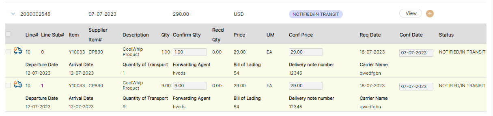 
</kbd>

<b>
 <a href="#table-of-contents">↥ Go to Top</a>
</b>

## **Notify Multiple POs**  

- This can be used when multiple POs are to be Notified. Click on the Notify button on the right side of the page with "Bell Icon" 

<kbd>
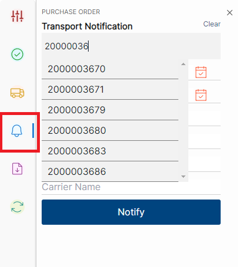 
</kbd>

- Similar to Notify functionality, 'Notify Transportation By PO window opens with the following options: 

  1. Departure Date (same as Carrier Departure Date in M3, must be valid date, past date is not allowed) 
  2. Forwarding Agent 
  3. Delivery Note Number 
  4. Carrier Name 
  5. Arrival Date 
  6. Bill of Lading 

<kbd>
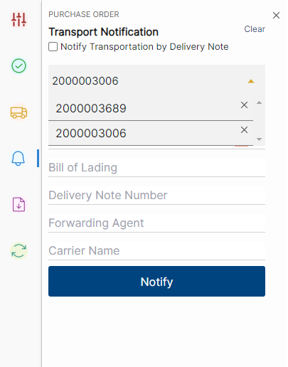 
</kbd>

- Additionally, there is a 'Search PO' dropdown. Users can search order numbers and choose from the dropdown.
- Only eligible POs will be displayed in the dropdown (POs that can be Notified based on the backend configuration).
- If user searches for a PO and that PO is not eligible for Notify, or if PO number search does not match any results, User is displayed with a message 'No results found'.
- As the user selects PO from dropdown, it appears on the right side of the search bar in a dropdown with a 'x' mark beside it. Users can select multiple POs and can choose to remove it by clicking on the 'x' mark.

_Note that by choosing the PO, all eligible lines of the PO get notified._

**Notify a PO in M3:**  

- Open PPS270 give the PO Number, the line with advised status will be displayed. 
- Select the PO line, Right click -\> Related -\> Notify. The line status will change to 45 (Notified for transportation). 

<b>
 <a href="#table-of-contents">↥ Go to Top</a>
</b>

# **Notify Transportation by Delivery Note number.**

- Notify option appears in the frontend (based on the configuration setting.) 
- Transport Notification pop-up has "Notify Transportation by Delivery note number" check box, once enabled following input text fields are displayed.
  1. Delivery Note Number 
  2. Carrier Name 
  3. Forwarding Agent 
  4. Bill of Lading 
  5. Departure Date 
  6. Arrival Date 
- Once the check box is selected, search PO box will be disabled.

<kbd>
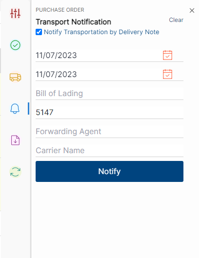 
</kbd>

_Note that all the above except 'Delivery Note Number' are optional input attributes._
_User can enter the Delivery note number and click on Notify. This will notify all the PO lines which has the same given Delivery note number_. 

<b>
 <a href="#table-of-contents">↥ Go to Top</a>
</b>

