# Version 23.4.0_PWA - User Manual - Admin User

# Table of contents

- [Overview](#overview)
  - [Organization of the Manual](#organization-of-the-manual)
  - [Architecture](#architecture)
  - [Features](#features)
  - [Point of Contact](#point-of-contact)
- [User Guide for Portal Admin](#user-guide-for-portal-admin)
  - [Log in](#log-in)
  - [Configuration](#configuration)
    - [Menus](#menus)
    - [eConnect-base Configuration](#econnect-base-configuration)
      - [Service Configuration](#service-configuration)
      - [Basic Data Configuration](#basic-data-configuration)
      - [Authentication](#authentication)
    - [Supplier Portal Settings](#supplier-portal-settings)
      - [General Configuration](#general-configuration)
      - [ION WorkFlow Configuration](#ion-workflow-configuration)
      - [Metrics Display](#metrics-display)
      - [On-Time Delivery KPI](#on-time-delivery-kpi)
      - [Email templates](#email-templates)
      - [Email Templates for PWA](#email-templates-for-pwa)
      - [Cron](#cron)
    - [Design Settings](#design-settings)
      - [General](#general)
      - [Frontend Color Codes](#frontend-color-codes)
      - [Logo Image size](#logo-image-size)
      - [Status Mapping](#status-mapping)
        - [PO Status Mapping](#po-status-mapping)
        - [Forecast Status Mapping](#forecast-status-mapping)
      - [Filter and Search](#filter-and-search)
        - [Purchaseorder Filter Mapping](#purchaseorder-filter-mapping)
        - [Forecast Filter Mapping](#forecast-filter-mapping)
    - [Supplier Invite](#supplier-invite)
    - [Exit System](#exit-system)
  - [Additional Functionality](#additional-functionality)
    - [IDM](#idm)

# Overview

LeanSwift Supplier Portal is a supplier self-service web portal that enables efficient online communication with vendors. It is seamlessly integrated with Infor M3 Cloudsuite via ION. Supplier Portal helps automate the entire purchase-to-pay process for the customer.

## Organization of the Manual

This manual describes the admin configuration of LeanSwift Supplier Portal for Infor M3 and is meant for the Portal administrator.

To view the user manual for Portal Users, click [here](./usermanual-supplierportal-user.md).

## Architecture

The solution is built on **Magento Open Source Platform**. It interacts with **Infor M3** via **Infor ION Platform**. **RabbitMQ** is the message queue used to send/receive messages to/from ION.

<kbd>
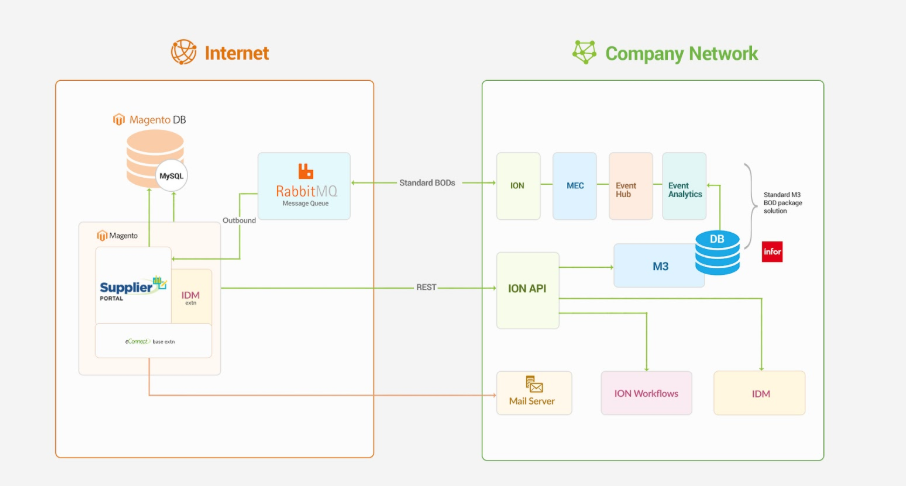
</kbd>

## Features

- Registration and Login
- Account
  - My Information 
  - My Documents 
- My Settings
  - Date Format
- My Purchase Orders 
  - View Purchase Orders 
  - Search/Filter/Sort on Purchase Orders 
  - Confirm Purchase Orders  
  - Download Purchase Orders Information 
  - Upload documents into IDM against Purchase Orders 
     - This is available ONLY if additional functionality for IDM integration is included as part of license  
- My Forecasts 
  - View Purchase Forecasts 
  - Download Forecast Orders Information 
  - Search/Filter/Sort on Purchase Forecasts 
- My Performance Metrics 
  - View Delivery Performance metrics 
  - View Quality metrics based on Rejected quantity 
  - View Purchase Price Variance metrics 
- Admin 
  - Settings and Configuration for Portal and M3 Connection 

## Point of Contact

This document and the software it describe are provided by Wipro Limited. For additional information regarding support, licensing, functionality etc. please contact Wipro Limited, via contact form at http://www.leanswift.com or email [scott.roush@wipro.com](mailto:scott.roush@wipro.com).

# User Guide for Portal Admin

## Log in

Log in to Magento Admin Panel using the URL provided to you and the applicable user credentials.

<kbd>
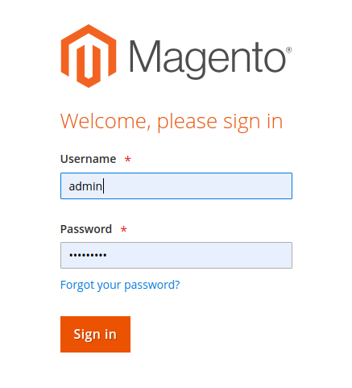
</kbd>

## Configuration

The Admin Panel allows the portal administrator to view and edit configuration required for the Supplier Portal to function.

### Menus

To access the LeanSwift Configuration, click the LeanSwift tab.

<kbd>
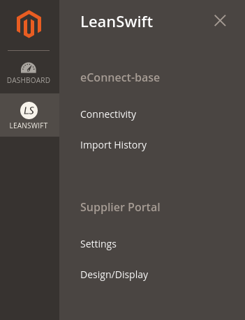
</kbd>

### eConnect-base Configuration

LeanSwift eConnect-base extension is a prerequisite for Supplier Portal. Provides the connectivity to eLink and/or Infor systems with the use of a generic function which decides whether to call the eLink / ION APIs based on the M3 Connection Protocol chosen in the backend

#### Service Configuration

Section enables the user to configure M3 communication and general usability related settings.

**M3 Connection Protocol** 

Option to choose the M3 communication protocol either ION or eLink.eConnectBase Pick the option which is choosen.

**API Service URL** 

Service URL is entered here.

**Email**

Define the e-mail address that will be used for error alerts if exceptions were to occur in
Magento and when any transaction in eConnect is not working due to service being down

**Error Email Template** 

Enabled an option to choose an error email template can map over the customized template here.

**Debug/Log data** 

Select &quot;Yes&quot; to log additional information in Magento. This setting is recommended in development but should be set to &quot;No&quot; in production to improve performance.

<kbd>
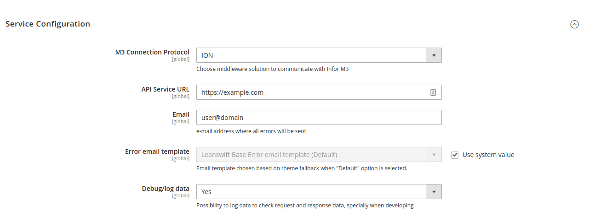
</kbd>

 

<b>
 <a href="#table-of-contents">↥ Go to Top</a>
</b>

#### Basic Data Configuration

The **Basic Data** section of the configuration contains key settings needed for the various transactions.

<kbd>
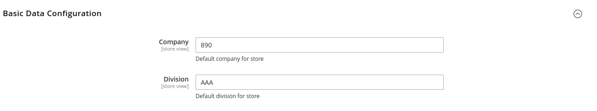
</kbd>

#### Authentication

The section used to configure the connection parameters for connecting M3. An option to test the connection between Portal and M3.

<kbd>
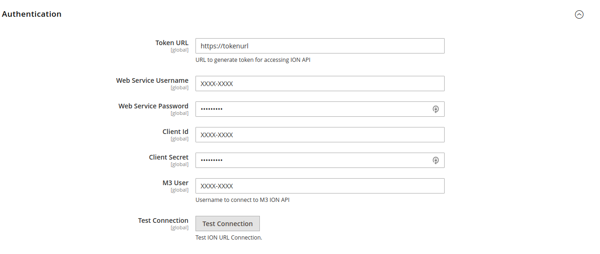
</kbd>

 

<b>
 <a href="#table-of-contents">↥ Go to Top</a>
</b>

### Supplier Portal Settings

Supplier portal related settings and design configurations can be made here.
 
#### General Configuration

The section provides configuration for the company details and other settings which are associated for the behaviour
 of the system.

**Company Name** 

Provide the company name.

**Company Email** 

Alerts will be sent to the company email.

**Debug/Log data** 

Select &quot;Yes&quot; to log additional information in Magento. This setting is recommended in development but should be set to &quot;No&quot; in production to improve performance.

<kbd>
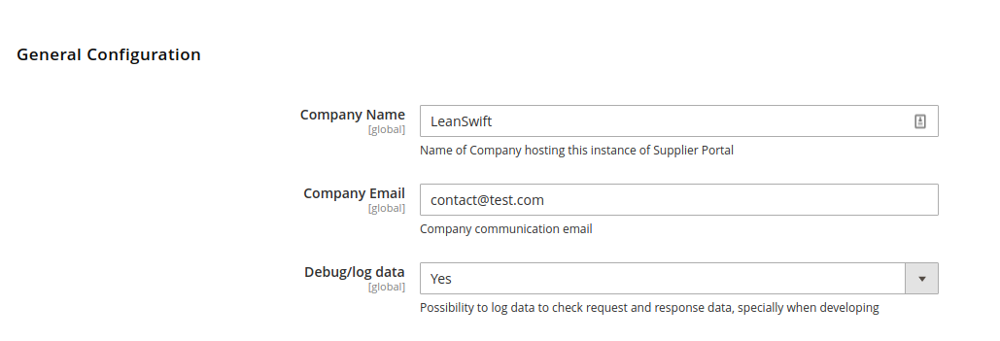
</kbd>

 

<b>
 <a href="#table-of-contents">↥ Go to Top</a>
</b>

#### ION WorkFlow Configuration

The section provides the configuration for connecting M3 workflow from the Supplierportal.

**API Service Url**

Provide the URL for ION processing workflows.

**Logical Id**

Provide application logical ID of Infor OS.

**Test Connection**

Provide an option to test connectivity between application to ION workflow.

<kbd>
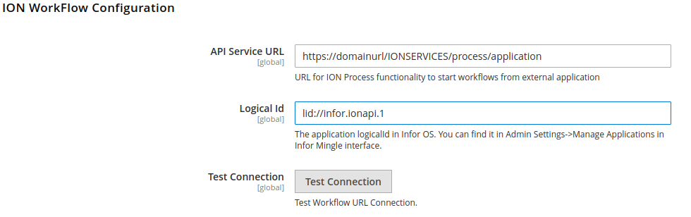
</kbd>
 

**PO Confirmation**

- The section different setting configuration for sending purchase order to M3.
- The confirmation of PO in M3 can be done in PPS250.

**Realtime API call for Confirm PO**

- When Realtime API call for confirm po is set to “YES” then the confirmed PO’s will be M3 by Realtime.
- If it is set to “NO” the confirmed PO will push to M3 via cron.

 
 <blockquote>
    How to enable in cron 
    <a href="#cron">refer here</a>
 </blockquote>

**Activate approval process for Confirm PO**

When an option set to "Yes", Changes made in Purchase order will push to M3 for Buyer approval. If it is set to
 "No" the changed purchase order pushed to M3 via Realtime or CRON based on setting above.
 
 
**Workflow Name**

Provide workflow name for PO confirmation.

This will be shown when activate approval process for confirm PO is set to true

<kbd>
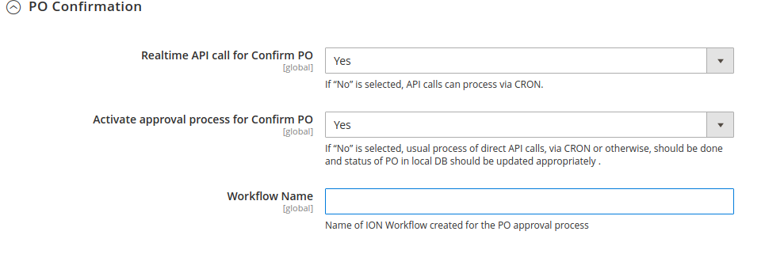
</kbd>
 

**Registration**

The section provides control the Supplier registration approval from system or M3.

 **Enable Register Approval**
 
 - When setting made to "Yes" the supplier registration approval will be send to M3 via workflow and approval process
 can be made in M3.
 - By checking in tasks, the approval procedure is carried out in M3
 - It is set to "No" approval process can be made in Portal Admin.

**Workflow Name**

- Provide workflow name for Supplier registration will trigger an Name of ION Workflow created for the portal approval process.

This will be shown when Enable Register Approval set to “YES”.

**Request to be approved by**

Provide an option to select request approver.
    
  - **Buyer**:  The Registration approval will be sent to buyer which is associated for the Supplier in CRS620 while creating the supplier.
    
  - **Authorized User**:  This also same as the Buyer the request approval will be sent to the Authorized User. In CRS620/E-Purchase details page we can see the Authorized User.
    
  - **Generic Admin User**:  When we select Generic Admin User it will enable another option Admin User Name in that we need to give the User name so that the request approval will go the particular Admin User.
    
  - **Generic Admin Group**:  When this option is selected it will enable another option Admin Group Name in this will be giving the group name which in created in Infor M3. 

To view the groups, click on Profile icon->User Management->Users->Manage->Groups.

This will be shown when Enable Register Approval set to true
  
<kbd>
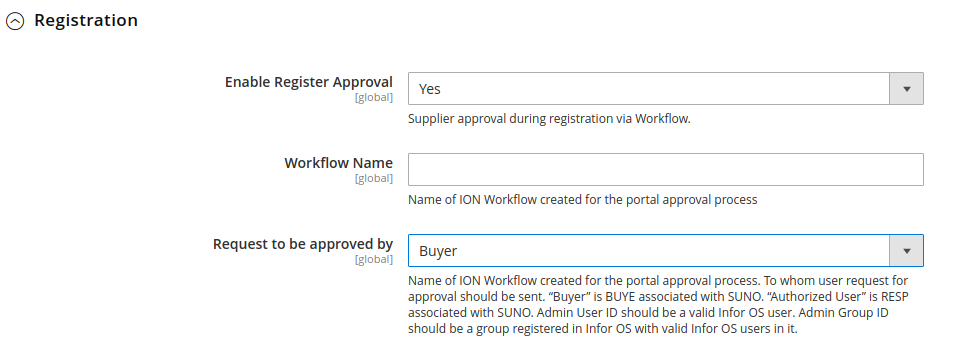
</kbd>

 

<b>
 <a href="#table-of-contents">↥ Go to Top</a>
</b>

  

#### Metrics Display

The section contains configuration for list of different metrics to display ot not.

**On-Time Delivery**

- If it set to “YES” it will display the on-time delivery to the Supplier.
- If it is set to “NO” the on-time delivery will be disabled.

This metric records the percentage of inbound deliveries received on time, that is Requested Delivery Date Vs Actual Delivery Date.
 
 
**Quality: Rejected Inventory**

- If it set to “YES” it will display Quality: Rejected Inventory to the supplier.
- If it is set to “NO” the Quality: Rejected Inventory will be disabled.

This metric records the total number of rejected supplies in a given period of time.

**Purchase Price Variance**

- If it set to “YES” it will display Purchase Price Variance to the supplier.
- If it is set to “NO” the Purchase Price Variance will be disabled.

This metric records the difference between the actual price paid to buy an item and its standard price as confirmed by the supplier, multiplied by the actual number of units purchased (Confirmed Quantity), i.e Confirmed Price Vs Invoiced Price	

<kbd>
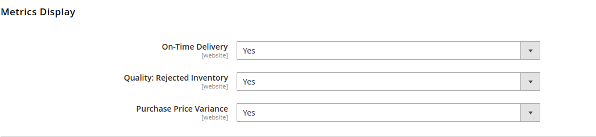
</kbd>
 

<b>
 <a href="#table-of-contents">↥ Go to Top</a>
</b>

#### On-Time Delivery KPI

The section provides calculation configuration for On-Time Delivery	metric Graph.

**Allowed delivery delay in days**

Provide an allowed delay delivery days to calculate graph.

**Y-Axis Date Field Criteria**

Provide an option to select a parameter, Based on selection the graph will be plotted.

- Receipt Date
- Confirmed Date
- Planning Date

<kbd>
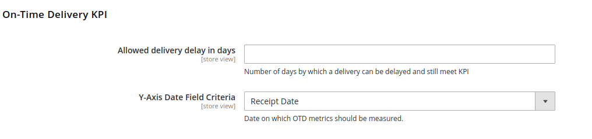
</kbd>
 

<b>
 <a href="#table-of-contents">↥ Go to Top</a>
</b>

#### Email templates

- The section provides an option to choose email templates for each operation. It is configured with default email
 templates. When a new email template is created it can be changed over here. 
- Navigate to Leanswift -> Supplier portal ->Settings -> switch to Main website ->Email Templates 
- Email templates have two different templates: 
  - **Header Template**: It has header email template (Default) and Supplier Portal PWA Invite mail. Based on the supplier requirement they can configure.
  - **Footer Template**: It has Footer email template (Default)  and Supplier Portal PWA Invite mail. Based on the supplier requirement they can configure.

<kbd>
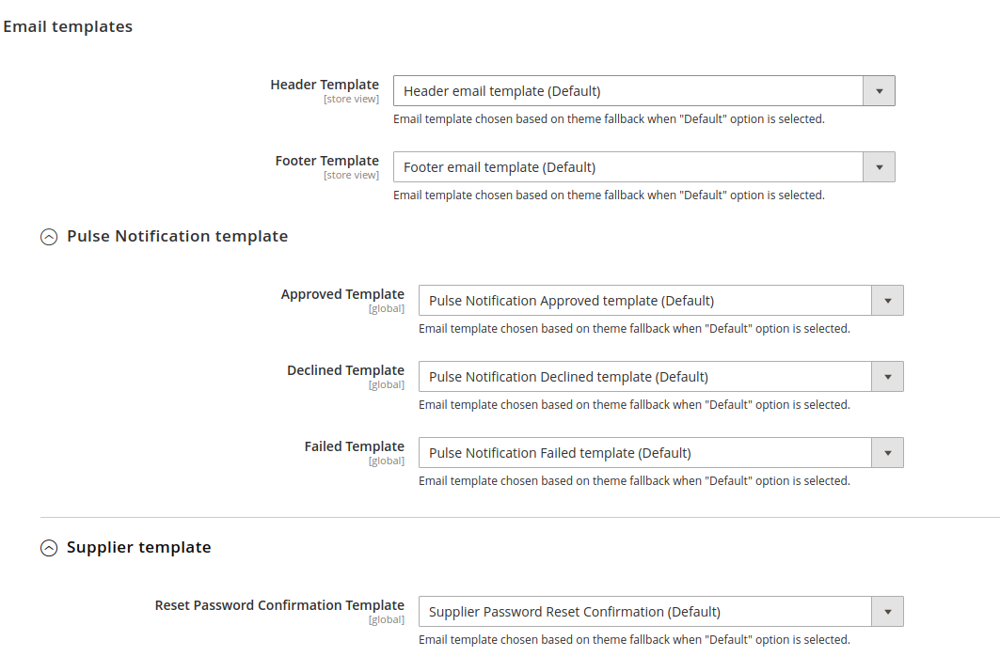
</kbd>

#### **Email Templates for PWA**

**Steps to create PWA Supplier Invite Email Templates.**

1. Go to marketing -\> Email Templates
2. Click on "Add New Template" button.
3. Select "Supplier Portal Invite Mail" from template button and click on "load template" button.
4. Give template name "Supplier Portal PWA Invite Mail". **(Note: you can use custom email template name also, but template name should be unique)**

<kbd>
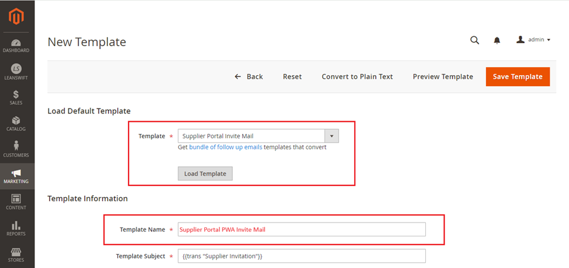
</kbd>

5. Search below line from template content and replace it.

**search line:** \<a href="{{var this.getUrl($store,'supplierportal/account/create/',[\_query:[token:$invite\_token],\_nosid:1])}}" target="\_blank"\>{{trans "Create Supplier Account"}}\</a\>
 **replace line:** \<a href="{{var this.getUrl($store,'create-password/')}}{{trans "?token=%token" token=$invite\_token}}" target="\_blank"\>{{trans "Create Supplier Account"}}\</a\>

**Note:** If you are using external url for your pwa app than replace with pwa\_app\_line with your pwa app url.
**replace line:** \<a href="pwa\_app\_url/create-password/{{trans "?token=%token" token=$invite\_token}}" target="\_blank"\>{{trans "Create Supplier Account"}}\</a\>

<kbd>
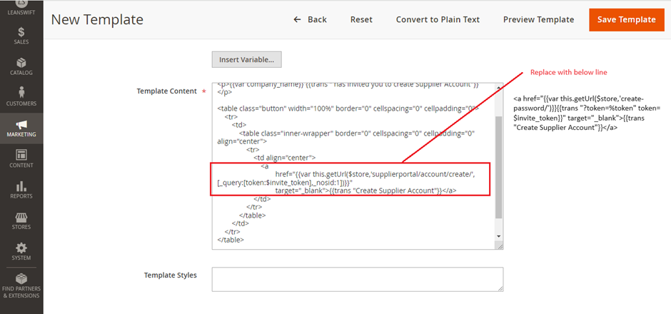
</kbd>

5. After changing above line save template.

**Steps to create PWA Supplier Reset Password Email Templates.**

1. Go to marketing -\> Email Templates
2. Click on "Add New Template" button.
3. Select "Supplier Password Reset Confirmation" from template button and click on "load template" button.

<kbd>
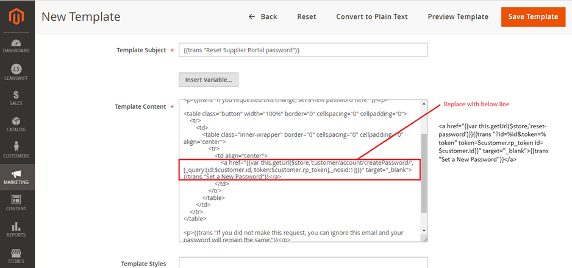
</kbd>

4. Give template name "PWA Supplier Password Reset Confirmation" and search below line from template content and replace it. **(Note: you can use custom email template name also, but template name should be unique)**

**search line:** \<a href="{{var this.getUrl($store,'customer/account/createPassword/',[\_query:[id:$customer.id, token:$customer.rp\_token],\_nosid:1])}}" target="\_blank"\>{{trans "Set a New Password"}}\</a\>
**replace line:** \<a href="{{var this.getUrl($store,'reset-password')}}{{trans "?id=%id&token=%token" token=$customer.rp\_token id=$customer.id}}" target="\_blank"\>{{trans "Set a New Password"}}\</a\>

**Note:** If you are using external url for your pwa app than replace with pwa\_app\_line with your pwa app url.
**replace line:** \<a href=" pwa\_app\_url/reset-password/{{trans "?id=%id&token=%token" token=$customer.rp\_token id=$customer.id}}" target="\_blank"\>{{trans "Set a New Password"}}\</a\>

<kbd>
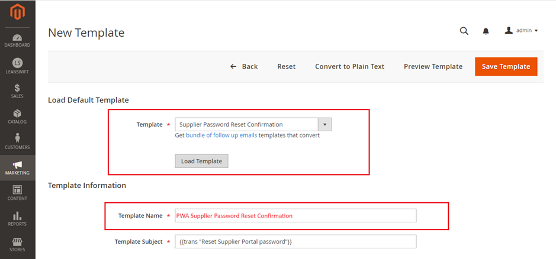
</kbd>

5. After changing above line save template.

**Steps to configure email templates**

1. Go to store -\> configuration and select website from scope.

<kbd>
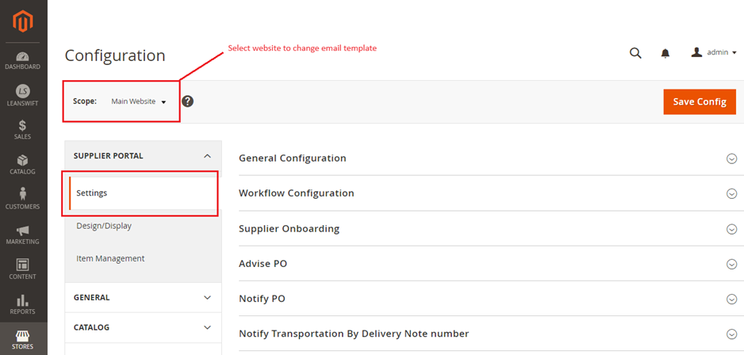
</kbd>

2. Go to Supplier Portal -\> Setting -\> Email Templates -\> Supplier Template.
3. Select Supplier Portal PWA Invite Mail (newly created Supplier portal pwa invite email template) from Supplier invite email dropdown.
4. Select PWA Supplier Password Reset Confirmation (newly created pwa supplier password reset email template) from Reset Password Confirmation Dropdown.

<kbd>
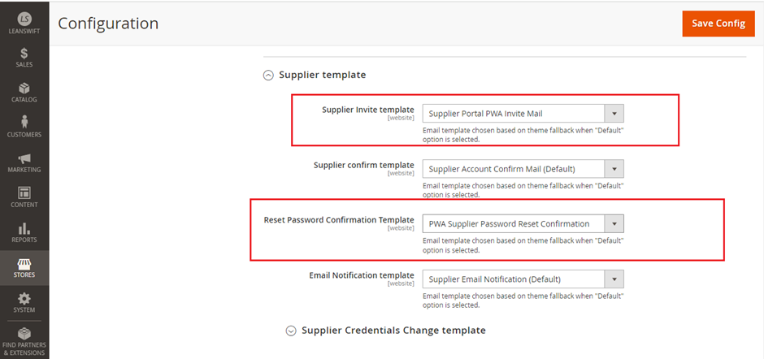
</kbd>
 

5. Save Configuration and clear cache.

 

<b>
 <a href="#table-of-contents">↥ Go to Top</a>
</b>

#### Cron

- This section contains the basic setup for how often the Supplier portal specific background (cron) jobs should run. 
- The actual configuration of the job in the screen shot below is not representative of a normal customer installation. 
- The setup will vary from Supplier to Supplier depending on a number of factors such as basic data volumes, frequency of changing purchase order etc.
- This section should always be reviewed within the project, and with the help of the LeanSwift Services team be adjusted to best fit each customer’s environment.
- Navigate to Leanswift -> Supplier Portal -> settings -> Cron.

**Cron setting to send confirm PO requests to M3**

- The setting facilitates to send confirmed Purchase orders to supplier.
- Setting is useful only when we disable the Realtime API call for Confirm PO.
- If the cron is left blank, then the cron will be disabled.

**Cron setting to get forecast PO from M3**

The settings used to pull the forecast purchase order's from M3.

<kbd>
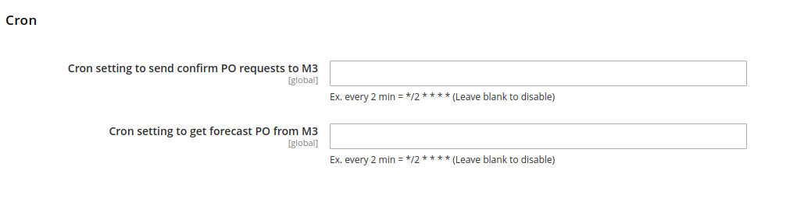
</kbd>

 

<b>
 <a href="#table-of-contents">↥ Go to Top</a>
</b>

### Design Settings

- The section provides configuration for the company images with color code configuration affecting frontend behaviour
with an option to choose different colors for each status of Purchase order and forecast. 
- It provides an option to create customizable filters for the purchase order and forecast pages.
- Navigate to Leanswift -> Supplier portal -> Design and Display -> switch to main website.

#### General

The section contains information to be basic configuration for company.

**Company Logo** 

Provide the company logo by choosing the file from your local.

**Product Logo**

Provide the product logo by choosing the file from your local.

**Homepage Banner**

Provide the homepage banner by choosing the file from your local.

**Facicon Image** 

Provide the Favicon for the website by choosing the file from your local.

**Show Supplier Portal Homepage** 

When an option selected as &quot;Yes&quot; Supplier portal homepage is shown.When
 it is set to &quot;No&quot; default homepage configured to website will be displayed.
 
The option wil be enabled only when LeanSwift Econnect Module is installed 

**Show document upload option** 

When an option selected as &quot;Yes&quot; upload document in
 Purchase order page will be displayed. When set to &quot;No&quot; upload document is disabled.

The option wil be enabled only when LeanSwift IDM Module is installed

<kbd>
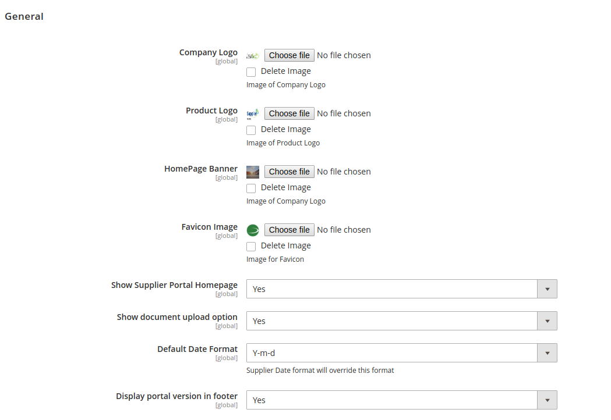
</kbd>

 

<b>
 <a href="#table-of-contents">↥ Go to Top</a>
</b>

#### Frontend Color Codes  

| Color Label    | Purpose    |
| :------------- | :---------- |
|  Background color | Page Body background color.   |
| Text HighLight   | Headings in account page, supplier name,filter name color. |
| Sign In Button color  | Normal Button BG color in supplier portal pages. |
| Filter Button color  | Filter list add button BG color for purchase order and forecast page. |
|Confirm All Button Color	|Color code used for Confirm All Button color|
| Special Button color  | The color code used in download button, confirm, all button and chart types menu in metrics page. |
|Document Upload BG color	|Color code used for Document upload background color| 
| Menu color  | Color code used for paginization , active menu selection, Table head BG color, Collapsible menu in my account and metrics page. |
| Chart color  | Chart color Background color in metrics page. |
| Confirmed Status BG color  | Confirmed purchase order line BG color. |
|Advised Status BG color	|Color code used for Advised purchase order line background color|
|Notify Status BG color	|Color code used for Notify purchase order line background color|
| Waiting Status BG color  | Waiting purchase order line BG color. |

BG  -  Background color

<kbd>
    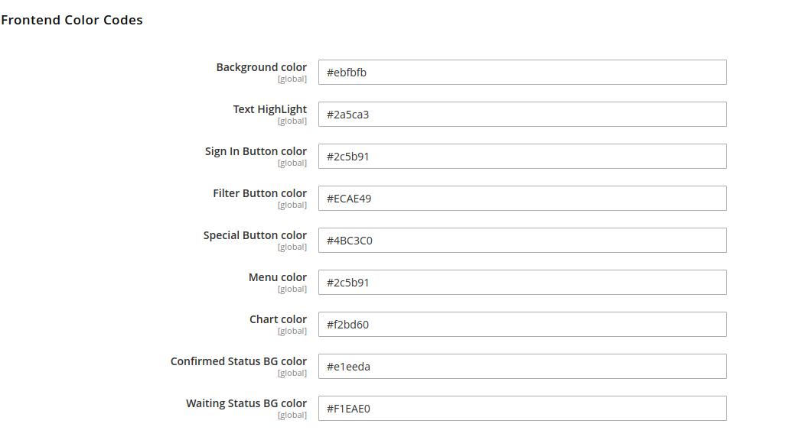
</kbd>

 

<b>
 <a href="#table-of-contents">↥ Go to Top</a>
</b>

#### Logo Image size

Logo image upload width and height can be changed over here.

<kbd>
    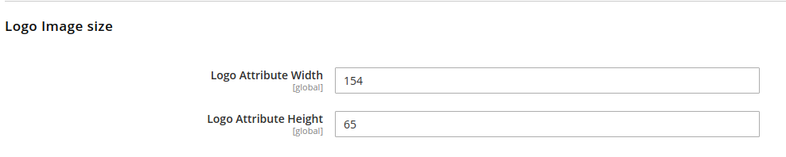
</kbd>

 

<b>
 <a href="#table-of-contents">↥ Go to Top</a>
</b>

#### Status Mapping

The section contains mapping of status code corresponding status label and color code.

##### PO Status Mapping

The section contains the status code ,label and color code mapping for Purchase order page.

<kbd>
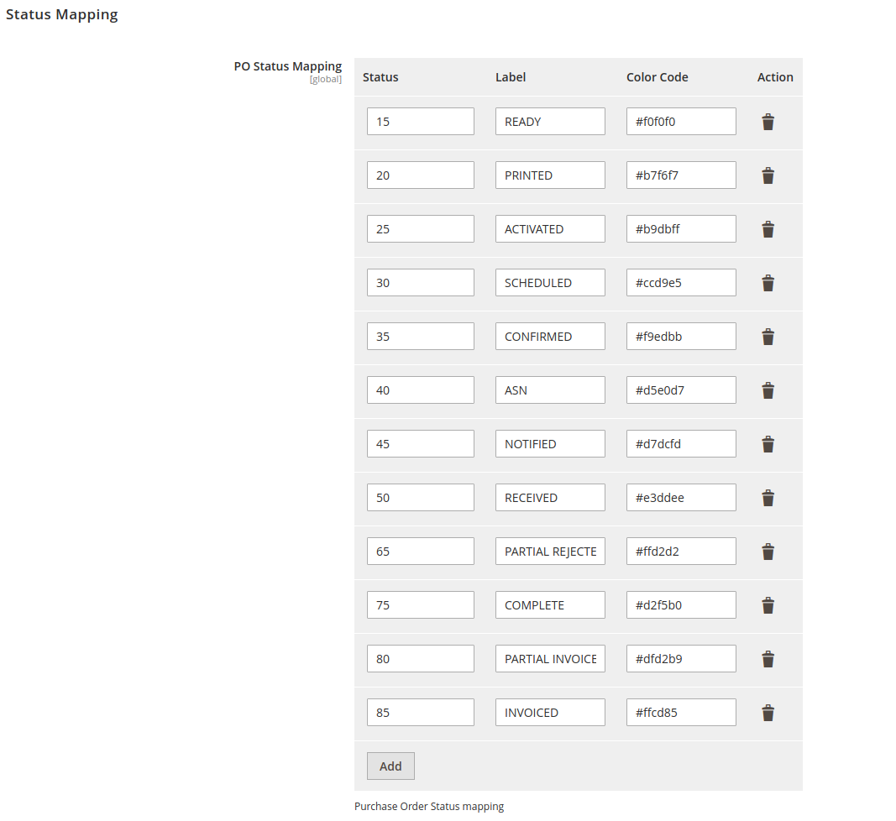
</kbd>

 

Purchase order M3 status shown below

<kbd>
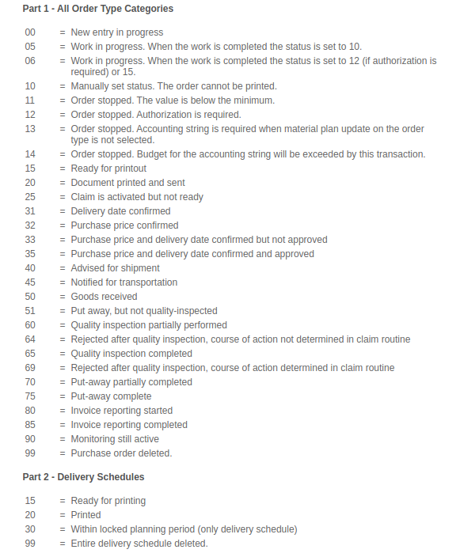
</kbd>

##### Forecast Status Mapping

The section contains the status code ,label and color code mapping for forecast purchase order.

<kbd>
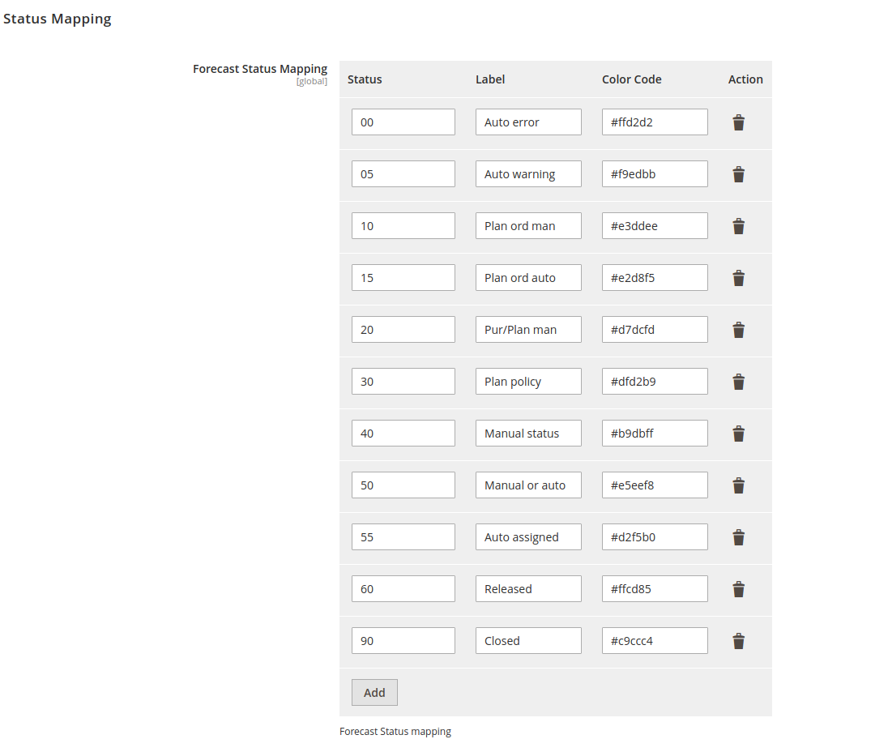
</kbd>

 

Forecast M3 status shown below

<kbd>
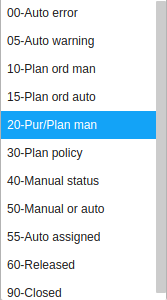
</kbd>

 

<b>
 <a href="#table-of-contents">↥ Go to Top</a>
</b>

#### Filter and Search

The section contains the filter limit and mapping for the filter attribute and filter operations with filter type.

**Filter Operations** 

Inbuild filter operations are

- Less Than
- Greater Than
- Equals
- Contains
- Starts with
- Ends with

**Filter types** 

Inbuild filter types are

- Number
- Date
- Text

##### Purchaseorder Filter Mapping

The section contains the filter limit, filter label mapping for the filter attribute and filter operations for
 purchase order.

<kbd>
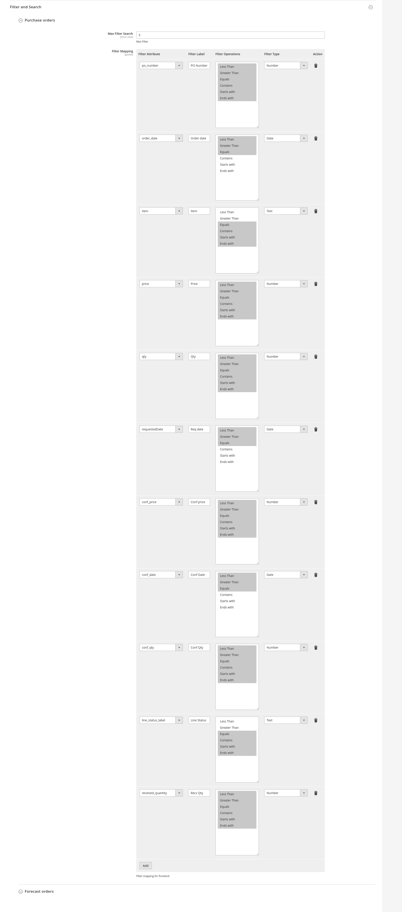
</kbd>

 

##### Forecast Filter Mapping

The section contains the filter limit, filter label mapping for the filter attribute and filter operations for forecast.

<kbd>
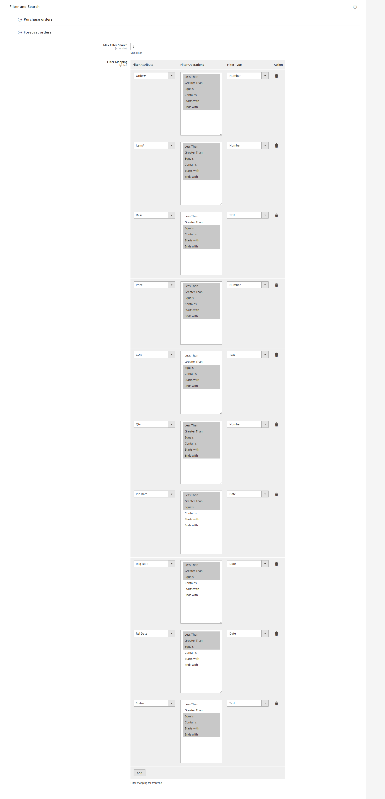
</kbd>

 

<b>
 <a href="#table-of-contents">↥ Go to Top</a>
</b>

### Supplier Invite

To view the user manual for Supplier Onboarding click [here](./usermanual-supplierportal-supplier-onboarding-admin.md).

### Exit System

Log out from Magento admin using the link at the top right human Icon and sign out.

<kbd>
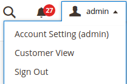
</kbd>

 

<b>
 <a href="#table-of-contents">↥ Go to Top</a>
</b>

## Additional Functionality

### IDM

- Uploading documents into IDM against Purchase Orders requires LeanSwift IDM Magento Extension. 
- The LeanSwift IDM extension for Infor M3 provides the ability to upload, download (multiple files for ION) and search documents in IDM. 
- Also, when the IDM extension is installed along with Supplier Portal, it provides the ability to download/ view  IDM documents from supplier portal **My Purchase Order** page.

**Configuration**

- The configurable options available for IDM add-on can be separated as three parts – *Upload*, *Download* and *Search*.
- Navigate to Leanswift -> IDM -> Settings.

**Upload Configuration**

- **Enable Upload** - If the option is set to “YES” the supplier can upload the files. If the enable Upload option is set to “NO” the supplier is not allowed upload the files.

- **Allowed File Types** – Enter the file extensions that are allowed to be uploaded to IDM. Example: docx, png, jpg, pdf etc. This field is not mandatory. They can be multiple file extensions can be added by separating them by comma.

- **Cron / Real-time** – If the option is chosen as real time the idm documents will upload based on real time. If cron is chosen, cron expression should be provided to upload the files on a periodic basis.

- **Configurable Options to Upload** – Select the Document Type from the drop-down list, required Attribute Type(s), Used In[Should be         unique to identify the configuration]. Can add as many options as necessary.

- **Clears the uploaded files to IDM** – Clears the documents stored under Magento_Root/pub/media/leanswift/idm/upload/ folder periodically based on cron expression. It’s good practice to configure suitable cron expressions here to manage disk space. But we should not configure upload through cron and clear the uploaded files to IDM at same time else it will conflict and not work.

<kbd>
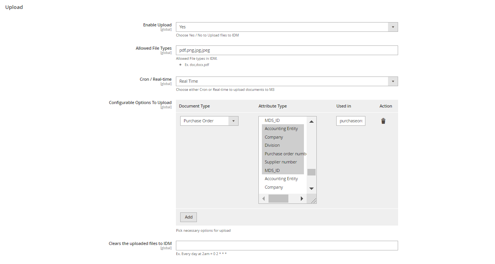
</kbd>

**Download Configuration**

- **Enable Download** - If the option is set to “YES” the supplier can download the files. If the enable Upload option is set to “NO” the supplier is not allowed download the files.

- **Cron / Real-time** – Documents will be downloaded from IDM based on this option. If cron is chosen, cron expression should be given to     download the files from IDM on a periodic basis.

- **Configurable Options to Download** – Select the Document Type, required Attribute Type, Operation, Used In [Should be unique to identify   the configuration]. Can add as many options as necessary.

- **Clears the downloaded files to IDM** – Clears the documents stored under Magento_Root/pub/media/leanswift/idm/download/ folder periodically based on cron expression. It’s good practice to configure suitable cron expression here to manage disk space. But we should not configure download through cron and clear the downloaded files to IDM at same time else it will conflict and not work.

<kbd>
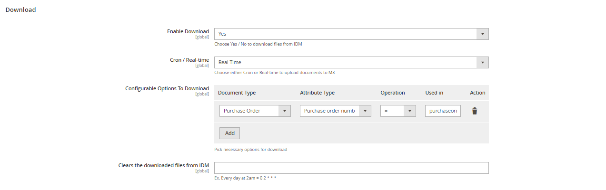
</kbd>

**Search Configuration**

- **Enable Search** - Option can be set to Yes or No

- **Configurable Options to Search** – Select the Document Type, required Attribute Type, Operation, Offset and Limit. Here we can multiple functions as per our requirement.

<kbd>
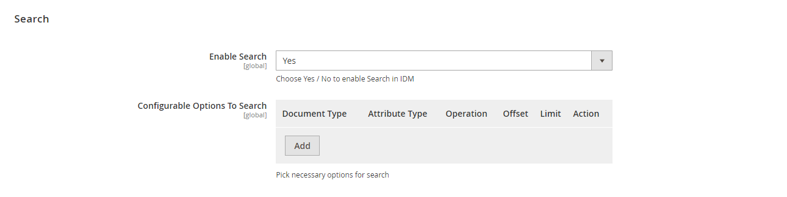
</kbd>

**Mapping**

Attribute Key refers to M3_AttributeKey Name of IDM Document Type and the Custom key is the one we name it for our reference which we will use in code to retrieve M3_AttributeKey mapped here.

<kbd>
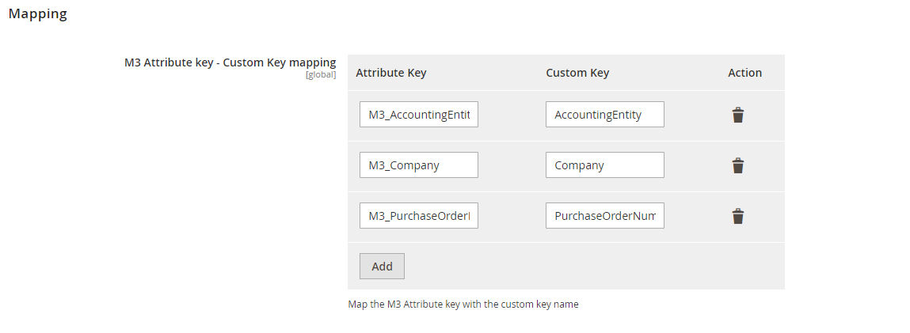
</kbd>
