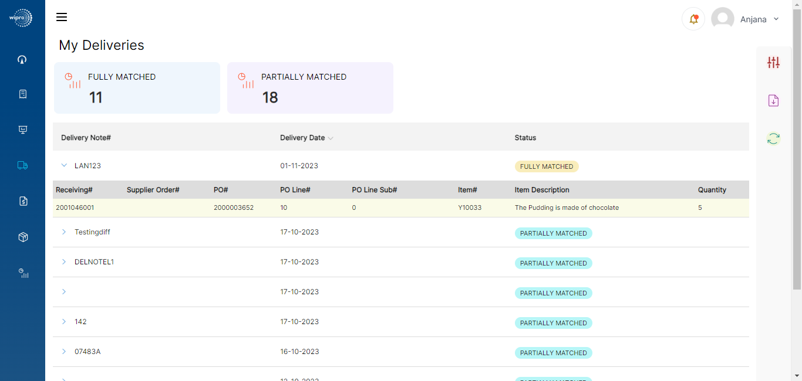
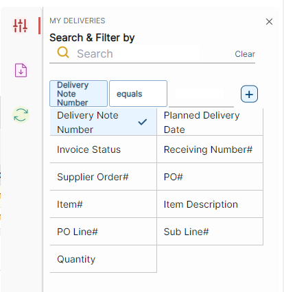
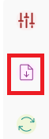
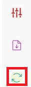
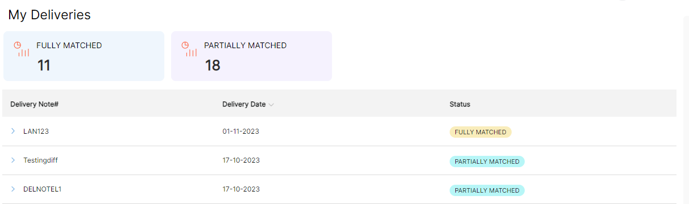

# **Version 23.4.0 - User Manual – Deliveries - User**

My Deliveries displays all the Delivery notes for Purchase Order (of order status \> 50)

The Delivery head contains the following:

1. Delivery Note# (Delivery Note Number)
2. Delivery Date
3. Status

The Delivery note lines contains the following,

1. Receiving# (Receiving Number)
2. Supplier Order# (Supplier Order number)
3. PO#
4. PO Line#
5. PO Line Sub# (Sub Line Number)
6. Item#
7. Item Description
8. Quantity

<kbd>
 
</kbd>

Deliveries can be filtered based on the below options.

<kbd>
 
</kbd>

There is a 'Download' option which downloads the entire list of filtered or unfiltered data on this page in CSV format.

<kbd>
 
</kbd>

There is a 'refresh' option that reloads the page to update the new records.

<kbd>
 
</kbd>

The number of '**FULLY MATCHED**' and '**PARTIALLY MATCHED**' Purchase orders are shown on the top of the deliveries table.

**FULLY MATCHED** – All the PO lines associated with that delivery note are Invoiced

**PARTIALLY MATCHED** - All the PO lines associated with that delivery note is not invoiced (even if one PO line is not invoiced)

<kbd>
 
</kbd>

_**Note**:_

- _When Delivery date is different, but the delivery number is the same, a new record with the same delivery number and a different delivery date is added._
- _When a Delivery name and Delivery date is the same, all the lines advised with the delivery note are added as lines and when we try to advise a line with different planned pick update, the following error message is shown 'Shipment Advise is not allowed. Delivery note XXX is already advised with shipment date XXYYMM'._

**To Create Deliveries in M3:**

- The status of the purchase order should be 45 (Notify) to receive goods.
- There are different types of Delivery methods and some of the Delivery Methods are:

- **Direct put away** : Go to PPS300 give the PO number and change the sorting order by open lines, Right click -\> Change -\> Enter Delivery Note no -\> Submit.
- The status of the PO will change to 75 (Put-away completed).
- **One step put away** : For one step put away the goods receiving method must be selected as M10(Goods receipt/ Quality inspect/put away)
    - Go to PPS200 and create a Purchase order.
    - The PO status must be 45(Notify)
    - Go to PPS300 enter the PO number and right click-\> change and enter the delivery note number and click next.
    - Sort to closed lines, click on line Related-\> Display Purchase order Transactions get receiving number
    - Go to PPS310(Inspect goods) enter receiving number, click on line right click-\> change.
    - There we can give the type of Quality Inspection result, and give the approved qty.
    - If rejected or partially rejected the qty must be entered, click on next. The status of the line will be 65(Quality Inspection complete)
    - Go to PPS320(Goods put away) give the receiving number and select the line -\> right click -\> change -\> enter the stored qty -\> next.
    - The line status changes to 75(Put away complete).
  - Delivery note number given in PPS300 will be displayed in portal under My Deliveries.

