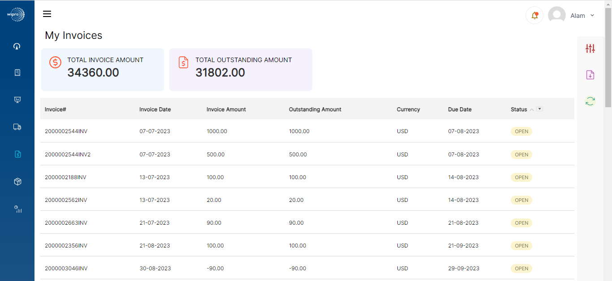
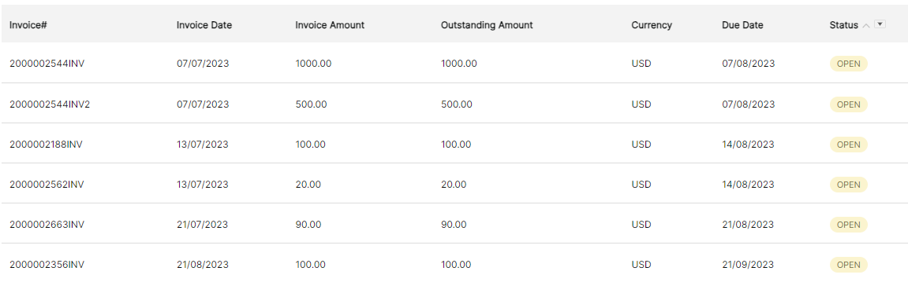
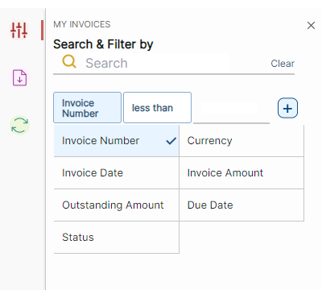
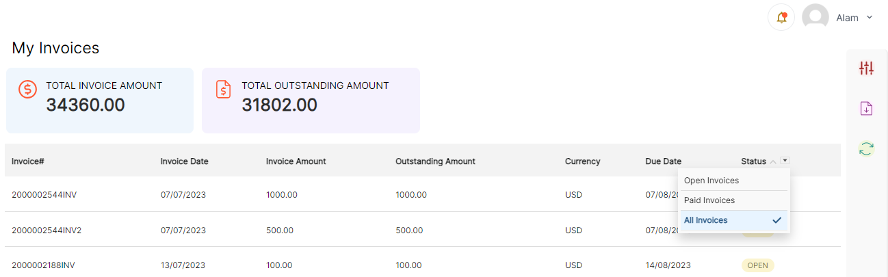
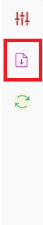

# **Version 23.4.0 - User Manual - Invoice - User**

This is an Add-on that can be used with Supplier Portal.

My Invoices Displays list of Invoices associated to the supplier

<kbd>
 
</kbd>

The Invoice page has the following details:

1. **Invoice number**: Invoice number given by the buyer in M3.
2. **Invoice Date**: Date of the invoice.
3. **Invoice amount**: The total amount of the invoice.
4. **Due date**: The due date to pay the invoice.
5. **Currency**: Type of the currency.
6. **Outstanding amount**: Remaining amount to be paid.
7. **Status**: Status of the invoice (Paid or Open).

<kbd>
 
</kbd>

Users can also filter the invoices based on the above fields.

<kbd>
 
</kbd>

Invoices can be filtered based on the following status:

1. All: Combination of Open and Paid Invoices
2. Open: Invoices which are not yet paid and partially paid
3. Paid: Invoices which are fully paid.

<kbd>
 
</kbd>

Total Amount and Total Outstanding Amount are displayed on the top of the invoice table.

Download option downloads the list of available invoices or based on filtered invoice results.

<kbd>
 
</kbd>

**Create Invoices in M3:**

- Once the goods receiving process is done the PO line status is changed to 75(Put away complete)
- Go to APS100 -\> FAM 400 (step match 4), enter Supplier number, invoice number, invoice amount (right click PO-\>related-\>charges or Received/Not Invoiced), purchase order number, Authorizer, Currency.
- Go to APS351 (Received good lines) -\>select po number (ctrl1)-\>create inv lines (act-f14).
- APS360 -\> PO matching -\>action-\>approve all.
- Actions -\> Check invoice f8.
- Actions -\> Create acct entries f11.
- Actions -\> Close(F3).
- The PO status will change to 85(Invoiced).

**Partially Invoiced**

- Once the goods receiving process is done the PO line status is changed to 75(Put away complete)
- Go to APS100 -\> FAM 400 (step match 4), enter Supplier number, invoice number, invoice amount (right click PO-\>related-\>charges or Received/Not Invoiced), purchase order number, Authorizer, Currency.
- Go to APS351 (Received good lines) -\>select po number (ctrl1)-\>create inv lines (act-f14)
- Actions Close(F3)
- Close all related programs and go to PPS200 the status of the PO will be 80(Partial invoiced).

**To make invoice payment:**

- Go to APS120-\>select 201 (USD check no remittance) -\>enter Paid amount [inv amount can be viewed in pps200\>payment table], payee, supplier, check number (any unique number), supplier invoice number, Voucher text
- click next
- Click on order line right click -\> full payment
- For partial payment Click on order line right click -\> related -\> partial payment -\> enter the partial amount -\> click Next.
- Go to Action -\> close.
