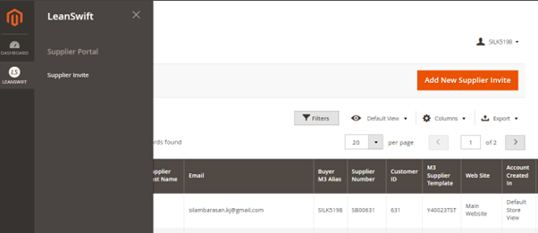

# **Version 23.4.0_PWA - Supplier Onboarding Admin**

# Table of contents

- [Supplier Onboarding](#supplier-onboarding)
- [Magento Admin User Role](#magento-admin-user-role)
- [Supplier Invite](#supplier-invite)
- [Supplier Onboarding Configuration](#supplier-onboarding-configuration)
- [Onboarding Task](#onboarding-task)
- [My Documents Task](#my-documents-task)

# **Supplier Onboarding**

Supplier portal onboarding allows supplier creation from portal itself. New supplier account is created using the invite sent by buyer to supplier email account.

# **Magento Admin User Role**

New user role _ **Buyer** _ is added by default. Navigate to **System-\>Permissions-\>User Roles.**

Select the user role _ **Buyer** _ and view the list of permissions granted and users associated with this role. If needed, provide other user permissions.

<kbd>
 
</kbd>
 

<kbd>
 
</kbd>

**Create Buyer as Magento User**

Navigate to System-\>Permissions-\>All Users.

**Provide User Name** as Buyer's _ **M3 User Alias** _ as below in Mingle portal and other required details.

<kbd>
 
</kbd>
 

<kbd>
 
</kbd>

Associate User role as Buyer and save user.

<kbd>
 
</kbd>

Login as Buyer user (who has only limited access) to Magento portal and invite supplier for onboarding.

<kbd>
 
</kbd>

<b>
<a href="#toc">↥ Go to Top</a>
</b>

# **Supplier Invite**

To onboard a new supplier, Buyer will send invite to supplier using supplier email id. Invite list can also be viewed in admin portal.

Navigate to LeanSwift-\>Supplier Portal-\>Supplier Invite.

<kbd>
 
</kbd>
 

<kbd>
 
</kbd>

Click **Add New Supplier Invite** and supplier Invite form will be displayed.

 <kbd>
 
</kbd>

Enter new **Supplier First Name** , **Supplier Last Name** and **Supplier Email**. Select **Associate to Website** and **Send Welcome Email** from the listed drop-down values.

**M3 Supplier Template** lists the existing supplier template in M3 based on which new supplier is created. Drop-down values can be configured in supplier onboarding under Supplier settings.

Click **Save and Invite**. Invite is sent to the supplier email and supplier list is created with status **Invitation sent successfully**.

<kbd>
 
</kbd>

Supplier Invite list can be searched using different filters. When portal fails to send invite mail to customer then status changes to **Invitation sent failed**.

<kbd>
 
</kbd>

Supplier will receive invite mail to create account, once supplier set password and logged in then status will change to **Customer Created Successfully** in supplier invite list table.

<kbd>
 
</kbd>

<b>
<a href="#toc">↥ Go to Top</a>
</b>

# **Supplier Onboarding Configuration**

Navigate to **LeanSwift-\>Supplier Portal-\>Settings** and configure ION Mingle connection URL as below.

<kbd>
 
</kbd>

My Information form field values can be configured under **Supplier Onboarding** in Supplier Configuration settings.

Navigate to **LeanSwift-\>Supplier Portal-\>Settings** and switch to Multi Website Scope configuration.

<kbd>
 
</kbd> 
 

<kbd>
 
</kbd>
 

<kbd>
 
</kbd>

**M3 Supplier Template** - Existing supplier template from M3 can be configured with comma separated values.

**M3 Supplier Prefix** – New supplier ID will be created with configured prefix value

**M3 Supplier number length** - This field is dropdown list which contains values as 5,6,7,8. Based on chosen length, Supplier number is created excluding

**Workflow Name** – Give ION workflow Name used for supplier Onboarding

**Fetch Configuration** – This will fetch M3 Configuration fields with dropdown values.

Selected Dropdown values for **M3 Language List, M3 Order Currency List, M3 Payment Terms, M3 Freight Terms, M3 Delivery Terms List, M3 Payment Method, M3 Packaging Terms List, M3 Monitoring Class List and M3 Delivery Method List** will be prepopulated in My Information form as default values. These values can be changed by supplier before submitting.

**M3 Payment Terms, M3 Freight Terms, M3 Delivery Terms List, M3 Packaging Terms List, M3 Monitoring Class List and M3 Delivery Method List** are language specific fields. Based on the M3 Language selected, drop down list will be listed.

**Allow to choose Payment terms** - If Yes, then supplier can choose payment terms from the dropdown list in my information form. If No, then supplier template payment term will be selected as default in my information form.

**Allow only UPPER CASE in Supplier Name** - By default Yes is configured, Supplier Name will be accepted only in UPPER Case and if lower case is entered then it is changed to uppercase in My Information form.

**Allow Special Character in Supplier Name** - Based on the selection, special characters are allowed for supplier name in My Information form.

**Tax ID Maximum Length** - Based on this configuration the length of the Tax ID is defined. The maximum length is 15 and the minimum length is 11.

**My Information Form Success Message** - Configured message will be displayed when supplier submits my information form.

**Supplier Template** can be created in M3 using program **CRS620** with status **05-Suppl Template'**.

Navigate to CRS620, enter supplier name, and click create button. Fill all required information and status should be in '05-Suppl Template'.

<kbd>
 
</kbd>
 

<kbd>
 
</kbd>

<b>
<a href="#toc">↥ Go to Top</a>
</b>

# **Onboarding Task**

Once supplier Submit my information form, Buyer will get supplier onboarding task in M3 to review supplier information submitted and can add notes if any changes required.

<kbd>
 
</kbd>
 

<kbd>
 
</kbd>
 

<kbd>
 
</kbd>

<b>
<a href="#toc">↥ Go to Top</a>
</b>

# **My Documents Task**

Approval Task and uploaded document notification will be generated in M3 for document uploaded by supplier.

Notification from Infor is sent to the Buyer's email when document uploaded by supplier reaches IDM for verification

Buyer will review all documents tasks submitted and can add notes if any changes required.

<kbd>
 
</kbd>
 

<kbd>
 
</kbd>
 

<kbd>
 
</kbd>
 

<kbd>
 
</kbd>

Bell Icon Notification will be triggered in portal for Task notes updated in M3 and cron is configured to get task notes from M3.

<kbd>
 
</kbd>

Once all tasks are approved at M3, **Final onboarding Approval task** is sent to the respective final approvers configured in Distribution list

<kbd>
 
</kbd>
 

<kbd>
 
</kbd>

Once above task is approved supplier will get a notification and a confirmation email.

Now that supplier account is activated, the new supplier can use all the functionalities available in the supplier portal.

<kbd>
 
</kbd>

 When M3 Buyer approved Supplier Onboarding tasks, supplier status will be changed to **Supplier Mapped to Customer** status in Supplier Invite list table.

<kbd>
 
</kbd>

<b>
<a href="#toc">↥ Go to Top</a>
</b>

