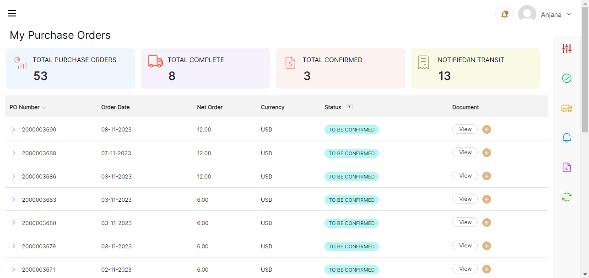
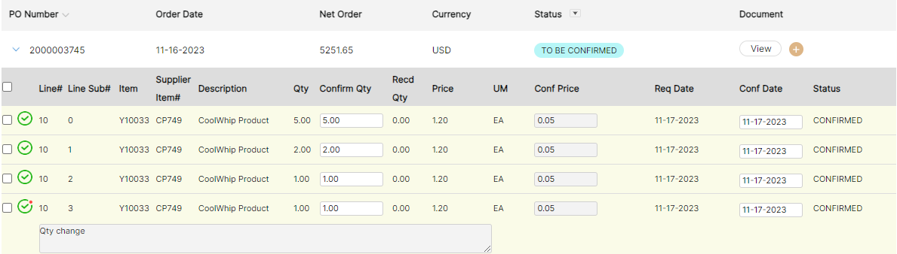
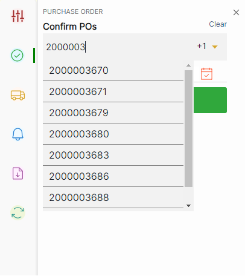

# **Version 23.4.0 - User Manual - Supplier User**

# **Table of contents**

# **System Overview**

LeanSwift Supplier Portal is a supplier self-service web portal that enables efficient online communication with vendors. It is seamlessly integrated with Infor M3 Cloud suite via ION. Supplier Portal helps automate the entire purchase-to-pay process for the customer.

## **Organization of the Manual**

This manual describes the frontend look and feel of LeanSwift Supplier Portal for Infor M3 and is meant for the Portal user (Supplier Representative).

To view the user manual for Portal admin, [click here](https://github.com/leanswift/leanswift.github.io/blob/dev/supplierportal/src/pages/23.4.0PWA/usermanual-supplierportal-admin.md).

## **Architecture**

The solution is built on  **Magento Open-Source Platform**. It interacts with  **Infor M3**  via  **Infor ION Platform**.  **RabbitMQ**  is the message queue used to send/receive messages to/from ION.

<kbd>
<kbd></kbd>
</kbd>

## **Features**

- Registration and Login
- My Account
   - My Information
   - My Documents
- My Settings
   - Date Format
-  My Purchase Orders
   - View Purchase Orders
   - Search/Filter/Sort on Purchase Orders
   - Confirm Purchase Orders
   - Download Purchase Orders Information
   - Upload documents into IDM against Purchase Orders
       - This is available ONLY if additional functionality for IDM integration is included as part of license
- My Forecasts
   - View Purchase Forecasts
   - Download Forecast Orders Information
   - Search/Filter/Sort on Purchase Forecasts
- My Performance Metrics
   - View Delivery Performance metrics
   - View Quality metrics based on Rejected quantity
   - View Purchase Price Variance metrics
- Admin
   - Settings and Configuration for Portal and M3 Connection

## **User Interface**

During setup, the Magento Admin is used to configure the supplier portal. Some of the images and colours used in the user interface are configurable via the admin panel. The portal is accessible via any device using a web browser or PWA

## **Validated Versions**

Refer [Release Notes ](https://wipro365-my.sharepoint.com/personal/ch20276537_wipro_com/Documents/supplier%20portal%20documents/usermanual-supplierportal-admin.docx?web=1)

## **Point of Contact**

This document and the software it describe are provided by LeanSwift Solutions Inc. For additional information regarding support, licensing, functionality etc. please contact LeanSwift Solutions Inc. via contact form at http://www.leanswift.com or email [info@leanswift.com](mailto:info@leanswift.com).

# **User Guide for Suppliers**

## **Registration**

- The Registration Page is used to register the user as a supplier, and the supplier portal registration page is displayed as shown below

<kbd>

</kbd>

**Prerequisites to register as supplier:**

- First Name
- Last Name
- Email
- Password
- Confirm Password
- Supplier Number: The user must be supplier in M3, and the supplier number to be in status '20' (approved) in M3.

_Note: Already registered supplier cannot be registered again._

**Steps to register as supplier:**

- Go to Home page and select 'Create an Account.'
- Enter all the mandatory fields and click on "Create Account."

- Once the supplier registration is completed and request is sent to buyer for approval.
- The user will be notified with the following message on the homepage: "Thank you for registering with us. Your request has been sent for review. It may take a few hours or days to receive a response."

<kbd></kbd>

_ **Note** __: Once registration is complete, an approval request is sent to the buyer. The supplier can only log in after the buyer has approved the registration request. The supplier will be notified via email regarding the approval or decline of the registration to their registered email ID._

<b>
<a href="#toc">↥ Go to Top</a>
</b>

## **Log in**

- The Homepage/Login page has " **Username"** and  **"Password"**  text fields.
- Click on "Sign In" button, supplier can login to the portal successfully.
- It can also be customised to incorporate CAPTCHA as additional field.

<kbd></kbd>

- The homepage/login page displays error messages for empty or incorrect  **username** and  **password**.

<kbd></kbd>

<kbd></kbd>

<b>
<a href="#toc">↥ Go to Top</a>
</b>

## **Forgot Password**

- To change the password or supplier forgot the password, click on  **forgot password**  link and enter the  **username**  and  **captcha** and click on **Reset My Password**

- An email will be sent to the registered mail id to reset the password.

<kbd></kbd>

<kbd></kbd>

<kbd></kbd>

Click **Set a New Password** enter the **New Password**, **Confirm Password** and then click **Set a New Password.**

<kbd></kbd>

Next page will be redirected to supplier user portal with status as **Your password has been updated. You may now log into your account.** Enter your supplier email address and password to **Sign In.**

<kbd></kbd>

<b>
<a href="#toc">↥ Go to Top</a>
</b>

## **My Settings**

- Date Format can be modified in this section.
- The selected date format will be displayed as "Changed Date Format."
- Format can be selected with combination of two columns (Date and Limiter).

<kbd></kbd>

<b>
<a href="#toc">↥ Go to Top</a>
</b>

## **My Account**

- My Accounts section contains "My Information" and "My Documents" of the supplier.
- It also contains the different address types of the Supplier.
- The Account information of the supplier will be fetched from Infor M3 table CRS620.

<kbd></kbd>

<kbd></kbd>

- The diverse types of supplier's address such as _Postal Address_, _Street Address_, _Pickup Address_, _Origin Address_, _Final Delivery Address,_ and _Bank Address_ are under "My Information."

<kbd></kbd>

<b>
<a href="#toc">↥ Go to Top</a>
</b>

# **My Purchase Orders**

- My Purchase Orders section contains all the purchase orders that belongs to the registered supplier.
- Each purchase order has one or more purchase order lines.
- Purchase orders holds the lowest status among the order lines.
- A single purchase order can hold more than 1000 PO lines and it will be displayed in a single page with scroll button.
- The purchase orders are created in Infor M3 in PPS200.

<kbd></kbd>

- By clicking on the arrow in a Purchase Order, it expands to display the purchase order lines and related information corresponding to the purchase order.
- The purchase order lines have Line#(Line Number), Line _Sub# (_Sub line Number), Item, Supplier Item#, _Description_, _Qty_, _Confirm Qty_, _Recd Qty_, _Price_, _UM_, _Conf Price_, _Req Date_, _Conf Date,_ and _Status_.
- Single select, Multi select or select all the purchase order lines can be done.

<kbd></kbd>

## **Pagination Scrolling**

- Content is loaded dynamically as the user scrolls down the page.

<kbd></kbd>

## **Sort**

- _PO number_, _Order date_ and _Status_ can be sorted ascendingly or discendingly.
- By default, the POs are sorted based on the "PO Number."
- Single click on arrow mark (symbol pointing downwards) determines that the sort is descending.
- Another click on the arrow mark (symbol pointing upwards) determine the sort is ascending.
- Only the sorted column will be highlighted by the arrow.

<kbd></kbd>

## **Search**

- Search bar is available in the filter by field on the right-side
- The Search bar is a text field, and it also accommodates _Filter_ and _Clear all_ buttons.
-  It provides a simple text search functionality and can be used to search both at PO and PO line levels.

<kbd></kbd>

## **Filter**

- Based on admin configuration PO's can be filtered using _Equals_, _Less Than_, _Greater Than_ _Contains_, _Starts With_, _Ends With_ operands_._
- POs are filtered by multiple combinations, as per the configuration in admin.
- The Maximum of filters that can be added in the frontend is configured in the admin
- The admin level configuration is done in Leanswift-\> Supplier Portal -\>Design and Display -\>Main Website -\>Filter and Search.
- The filters work in AND operation (if two filters f1 and f2 are added, the results will have POs that satisfy f1  **AND**  f2).
- The additional filters can be added by clicking on the plus icon.

<kbd></kbd>

## **Filter on Status**

- The Status filter is a dropdown having a list of PO status such as "READY, TO BE CONFIRMED, ACTIVATED, SCHEDULED, CONFIRMED, ASN, NOTIFIED, RECEIVED, PARTIAL REJECTED, COMPLETE, PARTIAL INVOICED, INVOICED."
- Multiple Status can be selected.
- Unavailable statuses are greyed out by default.

<kbd></kbd>

## **Download as CSV**

- Download button is present on right side of the My Purchase Order page.

<kbd></kbd>

- By default, it downloads all the PO, When the purchase order is filtered, it downloads only the filtered results in CSV format.
- Downloaded File Name has pre-defined format, Supplier number with Timestamp of download. For example, **Y40028ANNI\_PurchaseOrders\_1700128607093**.

<kbd></kbd>

# **Confirm Lines in PO**

To Confirm a PO line, select a single PO line or multiple lines and click on the Confirm button which is on right side . Confirming a PO line can be done in two ways:

<kbd></kbd>

## **Confirm with changes** :

- When a PO line is confirmed with changes, approval request is sent to Buyer. (if approval is enabled in admin)
- To confirm a PO line with changes, we need to change the Conf Qty/ Conf Date/ Conf Price and click on confirm button.
- When confirm with changes are done, PO Confirm approval request is sent to the buyer of the PO.
-  The PO lines confirmed with changes has indicator with red dot to differentiate with lines confirmed without changes.
- Here while doing confirm with changes, we can also add the comments.
- When there is change in quantity and it is confirmed by the buyer a new line will be added below the confirmed line with the reaming quantity with status 'To be confirmed'.

<kbd></kbd>

<kbd></kbd>

- When a PO line approval is  **rejected** by the buyer, it is update in the PO line with "reject symbol."

<kbd></kbd>

- When PO line confirm quantity or date or price is modified, a text dialog box appears below PO line to add comments. User can add short notes on changes made. The text box appears for each PO line. When there is no change in conf qty/date/price, the dialog box is not displayed.

<kbd></kbd>

## **Confirm without changes**:

- To confirm a PO line without changes, keep the conf qty/ conf date/ conf price as same as the requested date/ price/ qty.
- When a PO line is confirmed without changes, line is confirmed directly and 'PO Confirm approval request' is not sent to the buyer.
- Confirmed line without any changes has a plain green indicator.

<kbd></kbd>

- Apart from confirmed and rejected indicators, there is a  **waiting** / **Processing**  indicator applied to a PO line before it moves to confirmed state.

<kbd></kbd>

### **Confirm All Lines**

- When Confirm All Lines is selected, all the purchase order lines in a PO are confirmed with same Confirmed Quantity/Price/Date as the Requested Quantity/Price/Date.

<kbd></kbd>

### **Confirm Multiple POs**

- Users can confirm multiple POs together using the Confirm button available in right side of 'My Purchase Orders' page.
- Confirm Selected POs (All Lines) window opens with 'Date' field which is prefilled with today's date.

<kbd></kbd>

- Additionally, there is a 'Search PO' dropdown. Users can search Purchase order numbers and choose from the dropdown.
- Only eligible POs will be displayed in the dropdown (POs that are Equal or Less than Confirmed status).
- If user searches for a PO and that PO is not eligible for Confirm or if PO number search does not match any results, user is displayed with a message 'No results found.'
- As the user select's PO from dropdown, it appears as the list with a 'x' mark beside it.
- Users can select multiple POs and can also remove it by clicking on the 'x' mark.
- The selected PO are displayed in search bar towards right side like "+3". 

<kbd></kbd>

### **Reconfirm PO**

- Users can reconfirm a PO line that is already confirmed.
- Order lines with status 'Confirmed' (i.e., Status 35) are applicable, irrespective of whether the previous confirmation was done with or without changes to the original request.
- The reconfirmation can be done any number of times as long as the lines satisfy the above requirements.
- When the user edits the Qty or date field 'You are about to re-confirm an already confirmed order line' message displays.
- The user can change the Conf Qty or Conf date.
- By selecting any PO line which is in "Confirmed" status then click on Confirm button on right side.
- A warning message will pop up on top like "You are about to re-confirm already confirmed orders. Do you want to proceed?".
- Users must add comments in comments box below which is mandatory.

<kbd></kbd>

- Choose eligible PO lines and click Confirm Button. For reconfirmation 'Conf Date' can be changed and 'Confirmed Qty' (Conf Qty) can be reduced but cannot increased. 'Confirmed price' (Conf price) cannot be modified.

<kbd></kbd>

- Once the Confirm button is clicked for reconfirmation, the process indicator changes to 'Request is Processing' or 'Confirmation awaiting approval' based on configuration.

<kbd></kbd>

- Once re-confirmation is done the process indicator changes to 'Confirmed without changes' (if 'Activate approval process for Confirm PO' is set to No') or 'Confirmed with changes' (if 'Activate approval process for Confirm PO' is set to Yes')

<kbd></kbd>

### **Upload to IDM**

- To add/view additional information related to a purchase order, one can upload/download IDM document.
- To upload an IDM document, click on the "Plus" option under Document section and upload a document.
-  Document type that can be uploaded is configured in the admin.

<kbd></kbd>

- To view the document attached for a particular PO, click on the "View." A pop-up is displayed with document uploaded for a particular PO after clicking on refresh icon.

<kbd></kbd>

- A success message will display when a file is uploaded successfully.

<kbd></kbd>

- An error message will be displayed when unsupported file type is uploaded.

<kbd></kbd>

<b>
<a href="#toc">↥ Go to Top</a>
</b>

## **My Forecasts**

- My Forecast page list the Planned purchase orders created via  **delivery schedules**.
- The graph has been plotted for number of planned orders against requested month.

<kbd></kbd>

The Forecast page has the following functionalities.

### **Pagination Scrolling**

Content is loaded dynamically as the user scrolls down the page.

<kbd></kbd>

### **Sort**

_Order number, Item, Description, Price_, Currency, Qty, Pln Date, Req Date and Rel Date can be sorted ascendingly or discendingly.

<kbd></kbd>

### **Search**

It provides a simple text search functionality and can be used to search at order level.

<kbd></kbd>

### **Filter**

Based on admin configuration PO's can be filtered using _Equals_, _Less Than_, _Greater Than_ _Contains_, _Starts With_, _Ends With_ operands_._

<kbd></kbd>

## **Download as CSV**

By default, it downloads all the orders, When the Forecast order is filtered, it downloads only the filtered results in CSV format.

<kbd></kbd>

<kbd></kbd>

## **My Performance Metrics**

Three key performance metrics are displayed.

- On-Time Delivery
- Quality - Rejected Inventory
- Purchase Price Variance.

Graph can be viewed either as bar or line chart. All metrics are plotted for  **Monthly** ,  **Quarterly,**  or  **Yearly.**

<kbd></kbd>

**On-Time Delivery %**

This metric records the percentage of inbound deliveries received on time, that is  **Requested Delivery Date**  Vs  **Actual Delivery Date**.

<kbd></kbd>

**Quality - Rejected Inventory**

This metric records the total number of items rejected by the Buyer. 

<kbd></kbd>

**Purchase Price Variance**

This metric records the difference between the Confirmed price multiplied by the actual number of units purchased price paid to supplier and Requested Price its requested price multiplied by the actual number of units purchased (Confirmed **Price**  Vs  **Invoiced Price** )

Purchase Price Variance = (Confirmed Price \* Qnty) - (Requested Price or price \*Qnty)

<kbd></kbd>

<b>
<a href="#toc">↥ Go to Top</a>
</b>

## **Bell and Email Notifications**

- Bell Notifications is used to display all the latest changes or additions of POs.

<kbd></kbd>

- The bell icon has a red dot which indicates that there are unread notifications (once all notifications are read, red dot is removed).
- The notification is highlighted in bold initially, once it is clicked bold is removed symbolising that the message is read.

<kbd></kbd>

- Email notifications are sent to the Supplier and Sub accounts (Based on permissions granted to sub accounts users) when the following events occur:
   - When a new Purchase Order is added.
   - When a PO is updated.
   - When a new Purchase Forecast is added.
   - When a Forecast is updated.

## **Log out**

- To Log out click on the profile icon and select sign out.

<kbd></kbd>

<b>
<a href="#toc">↥ Go to Top</a>
</b>

