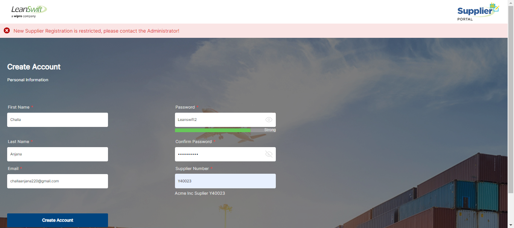
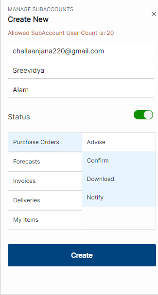

# **Version 23.4.0 - User Tracking - User Manual - User**

Based on the number of allowed user in the configuration for ‘Allowed Registered Admin User Count’, an error message is displayed when ‘Create Account’’ is clicked. 

<kbd>
 
</kbd>

Based on the number of allowed user in the configuration for ‘Allowed Subaccount Count’, A note is displayed to the user in the ’Manage Sub-Account page’ under ‘Create New’. 

<kbd>
 
</kbd>
