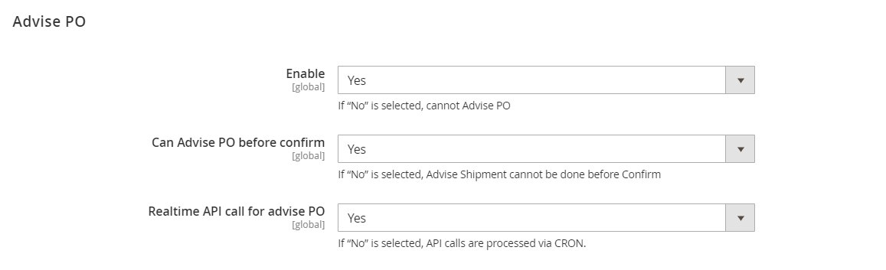
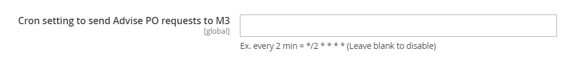
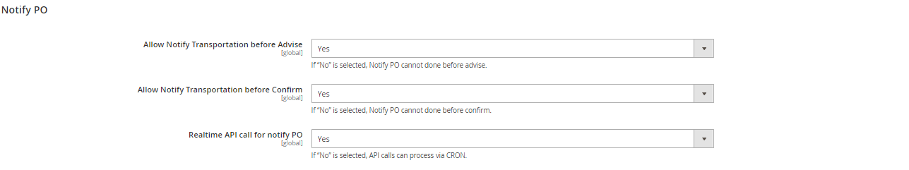
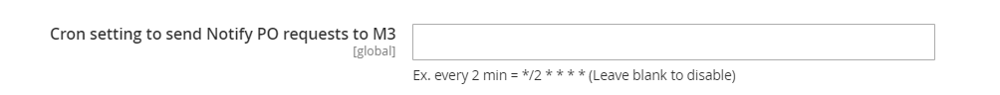
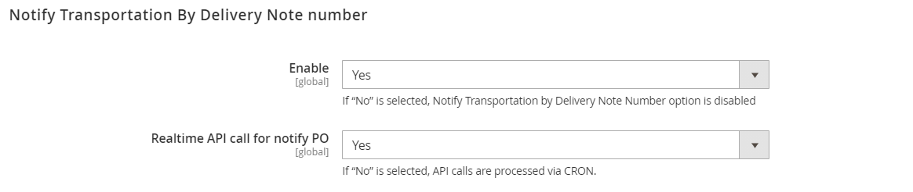
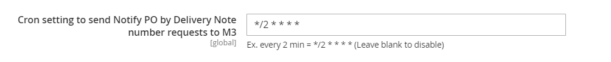
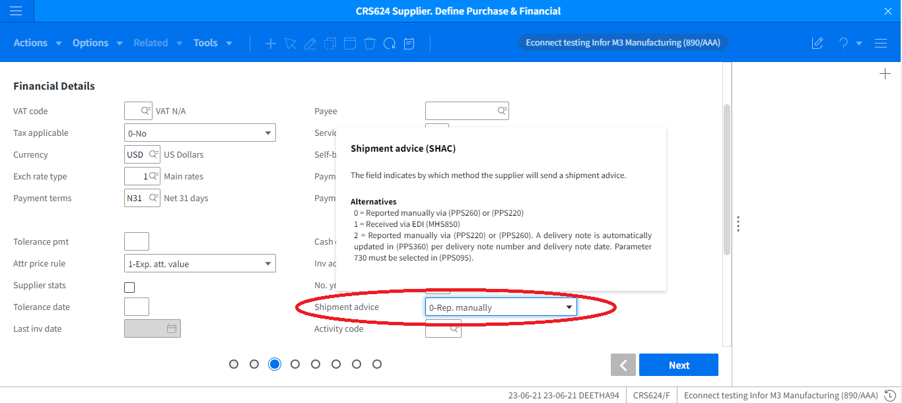
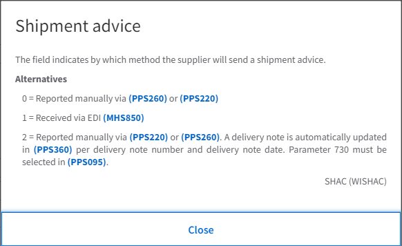

# Version 24.1.0 - Advise/Notify User Manual - Admin

# Table of contents

- [Advise](#advise)
    - [Enable](#enable)
    - [Can Advise PO before confirm:](#can-advise-po-before-confirm)
    - [Realtime API call for advise PO:](#realtime-api-call-for-advise-po)
    - [Cron setting to send Advise PO requests to M3:](#cron-setting-to-send-advise-po-requests-to-m3)
- [Notify](#notify)
    - [Enable](#enable)
    - [Allow Notify Transportation before Advise:](#allow-notify-transportation-before-advise)
    - [Allow Notify Transportation before Confirm:](#allow-notify-transportation-before-confirm)
    - [Realtime API call for notify PO:](#realtime-api-call-for-notify-po)
    - [Cron setting to send notify PO requests to M3:](#cron-setting-to-send-notify-po-requests-to-m3)
- [Notify Transportation By Delivery Note number](#notify-transportation-by-delivery-note-number)
    - [Enable](#enable)
    - [Realtime API call for notify PO:](#realtime-api-call-for-notify-po)

# Advise

- This Add-on is used to Advise PO lines and should be used along with Supplier Portal

- Navigate to Leanswift -> Supplier portal ->Settings -> Switch to Main Website -> Advise PO. 

<kbd>
 
</kbd>

### Enable
- If &quot;Yes&quot; is selected, Advise option is enabled.

- If &quot;No&quot; is selected, Advise option is disabled.

### Can Advise PO before confirm: 
- If &quot;Yes&quot; is selected, Advise PO can be done before Confirm PO.

- If &quot;No&quot; is selected, Advise PO cannot be performed before Confirm PO is executed.

- When the above setting is &quot;No&quot;, PO Lines which are in READY/PRINTED status, that is, PO Line status less than 35 cannot be Advised for Shipment.An error message will be thrown when trying to advise a PO in printed status. 

### Realtime API call for advise PO:
- If &quot;Yes&quot; is selected, API calls will be made in real time. 

- Real time API call PPS001/AdviseLine is made. 

- The Sync.PurchaseOrder BOD will be triggered in M3. 

- If &quot;No&quot; is selected, API calls are processed via a background job (CRON).

- To set the cron configuration, navigate to Leanswift -> Supplier Portal -> Settings -> Cron -> Send to M3.

<kbd>
 
</kbd>

### Cron setting to send Advise PO requests to M3:
- Set an expression for CRON to send requests to M3 at fixed intervals

- Example: For every 10 mins- */10 * * * *. If it is left blank it will automatically be disabled.  

<b>
 <a href="#table-of-contents">↥ Go to Top</a>
</b>

# Notify

- This Add-on is used to Notify PO lines and has to be used along with Supplier Portal and Advise PO.

- To Configure navigate to Leanswift -> Supplier Portal -> Settings -> Switch to main website -> Notify PO. 

<kbd>

</kbd>

### Enable
- If &quot;Yes&quot; is selected, Notify option is enabled.

- If &quot;No&quot; is selected, Notify option is disabled.
 

### Allow Notify Transportation before Advise:
- If &quot;Yes&quot; is selected, Notify PO can be done before advise.

- If &quot;No&quot; is selected, Notify PO cannot be done before advise.

- When the above setting is No, POs which are in READY/PRINTED/ASN status i.e PO status less than 40 cannot be Notified.

### Allow Notify Transportation before Confirm: 
- If &quot;Yes&quot; is selected, Notify PO can be done before confirm.

- If &quot;No&quot; is selected, Notify PO cannot be done before confirm.

- When the above setting is No, POs which are in READY/PRINTED status i.e PO status less than 20 cannot be Notified.

### Realtime API call for notify PO:
- If &quot;Yes&quot; is selected, API calls are processed realtime. 

- Real time API call PPS001/NotifyLine is made.  

- The Sync.PurchaseOrder BOD will be triggered in M3. 

- If &quot;No&quot; is selected, API calls are processed via CRON.

- To set the cron configuration navigate to Leanswift -> Supplier Portal -> Settings -> Cron -> Send to M3. 

<kbd>
 
</kbd>

### Cron setting to send notify PO requests to M3:
- Set an expression for CRON to send requests to M3 at fixed intervals

Example: every 10 mins- */10 * * * *. If it is left blank it will automatically be disabled.  

<b>
 <a href="#table-of-contents">↥ Go to Top</a>
</b>

# Notify Transportation By Delivery Note number

- This Add-on is used to Notify POs using Delivery Note Number and has to be used along with Supplier Portal.

- To Configure, navigate to Leanswift -> Supplier Portal -> Settings -> Switch to main website -> Notify transportation by Delivery Note Number. 

<kbd>

</kbd>

### Enable
If &quot;Yes&quot; is selected, Notify Transportation by delivery number is Enabled. 

If &quot;No&quot; is selected, Notify Transportation by delivery number is Disabled.

### Realtime API call for notify PO:
- If &quot;Yes&quot; is selected, API calls are processed realtime.

- Real time API call PPS001/NotifyDelNot is made. 

- If &quot;No&quot; is selected, API calls are processed via CRON.

- To set the cron configuration navigate to Leanswift -> Supplier Portal -> Settings -> Cron -> Send to M3. 

<kbd>
 
</kbd>

Prerequisite: Supplier should have Shipment Advice (SHAC) value as !=0 or \&gt;0, that is, it can be 1 or 2.

SHAC:  Shipment advice can be seen in CRS624/F - Finacial Details. 

<kbd>
 
</kbd>
  

 
<kbd>
 
</kbd>

<b>
 <a href="#table-of-contents">↥ Go to Top</a>
</b>

