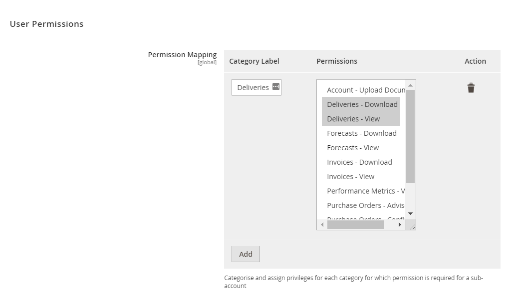
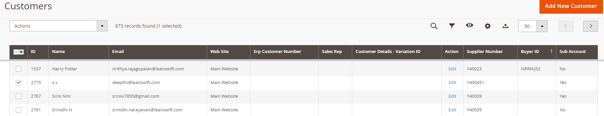
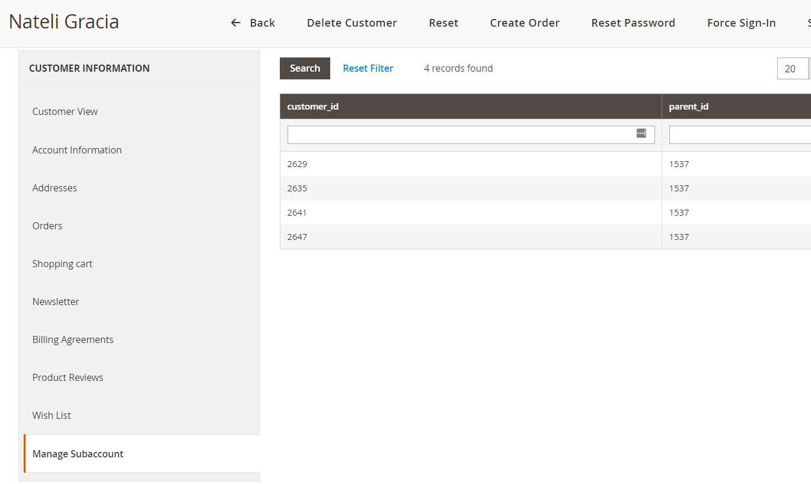

# Version 24.2.0 - Manage Sub-Account User Manual - Admin 

This is a separate Add-on which can be used with Supplier Portal and any other extension.

If the registered user is a Supplier, He will have options to manage other portal users tied to him through a page called &#39;Manage Subaccounts&#39; which will be visible only to the Supplier admin and not to other users.

This Supplier will have options to

1. Create Sub Accounts
2. Edit/Delete Sub Accounts
3. Manage permissions to his Sub Accounts

The list of Permissions available can be configured in the Configuration under User Management > Permissions. Below are the list of permissions available:

1. Purchase Orders - Advise
2. Purchase Orders - Confirm
3. Purchase Orders - Download
4. Purchase Orders - Notify
5. Forecasts - Download
6. Forecasts - View
7. Invoices - Download
8. Invoices - View
9. Deliveries - Download
10. Deliveries - View
11. My Items-View
12. Performance Metrics - View

<kbd>
 
</kbd>

Supplier Admin can group permissions under different categories and label them as required.

Supplier and list of subaccount users can be viewed in All Customers Grid page in the backend with subaccount columns. If it is 'YES' then it is subaccount user if it 'NO' then it is not a subaccount user. 

For supplier Admin the “Manage Sub Account” option is enabled and for sub account user the option will be disabled. Here it will display the “customer id” and its “parent id”.

<kbd>
 
</kbd>

There is another tab called &#39;Manage Sub accounts&#39; and is available only for Admin and not Sub-account. Here it will display the &#39;customer id&#39; and its &#39;parent id&#39;

The &#39;customer id&#39; is the subaccount id and &#39;parent id&#39; is the supplier id.

<kbd>
 
</kbd>
