# **Version 24.1.0 - User Manual - Manage Sub-account – User**

# Table of contents

- [Create New User](#create-new-user)
- [Edit User](#edit-user)
- [Delete User](#delete-user)

# **Create New User**  

- Click on "Create new" which is on top of the page to create a new Sub Account user.  
- A Pop-up window is opened on the right side.
- Fill in the details like "Email ID", "First Name", "Last Name". Choose the necessary permissions and click on "Create". 

<kbd>
 
</kbd>

-   The Allowed subaccount user count will be displayed When "Create New" is clicked.
- By Default, newly added users get added in active status. Admin can switch the toggle to make the user Active/Inactive. 

<kbd>
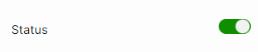 
</kbd>

- Success messaged is displayed, once the subaccount user is created successfully.  

<kbd>
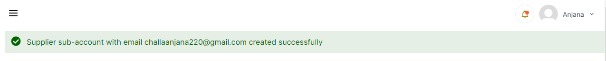 
</kbd>

- The newly created users appear in the table with all the details such as "Email ID", "First name", "Last Name", "Status", "Permissions".  

 

<kbd>
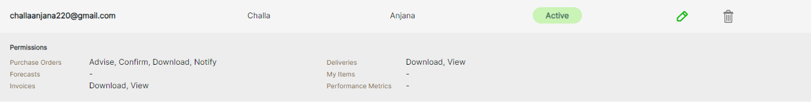 
</kbd>

**Note:** _Newly created Sub-account by default will have permission to view "My Account" and "My Purchase Order" details. _

- Once a new user is created, a reset password email id is sent to their mail id. Users can click the reset password link and will navigate to reset password page.
- Provide the required information like "Email ID", "New Password", "Confirm Password" click on "Save Password" button.

<kbd>
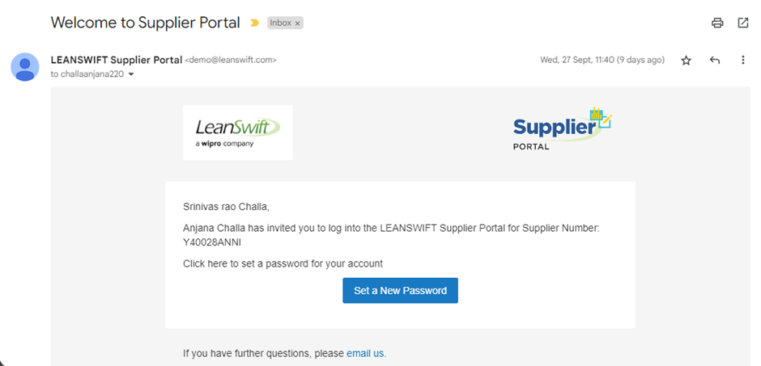 
</kbd>
 

<kbd>
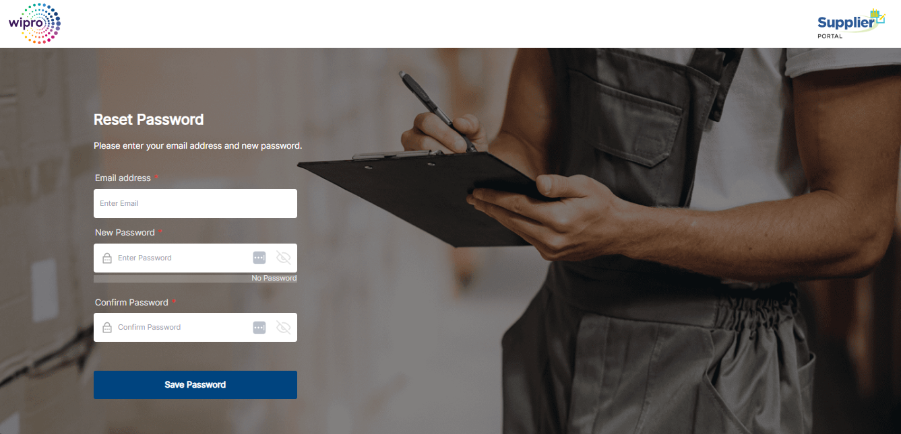 
</kbd>

- Once a user sets his password, he can login into the portal using the email address and password. The list of menus available are based on the permissions provided to the user.   

<kbd>
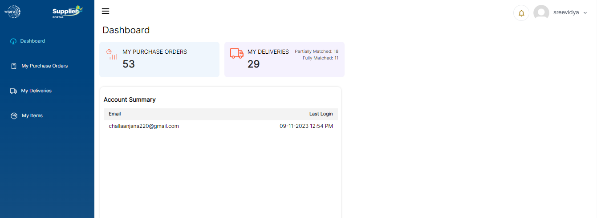 
</kbd>

<b>
<a href="#toc">↥ Go to Top</a>
</b>

# **Edit User**

- Once the user is created, it can also be edited by clicking on the "Edit icon" option on the right side of the subaccount's user details.

<kbd>
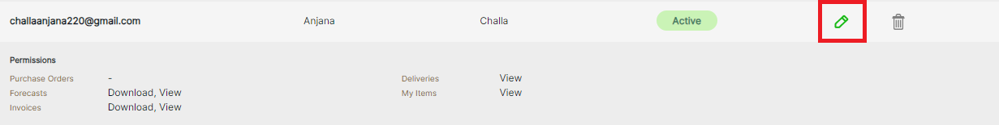 
</kbd>

- A new Pop-up window will appear on the right side of the page with prepopulated details of the subaccounts user and given permissions.

<kbd>
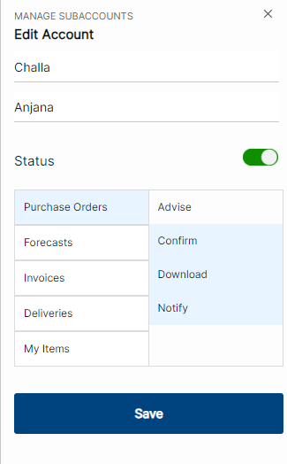 
</kbd>

- Main Supplier can make changes to the details and click on "Save". Once it is saved a success message will be displayed and new changes will be applicable to the sub account user.

<kbd>
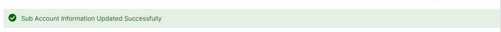 
</kbd>

<b>
<a href="#toc">↥ Go to Top</a>
</b>

# **Delete User**

- Created users can be deleted by clicking on the "Delete" option on the right-side of subaccount's details.

<kbd>
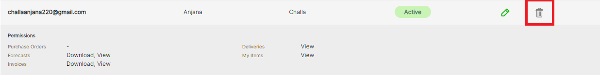 
</kbd>

- After clicking on delete icon a confirmation dialog box will appear asking for confirmation. 

<kbd>
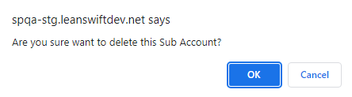 
</kbd>

-  Once the user clicks "OK" button Subaccount user will get deleted, and the success message will be displayed as "Supplier sub-account deleted successfully". 

<kbd>
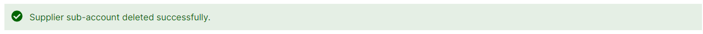 
</kbd>