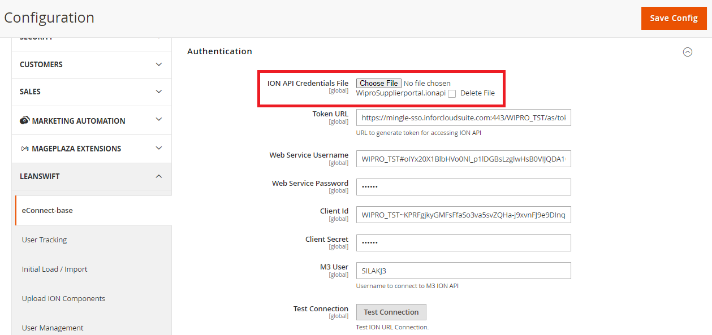
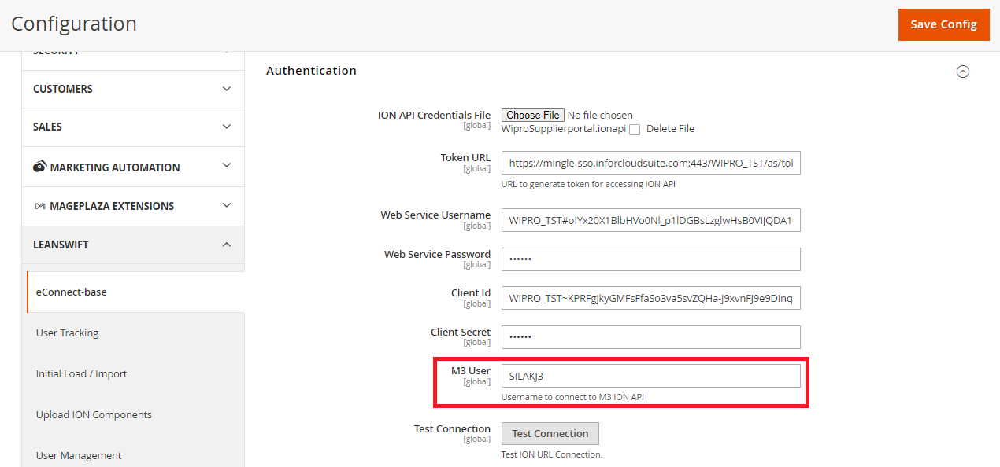

# Version 24.1.0 - One Day Deployment User Manual

# Table of contents

- [Initial Import:](#initial-import)
  - [Configuration Setup:](#configuration-setup)
  - [IDM Configuration:](#idm-configuration)
  - [Supplier Portal Configurable:](#supplier-portal-configurable)
  - [Item Management configuration:](#item-management-configuration)
- [ION Authentication:](#ion-authentication)
  - [Import History:](#import-history)
- [Upload ION components:](#upload-ion-components)
  - [Connection Point:](#connection-point)
  - [Data Flows:](#data-flows)
  - [Workflows:](#workflows)
  - [ION Component Upload History:](#ion-component-upload-history)

This is a new feature implemented to set configuration by one click and make Supplier Portal ready to use by one day.

Some of the values are prepopulated form the csv file which is uploaded while doing the deployment.  

# Initial Import:

When supplier portal is initially installed there are some default values which are given in the program. 

## Configuration Setup:

### Data Templates Packages:

- Navigate to Leanswift -> Econnect Base -> Connectivity -> Configuration Setup -> Data Template Packages. 
- Once “Import” is clicked in data template package all the values from the config.csv file will be updated and overridden.

<kbd>
 
</kbd>

### Connection Point Packages:

- Navigate to Leanswift -> Econnect Base -> Connectivity -> Configuration Setup -> Connection Point Packages. 
- Once “Upload” is clicked in connection point packages the connection point will automatically generate in Infor OS. 
- The connection point file must be given while initial installing the supplier portal.
- An error message” There's an issue with the input, or it already exists within Infor ION for ConnectionPoint.json Connection Point.” will be displayed if the file is uploaded. 

<kbd>
 
</kbd>

### Data Flow Packages:

- Navigate to Leanswift -> Econnect Base -> Connectivity -> Configuration Setup -> Data Flow Packages.  
- Once “Upload” is clicked in Data Flow packages the Data flows will automatically generate in Infor OS. 
- The Data flow file must be given while initial installing the supplier portal.

<kbd>
 
</kbd>

### Work Flow Packages:

- Navigate to Leanswift -> Econnect Base -> Connectivity -> Configuration Setup -> Work Flow Packages.  
- Once “Upload” is clicked in Work Flow packages the Work flows will automatically generate in Infor OS. 
- The Work flow file must be given while initial installing the supplier portal.

<kbd>
 
</kbd>

## IDM Configuration:  

- For IDM Configuration navigate to Leanswift -> Supplier portal -> Settings
- Expand the menu Leanswift -> Initial load / Import -> default config -> Import IDM Configuration -> Click on Import Button.

<kbd>
 
</kbd>

- This will import/fetch Document Type and Attribute Type fields in Configurable Options to Upload and Configurable Options to Download form M3.

<kbd>
 
</kbd>

<kbd>
 
</kbd>

If there are any changes in Document Type and Attribute Type in Infor M3 once the “Reset” is clicked it will fetch the new added values from Infor M3.

## Supplier Portal Configurable:

- Supplier Portal configuration is website specific.
- Navigate to Leanswift -> Supplier portal -> Settings.
- Expand the menu Leanswift -> Initial load / Import -> Main Website -> Import Supplier portal configuration -> Click on Import Button. 

<kbd>
 
</kbd>

- When “Import” button is clicked it will retrieve the settings from M3 and configure itself using the default values which are given program.
- ` `Upon uploading or loading the “config.csv”, it will retrieve the values from M3 and configure accordingly.
- Fields of Supplier Onboarding (M3 supplier template, SP Prefix, M3 Language list, M3 Order Currency List, M3 payment terms, M3 Fright Terms, M3 Delivery Terms list, M3 Payment Method List, M3 Packing terms list, M3 Monitoring class list, M3 delivery method list) will be Imported and overridden with new values. 
- Remaining values of Supplier Portal Settings will be given in the program by default. 

<kbd>
 
</kbd>

<kbd>
 
</kbd>

## Item Management configuration:

- Item Management Configuration is website specific.
- Navigate to Leanswift -> Supplier portal -> Settings.
- Expand the menu Leanswift -> Initial load / Import -> Main Website -> Import Item Management configuration -> Click on Import Button.

<kbd>
 
</kbd>

- Both Item Type, Quality Class have default values in program and can be configure in “config.csv” file.
- item\_creation\_responsible, item\_workflow\_distribution\_username need to have the user specified values. That can be given in config.csv file. 

<kbd>
 
</kbd>

<kbd>
 
</kbd>

# ION Authentication:

- The ION API file will auto populate other API URL fields in the configuration.
- Navigate to Leanswift -> eConnect base -> Connectivity -> Authentication -> ION API Credentials file. 
- Once the ION API file is uploaded the below fields will auto update.

<kbd>
 
</kbd>

1. Store -> Configuration -> Leanswift -> Econnect Base -> service configuration -> API service url.

<kbd>
 
</kbd>

2. Store -> Configuration -> Leanswift -> Econnect Base ->Authentication all field except M3 user.

<kbd>
 
</kbd>

3. Store -> Configuration -> Leanswift -> Econnect Base ->ION Workflow Configuration -> API service Url.

<kbd>
 
</kbd>

4. Store -> Configuration -> Supplier portal -> Settings -> Supplier onboarding -> ION ProcessUserService Url.

<kbd>
 
</kbd>

5. Store -> Configuration -> LeanSwift -> Idm -> General Configuration -> ION Api service url.

<kbd>
 
</kbd>

## Import History:

Once the all the configuration is imported (Supplier Portal settings, Item Management, IDM Settings), history of import is recorded.

To verify the import history, navigate to Leanswift -> Econnect Base -> Import History. 

<kbd>
 
</kbd>

# Upload ION components:

- Upload ION components are used to import the Connection Points, Data Flows, Workflows to ION from admin portal.
- Navigate to Leanswift ->Econnect base -> Upload ION components.
- When initial installation of supplier these values will be Empty once the config.csv file is uploaded then the values will be auto populated. 
- The Proxy URL, ION connect /Process model URL, Encoded service account, Encoded Service Account values are updated from the “config.csv” file.

**Prerequisites**: The file format must be in zip or Json file only.  

<kbd>
 
</kbd>

## Connection Point:

- Navigate to Leanswift -> Econnect base -> Upload ION Components -> Upload connection point, data flow and workflow -> Upload ION Connection Point 

<kbd>
 
</kbd>

- Once the file is uploaded, a success message is displayed. The connection point can be verified in Infor under OS -> ION -> Connect -> Connection Point. 

<kbd>
 
</kbd>

- In OS portal, initially the connection point will be “Inactive” state, once the data flows are uploaded then the connection point will become “Active”.
- The connection point will be coming with the name given in connection point file. 

## Data Flows:

- Navigate to Leanswift -> Econnect base -> Upload ION Components -> Upload connection point, data flow and workflow -> Upload ION data flow

<kbd>
 
</kbd>

- Once the file is uploaded, a success message is displayed. The activated data flow can be verified in M3 under ION Desk -> Connect -> Data flows.
- List of data flows are: 
1) Supplier\_Portal\_M3\_Invoice\_Show\_Sync\_BOD
2) Supplier\_Portal\_M3\_PO\_Show\_Sync\_BOD
3) Supplier\_Portal\_M3\_Supplier\_Show\_Sync\_BOD
4) Supplier\_Portal\_M3\_Sync\_BOD

<kbd>
 
</kbd>

## Workflows:

- Navigate to Leanswift -> Econnect base -> Upload ION Components -> Upload connection point, data flow and workflow -> Upload ION work flow.

<kbd>
 
</kbd>

- Once the file is uploaded, a success message is displayed and work flow is activated in M3. The activated work flow can be verified in Infor under ION Desk -> Monitors & Workflows -> Workflows. 
- List of Workflows are:
1) supplier\_access\_approval
2) supplier\_onboarding\_idm\_notification
3) supplier\_portal\_item\_creation
4) supplier\_portal\_onboard
5) supplier\_portal\_onboard\_document
6) supplier\_portal\_supplier\_connect\_item
7) supplier\_portal\_supplier\_connect\_item\_updation
8) confirm\_po\_approval

<kbd>
 
</kbd>

## ION Component Upload History:

- To verify the upload history of ION components, navigate to Leanswift ->Econnect Base -> ION Component Upload history.   
- If the Job ID is 201 means the connection is successfully done.
- If the Job ID is 400 means invalid input work flow, workflow already exists, or workflow name is missing, and it is displayed on the configuration page also.
- If the Job ID is 500 means Server Error 
- If the Job ID is 403 means No Authorization.

<kbd>
 
</kbd>

