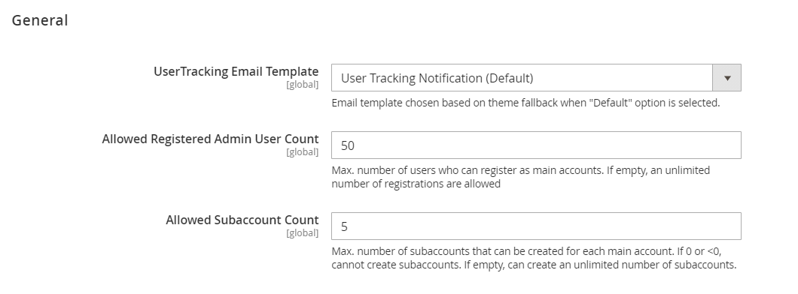

# **Version 24.1.0 - User Tracking - User Manual - Admin**

This an Add-on can be used along side Supplier Portal.

User Tracking is used to track and restrict Number of Registered Admins and Sub-accounts.

The settings can be found under Leanswift -> User Tracking -> Settings

<kbd>
 
</kbd>

- **UserTracking Email Template**: Email template is chosen based on theme fallback when "Default" option is selected.
- **Allowed Registered Admin User Count**: Total number of allowed registered (supplier admin) users can be configured here.
- **Allowed Subaccount Count**: Total number of allowed sub-account users per supplier admin can be configured here.

If the limit is exceeded, portal admin is notified with an email about it.
If the count field is left empty, it is considered unlimited. 

Based on the count configured, number of Registered Admins and Sub-accounts that can be created are restricted.
