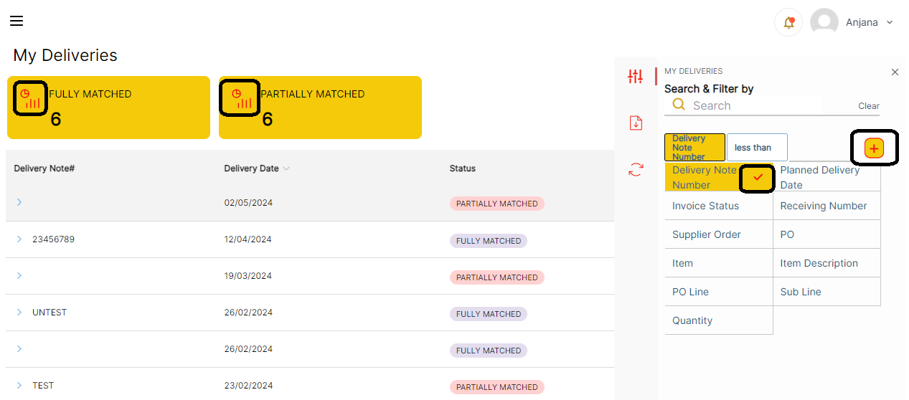

# Version 24.2.0 - Design/Display pwa User Manual

This feature is implemented for user to experience different themes of the supplier portal, admin user can configure the portal theme of supplier portal.

There are three types of theme configuration.

1. Light Theme 
2. Dark Theme
3. Custom Theme 

## Light Theme:

This is the default theme which is pre-configured with initial installation of Supplier Portal. 

Theme can be configured by,

Navigate to Leanswift -> Supplier Portal -> Design/Display PWA. Select the scope of website

Under Theme Section, Choose Theme dropdown as ‘Light Theme’.

<kbd>
 
</kbd>

Supplier Portal theme looks as below,

<kbd>
 
</kbd>

## Dark Theme:

Navigate to leanswift -> supplier Portal -> Design/Display PWA. Select the scope of website

Under Theme Section, Choose Theme dropdown as ‘Dark Theme’.

<kbd>
 
</kbd>

In Dark theme we can configure major two fields,

1. **Active Menu Color / Icon Colour**: Color code configured here is applied to highlight the text of menu selected in Left side menu and all the icons in Portal.
       	
	Ex: My Purchase Orders, Icons on the right -side menu and Totals stats Icons in every page. 

<kbd>
 
</kbd>

2. **Button Colour:** Color code configured is applied to all the buttons in Portal.

	Ex: Sign-in button at login page, Reset Password, Create New Account, Confirm, Notify, Advise, My Settings ‘Save’ etc. 

<kbd>
 
</kbd>

## Custom Theme:

Navigate to leanswift -> supplier Portal -> Design/Display PWA. Select the scope of website

Under Theme Section, Choose Theme dropdown as ‘CustomTheme’

<kbd>
 
</kbd>

Custom theme has following fields to be configured:

1. **Icon Colour:** color is applied to Filter fields add button border ( "+") colour, filter delete ("-") sign color in filters in all pages, Total Stats Icons, Filter attribute selected sign colour.

<kbd>
 
</kbd>

2. **Button Colour**: All the buttons in Portal will appear as configured colour.

	Ex: Sign-in button, Reset Password, Create New Account, Confirm, Notify, Advise, My Settings ‘Save’ etc. 

<kbd>
 
</kbd>

3. **Left Side Menu Background Colour:** Color applied to Left menu background

<kbd>
 
</kbd>

4. **Left Side Menu Colour:** Left side menu text colour 

<kbd>
 
</kbd>

5. **Left Side Menu Active Link Colour**: Color code configured here is applied to highlight the text of menu selected in Left side menu. 

<kbd>
 
</kbd>

6. **Total Stats Background Colour**: Color is applied to Totals stats background colour in every page.

<kbd>
 
</kbd>

