# User Manual - Accounts Receivable - Version 8.0.0

### Table of Contents

- [Overview](#overview)

- [Navigating the Application](#navigating-the-Application)

    - [Main Menu](#main-Menu)

    - [Application Pages](#application-Pages)

    - [About](#about)

    - [Selecting Lines in a List](#selecting-Lines-in-a-List)

    - [Selecting Cells and Copy/Paste](#selecting-Cells-and-Copy/Paste)

    - [List Filters](#list-Filters)

    - [Sorting Lists](#sorting-Lists)

    - [Rearranging column order](#rearranging-column-order)

    - [Exporting to Excel](#exporting-to-Excel)

    - [Notifications](#notifications)

- [Application Pages](#application-Pages)

    - [Main selection](#Main-selection)

    - [Division](#division)

    - [Customer](#customer)

    - [Default Payer from Customer](#default-Payer-from-Customer)

    - [Payer](#payer) 

    - [Rolling Date](#rolling-Date)

    - [Invoices](#invoices)

    - [Payments](#payments)

    - [Payment Details](#payment-Details)

    - [Aging](#aging)

    - [Infor Document Management](#infor-Document-Management)

    - [Tickler Notes By Invoice Number](#tickler-Notes-By-Invoice-Number)

    - [Flagged Invoices](#flagged-Invoices)

    - [Basic Data](#basic-Data)

    - [Tickler Notes](#tickler-Notes)

    - [Adding new notes](#adding-new-notes)

    - [Editing existing notes](#editing-existing-notes)

    - [Credit History](#credit-History)

    - [Credit Release](#credit-Release)

    - [Release Orders](#release-Orders)

    - [Tickler Notes By Invoice Number](#tickler-Notes-By-Invoice-Number)

    - [Orders](#orders)

    - [Account Payments](#account-Payments)
 
    - [Search for a Check Number](#search-for-a-Check-Number)

    - [Cash Payments](#cash-Payments)

    - [Search](#search)

- [Troubleshooting](#troubleshooting)

    - [First Sign Of Trouble](#first-Sign-Of-Trouble)

    - [Deciphering Error Messages](#deciphering-Error-Messages)

- [Limitations](#limitations)

- [Point of Contacts](#point-of-contacts)

## Overview 

This user guide will cover the Accounts Receivable application. This webapp takes information and data from multiple places in Infor M3 such as, but not limited to, CRS610, MFS610, ARS200, RMS440, and combines them into one interface. This should allow a credit manager to do all of their job functions from one place rather than going into multiple programs and screens in Infor M3 to enter, edit, and obtain information.This version is compatible with Infor M3 13.4 (on-premise) and Infor M3 CloudSuite.

[Go to Top](#table-of-contents)

## Navigating the Application

This section will give a quick overview on how to get around and navigate the web application.

### Main Menu

The main menu appears on the left side of the screen, and the menu button is in the top left corner of the screen. The menu itself is stickied to the left side and will display without icons, or icons with labels. You can cycle through either display option by clicking the menu button.

<kbd>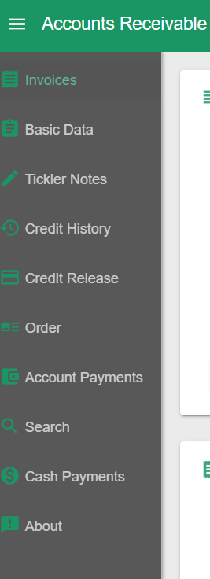</kbd>

In the top navigation bar you will also see what M3 environment (and Company and Division) you are viewing in the app.

<kbd></kbd>

[Go to Top](#table-of-contents)

### Application Pages

The first section of the main menu will be the application pages themselves. These are specific to the application and contain views grouped in functional and intuitive ways. Clicking any of these menu options will load the respective page. All of these are described in detail below.

[Go to Top](#table-of-contents)

### About

The about main menu option will display details of the application such as the exact application version and build you are running. If you are experiencing issues these will be vital to know when contacting support and troubleshooting.

<kbd>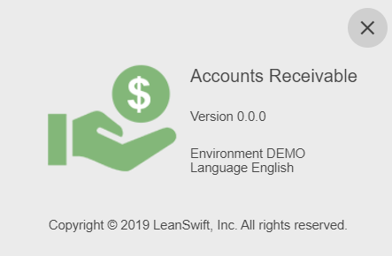</kbd>

[Go to Top](#table-of-contents)

### Selecting Lines in a List

To select a line click the checkmark box to the left of the line you wish to select. When you select a line usually there is a list or data section below on the same page that will populate with detailed data based on the selected line.

<kbd></kbd>

Lists also support multi selection. 

<kbd>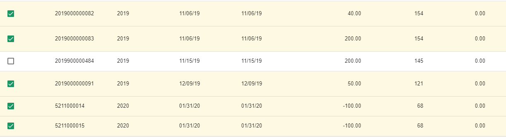</kbd>

Note that some functionality like loading details below will only apply to the last clicked line.

[Go to Top](#table-of-contents)

### Selecting Cells and Copy/Paste

You can select an individual cell inside of a list by clicking it (it will become highlighted).

<kbd>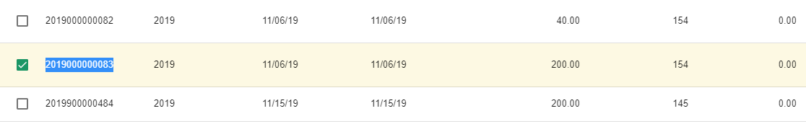</kbd>

With a cell selected you can copy the value using Ctrl+C (or Cmd+C).

[Go to Top](#table-of-contents)

### List Filters

At the top of each list there are filters. These should be intuitive enough to use at first glance.

The filters are based on the data type in the column. For numbers and dates it is possible to filter by greater, lesser or in a range.

&gt;= means &quot;greater than or equal to&quot;

&lt;= means &quot;lesser than or equal to&quot;

For normal text filters you can free text search. Note that it is a wildcard search and the value does not have to start or end with your search string.

<kbd>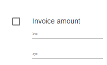</kbd>

[Go to Top](#table-of-contents)

### Sorting Lists

You can sort a list by any column simply by clicking the column header. Please note that there are 3 stages when you click a header for sorting, and clicking will cycle through all of them.

- Unsorted/original order
- Descending
- Ascending

[Go to Top](#table-of-contents)

### Exporting to Excel

You can use the list menu for a number of things, one of them being exporting to Excel. Click the small menu icon in the right hand corner of any list and select &quot;Export all data as csv&quot;.Then open the csv file in Excel.

<kbd>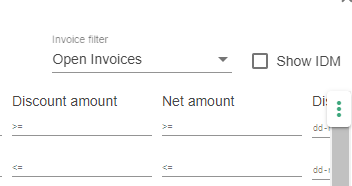</kbd>

Note. You can also use the list menu to show and hide columns.

[Go to Top](#table-of-contents)

### Notifications

All notification, warning and error messages will be displayed in a colored box below. 

<kbd></kbd>

[Go to Top](#table-of-contents)

## Application Pages

### Main selection

This is not a menu option on its own but at the top of each page there will be a consistent &quot;Selection&quot; section. Generally this is the main selection criteria for which the application displays data. Once you press the Find button the application will load and display the data based on your selections (each page will be loaded based on your selection data). The Clear button is a quick and easy way to clear out all your selections.

<kbd>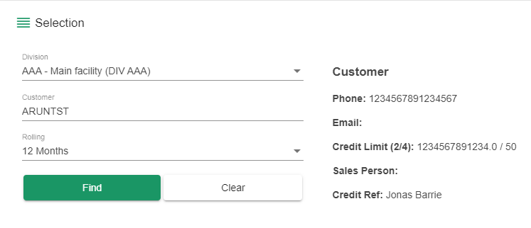</kbd>

[Go to Top](#table-of-contents)

### Division

This is the M3 division and the default division for your M3 user will be pre-selected.

[Go to Top](#table-of-contents)

### Customer

In the Customer dropdown you select which customer account to display. You can either scroll in the list or type using your keyboard and it will narrow the search down to what matches your typed characters.

Note that if you are using a tablet to view the application you need to click the in the dropdown (again) to bring up the on screen keyboard.

[Go to Top](#table-of-contents)

### Default Payer from Customer

Checking this box will disable the Payer input and pick the default payer that is tied to the customer account in M3. In most cases this is the customer account itself.

[Go to Top](#table-of-contents)

### Payer

This is the Payer account that you want to view. It works in the same manner as the Customer dropdown selection. Some of the application functionality will load data based on the selected Payer, other use Customer, and some require both.

[Go to Top](#table-of-contents)

### Rolling Date

The selector for rolling date is there to limit the amount of data that is loading from the backend into the application. The application will load data from today&#39;s date minus your rolling selection.

Default is 12 months, which is usually enough, but you can increase this as you need. Keep in mind that some accounts with less activity can easily be loaded for several years back but some larger accounts could have tens of thousands of invoices and could take a very long time to load.

Note. A common mistake when you&#39;re not seeing a particular invoice is that the invoice date in M3 is out of your selected date range in the application.

[Go to Top](#table-of-contents)

### Invoices

This is the main page in the application where you can list and view invoices with additional order information, totals, payments, payment details and invoice aging. In short is a much enhanced version of ARS200 in M3.

Once you have made your selection and hit the Find button the Invoices list will populate with data. By default Open invoices are loaded and displayed. You can change this, and switch between Open, Paid and All invoices, by using the selection box display options at the top.

Note that this operation while optimised still can take some time to complete, especially for big accounts, or if you have a date range selected for multiple years back, or if for example you&#39;re working through a VPN connection. Quite a lot of data is retrieved from M3 and then processed and calculated before display.

<kbd>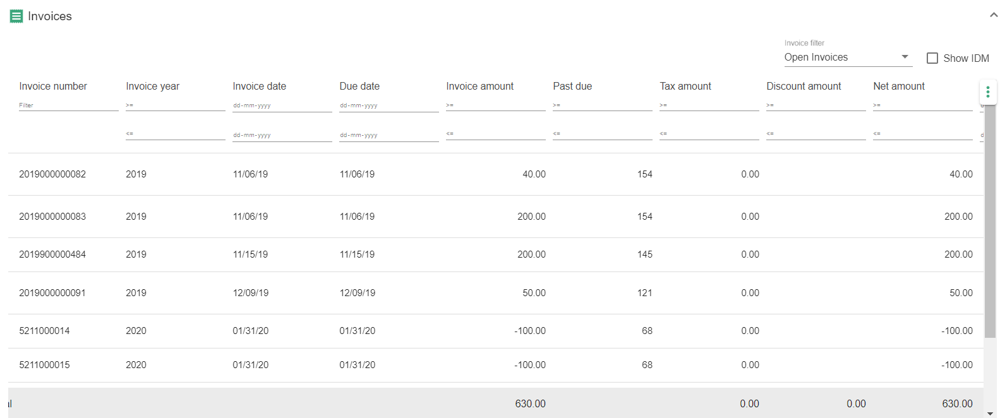</kbd>

The bottom of the list of invoices will display totals for the amount columns. Also note that if you select multiple lines it will immediately display how many you have selected as well as the amount totals for your selection (pressing the Totals button below the list will give you a popup with the same information for your selections).

<kbd></kbd>

[Go to Top](#table-of-contents)

### Payments

If you select a line in the list of invoices the Payments section below will load and display payment data for the selected invoice.

<kbd>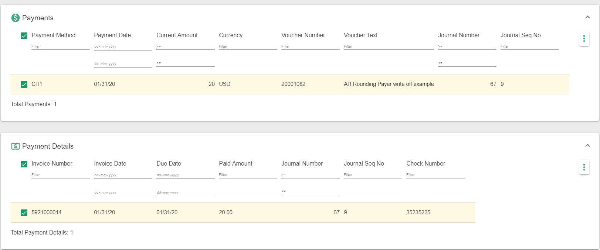</kbd>

[Go to Top](#table-of-contents)

### Payment Details

By selecting a line in the Payments list in turn the Payment Details list below that will load. You can review any details of the payment itself, for example if it was used to pay multiple invoices.

[Go to Top](#table-of-contents)

### Aging

At the bottom of the page the aging will be displayed. It will only populate if you are viewing Open or All Invoices (and only take open invoices into account). Aging can be viewed by Invoice or by Due date as selected.

<kbd>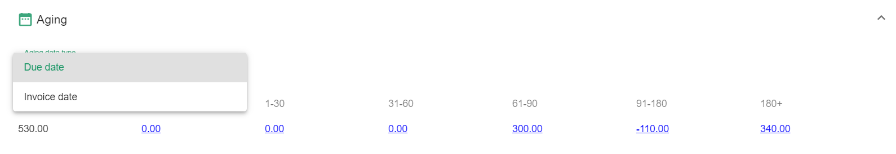</kbd>

Each aging bucket is hyperlinked and you can click this amount to open a popup. The popup will contain a listing of the invoices that make up that specific aging bucket amount.

<kbd>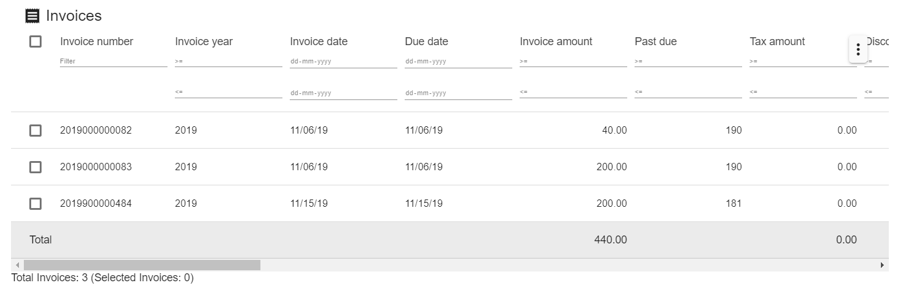</kbd>

[Go to Top](#table-of-contents)

### Infor Document Management

The Accounts Receivable application can be configured to integrate with your company&#39;s IDM. Note. If your company is not using IDM then this specific functionality will not work in your AR application.

At the top next to the display options there will be a checkbox &quot;Show IDM&quot;. Checking this option will display two additional columns in the list for Invoice and Proof of Delivery. Initially these columns will be empty.

<kbd>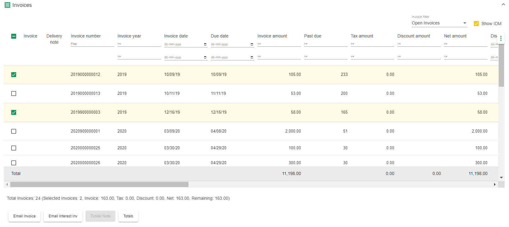</kbd>

Clicking the PDF icon will open the Invoice document for view directly in your browser.

Note that the two previously disabled buttons Email Invoice(s) and Email PoD(s) have now become active. You can select one, or multiple lines, and click the the respective Email button

<kbd>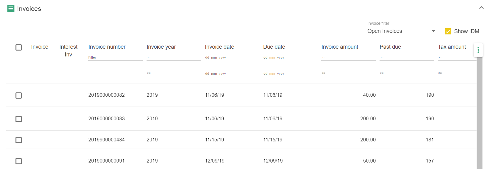</kbd>

Once you click the Email button a popup will appear. Fill out the fields and press the Send button. All of the respective documents for your selected lines will be attached to the email. Once the email have been sent the popup will automatically close.

This will allow you to quickly and easily email the selected documents to a customer (or internally).

Do not forget the From or To email addresses or the email will not be sent by the mail server.

You can send to multiple emails using , to separate the list:

_To: steve@penguinglasscorp.com,jamesh@penguinglasscorp.com_

[Go to Top](#table-of-contents)

### Tickler Notes _By Invoice Number_

**Please note.** \*\* This functionality is slightly different than the Tickler Notes page. The button below the list of Invoices labeled &quot;Tickler Note&quot; will allow you to add an invoice reference to a Tickler Note (or create a new Tickler Note with the selected invoice as a reference). \*\*\*\* This is NOT a &quot;shortcut&quot; to the standard Tickler Note functionality on the \*\*\*\* Tickler Note page \*\*\*\* described in a separate chapter.\*\*

First you have to select a single line, one invoice, and then press the Tickler Note button. A popup window will appear. This window can look somewhat different depending on if there is already an existing tickler note invoice reference on the invoice you selected, or if there is no such pre-existing reference. _Note. There is a 1:1 relationship when it comes to a Tickler Note and an Invoice._

If there is no pre-existing reference on the selected invoice you will get a listing of all Tickler Notes for that customer, and also be given the option to create a new Tickler Note. You can create a new note, or select one in the list. You can add or modify text and then press save. When you save the invoice number from your selected line will be saved as a reference on the selected Tickler Note.

If there is an existing invoice reference on a Tickler Note for your selected invoice the popup window will only list that specific Tickler Note, and that is the only note you will be able to modify for your selected invoice line. For example if you had selected the same line as above a second time and pressed the Tickler Note, now only the note you previously saved will display. _Again, this is because there is a 1:1 relationship between tickler note references and invoices._

Also note that Tickler Note By Invoice Number functionality may or may not be activated as it is an administrator configuration. Your company may not be using this.

<kbd>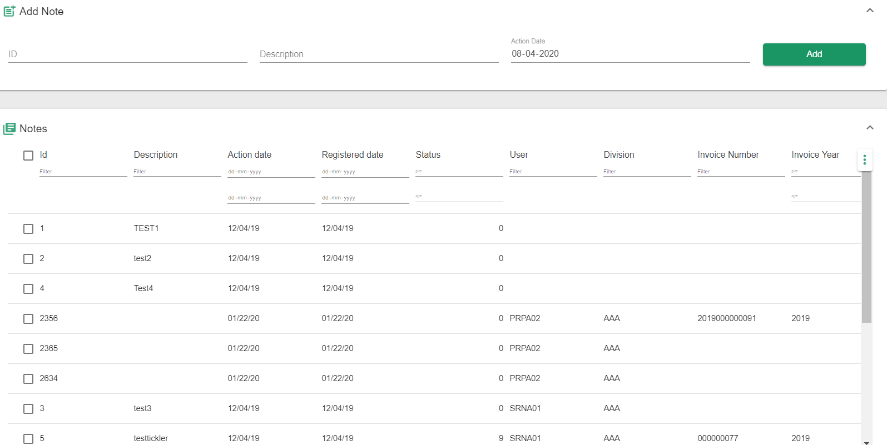</kbd>

[Go to Top](#table-of-contents)

### Flagged Invoices

Some invoices may appear &quot;flagged&quot; with a small icon. These are so called preliminary invoices in M3 and should not be appearing here. It is an indication that something is not right and may need further investigation in M3.

<kbd>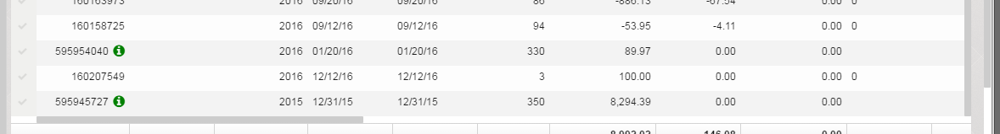</kbd>

[Go to Top](#table-of-contents)

### Basic Data

The Basic Data page combines information from various places in M3 such as CRS610, MFS610 and OIS165. From this screen you can view and update customer basic data and credit limits.

Note. If you do not see the Save button on the Basic Data page then you have not been granted update access by your application administrator.

<kbd></kbd>

<kbd>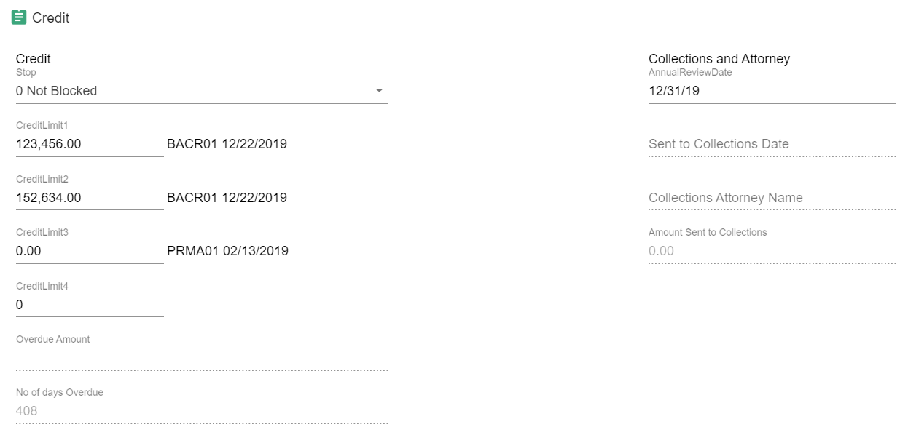</kbd>

[Go to Top](#table-of-contents)

### Tickler Notes

Tickler Notes are created in RMS440 in M3, however, the M3 interface is not intuitive and complex to use (and there exist no standard M3 api to handle Tickler Notes). On the Tickler Notes page you will be able to easily and quickly view, edit, and create new notes.

Note. If you do not see the Save button on the Tickler Notes page then you have not been granted update access by your application administrator.

[Go to Top](#table-of-contents)

### Adding new notes

To add a new tickler note simply enter an id and description and click the Add button.

<kbd>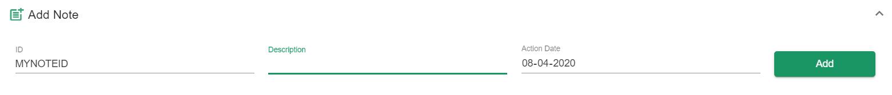</kbd>

[Go to Top](#table-of-contents)

### Editing existing notes

By selecting a line the detail section below will load (note that if there is no text data it will still be blank). You can type in any of the fields and then click the Save button.

<kbd></kbd>

Note. Make sure to wait for the loading icon to complete the save.

[Go to Top](#table-of-contents)

### Credit History

The Credit History page will display credit information for both the customer and payer selected. This page will show last payment details, balances and high period, outstanding amount, average days to pay, aging and more. The purpose of this page is to review credit references and history.

<kbd>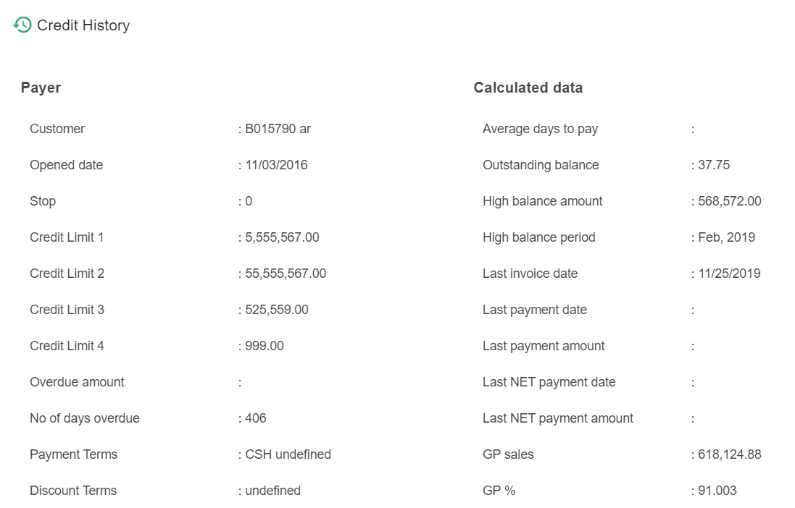</kbd>
<kbd>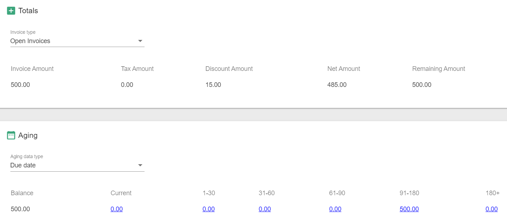</kbd>

Note. Initially the page will not load additional details for application performance reasons.

[Go to Top](#table-of-contents)

### Credit Release

The Credit Release page allows for credit release similar to OIS120 in M3. It also provides customer and payer information similar to the Credit History page to help determine if an order should be released from hold or not. The list of credit stopped orders displays orders for all customers regardless of your customer and/or payer selection.

Note. When you select a line in the list the Data/Aging/Totals sections below will load with data based on the Customer and Payer on the selected line. The Aging and Totals displayed on the Credit Release page are corresponding to the Customer and Payer on the selected line and NOT your main selection in the application.

<kbd>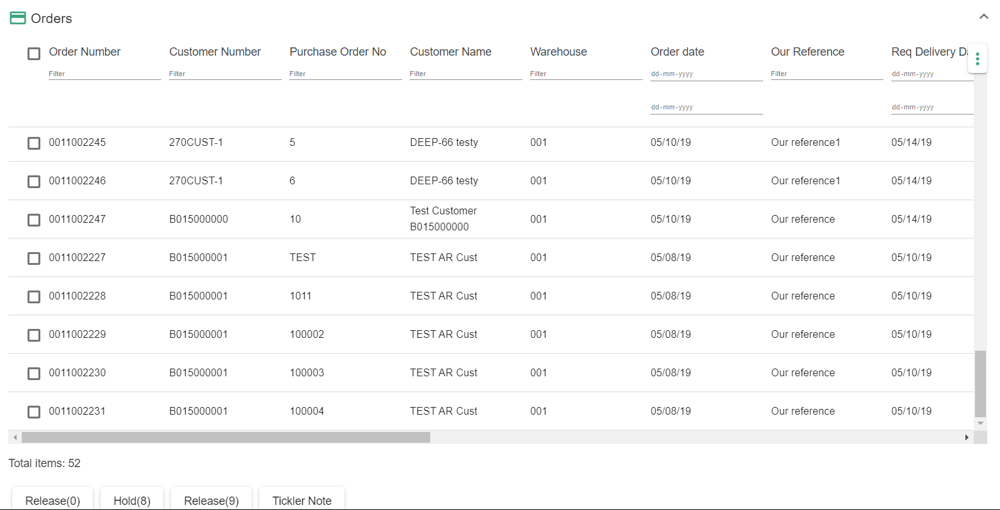</kbd>

[Go to Top](#table-of-contents)

### Release Orders

The buttons below the list for Release and Hold will put the order in the corresponding status in M3 as per the button label (ie releasing to 0, 8 or 9).

You can select one or more lines to release at the same time.

Note. If you do not see the Release/Hold button(s) on the Credit Release page then you have not been granted access to release by your application administrator.

[Go to Top](#table-of-contents)

### Tickler Notes _By Invoice Number_

The button below the list labeled Tickler Note works in the same manner as described above for the Invoice page. Please refer to that section of this guide. It uses the invoice number tied to the line you select.

_Again. This is not a &quot;shortcut&quot; to the Tickler Notes page functionality, but works in a slightly different manner._

[Go to Top](#table-of-contents)

### Orders

The Orders page shows a list of current and past orders for the selected customer account. This can be useful to lookup additional details of a current order or to lookup past orders that have had issues such as payment rejections.

By selecting an order in the list, the below order lines will load. By selecting an order line in turn the charges and line charges will load if there are any

<kbd>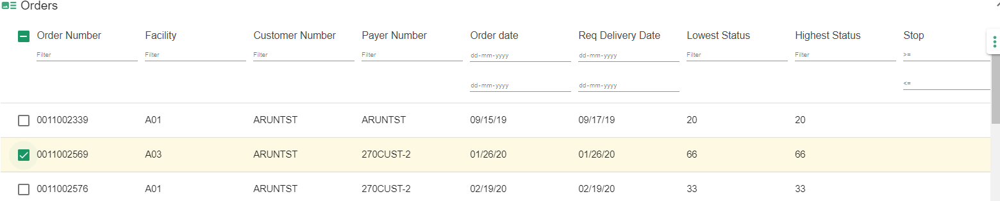</kbd>

<kbd>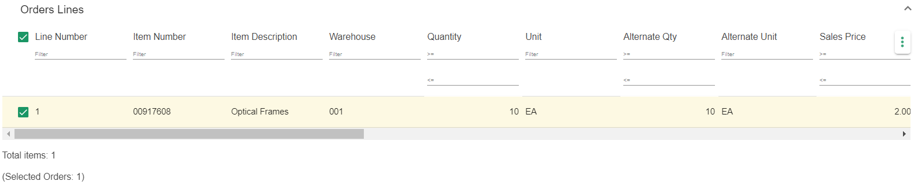</kbd>

<kbd>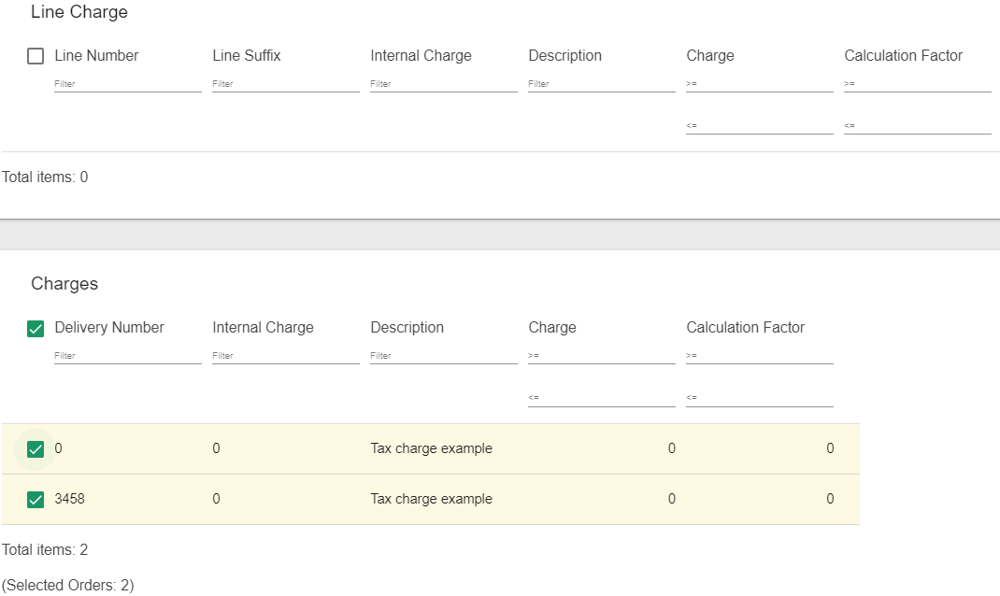</kbd>

[Go to Top](#table-of-contents)

### Account Payments

The Account Payments page will show a list of checks paid by a customer along with all the invoices paid on that check. When you select a Payment line the Payment Details for that line will load.

<kbd>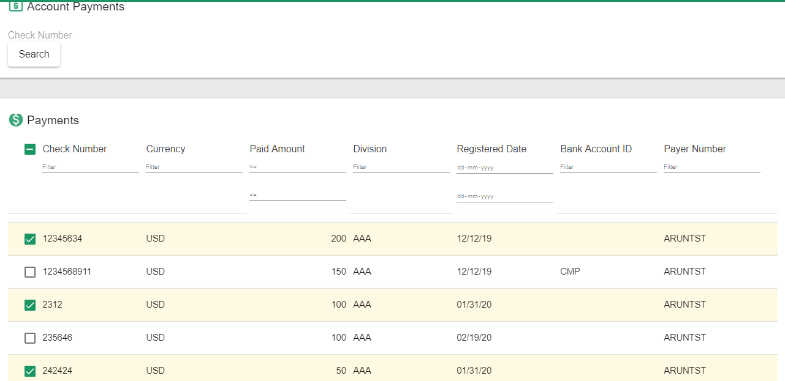</kbd>

<kbd></kbd>

[Go to Top](#table-of-contents)

### Search for a Check Number

There is a special search box at the top where you can query for any check. Note that this is not a filter for the list below it. This search box is special in that it will search and display results regardless of your main selection - ie you can search for any check number in M3 even if it does not match your main selection above.

<kbd>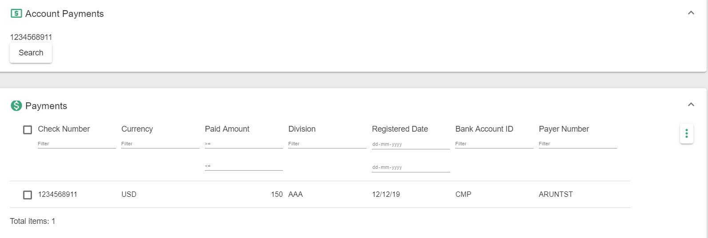</kbd>

[Go to Top](#table-of-contents)

### Cash Payments

This section shows information for cash account customers and charge account customers that paid cash or used a credit card for a transaction.

Selecting a Cash Payments line will display the Cash Payments Detail.

<kbd>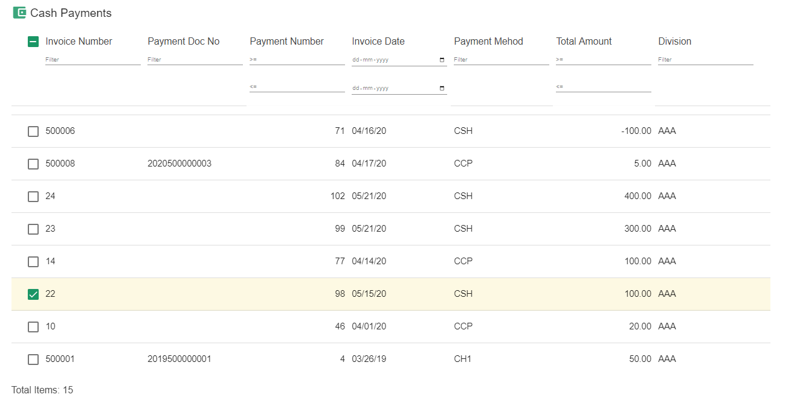</kbd>

[Go to Top](#table-of-contents)

### Search

The Search page allows you to search for an invoice, either via invoice number, order number, PO number or by check number.

Type your search criteria in the input boxes and then press the Search button.

<kbd></kbd>

Note. If/When you select a line in the Results list below the application will switch over to the Invoices page, change the main selection criteria to match the searched invoice, reload, and then scroll down and display the invoice in the list.

[Go to Top](#table-of-contents)

## Troubleshooting

#### Clear cache and cookies

When you are experiencing issues with the application your first line of defense before contacting support should always be to clear out your browser cache, cookies and temporary internet files. Then close down the tab and browser, reopen your browser and reopen the application page.

After a new version of the application has been deployed normally you only need to reload your browser for changes to take effect. However, in case you are experiencing issues right after a new version deployment you must clear your cookies, cache and temporary internet files in your browser to resolve the problem.

[Go to Top](#table-of-contents)

### Deciphering Error Messages

Errors can happen in the application for many different reasons and will be presented to you in a notification box. Here is a short guide on how to decipher these messages.

Example 1 - M3 API error

<kbd>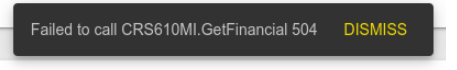</kbd>

In this error message it begins by telling us which service specifically is failing. You can recognize this by it being on a URL form. In this case _http://...rest/items/itemwarehouse/copy_

This is then followed by a server error message usually starting with &quot;Status…&quot;. Per above

_Status: 500 (Internal Server Error)_

After this can come any number of details about the error. In the above example it is an M3 API failing. When you see a &quot;NOK&quot; this is going to be an M3 API error. And in the above example we can see that there is some sort of problem in M3 with the Trade Stat: Error: NOK - Consumption code - trade stat (TST) does not exist

So this in this case it is not necessarily the application that is failing, but M3 is complaining about the input to the api call. This is a problem that may be due to data in M3 being incorrect, and can possibly be fixed in M3 to make it work in the application without even contacting support. However, knowing exactly what API that failed in M3 is not necessarily clear and you must still know what the application is trying to do to draw conclusions about what could be wrong in M3.

Example 2 - The &quot;Status 0&quot; error

If by chance you see somewhere in the error that it mentions &quot;Status 0&quot; (zero) this means that your browser itself ran into an unexpected problem. It is unfortunately almost impossible to know what has happened to cause this or even to diagnose the problem. It is your browser that errored out, and not the server (which is sometimes the unfortunate nature of browser based applications).

Some &quot;usual suspects&quot; that could have caused this (but by far not limited to)

•The request timed out and browser aborted it

•You clicked something else, navigating away from a page, while a request was still happening in the background and the browser aborted your previous request

•Generic network related problems caused unexpected abort by browser

If you see this you should try re-doing what you just did. For example load something else in the app, then go back in and load the data that caused the issue, and so on. If the problem persists you will need to contact your application administrator.

Also you should avoid clicking around all too much in the application while you see a loading icon on the screen.

[Go to Top](#table-of-contents)

## Limitations

Few APIs have a limit on the number of records returned. Below are the list of functionalities that use APIs which are limited to 1000 results
1. Open Invoices,Paid Invoices ,Payer Information,Orders,Order lines and Ordercharges
2. Pricing ,Discount Model and Order Types in Basic Data section
AR app doesn't work on safari and MT.

[Go to Top](#table-of-contents)

## Point of Contacts

This document and the software it describes are provided by LeanSwift Solutions Inc. For additional information regarding support, licensing, functionality etc. please contact LeanSwift Solutions Inc. via contact form at http://www.leanswift.com or email info@leanswift.com

[Go to Top](#table-of-contents)
